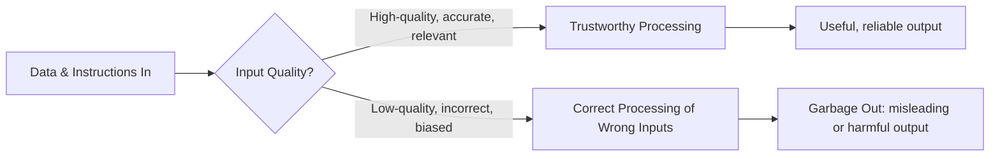

---
aliases:
  - GIGO
  - Garbage-In, Garbage-Out
date_created: 2025-02-02
date_modified: 2026-05-27
cf_last_run: "2026-05-27T01:46:18.182Z"
cf_last_run_model: "Perplexity sonar-pro"
site_uuid: 349c9622-1b92-4fab-aa01-c75ef69cac01
publish: true
title: "Garbage In, Garbage Out"
slug: garbage-in-garbage-out
at_semantic_version: 0.0.0.1
---

# Defining and Describing Garbage-in, garbage-out

_If you start with bad data or flawed instructions, even the smartest system will give you bad results._

**Garbage in, garbage out (GIGO)** is a foundational principle in computing and data processing stating that the **quality of output depends entirely on the quality of input**. [^o0ek4w] [^wenf9d] It captures the idea that computers and algorithms will faithfully process whatever they are given, but **cannot compensate for incorrect, incomplete, or nonsensical data or logic**. [^o0ek4w] [^wenf9d] The phrase is used across computer science, statistics, automation, and AI to warn that unreliable input inevitably leads to unreliable analysis, predictions, or decisions. [^o0ek4w] [^wenf9d] [^b5wx5p] It matters because organizations often blame algorithms for failures that are actually rooted in poor data quality or badly specified models. [^wenf9d] [^b5wx5p]

# Uses in Context

- In general English, dictionaries define the phrase as something you say when “**something produced from data or materials of low quality will also be of low quality**.”[^fp6lpu] It is often quoted to stress that no process or tool can rescue fundamentally bad inputs. [^fp6lpu]

- In computer science education, GIGO is taught as a basic principle: the term stands for **“Garbage In, Garbage Out”** and explains that “**the quality of the output is determined by the quality of the input**,” with computers lacking “the discretion to identify if the input data provided by the user is wrong.”[^o0ek4w]

- In automation and AI, practitioners describe GIGO as meaning that “**poor data always produces poor outcomes, regardless of the system**” and that if a system is fed “**flawed, incomplete, or inaccurate data, the output will inevitably be flawed**.”[^wenf9d]

- In data‑driven industries like pharmaceuticals, commentators warn that “garbage in, garbage out” can lead not just to wasted effort but to “**misleading outputs that carry regulatory, ethical, and even patient safety risks**,” emphasizing the need for clinically curated, cleaned, and contextualized data. [^b5wx5p]

- In AI‑agent and tooling discussions, some authors argue that “for years” enterprise tech adoption was constrained by skepticism around “Garbage In, Garbage Out,” and frame newer systems as attempting to move beyond a simplistic GIGO mentality by adding more robust input‑handling and validation. [^zle7mh]

# History of Use

## Origins

- The phrase **originated in early computer science and data processing**, where programmers observed that computers would produce nonsensical results when given nonsensical inputs, leading to the shorthand “garbage in, garbage out (GIGO).”[^o0ek4w] [^wenf9d]

- Modern explainers trace the term specifically to **“early computer science”** culture, where it captured the limitation that computers will *logically* process whatever they receive, even if that input is wrong. [^wenf9d] As a coined term it is widely associated with mid‑20th‑century computing practice rather than with a single academic paper, and is now treated as standard vocabulary in computer science and IT glossaries. [^o0ek4w] [^wenf9d]

## Evolution

- **1960s–1980s – From programming jargon to general computing principle.** As computers spread from specialized labs to business data processing, GIGO was popularized in textbooks and training materials to explain why accurate data entry and validated inputs were critical, reinforcing that computers’ accuracy depends on the correctness of what they are given. [^o0ek4w] [^wenf9d]

- **1990s–2010s – Extension to data quality and analytics.** With the rise of large databases, business intelligence, and statistical modeling, GIGO was generalized from code and input forms to the broader idea that **bad data quality undermines analytics, models, and decisions**, making data validation, cleansing, and governance a central concern. [^wenf9d] [^b5wx5p]

- **2020s – Reinterpretation in AI and automation.** Contemporary AI and automation discussions still emphasize that “bad input equals bad output,” but also stress better data‑quality frameworks (such as structured validation and standards) to mitigate GIGO in machine‑learning and automation pipelines. [^wenf9d] Some practitioners even describe “Garbage In, Garbage Out” as an “obsolete mentality” in the era of AI agents, arguing for systems that can detect, repair, or route around bad inputs instead of merely propagating them. [^zle7mh]

# Best Real-World Examples

- [Parseur](https://parseur.com/blog/gigo) – Email and document parsing service that foregrounds GIGO by explaining how bad source documents and unstructured data can “destroy automation ROI,” and advocating strict input validation and standards to avoid garbage outputs in automated workflows. [^wenf9d]

- [Sama](https://parseur.com/blog/gigo) – Training‑data provider cited for warning that **“just a 15% inaccuracy rate in training data can cripple model performance,”** illustrating how modest levels of garbage input can lead to dangerous outputs in applied AI models. [^wenf9d]

- [Actively.ai](https://www.actively.ai/blog/garbage-in-garbage-out-is-an-obsolete-mentality-in-the-ai-agent-era) – AI‑agent startup that explicitly frames traditional GIGO thinking as limiting, using the concept to argue for agents that perform dynamic checking, enrichment, and transformation on inputs rather than passively accepting garbage. [^zle7mh]

- [Pharmaphorum’s pharma data initiatives](https://pharmaphorum.com/digital/garbage-garbage-out-hidden-data-crisis-pharma) – Industry efforts in pharmaceuticals to move from “garbage in, garbage out” toward “clinically curated inputs,” cleaning and structuring data to avoid misleading outputs that could affect regulation and patient safety. [^b5wx5p]

- [Testbook computer fundamentals materials](https://testbook.com/question-answer/the-term-gigo-garbage-in-garbage-out-is-most-clo--69d4b420c320e5b7183483cf) – Educational content that uses GIGO as a core illustration of why accurate input and instructions are essential, teaching students that computers process wrong inputs with “100% accuracy” into wrong results. [^o0ek4w]

- [Cambridge Dictionary’s entry](https://dictionary.cambridge.org/us/dictionary/english/garbage-in-garbage-out) – Mainstream dictionary example showing how the idiom has left technical circles and is now used in everyday English to describe any process where low‑quality inputs guarantee low‑quality outputs. [^fp6lpu]

# Case Studies

## **1. Automation workflows at Parseur: cleaning inputs to avoid GIGO**

Parseur, a document and email parsing startup, frames GIGO as a core risk for any automation pipeline: “GIGO (Garbage In, Garbage Out) means poor data always produces poor outcomes, regardless of the system.”[^wenf9d] They describe real‑world automation projects where unstructured, inconsistent invoices, emails, or PDFs are ingested without validation, leading to incorrect extractions, mis‑routed tasks, and unreliable downstream analytics—classic “garbage out.”[^wenf9d] In response, they advocate practices like the **VACUU model** for data quality (Valid, Accurate, Consistent, Uniform, Unify, Model), automated validation rules at ingestion, and human‑in‑the‑loop checks for high‑stakes processes, all aimed at improving input quality. [^wenf9d] The trajectory shows that avoiding GIGO in modern automation is less about smarter algorithms and more about building robust input‑quality safeguards, standards, and oversight into the workflow. [^wenf9d]

## **2. Training‑data accuracy and AI model risk (Sama example)**

In the context of machine‑learning and AI, Sama—an AI‑data company—highlights how sensitive models are to training‑data quality, noting that **“just a 15% inaccuracy rate in training data can cripple model performance, potentially producing dangerous outcomes in fields”** where AI is used. [^wenf9d] This illustrates a quantitative version of GIGO: even when models and architectures are sophisticated, a relatively modest amount of mislabeled or noisy data in the input set can severely degrade outputs, especially in safety‑critical domains. [^wenf9d] The case underscores that investment in careful data collection, annotation, and cleaning is not an optional extra but central to avoiding “garbage out” in AI systems that make predictions or decisions affecting people. [^wenf9d]

## **3. “Hidden data crisis” in pharma: from garbage to clinically curated inputs**

A Pharmaphorum analysis of digital transformation in pharmaceuticals describes a “hidden data crisis” in which inconsistent, poorly contextualized clinical and real‑world data lead to “garbage in, garbage out” outcomes. [^b5wx5p] In pharma, this means not only wasted analytic effort but “misleading outputs that carry regulatory, ethical, and even patient safety risks,” because flawed inputs can distort efficacy or safety assessments. [^b5wx5p] The article argues that addressing GIGO requires **clinically curated inputs**, where data is “cleaned, contextualised, and structured with a clinical mindset,” and recommends careful partner selection, validation of investors, and tightly scoped pilots to ensure organizations can handle sensitive data responsibly. [^b5wx5p] This case shows how the old computing adage of GIGO becomes consequential in high‑stakes, regulated settings: poor input quality can translate directly into real‑world harm, making data curation and governance central to responsible innovation. [^b5wx5p]

***

# Sources

[^fp6lpu]: [Meaning of garbage in, garbage out in English - Cambridge Dictionary](https://dictionary.cambridge.org/us/dictionary/english/garbage-in-garbage-out)
[^o0ek4w]: [[Solved] The term GIGO (Garbage In Garbage Out) is most closely relat](https://testbook.com/question-answer/the-term-gigo-garbage-in-garbage-out-is-most-clo--69d4b420c320e5b7183483cf)
[^wenf9d]: [Garbage In, Garbage Out - Why Bad Data Destroys Automation ROI](https://parseur.com/blog/gigo)
[^b5wx5p]: [Garbage in, garbage out: The hidden data crisis in pharma](https://pharmaphorum.com/digital/garbage-garbage-out-hidden-data-crisis-pharma)
[^zle7mh]: [Garbage In, Garbage Out Is an Obsolete Mentality in the AI Agent Era](https://www.actively.ai/blog/garbage-in-garbage-out-is-an-obsolete-mentality-in-the-ai-agent-era)
