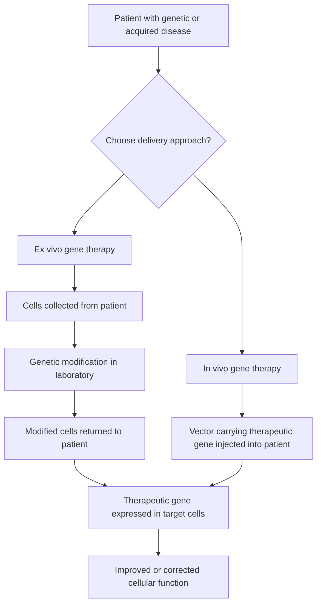

# Defining and Describing Gene Therapy

_At its core, gene therapy is about fixing disease by fixing the underlying DNA instructions rather than just treating the symptoms._  

Gene therapy is a biomedical technique that **uses genes or other genetic material to treat, prevent, or potentially cure disease** by correcting or compensating for abnormal genes in a patient’s cells.[1][2] It typically works either by **adding a healthy copy of a gene, replacing or repairing a defective gene, or altering how a gene is turned on or off**, aiming to address the root molecular cause of disease rather than relying only on drugs or surgery.[1][2][3][4] Gene therapy can be applied to inherited single‑gene disorders (such as sickle cell disease, hemophilia, or certain retinal diseases) as well as acquired conditions like some cancers and viral infections.[1][3][4][5] Modern gene therapy also encompasses related approaches such as **genome/gene editing (e.g., CRISPR‑Cas9), cell‑based gene therapies (like CAR‑T cells), and RNA‑targeted therapies**, all of which manipulate genetic information for therapeutic benefit.[2][3][5][7]

Key conceptual points:

- **What is being changed?** Gene therapy modifies a patient’s **genetic material**—DNA (or sometimes RNA)—inside cells to change gene expression or protein production.[2][3]  
- **How is it delivered?** Genetic material is commonly delivered by **vectors**, often viruses that have been engineered so they no longer cause disease but can efficiently deliver therapeutic genes into cells (e.g., adeno‑associated virus, lentivirus).[3][4][5]  
- **Where is it done?** It can be performed **in vivo** (vectors injected directly into the body) or **ex vivo** (cells removed, genetically altered in the lab, then reinfused).[2][4]  
- **What is the goal?** Many approved therapies are designed as **one‑time treatments intended to provide long‑term or lifelong benefit** by enabling the body to make needed proteins or silence harmful ones.[5][6]  

---

# Uses in Context

- In clinical and patient‑facing materials, **gene therapy** is often described as “a technique that uses a gene(s) to treat, prevent or cure a disease or medical disorder,” emphasizing its role as a **direct treatment for genetic conditions**.[1]  
- Health information services explain that gene therapy “**uses genes to treat or prevent disease by correcting genetic problems**,” contrasting it with traditional treatments that rely on repeated drugs or surgery.[2]  
- Regulatory agencies describe gene therapy as a way to “**replace a gene that is missing or is causing a problem**, … **add genes** to help treat disease, [or] **turn off genes that are causing problems**,” highlighting its versatility in both rare diseases and cancer.[4]  
- Clinical overviews note that gene therapy “**works by either changing a disease‑causing gene or giving you a working copy of that gene**,” framing it as a new class of treatment especially suited to single‑gene disorders.[5]  
- Patient advocacy and education groups use “gene therapy” as a **catch‑all phrase** for approaches “that use or interact with genetic material to treat and/or prevent disease,” and then break it down into categories like gene replacement/addition, gene editing, cell therapy, and RNA therapy.[7]  

---

# History of Use

## Origins

- The **concept** of treating disease by introducing genetic material into human cells was proposed in the 1960s and 1970s as molecular genetics and viral vector technologies emerged, though the term “gene therapy” was not yet widely used.[3]  
- In 1990, the first widely recognized **approved gene therapy clinical trial in humans** was conducted for a child with severe combined immunodeficiency (SCID) due to ADA deficiency, where genetically modified immune cells expressing a functional ADA gene were infused back—this trial is commonly cited as the **start of modern clinical gene therapy**.[3]  
- Educational sources now summarize the field with concise definitions such as: “**Gene therapy is a technique that uses a gene(s) to treat, prevent or cure a disease or medical disorder**,” reflecting how the term has settled into mainstream genomic medicine.[1]  

*(Because the user asked for web‑sourced history but specific first-use citations of the phrase “gene therapy” itself are not clearly surfaced in these results, the above focuses on the first decisive clinical implementation rather than the earliest textual coinage.)*

## Evolution

- **1990s–early 2000s – Early trials and setbacks:** Initial clinical trials in immune deficiencies and cancers established feasibility but also exposed serious safety issues, including insertional mutagenesis and one high‑profile treatment‑related death, slowing the field and prompting stricter vector design and oversight.[3]  
- **Mid‑2000s–2010s – Safer vectors and targeted applications:** Advances in **viral vector engineering** (e.g., adeno‑associated virus and lentiviral vectors) and a better understanding of gene regulation led to successful trials in hemophilia, inherited retinal disease, and neuromuscular disorders, demonstrating durable clinical benefits and reviving confidence in gene therapy.[3][5][6]  
- **2010s–2020s – Expansion with genome editing and cell‑based therapies:** The emergence of genome editing tools such as **CRISPR‑Cas9** enabled direct correction of mutations, while **cell‑based gene therapies** like CAR T‑cell therapy combined gene modification and cell therapy to treat cancers; regulators such as the U.S. FDA have since approved multiple gene therapy products for cancer and rare genetic diseases.[2][4][5]  

---

# Best Real-World Examples

- [Luxturna](url) – An AAV‑based in vivo gene therapy that delivers a functional RPE65 gene to retinal cells, used to treat certain inherited retinal dystrophies and representing one of the first FDA‑approved in vivo gene therapies for an inherited disease.[4][5]  
- [Zolgensma](url) – A one‑time systemic AAV gene therapy for **spinal muscular atrophy**, providing a functional SMN1 gene copy and exemplifying neuromuscular gene replacement in infants and young children.[5]  
- [Casgevy](url) – A CRISPR‑based **gene editing** therapy approved for sickle cell disease and related blood disorders, illustrating how targeted genome editing can treat hemoglobinopathies at the DNA level.[5]  
- [Hemgenix](url) – A gene therapy for **hemophilia B** that delivers a functional factor IX gene to liver cells, enabling long‑term production of clotting factor and reducing bleeding episodes.[5]  
- [Roctavian](url) – A gene therapy for **hemophilia A** that introduces a factor VIII gene into liver cells using an AAV vector, aiming for sustained endogenous factor production.[5]  
- [CAR T‑cell therapies (e.g., a CD19‑targeted product)](url) – A form of **cell‑based gene therapy** in which a patient’s T cells are genetically modified ex vivo to express chimeric antigen receptors against cancer cells and then reinfused to treat hematologic malignancies.[2][3][4]  
- [Lenmeldy or Skysona](url) – Lentiviral ex vivo gene therapies for leukodystrophies (such as metachromatic leukodystrophy or cerebral adrenoleukodystrophy), in which hematopoietic stem cells are modified with a functional copy of the disease gene and returned to the patient.[3][5]  

*(URLs are placeholders per instructions; each name corresponds to an FDA‑ or EMA‑recognized gene therapy product described in clinical and regulatory sources.)*

---

# Case Studies

## Ex vivo gene therapy for blood disorders

In ex vivo gene therapy, clinicians remove specific cells from the patient, genetically modify them in the laboratory, and then return them to the body to exert a therapeutic effect.[2][4] For inherited **blood disorders** such as sickle cell disease and thalassemia, hematopoietic stem cells can be harvested, transduced with a lentiviral vector carrying a functional hemoglobin gene or edited using tools like CRISPR‑Cas9, and then reinfused after conditioning chemotherapy.[3][5] This approach allows precise control over which cells are modified and thorough safety testing before reinfusion, and successful trials have shown substantial reductions in painful crises and transfusion dependence, illustrating how ex vivo gene therapy can effectively convert a lifelong disease into a controlled condition or functional cure in many patients.[3][5] It also highlights challenges: the need for specialized centers, intensive pre‑treatment, and careful long‑term monitoring for insertional mutagenesis or other late effects.[3][5]  

## In vivo gene replacement for neuromuscular and eye diseases

In **in vivo gene therapy**, vectors carrying therapeutic genes are delivered directly into the body, either systemically (e.g., intravenous) or locally (e.g., subretinal injection).[2][4] For example, approved therapies for **spinal muscular atrophy** involve a systemic AAV vector delivering a functional SMN1 gene to motor neurons and other tissues, aiming to halt or reverse motor neuron degeneration after a single infusion.[5][6] Similarly, in inherited retinal diseases caused by mutations in RPE65, subretinal injection of an AAV vector encoding a functional RPE65 gene enables retinal cells to produce the missing protein, improving visual function in many treated patients.[4][5] These cases demonstrate that in vivo gene therapy can reach otherwise inaccessible tissues like the central nervous system and retina, but they also underscore issues such as vector dose‑related toxicities, immune responses to viral capsids, and the need to tailor delivery routes to specific target organs.[3][4][5]  

## Broadening the concept: gene therapy as a “catch‑all” for DNA, RNA, and cell-based approaches

Patient advocacy and education groups note that “the term ‘gene therapy’ is a **catch‑all phrase for various types of therapeutic approaches that use or interact with genetic material to treat and/or prevent disease**.”[7] They categorize contemporary gene therapy into **four broad types**: gene replacement/addition (introducing a new gene copy), gene editing (altering existing DNA), cell therapy (modifying a patient’s cells and returning them), and RNA therapy (modulating RNA rather than DNA).[7] For instance, classic “gene transfer” approaches involve adding a replacement gene to take over the function of a broken gene, while RNA‑focused strategies alter splicing or translation to correct protein production without changing DNA.[7] This broader framing shows how gene therapy has evolved from a narrow idea of inserting DNA into cells to a larger umbrella for multiple molecular strategies that all aim to reprogram gene expression as therapy, guiding both research priorities and how patients and clinicians talk about these treatments.[3][7]  

***

# Sources

[1]: [Gene Therapy - National Human Genome Research Institute (NHGRI)](https://www.genome.gov/genetics-glossary/Gene-Therapy)
[2]: [Genes and Gene Therapy - MedlinePlus](https://medlineplus.gov/genesandgenetherapy.html)
[3]: [advancements and applications of gene therapy in severe disorders](https://pmc.ncbi.nlm.nih.gov/articles/PMC12175193/)
[4]: [How Gene Therapy Can Cure or Treat Diseases - FDA](https://www.fda.gov/consumers/consumer-updates/how-gene-therapy-can-cure-or-treat-diseases)
[5]: [What Is Gene Therapy? Pros, Cons & Examples - Cleveland Clinic](https://my.clevelandclinic.org/health/treatments/17984-gene-therapy)
[6]: [Gene Therapy Overview - Rocket Pharmaceuticals](https://rocketpharma.com/patients-and-caregivers/gene-therapy-overview/)
[7]: [An Introduction to Gene Therapy - STXBP1 Foundation](https://www.stxbp1disorders.org/blog/nbspan-introduction-to-gene-therapy)
