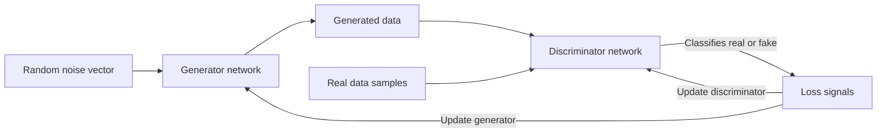

_Generative adversarial networks turn neural networks into rivals, using competition between a “forger” and a “detective” to produce strikingly realistic synthetic data. [^wi1587] [^oyum99]_

Generative Adversarial Networks (**GANs**) are a family of deep learning models where two neural networks, a **generator** and a **discriminator**, are trained together in an adversarial game to generate new data that mimics a training distribution. [^wi1587] [^oyum99] [^d7omqa] [^r5bg7i] They apply whenever you want machines to create images, audio, video, or other complex data *from scratch* rather than just classify or predict, and have become central to modern generative AI in computer vision, entertainment, simulation, and data augmentation. [^wi1587] [^oyum99] [^8htaca] [^36eqti] GANs matter because they can “generate new, realistic data by learning from existing data,” enabling synthetic faces, artworks, voices, and environments that are difficult to distinguish from real-world data. [^oyum99] [^36eqti]

# Defining and Describing Generative Adversarial Networks

GANs are typically defined as a **generative model** consisting of two neural networks trained in opposition. [^wi1587] [^oyum99] [^d7omqa] [^r5bg7i]

- A **generator** $G$ learns to map a noise vector $z$ (often sampled from a simple distribution like Gaussian) to synthetic data samples such as images or audio. [^oyum99] [^d7omqa] [^r5bg7i]  
- A **discriminator** $D$ learns to distinguish between real samples from the training data and fake samples produced by the generator, outputting a probability that an input is real. [^oyum99] [^d7omqa] [^r5bg7i]  

During training, the generator tries to “fool” the discriminator, while the discriminator tries to correctly classify inputs as real or fake, forming a two-player minimax game. [^oyum99] [^d7omqa] [^r5bg7i] As training progresses, the generator improves until the discriminator “cannot distinguish [generated data] from real data,” at which point the generator’s outputs are considered high quality. [^wi1587] [^d7omqa] [^r5bg7i] Conceptually, GANs “go beyond classification to generate content,” making them different from purely discriminative deep learning models. [^oyum99]

Common characteristics:

- **Architecture**: Both $G$ and $D$ are neural networks; for images they are often convolutional (e.g., DCGAN), sometimes with deeper or residual architectures. [^oyum99] [^8htaca] [^r5bg7i]  
- **Training signal**: The discriminator’s classification loss is backpropagated through the discriminator and into the generator, providing an implicit learning signal about how to make fake data more realistic. [^d7omqa] [^r5bg7i]  
- **Applications**: GANs are used for image generation, video synthesis, “voice cloning,” style transfer, super-resolution, and creating synthetic training data, among other tasks. [^wi1587] [^oyum99] [^8htaca] [^36eqti]  

# Uses in Context

- In technical and educational contexts, GANs are introduced as “a type of deep learning architecture that uses two competing [[concepts/Explainers for AI/Neural Networks|Neural Networks]] to generate new data.”[^wi1587]  
- Tutorials and textbooks describe GANs as models that “generate new, realistic data by learning from existing data,” emphasizing their role in image, video, and music creation. [^oyum99]  
- Developer guides explain that “a generative adversarial network (GAN) has two parts: the generator learns to generate plausible data [and] the discriminator learns to distinguish the generator's fake data from real data.”[^d7omqa]  
- Industry explainers frame GANs as AI models that “create realistic outputs like images and voices,” noting their impact on “art, gaming, and computer graphics.”[^36eqti]  
- Online courses and specializations present GANs as “an emerging class of deep learning algorithms that [are] generating incredibly realistic images,” often positioning them alongside other generative models. [^8htaca] [^0vgz1c]  

# History of Use

## Origins

- GANs were introduced by **Ian Goodfellow** and colleagues in the 2014 paper “Generative Adversarial Nets,” presented at the conference **NIPS 2014** (now NeurIPS). [^oyum99] [^r5bg7i]  
- In that work, Goodfellow proposed training “a generative model and an adversarial discriminative model simultaneously,” where the generative model learns to produce samples that the discriminative model cannot distinguish from training data. [^r5bg7i]  
- The concept emerged from academic research in deep learning rather than from a large incumbent vendor; it was developed in an open research environment and quickly spread through the machine learning community via the paper, talks, and open-source implementations. [^oyum99] [^r5bg7i]  

## Evolution

- **2015–2016 – Deep convolutional GANs (DCGANs):** Researchers extended GANs to use convolutional architectures tailored to images, leading to “deep convolutional generative adversarial networks” (DCGANs) that significantly improved stability and image quality, and became a reference design for vision-based GANs. [^8htaca] [^r5bg7i]  
- **2017–2018 – Conditional and specialized GANs:** Work on conditional GANs allowed models to “tell your GAN what to generate,” such as specifying a dog breed or adjusting attributes like age in generated faces, greatly expanding control over outputs. [^8htaca] [^r5bg7i]  
- **Late 2010s – High-fidelity and application-specific GANs:** Subsequent research produced GAN variants for tasks such as super-resolution, image-to-image translation, and realistic face synthesis, enabling applications like “incredibly realistic images” and synthetic media that sparked both enthusiasm and concern about deepfakes. [^8htaca] [^36eqti]  

# Best Real-World Examples

- [StyleGAN](https://arxiv.org/abs/1812.04948) – A family of GAN architectures for high-resolution face and object synthesis that produces photorealistic images widely used in art projects, games, and synthetic datasets. [^r5bg7i] [^36eqti]  
- [This Person Does Not Exist](https://thispersondoesnotexist.com) – A web demo built on StyleGAN that continuously generates realistic human faces of people who do not exist, showcasing the visual power of GANs. [^36eqti]  
- [Artbreeder](https://www.artbreeder.com) – An online platform that uses GAN-based models to let users “breed” and morph images such as faces and landscapes by adjusting sliders, popular among digital artists and indie creators. [^36eqti]  
- [NVIDIA GauGAN](https://www.nvidia.com/en-us/research/ai-playground/gaugan/) – A research demo and tool using GANs to transform segmentation maps or sketches into photorealistic scenes, illustrating GANs in graphics and content creation. [^36eqti]  
- [DeepArt / neural art platforms](https://deepart.io) – Creative services leveraging GAN-like and related generative models to transform user photos into artwork, helping popularize AI-driven artistic style transfer and synthesis. [^36eqti]  
- [Google’s DeepDream-inspired and GAN-based experiments](https://experiments.withgoogle.com) – Experiments from Google’s research community that adopt GANs to generate surreal imagery and interactive creative tools, popularizing generative art for a broad audience. [^wi1587] [^8htaca]  

# Case Studies

## Case Study 1 – StyleGAN and Photorealistic Synthetic Faces

Researchers at NVIDIA and academic collaborators developed **StyleGAN**, a GAN architecture that introduced a style-based generator to produce unprecedentedly high-quality synthetic images, especially human faces. [^r5bg7i] [^36eqti] StyleGAN separates high-level attributes (like pose and identity) from stochastic variation (like freckles or hair strands), giving fine-grained control over generated results and making it easy to interpolate between different faces. [^r5bg7i] Public demos built on StyleGAN, such as “This Person Does Not Exist,” showed that GAN-generated portraits can be indistinguishable from real photographs to casual observers, drawing attention to the creative and ethical implications of synthetic media. [^36eqti] This case illustrates how an open research architecture can quickly propagate into indie projects, art platforms, and public discourse, highlighting both the power and risks of adversarial training for image synthesis. [^r5bg7i] [^36eqti]

## Case Study 2 – GANs for Creative Tools and Art Platforms

Creative platforms such as **Artbreeder** use GAN-based models to let users interactively explore a “latent space” of images, combining and editing faces, landscapes, and other content through intuitive controls rather than traditional image editing. [^36eqti] By building on open research in GAN architectures like DCGAN and StyleGAN, these platforms enable artists, hobbyists, and small studios to generate large numbers of unique, high-quality visuals without custom 3D modeling or photography. [^8htaca] [^r5bg7i] [^36eqti] The success of these tools in online art communities and indie game development demonstrates how GANs can democratize content creation, turning complex generative models into accessible interfaces for experimentation and visual storytelling. [^8htaca] [^36eqti]

## Case Study 3 – GANs in Education and Developer Training

Online courses such as Udacity’s **“Deep Learning: Building Generative Models”** and GAN-focused specializations teach developers to “build basic GANs using [[Tooling/AI-Toolkit/AI Programming Frameworks/PyTorch|PyTorch]] and advanced DCGANs using convolutional layers,” reflecting the growing importance of GAN literacy in the machine learning field. [^8htaca] [^0vgz1c] These courses walk learners through constructing generator and discriminator networks, training them adversarially, and then extending them to conditional and more controllable GANs (e.g., specifying which type of object to generate). [^8htaca] [^0vgz1c] By providing hands-on projects like training a GAN on CIFAR-10 images, they help students internalize the dynamics of adversarial training, highlighting common issues (like mode collapse) and practical techniques for stabilizing GANs in real-world applications. [^oyum99] [^8htaca] [^0vgz1c]

***

# Sources

[^wi1587]: [What are generative adversarial networks (GANs)? - Google Cloud](https://cloud.google.com/discover/what-are-generative-adversarial-networks)
[^oyum99]: [Generative Adversarial Network (GAN) - GeeksforGeeks](https://www.geeksforgeeks.org/deep-learning/generative-adversarial-network-gan/)
[^d7omqa]: [Overview of GAN Structure | Machine Learning](https://developers.google.com/machine-learning/gan/gan_structure)
[^8htaca]: [Generative Adversarial Networks (GANs) Specialization - YouTube](https://www.youtube.com/watch?v=W-EPzOh-6E4)
[^r5bg7i]: [The Ultimate Guide to Generative Adversarial Networks (GANs)](https://pub.towardsai.net/the-ultimate-guide-to-generative-adversarial-networks-gans-from-zero-to-hero-6459317b4bdf)
[^0vgz1c]: [Deep Learning: Building Generative Models | Online Course - Udacity](https://www.udacity.com/course/building-generative-models--cd1823)
[^36eqti]: [What Is a Generative Adversarial Network (GAN)? - Akamai](https://www.akamai.com/glossary/what-is-a-generative-adversarial-network-gan)
