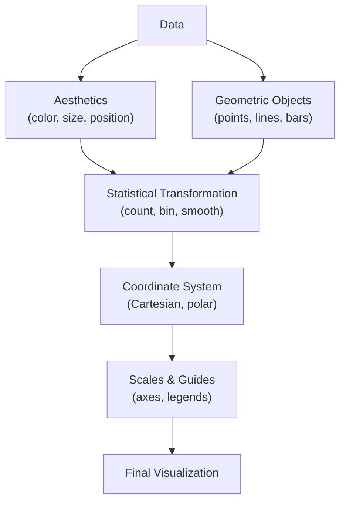

[[Sources/People/Hadley Wickham|Hadley Wickham]]
[[ggsql]]

# Grammar of Graphics

## Defining and Describing Grammar of Graphics

_A systematic framework for describing and constructing any data visualization by composing independent grammatical elements—data, aesthetics, geometry, statistics, and coordinates—like words in a sentence._

[^1dbju6]dbju6]: The **Grammar of Graphics** (GoG) is a grammar-based system for representing graphics to provide grammatical constraints on the composition of data and information visualiza [^1dbju6]ns. [1] A graphical grammar differs from a graphics pipeline as it focuses on semantic components such as scales and guides, statistical functions, coordinate systems, marks and aesthetic attributes. [^n9v1sj] The GoG helped expand the expressive gamut of visualization by moving beyond fixed chart types and towards a design space of composable operators. Unlike traditional charting libraries where you select a pre-built chart type (bar, pie, line), a grammar of graphics lets you specify the underlying rules by which data maps to visual properties, making it possible to build novel visualizations by composition rather than choosing from a menu.

## Uses in Context

- **Statistical graphics authoring**: [^9kx4ym] Applied to visualizations, a **grammar of graphics** is a grammar used to describe and create a wide range of statistical graphics, moving from fixed chart types to compositional design. [^0h4773] The grammar of graphics is a clear and intuitive way of describing nearly any data visualization.

- **Chart type transformat [^1dbju6]**: [1] For example, a bar chart can be converted into a pie chart by specifying a polar coordinate system without any other change in graphical specification—illustrating how the same data specification can yield radically different visualizations.

- **Multi-view and interactive syst [^1dbju6]**: [1] Vega-Lite combines ideas from Wilkinson's Grammar of Graphics and Wickham's Layered Grammar of Graphics with a composition algebra for layered and multi-view displays with a grammar of interaction.

- **Annotation and communication design**: [^sd21ma] Annotations are central to effective data communication, yet most visualization tools treat them as secondary constructs—leading researchers to propose a declarative extension to Wilkinson's Grammar of Graphics that reifies annotations as first-class design elements.

- **Cross-language standardization**: [^0h4773] The grammar of graphics is the foundation of the ggplot2 R package and has been implemented in many other languages, including Python, enabling consistent visualization semantics across platforms.

- **SQL-native visualization**: [^0k03lg] ggsql is an implementation of the grammar of graphics based on SQL, extending the grammar to data manipulation and visualization queries in a single declarative interface.

## History of Use

### Or [^1dbju6]ns

[^1dbju6]: [^ev4pqs] The grammar of graphics concept was launched by Leland Wilkinson in 2001 (Wilkinson et al., 2001; Wilkinson, 2005), though the concept was introduced in the 1990s by Leland Wilkinson. Wilkinson's foundational work introduced a formal system for describing the semantic components of statistical graphics as a set of composable rules, treating visualization construction analogously to how grammar structures language. Rather than treating charts as monolithic objects (a "bar chart," a "scatter plot"), Wilkinson's framework decomposed them into fundamental building blocks: variables, algebra, geometry, aesthetics, statistics, scales, and coordinates—each specifiable independently and combinable into novel visualizations.

### Evolution

- **2005: Wilkinson's for [^1dbju6]ization** — [1] Wilkinson conceived the seven elements of a graphics to be Variables, Algebra, Geometry, Aesthetics, Statistics, Scales, and Coordinates, establishing the canonical theory of graphical composition.

- **2009–2010: Hadley Wickham's layered grammar a [^1dbju6]ggplot2** — [1] Wickham added a hierarchy of defaults based around the idea of building up a graphic from multiple layers, with elements including Defaults (data and mapping), Layer (data, mapping, geom, stat, position), Scale, Coordinate system, and Faceting. [^9kx4ym] The layered grammar of graphics approach is implemented in {ggplot2}, a widely used graphics library for R, becoming the most adopted instantiation of the grammar in practice.

- **2016–2018: Vega and Vega-Lite's grammar of i [^1dbju6]raction** — [1] Vega-Lite combines ideas from Wilkinson's Grammar of Graphics and Wickham's Layered Grammar of Graphics with a composition algebra for layered and multi-view displays with a grammar of interaction, extending the framework to handle complex multi-view coordination and event-driven interactivity.

## Best Real-World Examples

- [**ggplot2**](https://ggplot2.tidyverse.org/) — The R graphics library that popularized Hadley Wickham's layered grammar of graphics, becoming the reference implementation and inspiring grammars across languages . [^9kx4ym] [^0h4773]

- [**Vega-Lite**](https://vega.github.io/vega-lite/) — A declarative grammar for interactive visualization that combines Wilkinson and Wickham's principles with a formal algebra for composing multi-view and intera [^1dbju6]ve displays . [1] [^n9v1sj]

- [**Plotnine**](https://plotnine.readthedocs.io/) — A Python implementation of the grammar of graphics that ports ggplot2 semantics to Python, enabling layered composition of data, aesthetics, and geometric objects . [^ev4pqs]

- [**ggsql**](https://github.com/posit-dev/ggsql) — An emerging implementation of the grammar of graphics for SQL, enabling declarative specification of both data transformation and visualization in a unified grammar . [^0k03lg]

- [**MIT GoFish research**](https://vis.csail.mit.edu/pubs/gofish/) — A formal extension to the grammar of graphics that expands its expressive power by adding new compositional operators, advancing the theoretical foundations . [^n9v1sj]

- [**Vega-Lite Annotation extension**](https://arxiv.org/abs/2507.04236) — A declarative extension that reifies annotations as first-class design elements, showing how the grammar of graphics can be extended to encompass data communication and explanation . [^sd21ma]

- [**Observable Plot**](https://observablehq.com/plot/) — A lightweight, grammar-of-graphics-inspired library for exploratory data analysis in JavaScript, demonstrating the framework's adoption in web-native visualization environments.

## Case Studies

### Case Study 1: ggplot2's Path to Dominance in Statistical Computing (2009–2015)

When Hadley Wickham introduced ggplot2 in 2009, R already had a mature graphics system (base graphics) built on a "pen and paper" metaphor where you drew sequentially. [^9kx4ym] Wickham's layered grammar of graphics approach—implemented in ggplot2—structured visualization as a series of independent, composable layers: data layer, aesthetic mappings (which variables map to which visual properties), geometric objects (points, lines, bars), statistical transformations, position adjustments, scales, and coordinate systems. [^9kx4ym] By 2015, ggplot2 had become the default choice for professional data scientists because it made exploratory workflow faster (one could rapidly iterate through geoms and aesthetics) and reproducible (the layered specification was transparent and shareable). The library proved that Wilkinson's abstract framework, when well-engineered and paired with sensible defaults, could outcompete entrenched imperative APIs. This success demonstrated that a *grammar*—not a toolkit of pre-made charts—was what practitioners actually wanted: the freedom to compose visualizations from reusable rules rather than memorize dozens of function names.

### Case Study 2: Vega-Lite's Multi-View and Interaction Grammar (2016–2020)

The original grammar of graphics handled single, static visualizations well but struggled with multi-view coordination (linked plots, dashboards) and [^1dbju6]eractivity. [1] Vega-Lite extended the framework by combining Wilkinson's and Wickham's ideas with a composition algebra that enabled layered and multi-view displays alongside a grammar of interaction—formally specifying how user events (clicks, selections) could bind multiple v [^1dbju6]s together. [1] Between 2016 and 2020, Vega-Lite became the foundation for tools like Observable, Altair (Python), and Apache Superset, all of which adopted its declarative specification. The extension showed that the grammar of graphics was not a closed theory but could absorb new concerns—interactivity, multi-view coherence—without losing its compositional elegance. Vega-Lite's adoption also demonstrated that a well-designed grammar could work across languages and platforms, as long as the core principle held: specify composition rules declaratively, and let the system generate the visualization.

### Case Study 3: Annotation as a Grammar-Level Concern (2024–2026)

For years, annotation (titles, labels, arrows, callouts) was treated as an afterthought in visualization grammars—something added manually after the chart was rendered. [^sd21ma] By 2024–2025, researchers recognized that annotations are central to effective data communication, yet most visualization tools treat them as secondary constructs—manually defined, difficult to reuse, and loosely coupled to the underlying visualization grammar. In response, researchers developed extensions like Vega-Lite Annotation, which [^sd21ma] reifies annotations as first-class design elements, enabling structured specification of annotation targets, types, and positioning strategies. This evolution reflects a broader maturation of the grammar of graphics: the framework is no longer just about *encoding data* but about *communicating insights*. By adding annotation as a first-class grammatical element—specifiable declaratively, composable with data and geometry, and portable across tools—the field has shown that the grammar of graphics can expand beyond its statistical roots to encompass the full lifecycle of visual communication. This case illustrates that grammars are living frameworks; they evolve as practice and research reveal new compositional needs.

***

# Sources

[^1dbju6]: [Wilkinson's Grammar of Graphics - Wikipedia](https://en.wikipedia.org/wiki/Wilkinson's_Grammar_of_Graphics)
[^9kx4ym]: [The grammar of graphics - INFO 3312/5312: Data Communication](https://info3312.infosci.cornell.edu/tutorials/grammar-of-graphics.html)
[^n9v1sj]: [GoFish: A Grammar of More Graphics! - MIT Visualization Group](https://vis.csail.mit.edu/pubs/gofish/)
[^0h4773]: [Understand the grammar of graphics - YouTube](https://www.youtube.com/watch?v=JkdBxGQySmM)
[^ev4pqs]: [Grammar of Graphics for Python: An Introduction to Plotline](https://www.geeksforgeeks.org/python/an-introduction-to-grammar-of-graphics-for-python/)
[^sd21ma]: [AnnoGram: An Annotative Grammar of Graphics Extension - arXiv](https://arxiv.org/abs/2507.04236)
[^0k03lg]: [ggsql: A grammar of graphics for SQL - Posit Open Source](https://opensource.posit.co/blog/2026-04-20_ggsql_alpha_release/)
