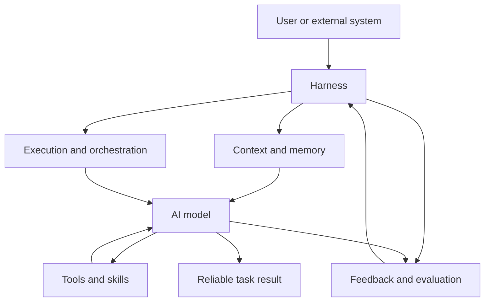

---
tags:
  - Tech-Trend
  - Influencer-Favorites
  - State-Of-The-Art-Practices
  - State-of-the-Art
date_created: 2025-12-05
date_modified: 2026-06-06
for_clients:
  - Laerdal
  - Param
  - Parslee
  - Tonguc
cf_last_run: 2026-06-06T04:19:49.934Z
cf_last_run_model: Perplexity sonar-pro
site_uuid: e7d169ee-71ec-4f4f-9bd6-356264874852
publish: true
title: Harness Engineering
slug: harness-engineering
at_semantic_version: 0.0.1.1
augmented_with: Perplexity AI using Sonar Pro
---

https://youtu.be/I82j7AzMU80?si=Q9Vpe6v3wxCLNzgL

https://openai.com/index/harness-engineering/

[[Tooling/Software Development/Developer Experience/DevTools/Pi Coding Agent|Pi.dev]]
[[Tooling/AI-Toolkit/Generative AI/Code Generators/Claude Code|Claude Code]]

# Defining and Describing Harness Engineering

_Harness engineering is about everything you build around an AI model so it can reliably do real work instead of just answer prompts once._[^c42ggi] [^49rdaa]

Harness engineering is an emerging discipline in AI/agent systems that focuses on the **scaffolding, environment, and control systems** wrapped around a model—prompts, tools, context policies, execution logic, guardrails, and feedback loops—so it behaves like a dependable agent rather than a raw LLM. [^c42ggi] [^hd0nep] [^49rdaa] [^8i1r8a] It applies whenever organizations want models to drive complex workflows (coding, operations, analysis) safely and repeatably, and it matters because in production “the environment you put [models] in is going to determine the output quality” as much as the model itself. [^c42ggi] [^49rdaa] In this framing, as Viv’s popular one‑liner puts it, **“Agent = Model + Harness,”** and if you’re not the model, you are effectively engineering the harness. [^hd0nep] [^49rdaa] [^hd6swj] Practitioners increasingly treat the harness as a first‑class artifact that “tightens every time the agent slips,” turning each observed failure into a design change so the agent does not make that mistake again. [^hd0nep] [^49rdaa]

Key working definitions from practitioners and early write‑ups:

- HumanLayer’s Viv describes **harness engineering** as “the art and science of leveraging your coding agent’s configuration points to improve output quality and increase task success rates.”[^hd0nep]
- Addy Osmani summarizes a harness as “the prompts, tools, context policies, hooks, sandboxes, subagents, feedback loops, and recovery paths wrapped around the model so it can actually finish something,” and notes that “a raw model is not an agent. It becomes one once a harness gives it state, tool execution, feedback loops, and enforceable constraints.”[^49rdaa]
- Anthropic’s internal framing, reported in AI‑focused commentary, treats the harness as a **three‑layer architecture**: an **information layer** (context and tools), an **execution layer** (decomposition, collaboration, recovery), and a **feedback layer** (verification, tracing, observability). [^c42ggi]

# Uses in Context

- To describe **agent‑centric coding workflows**, HumanLayer writes that “harness engineering…is the subset of context engineering which primarily involves leveraging harness configuration points to carefully manage the context windows of coding agents.”[^hd0nep]
- Addy Osmani uses the term to distinguish real agents from raw models: “A coding agent is the model plus everything you build around it. Harness engineering treats that scaffolding as a real artifact, and it tightens every time the agent slips.”[^49rdaa]
- In discussions of AI organizational design, AI Daily Brief’s “Harness Engineering 101” video explains that harness engineering covers “the systems, tooling, and interfaces surrounding AI models to provide context, memory, safe execution, and orchestration,” arguing that these determine real‑world AI performance and business impact. [^c42ggi]
- An “awesome‑harness‑engineering” list on [[Tooling/Software Development/Developer Experience/GitHub|GitHub]] defines the field as “the discipline of designing the scaffolding — context delivery, tool interfaces, planning artifacts, verification loops … — around models so they behave like robust agents instead of stochastic parrots.”[^8i1r8a]
- [[Vocabulary/DataOps|DataOps]] oriented commentary frames it as **agent control systems**, where “harness engineering builds AI agent control systems using guides and sensors,” emphasizing data contracts, observability, and governance as part of the harness. [^hd6swj]
- A DEV Community introduction generalizes the idea with the metaphor “think of AI like a horse…you need to develop a harness…agents, roles, artifacts, and workflow standards that let you guide execution instead of hoping for a good result,” extending the term beyond coding agents to cross‑functional AI workflows. [^580vx1]

# History of Use

## Origins

- A widely cited origin for the modern term is **Viv (HumanLayer)**, who coined “harness engineering” in the context of **coding agents**, defining it as “the practice of leveraging these configuration points to customize and improve your coding agent’s output quality and reliability.”[^hd0nep] [^49rdaa] [^8i1r8a]
- The phrase gained visibility when **Mitchell Hashimoto** summarized the practice as “anytime you find an agent makes a mistake, you take the time to engineer a solution such that the agent never makes that mistake again,” a quote repeated in early blog posts and talks on harness engineering. [^hd0nep] [^49rdaa]
- The concept builds on long‑standing software and testing usage of “harness” (as in “test harness”), where a harness is “the layer that connects, protects, and orchestrates components without doing the work itself,” language cited in AI Daily Brief’s explanation of the term. [^c42ggi]

## Evolution

- **Early 2020s – from prompt engineering to context/harness engineering.** As LLM use moved from one‑off prompts to agents, practitioners began to talk about “context engineering” and then “harness engineering” as a broader practice covering prompts, tools, and orchestration, with Viv’s “Agent = Model + Harness” formulation crystallizing the shift. [^hd0nep] [^49rdaa] [^8i1r8a]
- **By 2024–2025 – formalization for coding agents.** HumanLayer’s “Skill Issue: Harness Engineering for Coding Agents” article systematized the idea around concrete configuration points—`CLAUDE.md`/`AGENTS.md` files, skills, sub‑agents, hooks, and back‑pressure—as primary levers for improving reliability, rather than swapping models. [^hd0nep]
- **Mid‑2020s – three‑layer architectures and disposable harnesses.** Anthropic Labs and commentators popularized the **information / execution / feedback** layering of harness design and the notion of “disposable harnesses” that can be rapidly created and discarded for specific tasks, emphasizing organizational design and observability as core to harness engineering. [^c42ggi]
- **2026 – mainstream framing in AI ops and data tooling.** Guides like Atlan’s “What Is Harness Engineering AI? The Definitive 2026 Guide” present harness engineering as a general pattern for building **AI agent control systems** with guides, sensors, and data governance, extending the term from coding agents into broader enterprise AI workflows. [^hd6swj]

# Best Real-World Examples

- **[HumanLayer](https://www.humanlayer.dev/blog/skill-issue-harness-engineering-for-coding-agents)** – Startup documenting production harness patterns for coding agents, including skills, sub‑agents, hooks, and progressive disclosure to keep agents in the “smart zone.”[^hd0nep]
- **[Agent Harness Engineering (Addy Osmani)](https://addyosmani.com/blog/agent-harness-engineering/)** – Practitioner playbook detailing how prompts, tools, MCP servers, sandboxes, orchestration logic, hooks, and observability form a harness around coding agents. [^49rdaa]
- **[ai-boost/awesome-harness-engineering](https://github.com/ai-boost/awesome-harness-engineering)** – Community‑maintained index of libraries, patterns, and tools focused on harness engineering, positioning it as a discipline of designing scaffolding, context delivery, and verification around models. [^8i1r8a]
- **[Anthropic Managed Agents](https://www.youtube.com/watch?v=OTjZBjq5FPg)** – Commercial coding agents that explicitly separate models from disposable harnesses providing memory files, web search, MCP tools, sandboxed execution, and verification loops. [^c42ggi]
- **[Atlan Harness Engineering Guide](https://atlan.com/know/what-is-harness-engineering/)** – Data‑ops oriented interpretation showing how data contracts, lineage, and monitoring become “guides and sensors” in an AI harness controlling agent behavior on enterprise data. [^hd6swj]
- **[DEV: An Introduction to Harness Engineering](https://dev.to/robearlam/an-introduction-to-harness-engineering-3j9l)** – Indie write‑up applying harness engineering principles to organizational workflows, mapping roles, artifacts, and workflow standards as a harness that channels AI across teams. [^580vx1]
- **[Open-source coding agent stacks indexed in “awesome-harness-engineering”](https://github.com/ai-boost/awesome-harness-engineering)** – Projects that expose explicit harness configuration (Agentfiles, MCP servers, skills, sub‑agents) and encourage users to iterate on harness design instead of model changes. [^8i1r8a]

# Case Studies

## 1. HumanLayer’s coding agents: skills, sub‑agents, and hooks

HumanLayer, an indie team building coding agents, published “Skill Issue: Harness Engineering for Coding Agents” as a field report on how they turned unreliable code‑generation into dependable workflows through harness engineering. [^hd0nep] They begin from the observation that coding agents expose many “configuration points”—system files like `CLAUDE.md`/`AGENTS.md`, skills, tools, sub‑agents, and hooks—and define harness engineering as the practice of leveraging these points to improve output quality and task success rates. [^hd0nep] In their day‑to‑day work, they use **skills** to implement *progressive disclosure*, ensuring that the agent only receives specific instructions, knowledge, or tools when it or the user decides they are needed, preventing context overload and keeping the main thread in the “smart zone.”[^hd0nep] They further use **sub‑agents** to encapsulate entire sessions for research or implementation tasks so that only the final result, not the intermediate tool calls or messages, returns to the parent agent’s context window, preserving limited context for high‑value reasoning. [^hd0nep] Finally, they implement **hooks** that can run automatically when events occur or tools are called—such as surfacing build/type errors to a coding agent before it finishes—so the harness forces the agent to keep working until the error is resolved, turning each class of failure into a permanent harness improvement. [^hd0nep] This case illustrates the core harness engineering loop: observe an agent mistake, then change the harness (skills, sub‑agents, hooks) so that category of mistake cannot recur, without changing the underlying model. [^hd0nep] [^49rdaa]

## 2. Agent = Model + Harness: Addy Osmani’s practical framework

Addy Osmani’s “Agent Harness Engineering” essay synthesizes Viv’s and Mitchell Hashimoto’s ideas into a concrete engineering framework for coding agents. [^49rdaa] He adopts Viv’s one‑liner “Agent = Model + Harness” and emphasizes that “if you’re not the model, you’re the harness,” reframing much of agent work as harness design. [^49rdaa] Osmani defines the harness as “every piece of code, configuration, and execution logic that isn’t the model itself,” and lists concrete components: system prompts and repository‑level files like `CLAUDE.md`/`AGENTS.md`; tools, skills, and MCP servers; bundled infrastructure like filesystems, sandboxes, and browsers; orchestration logic for sub‑agent spawning, handoffs, and model routing; hooks and middleware for deterministic execution; and observability—logs, traces, cost and latency metering. [^49rdaa] He proposes a design pattern he attributes to Viv: start from the **behavior you want (or want to fix)** and then derive the harness piece that delivers it, treating the harness as something that “tightens every time the agent slips.”[^49rdaa] For example, when an agent repeatedly ships broken code, the harness might add pre‑commit lint hooks, type‑checking steps, or compilation checks that must pass before a change is considered done, turning reliability into a property of the harness rather than the model. [^49rdaa] This case study demonstrates how harness engineering can be operationalized as a feedback‑driven, behavior‑first design practice rather than an abstract concept.

## 3. Anthropic’s disposable harnesses and three-layer architecture

A widely viewed “Harness Engineering 101” segment from the AI Daily Brief dissects Anthropic’s approach to coding agents and highlights harness engineering as a primary design lever for business impact. [^c42ggi] The video reports that Anthropic, in an announcement about managed agents, explicitly described pairing “an agent harness tuned for performance with production infrastructure,” and later defines a harness, echoing broader engineering usage, as “the layer that connects, protects, and orchestrates components without doing the work itself.”[^c42ggi] It relays Anthropic Labs’ description of a **three‑layer harness architecture**: an **information layer** that decides what information an agent can see and what capabilities (tools, memory, MCPs) it can invoke; an **execution layer** that determines how work is decomposed, how agents collaborate, and how the system recovers from failure; and a **feedback layer** that controls how the system improves over time via verification, evaluation, tracing, and observability. [^c42ggi] The same commentary emphasizes **“disposable harnesses”**, where Anthropic is said to be “building infrastructure to make harnesses disposable,” so teams can rapidly spin up and retire task‑specific harnesses around shared models, treating harnesses as configuration and code artifacts that evolve quickly as workflows change. [^c42ggi] This case underscores how a frontier lab adopts the harness engineering framing at scale: the model is necessary but insufficient, and organizational performance comes from how effectively teams design, observe, and iterate the harness around it. [^c42ggi] [^49rdaa]

***

# Sources

[^580vx1]: [An Introduction to Harness Engineering - DEV Community](https://dev.to/robearlam/an-introduction-to-harness-engineering-3j9l)
[^c42ggi]: [Harness Engineering 101 - YouTube](https://www.youtube.com/watch?v=OTjZBjq5FPg)
[^hd0nep]: [Skill Issue: Harness Engineering for Coding Agents - HumanLayer](https://www.humanlayer.dev/blog/skill-issue-harness-engineering-for-coding-agents)
[^49rdaa]: [Agent Harness Engineering - AddyOsmani.com](https://addyosmani.com/blog/agent-harness-engineering/)
[5]: [Harness engineering: leveraging Codex in an agent-first world](https://openai.com/index/harness-engineering/)
[^hd6swj]: [What Is Harness Engineering AI? The Definitive 2026 Guide - Atlan](https://atlan.com/know/what-is-harness-engineering/)
[7]: [What is harness engineering? - Software Improvement Group - SIG](https://www.softwareimprovementgroup.com/blog/what-is-harness-engineering/)
[^8i1r8a]: [ai-boost/awesome-harness-engineering - GitHub](https://github.com/ai-boost/awesome-harness-engineering)
