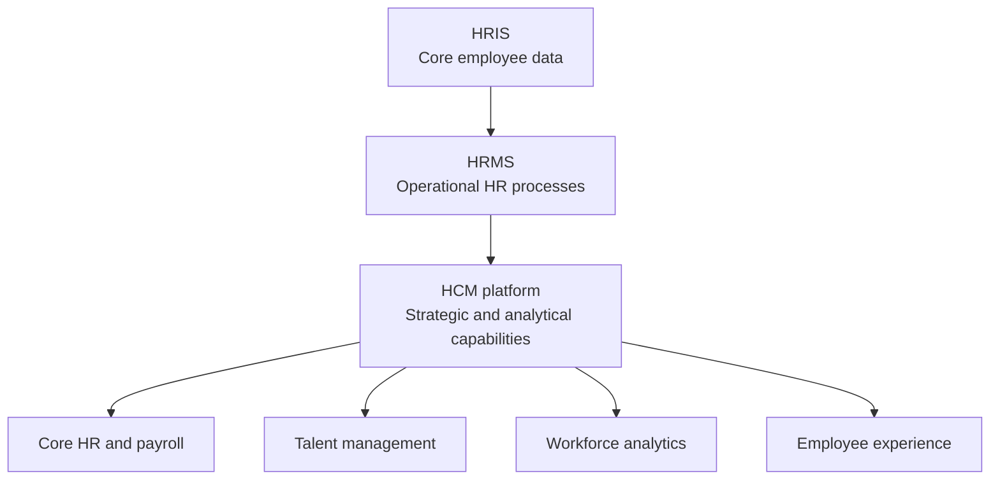

---
aliases:
  - HCM
  - HCMs
  - Human Capital Management Platform
date_created: 2026-06-19
date_modified: 2026-06-19
cf_last_run: 2026-06-19T17:50:44.719Z
cf_last_run_model: Perplexity sonar-deep-research
tags:
  - Enterprise-Jobs-To-Be-Done
  - Founder-Toolkit
  - Lossless-Toolkit
---
[[Gusto]]

# Human Capital Management Platforms: Definition, History, Architecture, and Practice  

Human Capital Management (HCM) platforms have evolved from simple record-keeping tools into integrated, cloud-based systems that unify core HR, payroll, talent management, workforce analytics, and increasingly finance, with the explicit goal of treating employees as strategic assets rather than mere administrative records. [^ffng0f] [^c5tz25] [^swhf69] [^3wkfos] [^bg40p8] [^7n4qol] [^e2ib9k] Modern HCM software suites extend the foundational capabilities of Human Resource Information Systems (HRIS) and Human Resource Management Systems (HRMS), encompassing end-to-end processes from recruitment and onboarding through performance management, learning and development, succession planning, and offboarding, while providing advanced analytics and artificial intelligence (AI)-driven insights to align the workforce with business objectives. [^c5tz25] [^swhf69] [^7n4qol] [^5a734n] [^e2ib9k] The global HCM software market reached approximately \$58.7 billion in 2024, with double‑digit year‑over‑year growth and a fragmented vendor landscape in which even the ten largest providers account for less than half of total spending, illustrating both the maturity and ongoing dynamism of this category. [^gfa7qk] As organizations navigate hybrid work, skills shortages, regulatory complexity, and pressure for better employee experiences, HCM platforms have become central to digital transformation agendas, connecting HR with payroll, time, scheduling, and increasingly finance and operational systems to drive more integrated, data-driven workforce management. [^ffng0f] [^swhf69] [^9scf1r] [^y8pn1i] [^7n4qol] [^5a734n]  

## Defining and Describing Human Capital Management Platforms  

_An HCM platform is best understood as the strategic “operating system” for an organization’s workforce, unifying data, processes, and analytics to maximize the value of human capital to the business. [^ffng0f] [^c5tz25] [^swhf69] [^3wkfos] [^7n4qol] [^e2ib9k]_  

At its core, Human Capital Management describes a philosophy and set of practices in which employees are treated as valuable assets to be developed and optimized in pursuit of organizational goals, rather than as static cost centers. [^ffng0f] [^swhf69] [^3wkfos] [^7n4qol] [^e2ib9k] SAP, for example, describes HCM as “a set of practices, tools, and systems for managing an organization’s workforce to maximize employee value and achieve business goals,” explicitly linking day‑to‑day HR processes with strategic outcomes such as productivity and engagement. [^ffng0f] Workday similarly defines HCM as “holistic strategies through which businesses attract, develop, and retain top talent while aligning HR processes with company goals,” emphasizing the alignment of workforce strategies with business objectives. [^swhf69] [^7n4qol] SMOWL, a learning and assessment provider, characterizes human capital management as a strategic approach to managing employees as valuable assets to achieve business objectives, reinforcing the shift from transactional HR to value‑oriented talent stewardship. [^3wkfos] Within this conceptual frame, an HCM platform or suite refers to the specific software system that operationalizes HCM by providing integrated digital capabilities across the entire employee lifecycle.  

HCM platforms are part of a broader taxonomy that also includes HRIS and HRMS, and understanding the distinctions between these categories is critical for precisely characterizing what makes an HCM platform unique. [^c5tz25] [^bg40p8] [^e2ib9k] An HRIS (Human Resource Information System) is generally considered the foundational system of record for employee data, centralizing and storing information such as demographics, job titles, compensation, benefits enrollment, payroll records, and compliance documentation. [^c5tz25] [^bg40p8] SAP notes that HRIS systems were among the first commercial HR software products developed in the 1980s, designed to digitize and automate core HR processes such as benefits administration, time and attendance, and payroll while maintaining structured repositories of employee data. [^bg40p8] An HRMS (Human Resource Management System) builds on HRIS by adding broader operational HR tools; APS Payroll and Paycor both describe HRMS as an integrated suite that combines the HRIS data backbone with core HR functions such as time tracking, performance management, recruitment tools, benefits administration, and employee self-service. [^c5tz25] [^e2ib9k]  

In contrast, HCM platforms are consistently described as the most comprehensive and strategic of the three categories, encompassing all HRIS and HRMS functionality while adding advanced talent management and analytics capabilities. [^c5tz25] [^swhf69] [^7n4qol] [^e2ib9k] APS Payroll notes that HCM “supports a long-term workforce strategy” and treats employees as strategic assets, going beyond operational HR to include talent acquisition and onboarding, learning and development tools, succession planning, compensation strategy, and workforce analytics and forecasting. [^c5tz25] Paycor similarly argues that while an HRIS is primarily for data management and an HRMS combines data management with HR operations, an HCM platform “combines data, HR functions, and strategy,” transforming HR processes such as talent acquisition, development, performance management, and analytics into strategic advantages. [^e2ib9k] Workday synthesizes this view by stating that HCM software includes everything in an HRIS and HRMS but “goes beyond basic administration to focus on strategic talent management and workforce development,” including advanced tools for recruiting, performance management, learning, succession planning, and analytics. [^swhf69] [^7n4qol]  

From a systems perspective, an HCM platform is typically implemented as a suite of integrated modules underpinning a unified data model, often delivered as cloud-based software-as-a-service. [^swhf69] [^gfa7qk] [^9scf1r] [^y8pn1i] [^7n4qol] [^lul1dq] [^5a734n] These modules normally cover core HR (employee records, organizational structures), payroll, time and attendance, scheduling, benefits, recruitment, onboarding, performance management, learning, compensation, succession, and workforce planning, alongside reporting and analytics. [^ffng0f] [^c5tz25] [^swhf69] [^9scf1r] [^bg40p8] [^7n4qol] [^5a734n] [^e2ib9k] Modern vendors such as Workday, UKG, SAP SuccessFactors, and Oracle position their HCM suites as single systems that “unify HR, finance, and payroll,” “connect HR, payroll and finance,” or “bring together HR, talent, payroll, time, and scheduling data in one system,” indicating the degree of integration expected of contemporary platforms. [^swhf69] [^9scf1r] [^y8pn1i] [^lul1dq] [^5a734n] This integrated architecture is essential to providing real‑time dashboards, AI-driven insights into skills gaps and succession risks, and consistent employee experiences across web and mobile channels. [^swhf69] [^9scf1r] [^7n4qol] [^lul1dq] [^5a734n]  

[IMAGE 1: Conceptual architecture diagram of an HCM platform, showing layers for core HR/HRIS, HRMS functions, strategic talent management, analytics, and employee experience, all connected to finance and payroll systems.]  

Because HCM platforms embody a complex hierarchy of concepts—from data storage to process automation to strategic analytics—it is useful to represent their relationship to HRIS and HRMS visually. The following Mermaid diagram illustrates a simplified taxonomy of HR technology categories, positioning HCM platforms as a superset of HRIS and HRMS capabilities:  

This diagram reflects how vendors and analysts describe the space: HRIS provides the foundational data; HRMS adds operational HR workflows; and HCM platforms add strategic talent management, advanced analytics, and experience layers, all of which are supported by a unified, often cloud-based, technology foundation. [^c5tz25] [^swhf69] [^bg40p8] [^7n4qol] [^e2ib9k] The emergent result is that when practitioners refer to “HCM platforms” today, they usually mean an integrated, cloud-hosted suite that consolidates HR master data and transactional processes, embeds analytics and intelligence, and supports continuous workforce development and planning, rather than a collection of disconnected point solutions. [^ffng0f] [^c5tz25] [^swhf69] [^gfa7qk] [^9scf1r] [^7n4qol] [^5a734n] [^e2ib9k]  

## Uses in Context  

In contemporary business and technology discourse, the term “Human Capital Management platform” is invoked in several distinct but overlapping ways that reflect both functional scope and strategic purpose. [^ffng0f] [^c5tz25] [^swhf69] [^9scf1r] [^3wkfos] [^7n4qol] [^5a734n] [^e2ib9k] First, it is used to describe a category of enterprise software that unifies core HR, payroll, and talent processes in a single cloud system, as exemplified by descriptions of Workday as “a leading enterprise HCM platform that unifies HR, finance, and payroll in a single cloud system” and UKG’s HCM as a solution that “brings together HR, talent, payroll, time, and scheduling data in one system.”[^9scf1r] [^5a734n] In this sense, “HCM platform” functions as a market label analogous to “ERP” for finance and supply chain, highlighting the breadth and integration of capabilities.  

Second, the term is widely used in the context of strategic workforce management and organizational transformation, where HCM platforms are presented as enablers of long‑term workforce strategy rather than just administrative efficiency. [^ffng0f] [^c5tz25] [^swhf69] [^3wkfos] [^7n4qol] [^e2ib9k] APS and Paycor both emphasize that HCM systems “treat employees as strategic assets” and support “a strategic approach to workforce management that views employees as valuable assets requiring investment and development,” underscoring their role in raising HR from a transactional function to a strategic partner. [^c5tz25] [^e2ib9k] Workday similarly stresses that HCM software helps organizations “attract, develop, and retain talent while aligning workforce strategies with business goals for long-term success,” suggesting that the platform is a key lever for executing on talent strategies such as building future skills, managing leadership pipelines, and improving engagement. [^swhf69] [^7n4qol] This rhetorical usage is particularly salient in discussions of digital transformation, where executives seek integrated technology platforms to operationalize new workforce strategies across increasingly distributed and hybrid environments. [^swhf69] [^9scf1r] [^7n4qol] [^5a734n]  

Third, HCM platforms are frequently invoked in conversations about the convergence of HR with adjacent domains such as finance, payroll, and workforce management. [^swhf69] [^9scf1r] [^y8pn1i] [^lul1dq] [^5a734n] Workday positions its HCM as part of a broader enterprise system that unifies HR and finance, thereby allowing organizations to link workforce plans with financial forecasting and budgeting. [^swhf69] [^9scf1r] Sage’s launch of Sage HCM is explicitly framed as “connecting HR, payroll and finance,” built on technology from the Criterion HCM platform to support complex HR and payroll needs while integrating with financial processes. [^y8pn1i] UKG similarly markets its HCM offering as delivering real-time dashboards that highlight staffing gaps, overtime risk, and other operational workforce metrics, reflecting the fusion of HCM with time, attendance, and scheduling historically associated with workforce management systems. [^5a734n] In this vocabulary, “HCM platform” connotes not just HR automation but a broader operational hub where workforce, payroll, and financial data intersect.  

Fourth, the term appears in analyst and market research contexts, especially in relation to Gartner’s “Magic Quadrant for Cloud HCM Suites for 1,000+ Employee Enterprises,” which evaluates vendors that offer broad HCM platforms delivered in the cloud. [^i3tl2w] [^gfa7qk] [^4bcoab] [^f69fh8] SAP and UKG both highlight their recognition as Leaders in this Magic Quadrant, thereby adopting Gartner’s terminology of “cloud HCM suites” as a synonym for HCM platforms that are comprehensive and appropriate for large enterprises. [^i3tl2w] [^4bcoab] Apps Run The World, a market research firm, also uses “HCM software vendors” as a category in its market size and forecast analysis, listing a top 10 of Workday, Microsoft, UKG, SAP, ADP, Oracle, Paycom, Ceridian (Dayforce), Paylocity, and Cornerstone OnDemand, together representing 45.6% of the HCM applications market. [^gfa7qk] In these contexts, “HCM platform” functions as a classification label that delineates which products are in scope for competitive comparisons and revenue tracking.  

Finally, HCM platforms are increasingly discussed in relation to AI, skills intelligence, and employee experience, reflecting a shift in how their value is framed. [^i3tl2w] [^swhf69] [^9scf1r] [^7n4qol] [^lul1dq] [^op21qa] [^5a734n] SAP’s commentary on its SuccessFactors suite highlights the combination of “skills intelligence and flexible HCM solutions,” aligning HCM platforms with emerging capabilities to infer, catalog, and develop employee skills at scale. [^i3tl2w] Workday describes its HCM software as offering “AI-driven insights into skills gaps and succession planning,” suggesting a move beyond static reporting to predictive and prescriptive analytics. [^swhf69] [^7n4qol] Oracle’s Fusion Cloud HCM is promoted as a “comprehensive cloud-based suite” that unifies HR processes and delivers “cohesive, personalized employee experiences” powered by advanced AI and “intelligent, agent-driven workflows,” indicating that the HCM platform is also an experience and automation layer for employees and managers. [^lul1dq] UKG emphasizes real-time dashboards and insights that drive better staffing and overtime decisions, connecting HCM platforms with operational intelligence at the frontline. [^5a734n] In this emerging discourse, the term “HCM platform” implies not just a repository of HR data or a collection of transactional workflows, but an intelligent, experience-centric system that continuously learns from and optimizes workforce behaviors.  

## History of Use  

### Origins  

The origins of Human Capital Management platforms are intertwined with both the evolution of HR as a discipline and the development of enterprise software technologies that digitized personnel administration. [^3wkfos] [^bg40p8] [^f69fh8] [^d57u8h] SAP notes that HRIS systems were among the first commercial software solutions developed in the 1980s, created because HR was “then—and continues to be—one of the most essential business functions,” requiring the storage and management of employee data such as personal details, demographic information, and compensation. [^bg40p8] These early HRIS products focused primarily on record‑keeping and basic process automation for benefits, time, and payroll; they did not yet embody the broader strategic ambitions that later came to define HCM. [^bg40p8] [^d57u8h]  

Workology’s marketplace history of HCM systems observes that “Human Capital Management (HCM) systems first began to appear in the late 1980s and early 1990s, evolving from earlier Human Resource Information Systems (HRIS).”[^f69fh8] This evolution reflected both technological advances—such as relational databases and client‑server architectures—and conceptual shifts, as organizations started to view HR data not just as a compliance necessity but as a potential source of insight for workforce planning and talent development. [^f69fh8] [^d57u8h] At the same time, management theorists and practitioners popularized the notion of “human capital” to describe employees’ knowledge, skills, and abilities as forms of capital that could be invested in and optimized, laying the intellectual groundwork for Human Capital Management as a term and practice. [^3wkfos] SMOWL’s definition of human capital management as a strategic approach to managing employees as valuable assets to achieve business objectives encapsulates this transition from administrative personnel management to capital‑oriented thinking. [^3wkfos]  

On the technology side, early integrated HR suites from vendors such as Oracle (through its E‑Business Suite) and PeopleSoft embodied many of the capabilities that would later be associated with HCM platforms, including modules for core HR, benefits, payroll, and sometimes performance or learning management, typically deployed on‑premise. [^d57u8h] A scholarly paper on the evolution from on‑premise HR systems to Oracle Cloud HCM notes that traditional on‑premise HR systems like Oracle E‑Business Suite and PeopleSoft provided strong control, customization, and data security but required significant hardware, maintenance, and upgrade efforts, factors that later fueled the shift to cloud-based HCM suites. [^d57u8h] These on‑premise suites did not yet fully realize the integrated, analytics-rich HCM vision, but they established the architectural template of multi‑module HR platforms.  

### Evolution  

Over the subsequent decades, HCM platforms have undergone several major inflection points in terms of architecture, functional scope, and strategic positioning. [^gfa7qk] [^4bcoab] [^bg40p8] [^f69fh8] [^lul1dq] [^op21qa] [^5a734n] [^d57u8h]  

The first significant inflection occurred as HRIS functions expanded into broader HRMS capabilities in the 1990s and early 2000s. [^c5tz25] [^bg40p8] [^f69fh8] [^d57u8h] APS Payroll describes HRMS as building on HRIS by adding operational tools such as time and attendance tracking, performance management, recruitment, benefits administration, and employee self-service, reflecting the transition from static data management to end‑to‑end HR process automation. [^c5tz25] SAP similarly notes that HRIS systems evolved to support not just data storage but also workflows for benefits, time, and payroll, effectively shifting from pure information systems to management systems. [^bg40p8] The academic literature on Oracle’s transition highlights that on‑premise suites like Oracle E‑Business Suite consolidated many HR processes but remained heavily customized, complex to upgrade, and limited in real-time analytics, setting the stage for a new generation of cloud solutions. [^d57u8h]  

The second inflection point was the emergence and gradual dominance of cloud-based HCM suites from the late 2000s onward. [^swhf69] [^gfa7qk] [^9scf1r] [^4bcoab] [^f69fh8] [^lul1dq] [^5a734n] [^d57u8h] Workology notes that HCM systems evolved significantly through the 2000s and 2010s as vendors began delivering integrated suites over the internet, reducing the need for customers to maintain their own infrastructure. [^f69fh8] Oracle’s Cloud HCM, described as a “comprehensive cloud-based suite that unifies human resources processes for organizations around the world,” exemplifies this shift from on‑premise to cloud, promising easier upgrades, continuous delivery of new features, and global scalability. [^lul1dq] [^d57u8h] Similarly, Workday was founded as a cloud-native enterprise HCM platform, unifying HR, finance, and payroll in a single cloud system with mobile interfaces and embedded analytics, representing a departure from legacy HR architectures. [^swhf69] [^9scf1r] UKG and SAP SuccessFactors also repositioned their HCM offerings as cloud suites, with SAP explicitly branding SuccessFactors as a Human Experience Management (HXM) suite and providing localized best-practice templates for dozens of countries to simplify global deployments. [^ffng0f] [^i3tl2w] [^op21qa] [^5a734n]  

The third major inflection has unfolded over the 2010s and 2020s, as HCM platforms have incorporated advanced analytics, AI, skills intelligence, and experience-centric design. [^i3tl2w] [^swhf69] [^9scf1r] [^7n4qol] [^lul1dq] [^op21qa] [^5a734n] Workday emphasizes that its HCM software “simplifies recruiting, onboarding, and career development by offering AI-driven insights into skills gaps and succession planning,” highlighting the move from descriptive reporting to predictive, skills-based workforce planning. [^swhf69] [^7n4qol] SAP emphasizes combining “skills intelligence and flexible HCM solutions” in its SuccessFactors suite, positioning HCM as a vehicle for skills-based talent management aligned with rapidly changing business needs. [^i3tl2w] Oracle’s Fusion Cloud HCM promises “cohesive, personalized employee experiences” powered by advanced AI and “intelligent, agent-driven workflows,” indicating the integration of conversational interfaces and automation into HR processes. [^lul1dq] UKG’s HCM experience is framed around real-time dashboards that illuminate staffing gaps and overtime risk, aligning HCM not only with HR strategy but with day‑to‑day operational decision‑making. [^5a734n] Throughout this evolution, HCM platforms have shifted from back-office record systems to front-line tools that shape employee experiences and managerial decisions.  

A fourth, ongoing inflection involves the broadening of the HCM platform’s role as a connectivity and integration hub, particularly for midmarket organizations seeking to link HR, payroll, and finance without the complexity of large‑enterprise ERP suites. [^gfa7qk] [^9scf1r] [^y8pn1i] [^5a734n] Sage’s launch of Sage HCM in 2026, built on technology from the Criterion HCM platform, is explicitly framed as a way to “connect HR, payroll and finance” for organizations with complex HR and payroll needs, bringing integrated HCM capabilities to customers that may not adopt a full ERP suite. [^y8pn1i] Apps Run The World’s market data show that, despite the presence of large incumbents such as Workday, SAP, Oracle, UKG, ADP, and Microsoft, the top ten vendors still account for only 45.6% of the market, suggesting a long tail of specialized providers innovating in niches and regional markets. [^gfa7qk] This fragmentation reflects continued experimentation with HCM deployment models, industry-specific functionality, and integration strategies, indicating that the concept of the HCM platform remains dynamic and contested rather than fixed.  

## Architecture and Core Capabilities of HCM Platforms  

To understand HCM platforms in detail, it is useful to decompose their architecture and capabilities into layers that mirror the conceptual progression from HRIS to HRMS to HCM. [^ffng0f] [^c5tz25] [^swhf69] [^9scf1r] [^bg40p8] [^7n4qol] [^5a734n] [^e2ib9k] At the foundation lies the HRIS layer, which provides the system of record for employee master data, organizational structures, and core employment relationships. [^c5tz25] [^bg40p8] [^e2ib9k] SAP describes HRIS as managing and automating core HR processes while storing employee data such as personal, demographic, and compensation information, and supporting workflows for benefits administration, time and attendance, and payroll. [^bg40p8] APS Forex Payroll and Paycor both emphasize that HRIS serves as the “digital backbone” or “system of record” for HR operations, digitizing and automating basic processes and replacing paper-based records with structured electronic data management. [^c5tz25] [^e2ib9k] In HCM platforms, this HRIS layer typically manifests as a “Core HR” or “Employee Central” module, where each worker’s profile, employment history, job, compensation, and organizational position are maintained. [^ffng0f] [^bg40p8] [^op21qa]  

Building on this foundation, the HRMS layer introduces operational HR process automation across the employee lifecycle. [^c5tz25] [^bg40p8] [^e2ib9k] APS notes that HRMS typically includes time and attendance tracking, performance management, recruitment tools, benefits administration, employee self-service portals, and workforce scheduling, effectively making HR processes more efficient and transparent. [^c5tz25] Paycor describes HRMS as integrating HRIS data with core HR functionality such as payroll and benefits administration, and adding self-service capabilities that allow employees to view and update their information, request time off, and access pay slips. [^e2ib9k] UKG’s HCM product exemplifies this layer by consolidating HR, payroll, time, and scheduling in one system, and providing dashboards that allow managers to monitor staffing and overtime, thus linking operational processes with actionable insights. [^5a734n] SAP’s SuccessFactors Employee Central provides preconfigured workflows for standard HR events such as promotions, transfers, and terminations, along with localized rules for time, benefits, and other regulated processes across 60 countries, illustrating the depth and complexity of HRMS functionality in global organizations. [^op21qa]  

The distinguishing feature of HCM platforms is the addition of strategic talent management, analytics, and development capabilities on top of HRIS and HRMS. [^ffng0f] [^c5tz25] [^swhf69] [^9scf1r] [^3wkfos] [^7n4qol] [^5a734n] [^e2ib9k] APS explicitly notes that, in addition to HRIS and HRMS functions, HCM solutions typically include talent acquisition and onboarding, learning and development tools, succession planning, compensation strategy tools, and workforce analytics and forecasting. [^c5tz25] Paycor similarly identifies talent acquisition, development, performance management, and workforce analytics as central features of HCM platforms, which “encompass the entire employee lifecycle, from recruitment and onboarding through performance management, learning and development, succession planning, and eventual offboarding.”[^e2ib9k] Workday highlights advanced tools for recruiting, performance management, learning and development, succession planning, and analytics, emphasizing that HCM software helps organizations systematically attract, retain, and develop top talent while aligning workforce strategies with business goals. [^swhf69] [^7n4qol] Wellness360’s overview of twenty HCM platforms emphasizes that leading enterprise HCM solutions such as Workday unify HR, finance, and payroll in a single cloud system while offering user‑friendly, mobile‑ready interfaces, further underscoring the integrated and strategic nature of modern HCM. [^9scf1r]  

A simplified comparison of HRIS, HRMS, and HCM capabilities, as synthesized from APS and Paycor, can be expressed in tabular form:  

| System type | Core role | Typical capabilities | Strategic focus |  
|------------|-----------|----------------------|----------------|  
| HRIS | System of record for employee data | Centralizes employee demographics, job data, benefits enrollment, payroll records, tax documentation, and compliance tracking. [^c5tz25] [^bg40p8] [^e2ib9k] | Limited; primarily administrative efficiency and data integrity. [^c5tz25] [^bg40p8] [^e2ib9k] |  
| HRMS | Operational HR engine | Adds time and attendance, performance management, recruitment tools, benefits administration, employee self-service, and workforce scheduling to HRIS data. [^c5tz25] [^e2ib9k] | Moderate; improves process efficiency, employee self-service, and compliance. [^c5tz25] [^e2ib9k] |  
| HCM platform | Strategic workforce platform | Includes all HRIS and HRMS capabilities plus talent acquisition and onboarding, learning and development, succession planning, compensation strategy, and workforce analytics and forecasting. [^c5tz25] [^swhf69] [^7n4qol] [^e2ib9k] | High; supports long-term workforce strategy, viewing employees as strategic assets and aligning HR with business goals. [^c5tz25] [^swhf69] [^3wkfos] [^7n4qol] [^e2ib9k] |  

Beyond functional scope, the architecture of HCM platforms is increasingly characterized by cloud delivery, unified data models, mobile-first experiences, and embedded intelligence. [^swhf69] [^gfa7qk] [^9scf1r] [^y8pn1i] [^7n4qol] [^lul1dq] [^5a734n] [^d57u8h] Workday emphasizes that its HCM software is delivered in the cloud, providing continuous innovation, scalability, and integration with other enterprise systems, and allowing HR and managers to access data from any device. [^swhf69] [^9scf1r] [^7n4qol] Oracle Fusion Cloud HCM is likewise described as a comprehensive cloud-based suite that unifies HR processes globally, with advanced AI capabilities to help organizations adapt quickly to evolving workforce needs and skills requirements. [^lul1dq] UKG’s HCM product offers real‑time dashboards and unified data across HR, talent, payroll, time, and scheduling, reflecting an architecture optimized for real‑time analytics and frontline decision‑support. [^5a734n] Sage’s Sage HCM, built on Criterion HCM technology, is designed to support complex HR and payroll requirements while connecting HR, payroll, and finance, demonstrating how vendors extend core HCM capabilities with strong integrations into financial systems. [^y8pn1i]  

A crucial architectural theme is the use of a single, integrated data model that underpins all modules in the HCM platform. [^ffng0f] [^swhf69] [^9scf1r] [^7n4qol] [^5a734n] By storing all HR, payroll, talent, and scheduling data in one consistent schema, platforms can generate cross‑functional insights such as how overtime patterns relate to turnover, how learning participation affects performance, or how compensation decisions impact engagement and retention. [^swhf69] [^7n4qol] [^5a734n] [^e2ib9k] Workday highlights the importance of real-time workforce insights, suggesting that organizations should “look for an HCM platform that integrates with your existing systems, supports automation, and provides real-time workforce insights,” underscoring the centrality of data integration and analytics. [^swhf69] [^7n4qol] UKG’s emphasis on real-time dashboards that highlight staffing gaps and overtime risk demonstrates how integrated data enables proactive interventions. [^5a734n]  

Employee and manager self‑service portals are another foundational architectural element, shifting many HR transactions from HR professionals to employees and line managers. [^ffng0f] [^c5tz25] [^swhf69] [^9scf1r] [^7n4qol] [^op21qa] [^5a734n] [^e2ib9k] APS and Paycor emphasize that both HRMS and HCM platforms typically include self‑service capabilities that allow employees to manage their own data, benefits, and requests, while managers can initiate actions such as promotions, transfers, and performance reviews. [^c5tz25] [^e2ib9k] SAP SuccessFactors provides preconfigured workflows for standard HR events that automatically route approvals and notifications, alongside localized configuration for time and benefits rules, thereby standardizing and streamlining HR processes globally. [^op21qa] This self-service and workflow‑driven design not only reduces administrative workload but also supports more transparent and timely interactions between employees, managers, and HR.  

Finally, modern HCM platforms are increasingly infused with AI, automation, and “skills intelligence,” reflecting a broader trend toward intelligent enterprise applications. [^i3tl2w] [^swhf69] [^9scf1r] [^7n4qol] [^lul1dq] [^5a734n] Workday describes using AI-driven insights to identify skills gaps and inform succession planning, while also enabling more personalized career development experiences. [^swhf69] [^7n4qol] SAP highlights combining skills intelligence with flexible HCM solutions, implying the use of AI to infer and manage skills data across the workforce. [^i3tl2w] Oracle’s Fusion Cloud HCM promises intelligent, agent-driven workflows that can guide users through complex HR processes, such as configuring benefits or responding to employee inquiries. [^lul1dq] UKG’s HCM dashboards enable managers to see staffing and overtime risks in real time, suggesting embedded analytics that surface actionable metrics without requiring specialized reporting skills. [^5a734n] Together, these architectural elements demonstrate that HCM platforms are not simply data repositories but increasingly intelligent systems that help organizations sense, interpret, and respond to workforce dynamics.  

## Market Landscape and Leading Vendors  

The market for Human Capital Management platforms has grown into a substantial and competitive segment of enterprise software, shaped by both large incumbents and a diverse ecosystem of specialist and regional providers. [^gfa7qk] [^9scf1r] [^y8pn1i] [^4bcoab] [^f69fh8] [^5a734n] [^e2ib9k] According to Apps Run The World, the global HCM software market reached \$58.7 billion in 2024, representing 11.7% year‑over‑year growth, indicating robust demand for HCM capabilities even in a mature category. [^gfa7qk] The same analysis reports that the top ten HCM vendors—Workday, Microsoft, UKG, SAP, ADP, Oracle, Paycom, Ceridian (Dayforce), Paylocity, and Cornerstone OnDemand—collectively account for 45.6% of the total HCM applications market, leaving more than half of the market distributed among a long tail of other providers. [^gfa7qk] This level of fragmentation underscores that, while a handful of large vendors have significant scale, innovation and adoption occur across numerous niches, including small and midsize businesses, industry-specific solutions, and regional providers.  

Workday is frequently cited as a leading enterprise HCM platform, recognized for its cloud-native architecture and integration of HR, finance, and payroll. [^swhf69] [^gfa7qk] [^9scf1r] [^7n4qol] Wellness360 describes Workday as “a leading enterprise HCM platform that unifies HR, finance, and payroll in a single cloud system” and notes its user-friendly, mobile-ready interface. [^9scf1r] Workday’s own materials emphasize that its HCM software encompasses holistic strategies to attract, develop, and retain top talent while aligning HR processes with company goals, and that it includes advanced capabilities such as AI-driven insights, skills-based planning, and real-time analytics. [^swhf69] [^7n4qol] Apps Run The World lists Workday as the number one HCM vendor in terms of market share, reflecting its strong adoption among large enterprises. [^gfa7qk]  

UKG (Ultimate Kronos Group) is another prominent player, especially recognized for its combination of HCM and workforce management capabilities. [^gfa7qk] [^4bcoab] [^5a734n] UKG has been recognized as a Leader in the 2025 Gartner Magic Quadrant for Cloud HCM Suites for 1,000+ employee enterprises for the third consecutive year, signaling its strength in serving large organizations. [^4bcoab] UKG describes its HCM platform as bringing together HR, talent, payroll, time, and scheduling data in a single system, supported by real-time dashboards that highlight staffing gaps, overtime risk, and other workforce insights. [^5a734n] This positioning reflects UKG’s heritage in time and attendance and scheduling, which it has integrated into a broader HCM platform, providing a distinctive value proposition where operational labor optimization is paramount. [^5a734n]  

SAP, through its SuccessFactors suite, is also a significant HCM vendor, particularly for global enterprises with complex, multinational requirements. [^ffng0f] [^i3tl2w] [^gfa7qk] [^op21qa] SAP frames HCM as a set of practices, tools, and systems to manage an organization’s workforce and offers SAP SuccessFactors as a Human Experience Management suite that supports core HR, talent, and analytics. [^ffng0f] [^i3tl2w] [^op21qa] SAP has been recognized as a Leader in Gartner’s Magic Quadrant for Cloud HCM Suites for 1,000+ employee enterprises, highlighting its strengths in global compliance, localization, and integration with SAP’s broader ERP offerings. [^i3tl2w] A video overview of SAP SuccessFactors emphasizes its preconfigured best-practice content, including localized configurations for Employee Central across 60 countries and prebuilt workflows for promotions, transfers, and terminations, reflecting its focus on rapid, standardized deployment. [^op21qa] Apps Run The World lists SAP among the top five HCM vendors by revenue. [^gfa7qk]  

Oracle is similarly prominent through its Oracle Fusion Cloud HCM, which exemplifies the transition from on‑premise HR suites such as Oracle E‑Business Suite to cloud-based HCM platforms. [^gfa7qk] [^lul1dq] [^d57u8h] Oracle Fusion Cloud HCM is described as a comprehensive cloud-based suite that unifies HR processes globally, delivering cohesive, personalized employee experiences and helping businesses adapt quickly to evolving workforce needs and skills requirements, all powered by advanced AI and intelligent, agent-driven workflows. [^lul1dq] A scholarly paper on the evolution from on‑premise HR to Oracle Cloud HCM notes that the move to the cloud has reduced infrastructure costs and improved the speed of innovation while maintaining robust security and configurability. [^d57u8h] Apps Run The World identifies Oracle as one of the top HCM vendors worldwide, particularly strong in existing Oracle ERP customer bases. [^gfa7qk]  

In addition to these large providers, the HCM platform landscape includes many midmarket and specialized vendors that often pioneer new approaches before they are adopted by larger incumbents. [^c5tz25] [^gfa7qk] [^9scf1r] [^y8pn1i] [^f69fh8] [^e2ib9k] APS Payroll, for example, offers HRIS and HRMS solutions with guidance on how to choose between HRIS, HRMS, and HCM, addressing the needs of small and midsize businesses seeking to modernize their HR operations. [^c5tz25] Paycor markets a “comprehensive strategic platform” that views employees as valuable assets and streamlines HR functions such as talent acquisition, development, performance management, and workforce analytics, targeting growing businesses that need more than a basic HRIS but may not require a large enterprise suite. [^e2ib9k] Wellness360’s list of twenty HCM platforms includes not only large vendors like Workday but also more focused solutions, reflecting the diversity of the ecosystem. [^9scf1r] Sage’s introduction of Sage HCM, built on technology from the smaller Criterion HCM platform, demonstrates how innovation by niche providers can be productized and scaled through acquisition by larger but still non‑megacap incumbents. [^y8pn1i]  

Gartner’s Magic Quadrant for Cloud HCM Suites for 1,000+ employee enterprises plays a central role in shaping perceptions of the market at the high end, as vendors such as SAP and UKG prominently cite their Leader status to signal maturity and completeness of vision. [^i3tl2w] [^4bcoab] At the same time, the fact that the top ten vendors control less than half of total HCM market revenue suggests that many organizations, particularly smaller and midsize ones, continue to adopt solutions from less publicized vendors that may offer specialized features, lower cost, or better fit with regional and regulatory contexts. [^gfa7qk] [^9scf1r] [^f69fh8] [^e2ib9k] This structural reality supports the interpretation that big technology companies are often adopters and popularizers of HCM innovations originally pioneered by smaller firms, academics, and practitioners, rather than the sole originators of new ideas in HCM design and practice. [^gfa7qk] [^9scf1r] [^y8pn1i] [^f69fh8] [^d57u8h]  

[IMAGE 2: Market landscape graphic showing approximate share of the top 10 HCM vendors versus the long tail of smaller providers, based on 2024 market size data.]  

## Implementation, Strategy, and Organizational Impact  

Implementing an HCM platform is not merely a technical project but a strategic transformation that reshapes how an organization manages, develops, and engages its workforce. [^ffng0f] [^c5tz25] [^swhf69] [^9scf1r] [^3wkfos] [^bg40p8] [^7n4qol] [^5a734n] [^e2ib9k] [^d57u8h] Because HCM platforms bundle together core HR records, payroll, time and attendance, scheduling, talent processes, and analytics, their implementation often requires organizations to reconsider and standardize HR processes, clarify roles and responsibilities, and align HR policies with broader business objectives. [^ffng0f] [^c5tz25] [^swhf69] [^bg40p8] [^7n4qol] [^op21qa] [^d57u8h] SAP emphasizes that HCM includes both administrative functions like payroll, time tracking, and benefits, and strategic activities like talent acquisition, learning, onboarding, performance management, and talent development, highlighting the breadth of processes an HCM implementation touches. [^ffng0f] Workday and Paycor both underscore that HCM platforms are intended to align workforce strategies with company goals, implying that implementation must integrate HR, finance, and leadership perspectives to ensure system configuration supports desired outcomes. [^swhf69] [^7n4qol] [^e2ib9k]  

Guidance from vendors and practitioners generally stresses the importance of structured evaluation and planning before selecting and deploying an HCM platform. [^c5tz25] [^swhf69] [^9scf1r] [^bg40p8] [^7n4qol] [^e2ib9k] APS recommends a stepwise approach to choosing among HRIS, HRMS, and HCM solutions, beginning with assessing workforce size and growth, identifying compliance requirements, evaluating payroll integration, considering reporting and analytics needs, and prioritizing user experience. [^c5tz25] This sequence reflects the need to understand not only current administrative demands but also future strategic ambitions and the organization’s capacity to adopt advanced features such as analytics and talent management. [^c5tz25] Workday suggests that organizations evaluating HCM software should identify their biggest workforce challenges—such as manual HR processes, lack of visibility into career growth, or fragmented systems—and then explore solutions that integrate with existing systems, support automation, and provide real-time workforce insights. [^swhf69] [^7n4qol] Workday also emphasizes the need to secure buy‑in from key stakeholders across HR, finance, and leadership, describing HCM transformation as a collaborative effort rather than a purely HR‑driven initiative. [^swhf69] [^7n4qol]  

Implementation methodologies often leverage preconfigured best practices and localization templates to accelerate time to value, especially in global deployments. [^ffng0f] [^bg40p8] [^op21qa] [^d57u8h] SAP SuccessFactors, for instance, offers “SAP Best Practices for Employee Central,” a preconfigured and localized foundation that includes standard HR events such as promotions, transfers, and terminations, with prebuilt workflows and approval steps already configured. [^op21qa] The same best‑practices package provides localized configurations for core HR across approximately 60 countries and localized templates for heavily regulated areas such as time off and benefits, with relevant rules and configurations preloaded, allowing organizations to adopt standardized processes while meeting local legal requirements. [^op21qa] Oracle’s evolution from on‑premise HR to Oracle Cloud HCM similarly emphasizes the benefits of standardized cloud configurations, which reduce customization and maintenance costs while enabling faster adoption of new features. [^d57u8h] These approaches suggest that successful HCM implementation increasingly relies on adopting well-defined process templates rather than attempting to replicate every nuance of legacy processes, thereby encouraging process harmonization and simplification.  

From an organizational impact perspective, the effects of HCM platforms can be analyzed along several dimensions: efficiency, data quality, decision‑making, employee experience, and strategic agility. [^ffng0f] [^c5tz25] [^swhf69] [^9scf1r] [^3wkfos] [^7n4qol] [^5a734n] [^e2ib9k] [^d57u8h] On the efficiency side, digitizing and automating core HR processes—from hiring and onboarding to payroll and performance reviews—reduces manual data entry, paper handling, and ad‑hoc communication, freeing HR staff to focus on higher‑value activities. [^ffng0f] [^c5tz25] [^bg40p8] [^e2ib9k] [^d57u8h] APS and Paycor emphasize that HRIS and HRMS capabilities alone streamline HR operations, while HCM platforms build on this foundation to automate more complex talent processes and workflows, further reducing administrative burden. [^c5tz25] [^e2ib9k] Centralized data and standardized workflows also improve data quality and consistency, as information is entered once and reused across modules, with validation rules and audit trails reducing errors and compliance risks. [^ffng0f] [^bg40p8] [^op21qa] [^d57u8h]  

In terms of decision‑making, HCM platforms transform the accessibility and granularity of workforce information. [^ffng0f] [^swhf69] [^9scf1r] [^7n4qol] [^5a734n] [^e2ib9k] Workday and UKG highlight their ability to deliver real-time workforce insights through dashboards and analytics, enabling HR leaders and managers to monitor key metrics such as headcount, turnover, internal mobility, performance distributions, learning activity, and labor costs at various levels of the organization. [^swhf69] [^7n4qol] [^5a734n] UKG’s HCM dashboards, for example, highlight staffing gaps and overtime risk, allowing operational managers to adjust schedules and staffing proactively, thereby controlling costs and preventing burnout. [^5a734n] Paycor emphasizes that HCM platforms include workforce analytics and forecasting tools, enabling leaders to draw connections between HR practices and business outcomes and forecast future staffing needs. [^e2ib9k] When combined with AI-driven insights into skills gaps and succession risks, as described by Workday, these analytics enable more informed, evidence-based talent decisions. [^swhf69] [^7n4qol]  

Employee experience is another critical area of impact, especially as HCM vendors increasingly reposition their offerings as Human Experience Management platforms. [^ffng0f] [^i3tl2w] [^swhf69] [^9scf1r] [^7n4qol] [^lul1dq] [^op21qa] [^5a734n] Employee and manager self-service portals give workers direct access to their information, pay slips, benefits, and learning content, while mobile interfaces allow them to interact with HR processes anywhere. [^c5tz25] [^swhf69] [^9scf1r] [^7n4qol] [^op21qa] [^5a734n] [^e2ib9k] Oracle’s emphasis on “cohesive, personalized employee experiences” in Fusion Cloud HCM reflects an effort to make HR interactions seamless and context-aware, potentially improving satisfaction and reducing frustration with administrative tasks. [^lul1dq] SAP SuccessFactors’ preconfigured workflows and localizations aim to create consistent experiences across countries, ensuring that employees in different jurisdictions follow similar processes even when underlying rules differ. [^op21qa] As organizations compete for talent, the quality of HR technology experiences—including how easy it is to apply for jobs, complete onboarding, find learning resources, and receive feedback—has become a tangible element of employer brand, making HCM platforms a visible part of the employee value proposition. [^ffng0f] [^swhf69] [^9scf1r] [^3wkfos] [^7n4qol]  

Finally, the strategic agility enabled by HCM platforms stems from their capacity to support skills-based workforce planning, agile talent deployment, and rapid adaptation to changing business needs. [^i3tl2w] [^swhf69] [^9scf1r] [^7n4qol] [^5a734n] [^e2ib9k] Workday’s and SAP’s emphasis on skills intelligence and AI-driven insights into skills gaps and succession planning suggests that organizations can move from static job-based planning to more dynamic skills-based strategies, identifying where critical skills reside, where they are lacking, and how to develop or redeploy talent accordingly. [^i3tl2w] [^swhf69] [^7n4qol] UKG’s integrated HCM and workforce management capabilities enable organizations to adjust staffing decisions based on real-time demand signals, aligning labor deployment with operational needs. [^5a734n] By consolidating HR, payroll, time, and sometimes finance data, platforms like Workday and Sage HCM allow organizations to link workforce changes directly to financial plans, enabling more agile scenario planning and cost management. [^swhf69] [^9scf1r] [^y8pn1i] [^7n4qol] In sum, the organizational impact of HCM platforms extends from operational efficiency and compliance to decision quality, employee experience, and strategic adaptability, making them central to contemporary approaches to managing human capital.  

## Best Real-World Examples  

Several HCM platforms exemplify different aspects of the concept, spanning large enterprise suites to innovative midmarket offerings, and illustrating how both established vendors and smaller firms contribute to the evolution of HCM practice. [^swhf69] [^gfa7qk] [^9scf1r] [^y8pn1i] [^4bcoab] [^lul1dq] [^5a734n] [^e2ib9k] [^d57u8h]  

One prominent example is the Workday Human Capital Management platform, which is often cited as a leading enterprise solution that unifies HR, finance, and payroll in a single cloud system. [^swhf69] [^gfa7qk] [^9scf1r] [^7n4qol] Wellness360 describes Workday as “a leading enterprise HCM platform that unifies HR, finance, and payroll in a single cloud system” and highlights its user-friendly, mobile-ready interface, emphasizing its focus on user experience. [^9scf1r] Workday’s own descriptions stress that its HCM software encompasses recruiting, onboarding, performance management, learning, succession planning, and analytics, supported by AI-driven insights into skills gaps and succession needs, positioning it as a quintessential example of an integrated, intelligent HCM suite. [^swhf69] [^7n4qol]  

A second notable example is the UKG Human Capital Management solution, which uniquely combines HCM with workforce management capabilities such as time and scheduling. [^gfa7qk] [^4bcoab] [^5a734n] UKG’s HCM is marketed as bringing together HR, talent, payroll, time, and scheduling data in a single system, with real-time dashboards that highlight staffing gaps and overtime risk. [^5a734n] UKG’s recognition as a Leader in Gartner’s Magic Quadrant for Cloud HCM Suites for 1,000+ employee enterprises for three consecutive years underscores its strength in serving large organizations with complex labor needs. [^4bcoab] This combination of strategic HCM and operational workforce management demonstrates how HCM platforms can be tightly integrated with day‑to‑day operations.  

SAP SuccessFactors provides a third example, representing a global, highly localized HCM suite that emphasizes Human Experience Management. [^ffng0f] [^i3tl2w] [^gfa7qk] [^op21qa] SAP frames SuccessFactors as a comprehensive HXM suite that supports core HR, talent management, and analytics, and has been recognized as a Leader in Gartner’s Magic Quadrant for Cloud HCM Suites. [^ffng0f] [^i3tl2w] A detailed video overview of SAP SuccessFactors highlights its “SAP Best Practices for Employee Central,” offering preconfigured workflows for standard HR events such as promotions and terminations and localization for approximately 60 countries, demonstrating its capability to support complex, multinational organizations. [^op21qa]  

Oracle Fusion Cloud HCM exemplifies the evolution from traditional on‑premise HR suites to cloud-based HCM platforms with strong AI capabilities. [^lul1dq] [^d57u8h] Oracle describes Fusion Cloud HCM as a comprehensive cloud-based suite that unifies HR processes globally and delivers cohesive, personalized employee experiences powered by advanced AI and intelligent, agent-driven workflows. [^lul1dq] Academic analysis of the evolution from on‑premise HR to Oracle Cloud HCM highlights how Oracle has migrated customers from heavily customized on‑premise systems to standardized cloud configurations, improving agility and reducing infrastructure burdens. [^d57u8h]  

At the midmarket level, Sage HCM illustrates how HCM platforms are being tailored to connect HR, payroll, and finance for organizations with complex but not necessarily global requirements. [^gfa7qk] [^y8pn1i] Sage launched Sage HCM in 2026, built on technology from the Criterion HCM platform, specifically framing it as a solution “to connect HR, payroll and finance for” its target customers and support complex HR and payroll needs. [^y8pn1i] This demonstrates how a smaller HCM innovator (Criterion) influences the product strategies of a larger but still non‑megacap vendor (Sage), and how HCM platforms are being adapted to midmarket contexts.  

Paycor’s HCM offering provides another example, focused on growing businesses seeking to move beyond basic HRIS. [^e2ib9k] Paycor defines its HCM platform as a “comprehensive strategic platform” that views employees as valuable assets and streamlines HR functions such as talent acquisition, development, performance management, and workforce analytics into strategic advantages. [^e2ib9k] By positioning HCM as a cloud-based solution that combines data, HR functions, and strategy, Paycor exemplifies how HCM concepts are being translated into accessible products for organizations that may lack the resources of large enterprises but still seek strategic workforce management capabilities. [^e2ib9k]  

Finally, APS Payroll’s suite illustrates how HRIS and HRMS vendors are evolving toward HCM by adding strategic features and guidance on long-term workforce strategy. [^c5tz25] APS distinguishes HRIS, HRMS, and HCM in its educational materials and describes HCM solutions as the most comprehensive, including talent acquisition, development, succession planning, and workforce analytics. [^c5tz25] By helping customers assess workforce size, compliance requirements, payroll integration, reporting needs, and user experience when selecting among HR technologies, APS highlights the practical decision-making frameworks that accompany HCM platform adoption. [^c5tz25]  

Collectively, these examples—ranging from [Workday](https://www.workday.com), [^swhf69] [^9scf1r] [^7n4qol] [UKG](https://www.ukg.com), [^4bcoab] [^5a734n] and [SAP SuccessFactors](https://www.sap.com)[^ffng0f] [^i3tl2w] [^op21qa] to [Oracle Fusion Cloud HCM](https://www.oracle.com), [^lul1dq] [^d57u8h] [Sage HCM](https://www.sage.com), [^y8pn1i] [Paycor HCM](https://www.paycor.com), [^e2ib9k] and [APS Payroll](https://apspayroll.com)[^c5tz25]—demonstrate the diversity of HCM platform implementations and how different providers emphasize various dimensions of the HCM concept, from global localization and AI to workforce management integration and midmarket accessibility.  

## Case Studies  

Case studies provide a deeper view of how HCM platforms function in practice, revealing not only the features of the software but also the organizational changes they drive and the innovations they embody. [^swhf69] [^9scf1r] [^y8pn1i] [^4bcoab] [^lul1dq] [^op21qa] [^5a734n] [^d57u8h] While vendor and analyst materials often focus on generalized benefits, they also offer clues about how specific types of organizations leverage HCM platforms to solve concrete problems.  

One instructive case concerns the evolution of Oracle’s HR offerings from on‑premise suites to Oracle Fusion Cloud HCM, which illustrates both technological and organizational transformation. [^lul1dq] [^d57u8h] Historically, many large enterprises implemented Oracle E‑Business Suite or PeopleSoft for HR, gaining strong control, customization, and data security but at the cost of substantial infrastructure investments and complex upgrade cycles. [^d57u8h] Over time, these on‑premise systems became difficult to maintain and slow to adopt new functionality, especially in areas like analytics and user experience, which evolved rapidly in the broader software industry. [^d57u8h] In response, Oracle developed Fusion Cloud HCM as a comprehensive cloud-based suite, positioning it as a unified platform for HR processes worldwide. [^lul1dq] Oracle describes Fusion Cloud HCM as delivering cohesive, personalized employee experiences and helping organizations adapt quickly to evolving workforce needs and skills requirements, powered by advanced AI and intelligent, agent-driven workflows. [^lul1dq]  

The transition from on‑premise HR to Oracle Cloud HCM involves migrating HR data and processes into standardized cloud configurations, often significantly reducing customization in favor of adopting best-practice templates. [^d57u8h] This migration requires organizations to rationalize their HR processes, harmonize global policies, and embrace more frequent updates, fundamentally changing how HR technology is managed. [^d57u8h] Benefits include reduced infrastructure and maintenance burdens, faster access to new features, and improved analytics and user experience, which can support better decisions and higher employee satisfaction. [^lul1dq] [^d57u8h] However, organizations must also manage change among HR staff and end users accustomed to legacy interfaces and workflows. [^d57u8h] This case shows how the HCM platform concept is inseparable from the shift to cloud architectures and standardization, and how large vendors like Oracle often adopt and scale design patterns—such as AI-driven workflows and experience-centric design—that may have been pioneered by smaller innovators or adjacent domains. [^lul1dq] [^d57u8h]  

A second case centers on UKG’s positioning and recognition in the Gartner Magic Quadrant for Cloud HCM Suites for 1,000+ employee enterprises, illustrating how convergence between HCM and workforce management responds to the needs of labor-intensive organizations. [^4bcoab] [^5a734n] UKG has long roots in time and attendance and workforce management, and its current HCM offering brings together HR, talent, payroll, time, and scheduling in a single system. [^5a734n] The product’s real-time dashboards highlight staffing gaps and overtime risks, providing managers with actionable insights into labor deployment. [^5a734n] Gartner’s repeated recognition of UKG as a Leader in its Cloud HCM Suites Magic Quadrant signals that this combination of strategic HCM and operational labor intelligence meets the needs of large enterprises with complex scheduling and compliance obligations, such as healthcare, retail, and manufacturing organizations. [^4bcoab] [^5a734n]  

Implementing UKG’s HCM in such environments involves consolidating previously separate systems for HR, payroll, and time and attendance, and often replacing manual or spreadsheet-based scheduling processes. [^5a734n] This integration allows for real-time tracking of attendance, overtime, and leave, linked directly to employee profiles and payroll, thereby improving accuracy and reducing compliance risk. [^5a734n] Managers gain visibility into staffing levels and can adjust schedules to optimize coverage and labor costs, while employees can access schedules, timecards, and self-service HR functions through unified interfaces. [^5a734n] The case illustrates how an HCM platform can become a central operational tool in addition to a strategic HR system, and how vendors with roots in specialized domains—such as workforce management—can reshape the definition of HCM by bringing operational data and decisions into the platform.  

A third case involves Sage’s launch of Sage HCM, built on the Criterion HCM platform, which highlights how midmarket vendors are extending HCM capabilities to organizations that require integration across HR, payroll, and finance without the scale of large-enterprise ERP systems. [^gfa7qk] [^y8pn1i] Sage’s announcement emphasizes that Sage HCM is designed “to connect HR, payroll and finance” and is built on technology from Criterion HCM, which has been “developed and refined over many years to support complex HR and payroll” needs. [^y8pn1i] This indicates that Criterion, a smaller HCM innovator, had already created a robust HCM platform focusing on complex HR and payroll requirements, and Sage is now leveraging that technology to serve its broader customer base, many of whom rely on Sage for financial systems. [^y8pn1i]  

In practice, deploying Sage HCM likely entails integrating HR and payroll data with Sage’s accounting and financial products, allowing organizations to align workforce changes with financial reporting and budgeting. [^y8pn1i] For midmarket firms that previously used disconnected HR and payroll systems—or manual processes—this represents a significant step toward an integrated HCM platform, offering benefits such as improved data consistency, streamlined processes, and more accurate cost reporting. [^y8pn1i] Because Sage’s customers often have limited IT resources compared to large enterprises, the product must balance configurability with ease of implementation, and the underlying Criterion technology—with its years of refinement—likely provides a mature foundation. [^y8pn1i] This case underscores how HCM innovation frequently emerges from specialized providers and is then disseminated to wider audiences through partnerships or acquisitions by larger but still non‑mega vendors, rather than exclusively originating from the largest technology companies.  

A fourth illustrative case can be drawn from the design of SAP SuccessFactors’ Employee Central and best-practices content, which demonstrates how HCM platforms codify and propagate HR process standards across global organizations. [^ffng0f] [^i3tl2w] [^op21qa] The SAP SuccessFactors HXM Suite overview describes how the Employee Central component comes with preconfigured workflows for standard HR events—such as promotions, transfers, and terminations—with approval steps already built in. [^op21qa] It also notes that SAP Best Practices for Employee Central provide localized configurations for core HR across about 60 different countries, and localized versions for heavily regulated areas like time off or benefits, preloaded with relevant rules and configurations. [^op21qa]  

When organizations implement SuccessFactors using this best-practices content, they effectively adopt SAP’s standardized process designs and localization rules, often replacing idiosyncratic legacy workflows. [^op21qa] This can significantly reduce implementation timelines and project risk, as organizations do not have to design and configure every process from scratch, and can instead start from a “pre-built foundation” that embodies leading HR processes. [^op21qa] At the same time, it requires organizations to adapt to these standard workflows, potentially changing job roles and responsibilities within HR and line management. [^op21qa] The case illustrates how HCM platforms are vehicles for spreading particular process models and compliance interpretations across diverse organizations and geographies, reinforcing the idea that HCM is as much about management practice as it is about software.  

Taken together, these cases—Oracle’s cloud migration, UKG’s convergence of HCM and workforce management, Sage’s adoption of Criterion’s HCM technology, and SAP SuccessFactors’ best-practice frameworks—demonstrate how HCM platforms mediate between technological innovation, management practice, and organizational change. [^y8pn1i] [^4bcoab] [^lul1dq] [^op21qa] [^5a734n] [^d57u8h] They highlight the roles of both large and smaller vendors in advancing the field, the importance of cloud architectures and standardization, and the ways in which HCM platforms shape, and are shaped by, evolving conceptions of human capital and workforce strategy. [^i3tl2w] [^swhf69] [^9scf1r] [^3wkfos] [^7n4qol]  

## Future Directions and Research Questions  

Looking ahead, Human Capital Management platforms appear poised to continue evolving along several key trajectories, each raising substantive questions for practitioners, vendors, and researchers. [^i3tl2w] [^swhf69] [^gfa7qk] [^9scf1r] [^4bcoab] [^7n4qol] [^lul1dq] [^5a734n] [^d57u8h]  

One major trajectory is the deepening integration of AI, skills intelligence, and predictive analytics into HCM platforms. [^i3tl2w] [^swhf69] [^9scf1r] [^7n4qol] [^lul1dq] [^5a734n] Workday and SAP describe using AI to generate insights into skills gaps and succession risks and to build skills intelligence into HCM solutions, suggesting that platforms will increasingly maintain dynamic, machine-inferred skills profiles for employees and candidates. [^i3tl2w] [^swhf69] [^7n4qol] Oracle’s emphasis on advanced AI and intelligent, agent-driven workflows in Fusion Cloud HCM indicates a move toward conversational and autonomous HR processes, in which virtual assistants guide users through tasks, answer questions, and proactively recommend actions. [^lul1dq] UKG’s real-time dashboards and analytics hint at the potential for more sophisticated forecasting of staffing and overtime based on historical and real-time data. [^5a734n] These developments raise research questions about the accuracy and fairness of algorithmic talent assessments, the governance of AI in HR, and how organizations can ensure transparency and trust in AI-augmented HCM decisions.  

Another trajectory involves the continued convergence of HCM with adjacent enterprise systems, particularly finance, operations, and customer experience platforms. [^swhf69] [^gfa7qk] [^9scf1r] [^y8pn1i] [^7n4qol] [^5a734n] Workday’s integration of HCM and finance, Sage HCM’s connection of HR, payroll, and finance, and UKG’s combination of HCM with workforce management illustrate the growing expectation that HCM platforms should not operate in isolation. [^swhf69] [^9scf1r] [^y8pn1i] [^7n4qol] [^5a734n] As these integrations deepen, organizations may be able to link workforce metrics directly to business performance indicators, enabling more sophisticated scenario planning and demonstrating the financial impact of talent initiatives. [^swhf69] [^gfa7qk] [^y8pn1i] [^7n4qol] [^5a734n] Researchers and practitioners will need to explore how best to design and govern these integrated architectures, including data models, APIs, and cross-domain analytics, to balance flexibility, security, and maintainability. [^gfa7qk] [^f69fh8] [^d57u8h]  

A third trajectory is the extension of HCM platforms into broader employee experience ecosystems, sometimes rebranded as Human Experience Management (HXM). [^ffng0f] [^i3tl2w] [^swhf69] [^9scf1r] [^7n4qol] [^lul1dq] [^op21qa] [^5a734n] SAP’s positioning of SuccessFactors as an HXM suite, Oracle’s focus on personalized employee experiences, and Workday’s emphasis on career development and learning experiences all indicate a shift toward viewing HCM as a key part of the digital workplace experience. [^ffng0f] [^i3tl2w] [^swhf69] [^7n4qol] [^lul1dq] [^op21qa] This includes more intuitive user interfaces, mobile access, personalized content, and integration with collaboration tools. [^swhf69] [^9scf1r] [^7n4qol] [^op21qa] [^5a734n] Future research might examine how HCM platforms affect employee engagement, how employees perceive and interact with these systems, and how experience design can be optimized to support diverse workforce segments.  

Fourth, the persistent fragmentation of the HCM market, with the top ten vendors holding less than half of total revenue, suggests that innovation will continue to emerge from smaller providers and specialized solutions. [^gfa7qk] [^9scf1r] [^y8pn1i] [^f69fh8] [^e2ib9k] Vendors like Criterion (underpinning Sage HCM), APS Payroll, and Paycor show how niche players can pioneer specific capabilities or models—such as midmarket-focused HCM, integrated payroll-HR-finance solutions, or particular decision frameworks for choosing HR technologies—that larger vendors may later adopt or acquire. [^c5tz25] [^y8pn1i] [^f69fh8] [^e2ib9k] This dynamic raises questions about how innovation diffuses across the HCM ecosystem, how customers can evaluate and integrate capabilities from multiple vendors, and how standards and interoperability can be fostered without stifling differentiation. [^gfa7qk] [^f69fh8] [^d57u8h]  

Finally, the broader context of remote and hybrid work, demographic shifts, and regulatory change will continue to shape expectations of HCM platforms. [^gfa7qk] [^9scf1r] [^3wkfos] [^4bcoab] [^5a734n] [^d57u8h] As organizations manage distributed teams, contingent workforces, and increasingly complex compliance regimes across jurisdictions, HCM platforms will likely need to incorporate more sophisticated capabilities for remote onboarding, digital learning, flexible scheduling, and regulatory monitoring, alongside stronger analytics and simulation tools for workforce planning. [^9scf1r] [^3wkfos] [^4bcoab] [^5a734n] [^d57u8h] These pressures underline the importance of localizations, such as the country-specific configurations provided by SAP SuccessFactors, as well as adaptable architectures that can respond quickly to new legal and social requirements. [^op21qa] [^d57u8h] Research questions may focus on how HCM platforms support inclusivity, well‑being, and worker autonomy in these new contexts, and how organizations can leverage HCM capabilities to design more resilient and equitable workforce strategies. [^9scf1r] [^3wkfos]  

[IMAGE 3: Conceptual illustration of AI-enabled HCM workflows, showing AI agents interacting with employee data, skills profiles, and manager dashboards within an HCM platform.]  

## Conclusion  

Human Capital Management platforms have emerged as central infrastructures for organizing, developing, and analyzing the modern workforce, evolving from their roots in 1980s HRIS systems into sophisticated, cloud-based suites that unify core HR, payroll, time, scheduling, talent management, and analytics. [^ffng0f] [^c5tz25] [^swhf69] [^gfa7qk] [^9scf1r] [^3wkfos] [^bg40p8] [^f69fh8] [^7n4qol] [^5a734n] [^e2ib9k] [^d57u8h] Conceptually, HCM reflects a shift from viewing HR as a purely administrative function to recognizing employees as forms of capital whose knowledge, skills, and engagement can be managed and developed to achieve business objectives, a perspective that HCM platforms operationalize through integrated data, workflows, and intelligence. [^ffng0f] [^swhf69] [^3wkfos] [^7n4qol] [^e2ib9k] Architecturally, HCM platforms sit atop a foundation of HRIS and HRMS capabilities, extending them with advanced talent modules, AI-driven insights, and increasingly experience-centric interfaces, while cloud delivery and unified data models enable global scale and real-time analytics. [^c5tz25] [^swhf69] [^9scf1r] [^bg40p8] [^7n4qol] [^lul1dq] [^op21qa] [^5a734n] [^e2ib9k] [^d57u8h]  

The market for HCM platforms is large and fragmented, with major vendors such as Workday, UKG, SAP, Oracle, ADP, and Microsoft accounting for a substantial but far from total share, and a long tail of smaller providers innovating in midmarket, regional, and specialized niches. [^gfa7qk] [^9scf1r] [^y8pn1i] [^4bcoab] [^f69fh8] [^e2ib9k] Case studies of Oracle’s migration to Fusion Cloud HCM, UKG’s convergence of HCM and workforce management, Sage’s adoption of Criterion HCM technology, and SAP SuccessFactors’ best-practice frameworks reveal how HCM platforms mediate between technology, process, and organizational change, and how both incumbents and smaller innovators contribute to the field’s evolution. [^y8pn1i] [^4bcoab] [^lul1dq] [^op21qa] [^5a734n] [^d57u8h] Implementing an HCM platform entails not just technical deployment but strategic rethinking of HR processes, governance, and employee experience, often leveraging standardized best practices and cross-functional stakeholder engagement to ensure alignment with business goals. [^ffng0f] [^c5tz25] [^swhf69] [^bg40p8] [^7n4qol] [^op21qa] [^d57u8h]  

Looking forward, HCM platforms are likely to become even more intelligent, integrated, and experience-driven, as vendors expand AI and skills intelligence, deepen integrations with finance and operations, and reimagine HCM as part of broader digital workplace ecosystems. [^i3tl2w] [^swhf69] [^gfa7qk] [^9scf1r] [^y8pn1i] [^7n4qol] [^lul1dq] [^5a734n] [^d57u8h] At the same time, the continued presence of numerous smaller providers suggests that innovation will remain distributed, challenging narratives that credit only large technology companies as pioneers. [^gfa7qk] [^9scf1r] [^y8pn1i] [^f69fh8] [^e2ib9k] [^d57u8h] For practitioners, this landscape offers both opportunities and complexities: opportunities to harness powerful platforms for strategic workforce management, and complexities in selecting, implementing, and governing these systems in ways that respect employee rights, promote equity, and genuinely unlock human potential. For researchers and policymakers, HCM platforms present a rich domain for studying algorithmic governance of work, the diffusion of management practices through software, and the interplay between technological affordances and organizational choices in the evolving world of work. [^i3tl2w] [^swhf69] [^9scf1r] [^3wkfos] [^7n4qol] [^5a734n] [^d57u8h]

***

# Sources

[^ffng0f]: [What is Human Capital Management (HCM)? - SAP](https://www.sap.com/resources/what-is-human-capital-management)
[^i3tl2w]: [SAP in Gartner Cloud HCM Suites Magic Quadrant](https://news.sap.com/2025/09/sap-leader-gartner-magic-quadrant-cloud-hcm-suites-1000-employee-enterprises/)
[^c5tz25]: [HRIS vs. HRMS vs. HCM: What's the Difference? - APS Payroll](https://apspayroll.com/blog/how-to-choose-hris-hrms-hcm-solutions/)
[^swhf69]: [What is human capital management (HCM) software? | Workday US](https://www.workday.com/en-us/topics/hr/human-capital-management-software.html)
[^gfa7qk]: [Top 10 HCM Software Vendors, Market Size and Forecast 2024-2029](https://www.appsruntheworld.com/top-10-hcm-software-vendors-and-market-forecast/)
[^9scf1r]: [20 Best Human Capital Management (HCM) Software Platforms in ...](https://www.wellness360.co/20-best-human-capital-management-hcm-software-platforms-in-2025/)
[^3wkfos]: [Human capital definition: types, examples, and management - SMOWL](https://smowl.net/en/blog/human-capital/)
[8]: [Best HCM Software 2026: Top Human Capital Management ...](https://www.youtube.com/watch?v=HajmRhfxTPI)
[^y8pn1i]: [Sage launches Sage HCM to connect HR, payroll and finance for ...](https://www.sage.com/en-us/news/press-releases/2026/04/sage-launches-sage-hcm-to-connect-hr-payroll-and-finance/)
[^4bcoab]: [UKG Recognized as a Leader in 2025 Gartner® Magic Quadrant ...](https://www.ukg.com/company/newsroom/ukg-recognized-leader-2025-gartnerr-magic-quadranttm-cloud-hcm-suites-1000-employee-enterprises-third-consecutive-year)
[^bg40p8]: [What is HRIS? (Human Resource Information System) - SAP](https://www.sap.com/resources/what-is-hris)
[^f69fh8]: [Best HCM Systems: Reviews & Pricing - Workology Marketplace](https://marketplace.workology.com/explore/hcm-system/)
[^7n4qol]: [What is human capital management (HCM) software? - Workday](https://www.workday.com/en-au/topics/hr/human-capital-management-software.html)
[^lul1dq]: [What is Oracle Fusion Cloud HCM: How Does AI Unify ... - YouTube](https://www.youtube.com/watch?v=iP2RqTAbb0Q)
[^op21qa]: [SAP SuccessFactors HXM Suite Overview | Core HR ... - YouTube](https://www.youtube.com/watch?v=T_KI7P1Wt-Y)
[^5a734n]: [UKG Human Capital Management | Insights That Drive Results](https://www.ukg.com/products/human-capital-management)
[^e2ib9k]: [HCM vs HRIS vs HRMS: The Differences You Should Know - Paycor](https://www.paycor.com/resource-center/articles/hcm-vs-hris-vs-hrms/)
[^d57u8h]: [[PDF] The Evolution of HR from On-Premise to Oracle Cloud HCM](https://ijsret.com/wp-content/uploads/IJSRET_V3_issue1_145.pdf)
