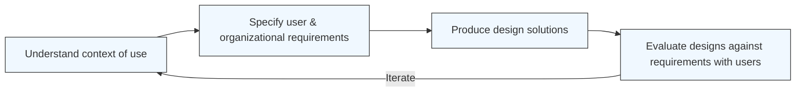

# Defining and Describing Human-Centered Design

_More than a method, human-centered design is a mindset and process that starts and ends with real people, not features or technology._ [^okl80a] [^na3xnh] [^d4fg13]

Human-centered design (HCD) is a creative, people-first approach to problem-solving and development that “puts real people at the centre of the development process” and involves them “in all steps of the problem-solving process.”[^okl80a] [^na3xnh] [^l55khk] It is defined in ISO standards as an “approach to interactive systems development that aims to make systems usable and useful by focusing on the users, their needs and requirements, and by applying human factors/ergonomics, and usability knowledge and techniques.”[^l55khk] [^nsne9l] In practice, this means deeply understanding users’ needs, behaviors, and context, then iteratively prototyping, testing, and refining solutions with those users to ensure they genuinely benefit from and want to use the result. [^okl80a] [^na3xnh] [^d4fg13] [^nsne9l] [^hap1v0] HCD matters because it improves effectiveness and efficiency, enhances user satisfaction and accessibility, and “counteracts possible adverse effects of use on human health, safety and performance.”[^l55khk]

# Uses in Context

- In design and innovation practice, HCD is invoked as “a creative approach to problem-solving that puts people—users, customers, stakeholders—at the heart of the process,” emphasizing designing “with people, not just for them.”[^na3xnh]
- User experience and interaction design communities describe it as a practice where “designers focus on four key aspects: they focus on people and their context; they seek to understand and solve the right problems; they understand that everything is a complex system; [and] they do small interventions” via continual prototyping and testing. [^d4fg13]
- ISO and usability standards bodies frame human-centered design as an approach that “aims to make systems usable and useful” and that, when applied, “enhances effectiveness and efficiency, improves human well-being, user satisfaction, accessibility and sustainability.”[^l55khk] [^nsne9l]
- Public-sector digital teams use the term to describe “a way of creating services that puts people first,” starting from understanding “what people need and what they experience,” including users, staff, and partners. [^y2m78c]
- In business collaboration and product strategy, it is described as “a creative problem-solving framework that focuses on understanding the needs, constraints, and motivations of the people who will most directly benefit from a solution,” with the goal of “getting to solutions people actually want to use.”[^hap1v0]
- In product and UX development, practitioners define it as “an approach to product development that focuses on how people actually use and experience products,” relying on “research, observation, and testing to make sure every design choice improves usability and solves a real need.”[^68kxem]

# History of Use

## Origins

- The phrase “human-centered design” (and the variant “human-centred design”) emerged in the human factors and ergonomics community in the late 20th century as a way to describe approaches to interactive systems that applied human factors knowledge to make systems usable and useful. [^l55khk]  
- It was formalized in international standards through ISO 13407:1999, “Human-centred design processes for interactive systems,” which defined a human-centered approach to interactive systems development aimed at usability and usefulness, later revised and expanded as ISO 9241‑210. [^l55khk] [^nsne9l]  
- These ISO formulations drew on earlier work in human–computer interaction and ergonomics, where researchers emphasized designing systems around user needs and capabilities rather than forcing people to adapt to machines; the ISO definition explicitly references “applying human factors/ergonomics, and usability knowledge and techniques.”[^l55khk]

## Evolution

- **1999 – ISO 13407 codifies HCD processes.** ISO 13407:1999 established a standard human-centered design process for interactive systems, detailing activities like understanding and specifying the context of use, specifying user and organizational requirements, producing design solutions, and evaluating designs with users. [^l55khk] [^nsne9l]  
- **2010s – Expansion beyond interactive systems to services and organizational change.** ISO 9241‑210 reframed human-centered design as “an approach to problem-solving commonly used in process, product, service and system design, management, and engineering frameworks,” extending it beyond software or interfaces to broader organizational and service challenges. [^l55khk]  
- **2020s – Framing HCD within broader “humanity-driven design” and social impact.** Contemporary design literature describes HCD as a subset of “humanity-driven design,” which “aims to address the major challenges humanity faces and, ultimately, save the planet,” emphasizing community-driven and multidisciplinary approaches and its use in sectors like healthcare, finance, education, and social innovation. [^d4fg13] [^na3xnh] [^c9g9e0]

# Best Real-World Examples

- [IDEO’s Human-Centered Design projects](https://www.ideou.com/blogs/inspiration/what-is-human-centered-design) – Consultancy and education programs that teach and apply HCD “with people, not just for them,” across sectors from healthcare to social innovation. [^na3xnh]
- [Province of British Columbia Digital Services](https://digital.gov.bc.ca/design/hcd/introduction/) – Government applying human-centred design to create public services that “put people first” by understanding the needs of users, staff, and partners before designing solutions. [^y2m78c]
- [StudioRed product design examples](https://www.studiored.com/blog/design/human-centered-design-examples/) – A design firm’s physical and digital product projects that rely on “research, observation, and testing” to improve usability and solve real user needs. [^68kxem]
- [Interaction Design Foundation’s HCD curriculum](https://ixdf.org/literature/topics/human-centered-design) – An educational platform that teaches human-centered design as focusing on people and context, root problems, systemic thinking, and iterative small interventions. [^d4fg13]
- [Public health interventions using HCD](https://pmc.ncbi.nlm.nih.gov/articles/PMC12352946/) – Global health programs that apply human-centered design to co-create solutions with communities, such as tailoring services based on lived experiences and iteratively refining interventions with user feedback. [^c9g9e0]
- [Mural’s collaboration platform and HCD practice guides](https://www.mural.co/blog/human-centered-design) – A digital whiteboard service that promotes HCD as a “creative problem-solving framework,” offering templates and practices that help teams involve users and stakeholders throughout design. [^hap1v0]
- [Miro’s HCD toolkits](https://miro.com/research-and-design/what-is-human-centered-design/) – An online collaboration tool that supports HCD workflows—research, mapping, prototyping, and testing—while publishing guidance on empathy, iteration, and multidisciplinary collaboration as core HCD principles. [^nsne9l]

# Case Studies

## Public Digital Services in British Columbia

The Province of British Columbia’s digital service teams have adopted human-centred design to improve how residents access government services. [^y2m78c] Their approach starts “with understanding what people need and what they experience,” explicitly including “the people who use the service, the staff who deliver it and the partners who support it.”[^y2m78c] Teams research pain points, map journeys, and then design or redesign services so “they work well for everyone,” iterating based on feedback from users and frontline staff. [^y2m78c] This case illustrates how HCD in the public sector goes beyond end-users to consider staff workflows and partner ecosystems, showing that human-centered services require balancing multiple human perspectives, not just citizen-facing interfaces. [^y2m78c]

## Human-Centered Design in Global Health Programs

A narrative review of human-centered design in public health and health care notes that HCD is increasingly used in global health, though “its comprehensive application in health programs remains underexplored.”[^c9g9e0] Projects in this domain commonly begin with immersive research to understand community needs, beliefs, and constraints, then co-create interventions with community members and health workers, using rapid prototyping and testing to refine materials, workflows, or service touchpoints. [^c9g9e0] For example, HCD methods are applied to redesign patient communication, adapt health services to local cultural contexts, and improve adherence by aligning interventions with people’s lived realities. [^c9g9e0] These efforts demonstrate that when health programs are designed with communities rather than imposed on them, they can become more acceptable, effective, and sustainable, reflecting HCD’s emphasis on empathy, context, and iterative learning. [^d4fg13] [^c9g9e0]

## Product Development with StudioRed’s HCD Approach

StudioRed, a product design consultancy, explicitly structures its work around human-centered design for both physical and digital products. [^68kxem] In their process, teams conduct research and observation to understand “how people actually use and experience products,” then move through phases of identification (mapping user journeys and pain points), creation (sketching and prototyping), collaboration (involving designers, engineers, and end users), and iteration (validating and refining based on feedback and performance data). [^68kxem] For example, they advocate starting with “low-fidelity prototypes (even paper models) to visualize solutions” and testing them early to see “what feels natural,” adjusting details like ergonomics, reach, and visibility. [^68kxem] This case shows how HCD provides a structured yet flexible framework for reducing product risk: by grounding design decisions in observed behavior and repeated user testing, teams can converge on solutions that are more usable, manufacturable, and aligned with real needs. [^d4fg13] [^nsne9l] [^68kxem]

***

# Sources

[^okl80a]: [What Is Human‑Centered Design? Guide (2026) - ParallelHQ](https://www.parallelhq.com/blog/what-human-centered-design)
[^na3xnh]: [What Is Human-Centered Design? A Complete Guide for Innovators](https://www.ideou.com/blogs/inspiration/what-is-human-centered-design)
[^d4fg13]: [What is Human-Centered Design (HCD)? — updated 2026 | IxDF](https://ixdf.org/literature/topics/human-centered-design)
[^l55khk]: [Human-centered design - Wikipedia](https://en.wikipedia.org/wiki/Human-centered_design)
[^nsne9l]: [What is Human-Centered Design? | Miro](https://miro.com/research-and-design/what-is-human-centered-design/)
[^68kxem]: [Human-Centered Design: 6 Examples and Why It's Important - StudioRed](https://www.studiored.com/blog/design/human-centered-design-examples/)
[^hap1v0]: [Human-Centered Design: What It Is & Why It Works - Mural](https://www.mural.co/blog/human-centered-design)
[^y2m78c]: [Human-centred design 101 – Province of British Columbia](https://digital.gov.bc.ca/design/hcd/introduction/)
[^c9g9e0]: [Narrative Review of Human-Centered Design in Public Health ... - PMC](https://pmc.ncbi.nlm.nih.gov/articles/PMC12352946/)
