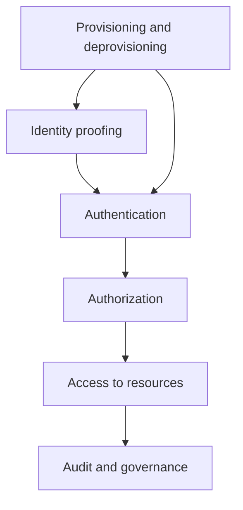

[[Tooling/Software Development/Lego-Kit Engineering Tools/SuperTokens|SuperTokens]]
[[Clear]]
[[projects/Emergent-Innovation/Standards/OAuth|OAuth]]

_Identity and Access Management is the quiet machinery that decides **who gets in, what they can do, and how that decision is tracked**. [^ozgdj7] [^cuilu5] [^7nhagx]_

Identity and Access Management, usually shortened to **IAM**, is a policy-and-technology discipline for controlling access to digital resources by verifying identity, granting appropriate permissions, and recording access activity. [^9ldvub] [^cuilu5] [^7nhagx] It matters whenever organizations need to manage users, devices, applications, or services across systems, especially in enterprise, cloud, and federated environments. [^cuilu5] [^iz6x16] [^7nhagx] In practice, IAM connects authentication, authorization, lifecycle management, and auditing into one security control plane. [^cuilu5] [^n43lzg] [^7nhagx]

# Defining and Describing Identity and Access Management

- 

- Identity and Access Management is commonly defined as a **framework of policies and technologies** that ensures the right users have the appropriate access to technology resources. [^9ldvub] [^cuilu5]  
- IBM describes IAM as spanning four pillars: **administration, authentication, authorization, and auditing**. [^cuilu5]  
- Trend Micro defines IAM as “**a set of policies, processes, and technologies** that control who can access digital resources, what they can do, and when they can do it.”[^7nhagx]  
- NIST-linked descriptions emphasize that identity management combines **technical systems, policies, and processes** to create and govern identity information, while access management enforces decisions at the point of access. [^vzk1m4]  
- In modern usage, IAM includes humans and non-human identities such as devices, services, workloads, and AI agents. [^iz6x16] [^n43lzg]  

# Uses in Context

- IAM is used in **enterprise security** to decide which employees, contractors, and partners can access applications and data. [^cuilu5] [^7nhagx]  
- IAM is used in **cloud environments** to apply least-privilege access across workloads and reduce attack surface. [^8mbhns] [^g2d2dp] [^zoyl7b]  
- IAM is used in **single sign-on** and federation so a user can authenticate once and access multiple systems through trusted identity providers. [^cxn1c6] [^1xwz3y] [^7nhagx]  
- IAM is used in **API and delegated authorization** through standards such as OAuth 2.0 and token exchange. [^cxn1c6] [^nn331y] [^4qt9qv]  
- IAM is used in **compliance and auditing** to produce authoritative logs for frameworks such as GDPR, ISO 27001, SOC 2, and PCI DSS. [^cuilu5]  
- IAM is used in **lifecycle automation** to provision, modify, and remove access as people join, move, or leave organizations. [^fz3vk2] [^n43lzg]  

# History of Use

## Origins

- The roots of IAM in computing are commonly traced to the **1960s**, when early password systems appeared on time-sharing systems such as MIT’s CTSS. [^rxxt29] [^3ec0g9] [^p9swdb] [^g2s4sh]  
- Sources describing the term’s rise say **“Identity and Access Management” gained prominence in the early 2000s** as enterprises recognized the limitations of isolated authentication systems. [^ozgdj7]  
- The term grew out of practical needs around **multi-user computing, directory services, and distributed access control**, rather than from a single foundational inventor or paper in the sources reviewed. [^ozgdj7] [^1jnspx] [^8bmv4n]  

## Evolution

- **1960s:** Early computer IAM began with password-based login on systems such as CTSS at MIT. [^rxxt29] [^3ec0g9] [^g2s4sh]  
- **1980s–1990s:** Directory services such as **[[concepts/Lightweight Directory Access Protocol]]** and related identity infrastructure expanded identity management across distributed environments. [^ozgdj7]  
- **Early 2000s:** IAM became a distinct enterprise discipline as organizations tried to unify authentication, access control, and governance across many systems. [^ozgdj7] [^8bmv4n]  
- **2010s:** Cloud and SaaS shifted IAM from a mostly internal IT function to a cross-platform discipline covering on-premises, mobile, and API-based integrations. [^ozgdj7] [^iz6x16]  
- **2020s:** IAM broadened to include **non-human identities**, zero-trust patterns, and automation for hybrid and cloud-native systems. [^cuilu5] [^iz6x16] [^n43lzg]  

# Best Real-World Examples

- [AWS IAM](https://aws.amazon.com/iam/) — AWS’s foundational access service for defining users, roles, and permissions in cloud workloads. [^0y1y49] [^g2d2dp]  
- [AWS IAM Identity Center](https://aws.amazon.com/marketplace/build-learn/ai-agent-learning-series/agent-identity-access-management/) — federation layer that integrates enterprise IdPs and issues credentials and OIDC tokens for cloud access. [^inhw39]  
- [IBM Cloud IAM](https://cloud.ibm.com/docs/iam?topic=iam-iamoverview) — centralized, standards-based IAM with fine-grained access control and least-privilege enforcement. [^8mbhns] [^g2d2dp]  
- [Microsoft Entra ID](https://kalpsystems.com/enterprise-security/identity-access-management-case-study-saas/) — used in a cited SaaS IAM transformation for centralized identity management, RBAC, and automated provisioning. [^fz3vk2]  
- [Okta](https://www.okta.com/newsroom/articles/okta-on-aws-simplifying-identity-security-to-power-innovation/) — used as an enterprise identity provider integrated with AWS IAM Identity Center and Auth0-based token validation flows. [^0sk4ng]  
- [SAML 2.0](https://cloudsecurityalliance.org/artifacts/navigating-identity-and-access-management-iam) — federation standard used for secure SSO and exchange of authentication assertions. [^cxn1c6]  
- [OpenID Connect](https://cloudsecurityalliance.org/artifacts/navigating-identity-and-access-management-iam) — authentication protocol built on OAuth that lets apps verify identity via a trusted IdP. [^cxn1c6] [^4qt9qv]  

# Case Studies

One useful case is the **Sysdig** example on AWS, where the company used **AWS IAM Identity Center** to manage workflow access across **2,500+ AWS accounts**. [^9v0eyp] That kind of scale shows why IAM is not just about login screens; it is about centralizing policy, reducing manual access work, and keeping access consistent across a large cloud footprint. [^9v0eyp] [^g2d2dp] The case also illustrates the modern IAM pattern of using federation and centralized control instead of managing separate credentials in every account. [^inhw39] [^9v0eyp]

A second case is the SaaS transformation described by **Kalp Systems**, which reports building a centralized identity management architecture around **Microsoft Entra ID**, **HR-driven lifecycle management**, **RBAC standardization**, automated provisioning, and policy-based access governance. [^fz3vk2] This shows the “identity” side of IAM in action: access is not only granted at login but continuously shaped by employee status, roles, and automation. [^fz3vk2] [^n43lzg] It also reflects how IAM has expanded beyond perimeter security into lifecycle orchestration across business systems. [^ozgdj7] [^iz6x16]

The **Cloud Security Alliance** standards material is a good case for understanding how IAM became interoperable across vendors and platforms. [^cxn1c6] It distinguishes **SAML** for secure SSO and assertion exchange, **OIDC** for identity verification through trusted providers, and **OAuth 2.0** for delegated authorization and token-based access. [^cxn1c6] This standards stack shows why modern IAM is usually less about a single product and more about coordinated protocols that let identities move securely across applications, clouds, and organizational boundaries. [^cxn1c6] [^nn331y] [^4qt9qv]

***

# Sources

[1]: [Robust Identity and Access Management - Case Study - Infosys](https://www.infosys.com/services/cyber-security/case-studies/identity-access-management-solution.html)
[^fz3vk2]: [Identity and Access Management Case Study for SaaS](https://kalpsystems.com/enterprise-security/identity-access-management-case-study-saas/)
[^cxn1c6]: [Identity and Access Management (IAM) Standards](https://cloudsecurityalliance.org/artifacts/navigating-identity-and-access-management-iam)
[4]: [2022jp15014_ Identity and Access Management | PDF](https://www.scribd.com/document/931467720/2022jp15014-Identity-and-Access-Management)
[5]: [Secure IAM Solutions for Telecom | PDF | Computing - Scribd](https://www.scribd.com/document/724579358/Case-Study-Hitachi-ID-PAM)
[6]: [How Have IAM Standards Like OAuth, OpenID Connect, And SAML Evolved? - Cloud Stack Studio](https://www.youtube.com/watch?v=KG0CxCijIOc)
[7]: [7. Azure Key Vault + Managed...](https://www.linkedin.com/pulse/designing-modern-identity-access-architecture-azure-case-mogueu-fuu0e)
[^inhw39]: [AI agent identity and access management - AWS - Amazon.com](https://aws.amazon.com/marketplace/build-learn/ai-agent-learning-series/agent-identity-access-management/)
[^nn331y]: [Understanding IAM Protocols & Standards - Resource Library - Fixiam](https://resources.fixiam.com/content/whitepaper/understanding-iam-protocols-and-standards)
[^0sk4ng]: [Okta on AWS: Simplifying identity security to power ...](https://www.okta.com/newsroom/articles/okta-on-aws-simplifying-identity-security-to-power-innovation/)
[^1xwz3y]: [Examen Iam Nids-P2223 | PDF | Security Engineering - Scribd](https://www.scribd.com/document/895202243/Examen-Iam-Nids-p2223)
[^4qt9qv]: [CCSP Cloud IAM: SAML vs OAuth vs OIDC](https://www.youtube.com/watch?v=V0pypd_sgJI)
[13]: [IAM & PAM Case Studies](https://www.idmexpress.com/casestudies)
[^9v0eyp]: [Improving operational efficiency using AWS IAM Identity ...](https://aws.amazon.com/solutions/case-studies/sysdig-case-study/)
[15]: [Implementing IAM as a Data Engineer: A Worked Example](https://atlonglastanalytics.substack.com/p/implementing-iam-as-a-data-engineer)
[^ozgdj7]: [What is Identity and Access Management (IAM or IdM)? - Plurilock](https://plurilock.com/glossary/identity-and-access-management-iam/)
[^rxxt29]: [What is Identity and Access Management (IAM)?](https://www.trendmicro.com/en_us/what-is/identity-and-access-management-iam.html)
[18]: [Identity and access management](https://en.wikipedia.org/wiki/Identity_and_access_management)
[^1jnspx]: [What Is Identity and Access Management (IAM) ...](https://www.strongdm.com/iam)
[^0y1y49]: [AWS History and Timeline regarding AWS Identity ...](https://hidekazu-konishi.com/entry/aws_history_and_timeline_aws_iam.html)
[21]: [Identity and access management - Grokipedia](https://grokipedia.com/page/identity_and_access_management)
[^3ec0g9]: [Co to jest IAM - Identity and Access Management?](https://www.trendmicro.com/pl_pl/what-is/identity-and-access-management-iam.html)
[23]: [What Is IAM (Identity and Access Management)?](https://www.accessowl.com/blog/what-is-iam-identity-and-access-management)
[24]: [Che cos'è la gestione delle identità e degli accessi (IAM)?](https://www.trendmicro.com/it_it/what-is/identity-and-access-management-iam.html)
[25]: [Was ist Identity und Access Management (IAM)?](https://www.trendmicro.com/de_de/what-is/identity-and-access-management-iam.html)
[^p9swdb]: [Qu'est-ce que la gestion des identités et des accès (IAM) ?](https://www.trendmicro.com/fr_fr/what-is/identity-and-access-management-iam.html)
[^g2s4sh]: [ID 및 액세스 관리(IAM)란 무엇입니까? | Trend Micro (KR)](https://www.trendmicro.com/ko_kr/what-is/identity-and-access-management-iam.html)
[28]: [What is Identity and Access Management (IAM)? | Trend Micro (BR)](https://www.trendmicro.com/pt_br/what-is/identity-and-access-management-iam.html)
[29]: [Что такое управление идентификацией и доступом (IAM)?](https://www.trendmicro.com/ru_ru/what-is/identity-and-access-management-iam.html)
[^8bmv4n]: [The Evolution of Identity and Access Management (IAM)](https://cpl.thalesgroup.com/blog/access-management/evolution-identity-access-management)
[^9ldvub]: [Identity and Access Management (IAM) in Cybersecurity | Information Security Authority](https://informationsecurityauthority.com/identity-and-access-management)
[^vzk1m4]: [What is NIST Identity and Access Management (IAM) ...](https://sprinto.com/glossary/nist-identity-and-access-management-iam-framework/)
[33]: [Identity and Access Management (IAM) Deployment Guide | IBM](https://www.ibm.com/think/topics/iam-deployment-guide)
[^cuilu5]: [Introducción a IBM Cloud IAM](https://cloud.ibm.com/docs/iam?topic=iam-iamoverview&locale=es)
[^8mbhns]: [Getting started with IBM Cloud IAM](https://cloud.ibm.com/docs/iam?topic=iam-iamoverview)
[^g2d2dp]: [What Is IAM in 2026? Enterprise Buyer's Definition - eMudhra](https://emudhra.com/en/blog/what-is-identity-and-access-management-iam-2026)
[^iz6x16]: [Identity and Access Management (IAM) Solutions](https://www.ibm.com/solutions/identity-access-management)
[^zoyl7b]: [What are NIST Identity and Access Management Best ...](https://www.techdemocracy.com/resources/nist-identity-and-access-management-best-practices-212)
[39]: [Implementing Ibm Iam: Best...](https://data.bn.dk/civic-notes/iam-with-ibm-secure-access-management-explained-1767647682)
[40]: [IAM/IGA/PAM Glossary — 490+ Terms Defined](https://identigy.com/glossary/)
[^n43lzg]: [NIST Privileged Access Management - PAM](https://www.miniorange.com/blog/nist-privileged-access-management/)
[42]: [IAM-Lösungen (Identity and Access Management) - IBM](https://www.ibm.com/de-de/solutions/identity-access-management)
[43]: [IBM Cloud IAMを使い始める](https://cloud.ibm.com/docs/iam?topic=iam-iamoverview&locale=ja)
[^8j90if]: 2025, Mar 17. "[Top 5 Open Source Identity and Access Management (IAM) providers 2025 | Medium](https://logto.medium.com/top-5-open-source-identity-and-access-management-iam-providers-2025-ef2428c01c6e)". Logto. [Medium](https://logto.medium.com).