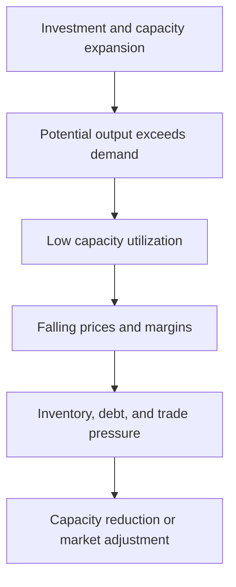

https://youtu.be/alAofcI7Yug?si=te4NpQYm_KZl03Vj

[[content-areas/AI-Factories-Datacenters/Concepts/Industrial Operations|Industrial Operations]]
[[concepts/Market-Categories/Industrial Automations]]
[[concepts/Market-Categories/Manufacturing Automation|Advanced Manufacturing]]

[[organizations/Tesla|Tesla]]
[[CATL]]
[[organizations/Huawei|Huawei]]

# Defining and Describing Industrial Overcapacity

:max_bytes(150000):strip_icc()/Term-e-excess-capacity_Final-12593c835d53431eba10e4ee61a208bc.png)

- _Industrial overcapacity is the condition in which productive capacity exceeds the demand that can reasonably absorb it at prevailing prices and sustainable costs._ [^x51l18] [^wua1mn]
- It can be measured through **capacity utilization**—actual output relative to potential or designed output—but no single utilization rate proves overcapacity in every industry, because normal rates vary by sector, technology, and business cycle. [^43qcln] [^o14sba]
- The concept applies when firms build facilities faster than demand grows, when demand falls after investment has been committed, or when subsidies, cheap credit, local-government competition, and expectations of future growth keep inefficient capacity operating. [^wm5mum] [^o14sba] [^d924rv]
- Its effects can include falling prices, compressed profit margins, inventories, debt stress, firm closures, trade disputes, and pressure to export surplus production. [^qbask4] [^x51l18] [^kur3cg]

## Uses in Context

- **Macroeconomics:** Analysts use “overcapacity” to describe supply that “cannot be absorbed by demand at current prices.” [^x51l18]
- **Industrial policy:** Governments invoke the term when evaluating whether subsidies, directed lending, or local investment have produced redundant facilities. [^o14sba] [^d924rv]
- **Trade policy:** European policymakers use industrial overcapacity to describe production that can distort competition and strain bilateral trade, particularly in relation to China. [^qbask4]
- **Corporate finance:** The term identifies assets that are underused but difficult to shut down because firms face debt obligations, labor costs, or political pressure. [^wm5mum] [^x51l18]
- **China-related policy debates:** The concept is applied both to traditional industries such as steel, coal, cement, and aluminum and to newer sectors including electric vehicles, batteries, and solar panels. [^x51l18] [^kur3cg] [^d924rv]
- **Energy-system planning:** Researchers also discuss whether excess industrial capacity can provide flexibility—for example, by allowing aluminum smelters to reduce production during periods of electricity-system stress. [^6nm3ho]

## History of Use

### Origins

- Industrial overcapacity is not tied to one universally recognized coinage or founding publication; it is an analytical concept developed through industrial economics, capacity-utilization analysis, business-cycle theory, and policy debates over excess investment.
- Contemporary research commonly defines it as actual output falling below an economically optimal production scale because demand is insufficient relative to firms’ capacity. [^o14sba]
- Explanations divide between a **market-driven account**, emphasizing information asymmetry, uncertainty, strategic investment, and imitation, and a **government-driven account**, emphasizing local officials’ growth incentives, fiscal expansion, directed credit, and redundant construction. [^o14sba]

### Evolution

- **2000s–2013 — Traditional heavy industry:** In [[China]], rapid economic expansion produced recurring concerns about excess capacity in steel, cement, coal, petrochemicals, flat glass, and shipbuilding. [^d924rv] In 2013, China’s State Council identified steel, cement, flat glass, and shipbuilding as priority sectors for addressing overcapacity. [^d924rv]
- **2014 — Scale of the steel problem:** China’s steel capacity reached approximately 1.125 billion metric tons by 2014, nearly doubling from earlier levels and representing 49.5% of global capacity, according to research on China’s de-capacity policy. [^wm5mum]
- **2020s — New industrial sectors:** Debate broadened from traditional heavy industry to electric vehicles, solar panels, batteries, machinery, and pharmaceuticals, where high investment and state support contributed to production levels that domestic demand could not fully absorb. [^kur3cg] [^wua1mn]
- **2025–2026 — Dynamic and international framing:** Recent analysis treats overcapacity as a dynamic relationship between supply, demand, prices, costs, inventories, and exports rather than as a fixed utilization threshold; European analysis links the issue to competition, trade flows, and the adjustment of global manufacturing. [^qbask4]

## Best Real-World Examples

- [China’s steel industry](https://www.europarl.europa.eu/thinktank/en/document/EXPO_STU(2026)783610) — A major example of capacity expansion outpacing sustainable demand, followed by policy efforts to reduce excess production. [^qbask4] [^wm5mum]
- [China’s cement industry](https://www.nature.com/articles/s41599-026-06746-7) — Rapid expansion and investment produced severe excess capacity alongside steel, coal, and non-ferrous metals. [^wm5mum] [^d924rv]
- [China’s coal industry](https://www.dallasfed.org/research/economics/2025/1230) — A traditional overcapacity sector targeted by supply-side structural reform and capacity reduction. [^x51l18]
- [China’s solar-panel industry](https://merics.org/en/china-overcapacities-monitor) — Production capacity in the “new three” sectors—solar panels, batteries, and electric vehicles—has exceeded what domestic demand can absorb. [^kur3cg]
- [China’s electric-vehicle industry](https://www.uschina.org/articles/rewiring-incentives-how-china-can-avoid-a-new-excess-capacity-spiral/) — Decentralized investment by private firms, local governments, and state-linked banks has raised concerns about capacity exceeding near-term global demand. [^wua1mn]
- [China’s battery industry](https://merics.org/en/china-overcapacities-monitor) — High investment relative to demand has contributed to price pressure, lower margins, and a larger share of loss-making firms. [^kur3cg]
- [Aluminum smelting as flexible capacity](https://ece.hku.hk/events/20260401-1/) — Research presents a nonstandard interpretation in which excess capacity can enable seasonal production shifts and support electricity-system decarbonization. [^6nm3ho]

## Case Studies

China’s **steel sector** illustrates how industrial overcapacity can emerge from the interaction of genuine demand growth and distorted investment incentives. During China’s rapid industrialization, steel capacity expanded dramatically; by 2014, capacity had reached about 1.125 billion metric tons, or 49.5% of global capacity. [^wm5mum] Researchers identify strategic firm behavior, demand uncertainty, herding, local-government competition, and policy incentives as contributing forces. [^wm5mum] [^o14sba] [^d924rv] The resulting excess capacity generated pressure for de-capacity policies, restructuring, and tighter control over inefficient producers. The case shows that overcapacity is not simply “too many factories”: it is a structural mismatch sustained by finance, political incentives, and the difficulty of closing facilities once capital and employment depend on them. [^wm5mum] [^o14sba]

China’s **solar, battery, and electric-vehicle sectors** demonstrate how the issue can migrate from old industries to strategically promoted technologies. Investment in these “new three” industries remained high relative to demand, pushing prices down, compressing margins, and increasing the share of loss-making firms. [^kur3cg] Unlike earlier sectors dominated by state-owned enterprises, the newer pattern involves private companies, local governments, and state banks, making coordinated capacity reduction more difficult. [^wua1mn] The case shows why technological importance does not immunize an industry from overcapacity: strong policy support and expectations of future global demand can produce facilities faster than markets, infrastructure, and consumers can absorb output. [^kur3cg] [^wua1mn]

A different case concerns **aluminum smelting and electricity systems**. Research presented by the [[University of Hong Kong]] argues that declining demand in energy-intensive sectors can leave capacity underused, but that underused capacity may also provide operational flexibility. [^6nm3ho] Aluminum smelters could adopt seasonal operation by reducing output during winter electricity peaks, potentially lowering the investment and operating costs of a decarbonized power system by 23–32 billion yuan per year, according to the cited research. [^6nm3ho] This example complicates the usual view that overcapacity is purely wasteful: excess capacity can impose storage, maintenance, and financial costs, yet under particular operating conditions it may create system-level flexibility. [^6nm3ho]

***

# Sources

[^qbask4]: [Industrial overcapacities, with a focus on China | Think Tank](https://www.europarl.europa.eu/thinktank/nl/document/EXPO_STU(2026)783610)
[2]: [Industrial overcapacities, with a focus on China | Think Tank ...](https://www.europarl.europa.eu/thinktank/es/document/EXPO_STU(2026)783610)
[3]: [Industrial overcapacities, with a focus on China | Think Tank ...](https://www.europarl.europa.eu/thinktank/mt/document/EXPO_STU(2026)783610)
[4]: [www.europarl.europa.eu › EXPO_STU(2026)783610Industrial overcapacities, with a focus on China | Think Tank ...](https://www.europarl.europa.eu/thinktank/en/document/EXPO_STU(2026)783610)
[5]: [Request for Comments on the Section 301 Investigations of ... - FDD](https://www.fdd.org/analysis/2026/04/15/request-for-comments-on-the-section-301-investigations-of-acts-policies-and-practices-of-certain-economies-relating-to-structural-excess-capacity-and-production-in-manufacturing-sectors/)
[^wm5mum]: [Government intervention and corporate litigation: evidence from China's de-capacity policy](https://www.nature.com/articles/s41599-026-06746-7)
[^43qcln]: [China's First Comprehensive Response to Western Overcapacity Allegations](https://www.geopolitechs.org/p/chinas-first-comprehensive-response)
[^o14sba]: [Building Long-Term Sustainability: The Impact of Green Factory Certification Policy on Enterprise Capacity Utilization](https://www.mdpi.com/2071-1050/18/14/7327)
[^x51l18]: [China manufacturing overcapacity boosts output, ...](https://www.dallasfed.org/research/economics/2025/1230)
[^6nm3ho]: [Events](https://ece.hku.hk/events/20260401-1/)
[11]: [Industrial overcapacities, with a focus on China - 국가전략포털](https://nsp.nanet.go.kr/plan/subject/detail.do?nationalPlanControlNo=PLAN0000061999)
[^kur3cg]: [merics.org · en · china-overcapacities-monitorChina Overcapacities Monitor | Merics](https://merics.org/en/china-overcapacities-monitor)
[^wua1mn]: [Rewiring Incentives: How China Can Avoid a New Excess ...](https://www.uschina.org/articles/rewiring-incentives-how-china-can-avoid-a-new-excess-capacity-spiral/)
[^d924rv]: [www.ajupress.com › view › 20260827153670156China's Supply Overcapacity: Between Failure and Strategy](https://www.ajupress.com/view/20260827153670156)
[15]: [Structural Frictions in the Global Economy Driven by a Supply-Side ...](https://note.com/_takumi_inoue_/n/n3d70bc2daff0?hl=en)
