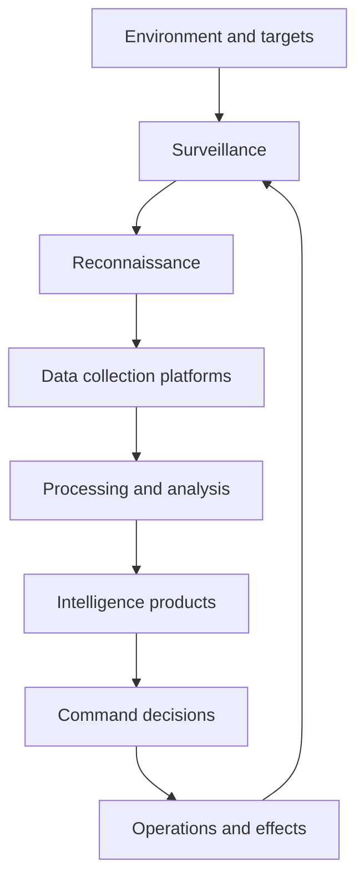

---
aliases:
  - ISR
  - intelligence, surveillance, reconnaissance
date_created: 2026-05-27
date_modified: 2026-05-28
cf_last_run: "2026-05-28T08:03:12.624Z"
cf_last_run_model: "Perplexity sonar-pro"
tags: [Drone-Platforms, Dual-Use-Technologies]
site_uuid: 4545fd01-b8a1-4645-845a-5a70e37f45a6
publish: true
title: "Intelligence, Surveillance, Reconnaissance"
slug: intelligence-surveillance-reconnaissance
at_semantic_version: 0.0.1.1
---

# Defining and Describing Intelligence, Surveillance, Reconnaissance

_Intelligence, Surveillance, Reconnaissance (ISR) is the integrated military and security practice of sensing the environment, watching it over time, and turning those observations into actionable insight for decision-makers. [^hibyg6] [^4n8jfa] [^1mx8im]_

ISR typically refers to a family of capabilities and processes that **collect**, **process**, and **disseminate** information from sensors on platforms such as aircraft, satellites, drones, ground stations, and maritime systems to support situational awareness, targeting, and strategic planning. [^hibyg6] [^x1loq0] [^4n8jfa] [^1mx8im] It matters because modern operations—military, border security, and critical infrastructure protection—depend on timely and accurate understanding of adversaries, terrain, and emerging threats, enabling earlier detection, faster response, and reduced uncertainty in high‑risk environments. [^hibyg6] [^4n8jfa] [^86af54]

In typical defense usage:

- **Intelligence** refers to processed, assessed information that provides understanding of adversaries, terrain, capabilities, and intentions, often fused from multiple sources. [^hibyg6] [^4n8jfa] [^1mx8im]  
- **Surveillance** is the continuous or periodic observation of air, surface, or subsurface areas, places, persons, or things by visual, electronic, or other means. [^hibyg6] [^4n8jfa]  
- **Reconnaissance** is focused, time‑bound observation or mission to obtain specific information about the activities and resources of an adversary or a particular area. [^hibyg6] [^4n8jfa] [^1mx8im]  

Modern ISR systems increasingly integrate AI‑enabled processing, networking, and automation to handle large volumes of sensor data and deliver “continuous situational awareness” in real time. [^hibyg6] [^x1loq0] [^4n8jfa] [^dn3wt1]

# Uses in Context

- Defense organizations describe ISR as a core function providing “continuous situational awareness to detect threats early, respond quickly & adapt to changing situations.”[^4n8jfa]  
- Air and space forces use ISR in doctrine and training to describe the set of “ISR capabilities and joint ISR capabilities at the operational-strategic level,” emphasizing planning, collection, processing, exploitation, and dissemination. [^1mx8im]  
- Defense technology vendors invoke ISR when marketing sensor and platform suites that deliver “end-to-end ISR…solutions across the full operational domain—air, land, maritime, and tactical.”[^x1loq0]  
- Maritime security collaborations frame ISR as an integrated net to “detect, classify and transmit actionable intelligence” and enable “persistent, long-range sub-surface Intelligence, Surveillance, and Reconnaissance (ISR)” for national defense. [^0up75b]  
- Research institutions use the term ISR when organizing work on RF, LiDAR, and radar sensors as “Intelligence, Surveillance & Reconnaissance,” emphasizing sensor engineering for information dominance. [^dn3wt1]  

# History of Use

## Origins

- In modern military terminology, ISR grew out of long‑standing concepts of **intelligence** and **reconnaissance** dating back to early aerial reconnaissance, then was formalized as a combined mission area in late–Cold War and post–Cold War doctrine as sensors and networks began to be integrated. [^1mx8im]  
- Formal teaching materials in institutions such as the U.S. Air University present “Intelligence, Surveillance, and Reconnaissance (ISR) Operations” as a defined doctrinal area focused on Air and Space Forces’ ISR capabilities and joint ISR at the operational‑strategic level, indicating that by the time these curricula were established, the ISR construct was already standard in joint doctrine. [^1mx8im]  

*(Detailed first-use tracing requires doctrinal archives beyond the accessible web; available sources show ISR as an established term in late 20th–early 21st century air and joint doctrine. [^1mx8im])*

## Evolution

- **1990s–2000s – Networked ISR and joint integration.** With the rise of precision warfare and network‑centric operations, ISR evolved from platform‑centric (e.g., single reconnaissance aircraft) to **networked, joint ISR**, integrating space, air, and ground sensors and emphasizing the “ISR enterprise” supporting operational and strategic commanders. [^1mx8im] [^86af54]  
- **2000s–2010s – Persistent ISR and unmanned systems.** The proliferation of drones and advanced sensors enabled “persistent ISR” for “continuous situational awareness,” particularly over conflict zones, borders, and critical infrastructure, shifting emphasis from episodic reconnaissance to constant coverage. [^4n8jfa] [^86af54]  
- **2010s–present – Multi-domain, AI-enabled ISR and ISTAR/ISR-T variants.** Vendors and defense forces extended ISR to concepts like **ISTAR** (Intelligence, Surveillance, Target Acquisition, and Reconnaissance) and **ISR-T** (Intelligence, Surveillance, Reconnaissance, and Targeting), integrating target acquisition and precision engagement and leveraging AI-powered processors to fuse and exploit data across air, land, maritime, and cyber domains. [^hibyg6] [^x1loq0] [^86af54]  

# Best Real-World Examples

- [Hoverfly Persistent ISR Drone Systems](https://hoverflytech.com/applications/defense/persistent-isr-intelligence-surveillance-reconnaissance-drone-systems/) – Small-firm tethered and free‑flying drone platforms providing “persistent ISR” for continuous situational awareness around bases, events, and borders. [^4n8jfa]  
- [C2 Robotics / Thales / Austal Maritime ISR Net](https://www.youtube.com/watch?v=cnVttwbKa6M) – Australian collaboration delivering a sovereign “Persistent, Long-Range Sub-surface Intelligence, Surveillance, and Reconnaissance (ISR) system” to detect and classify hostile sub‑sea and surface contacts. [^0up75b]  
- [UDRI Intelligence, Surveillance & Reconnaissance Research](https://udri.udayton.edu/expertise/digital-and-systems-engineering/sensors-and-data-based-solutions/intelligence-surveillance-reconnaissance.php) – University of Dayton Research Institute program advancing RF, LiDAR, and radar technologies that underpin ISR sensing and data exploitation. [^dn3wt1]  
- [Maris-Tech ISTAR Solutions](https://www.maris-tech.com/blog/what-is-istar-intelligence-surveillance-target-acquisition-and-reconnaissance/) – A smaller specialist provider integrating video, AI, and communication modules for **ISTAR**, building on traditional ISR to add target acquisition and real‑time processing at the edge. [^hibyg6]  
- [Teledyne FLIR Defense ISR-T Systems](https://defense.flir.com/isrt/overview/) – End‑to‑end **ISR-T** solutions using electro‑optical/infrared sensors and targeting systems for air, land, and maritime forces. [^x1loq0]  
- [Lockheed Martin Integrated ISR Systems](https://www.lockheedmartin.com/en-us/products/integrated-intelligence-surveillance-reconnaissance-systems.html) – Large‑scale integrated airborne and ground ISR configurations supporting wide‑area surveillance and intelligence collection for national militaries. [^86af54]  
- [Air University ISR Operations Course](https://www.airuniversity.af.edu/ISR/) – Formal educational program that codifies ISR doctrine, processes, and capabilities within Air and Space Forces and joint operations. [^1mx8im]  

# Case Studies

## 1. Hoverfly’s Persistent ISR for Tactical Situational Awareness

Hoverfly Technologies, a smaller U.S.-based company specializing in tethered and untethered drone systems, developed **persistent ISR** solutions to give military and security personnel continuous overhead coverage of key areas. [^4n8jfa] Its systems are marketed specifically to deliver “continuous situational awareness to detect threats early, respond quickly & adapt to changing situations,” highlighting ISR’s role as an always‑on sensing layer rather than occasional reconnaissance. [^4n8jfa] By providing long‑endurance aerial vantage points that stream video and sensor data directly to operators, these platforms show how compact, power‑efficient UAVs can operationalize ISR for smaller units, border patrols, and event security without relying solely on large, high‑cost, high‑altitude assets. [^4n8jfa] This case illustrates how ISR capabilities have been democratized: specialized startups can now field meaningful ISR contributions through niche platforms and smart integration of sensors and communications. [^4n8jfa]  

## 2. Australian Maritime Sub-surface ISR Collaboration

In Australia, a partnership between Thales Australia, C2 Robotics, and Austal created a **persistent, long-range sub-surface ISR system** unveiled at the Indo Pacific International Maritime Exposition. [^0up75b] The collaboration integrates Austal’s surface fleet with C2 Robotics’ “Speartooth” family of autonomous underwater vehicles and Thales’s undersea warfare sensors to “detect, classify and transmit actionable intelligence” on sub‑sea and surface contacts. [^0up75b] Designed to protect major maritime approaches and national economic interests, the system exemplifies ISR as a **multi‑platform, multi‑sensor network** in the undersea domain, extending the ISR concept from air and land into long‑range underwater surveillance and reconnaissance. [^0up75b] It demonstrates how smaller innovators like C2 Robotics contribute specialized autonomous systems that, when integrated with larger defense primes, create sophisticated ISR nets tailored to specific geostrategic environments. [^0up75b]  

## 3. Academic and Enterprise ISR Research at UDRI

The University of Dayton Research Institute (UDRI) runs a focused program in **Intelligence, Surveillance & Reconnaissance** that advances key enabling technologies such as radio-frequency (RF) and LiDAR sensors and radar systems and components. [^dn3wt1] UDRI personnel “conduct research focused on RF and Light Detection And Ranging (LiDAR) sensors and radar systems and components,” explicitly tying this sensor work to ISR missions. [^dn3wt1] By exploring new sensor designs, signal processing methods, and data‑based solutions, the program shows how academia contributes foundational pieces of the ISR ecosystem—improving detection range, resolution, and robustness—which then feed into operational systems developed by industry and defense organizations. [^dn3wt1] This case underscores that ISR is not only about platforms and operations but also about ongoing research into sensing and data exploitation technologies that make higher‑quality intelligence possible. [^dn3wt1]

***

# Sources

[^hibyg6]: [What is ISTAR? Intelligence, Surveillance and more. - Maris Tech](https://www.maris-tech.com/blog/what-is-istar-intelligence-surveillance-target-acquisition-and-reconnaissance/)
[^0up75b]: [NEW INTELLIGENCE, SURVEILLANCE AND RECONNAISSANCE ...](https://www.youtube.com/watch?v=cnVttwbKa6M)
[^x1loq0]: [ISR-T | Defense.flir.com](https://defense.flir.com/isrt/overview/)
[^4n8jfa]: [Persistent ISR (Intelligence, Surveillance, Reconnaissance)](https://hoverflytech.com/applications/defense/persistent-isr-intelligence-surveillance-reconnaissance-drone-systems/)
[^1mx8im]: [Intelligence, Surveillance, and Reconnaissance (ISR) Operations](https://www.airuniversity.af.edu/ISR/)
[^86af54]: [Integrated Intelligence Surveillance Reconnaissance Systems](https://www.lockheedmartin.com/en-us/products/integrated-intelligence-surveillance-reconnaissance-systems.html)
[^dn3wt1]: [Intelligence, Surveillance & Reconnaissance](https://udri.udayton.edu/expertise/digital-and-systems-engineering/sensors-and-data-based-solutions/intelligence-surveillance-reconnaissance.php)
