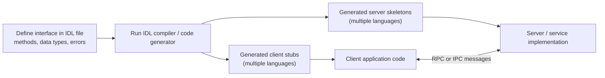

***
> [!info] **Perplexity Query** (2026-05-04T06:40:48.022Z)
> **Question:**
> Write a comprehensive one-page article about "Interface Description Language". 
> 
> **Model:** sonar-pro
> 

# Interface Definition Language (IDL)

# Defining and Describing Interface Description Language

_An interface description language is a neutral “contract language” that lets different programs, often in different languages and on different machines, agree on how to talk to each other._

An **Interface Description Language (IDL)** is a generic, language‑independent notation used to specify software object interfaces, including operations and data types, without committing to any particular implementation language or platform. [^ps6m4y] [^x9tua8] It is commonly used wherever components written in different languages or running on different systems need to interoperate via remote procedure calls (RPC) or message passing. [^x9tua8] [^lfrv1z] [^kka88c] By capturing interface details in a single, formal description, IDLs enable tools to generate client and server stubs, documentation, and validation logic, which reduces coupling, eases evolution of APIs, and improves interoperability. [^lfrv1z] [^kka88c] Modern ecosystems (from distributed middleware like CORBA to blockchain runtimes and operating systems) adopt IDLs to keep interfaces stable while implementations and languages change underneath. [^x9tua8] [^lfrv1z] [^q37spy] [^jnu8ea] [^9kky5q]

# Uses in Context

- As a **language‑independent specification tool**: MDN defines an IDL as “a generic language, used to specify object interfaces independent of any particular programming language,” emphasizing that the same interface can be implemented in multiple languages or runtimes. [^ps6m4y]  
- As an **inter‑component contract in distributed systems**: A French technical guide describes an Interface Definition Language as “un outil indispensable pour décrire les interfaces entre composants d’applications” and notes that it lets them “communiquer de manière fluide malgré les différences de langage et de technologie.”[^kka88c]  
- As the **basis for code generation**: IDL descriptions are typically compiled so that tools “consume that IDL and emit code and infrastructure that allows you [to] target a specific platform or language,” generating stubs and data structures from the abstract definitions. [^lfrv1z] [^kka88c]  
- As a **formal RPC interface for operating systems**: In Google’s Fuchsia OS, the *Fuchsia Interface Definition Language (FIDL)* is “the language used to describe interprocess communication (IPC) protocols used by Fuchsia programs,” where providers define interfaces as a *protocol* consisting of methods and structured data types. [^jnu8ea]  
- As a **contract for mobile IPC**: Android’s AIDL is “similar to other IDLs: it lets you define the programming interface that both the client and service agree upon in order to communicate with each other,” making cross‑process method calls possible on Android devices. [^9kky5q]  
- As a **schema for on‑chain program interfaces**: In the Solana ecosystem, “IDL stands for Interface Definition Language” and IDLs are JSON files that “describe the interface of a program,” allowing clients and explorers to decode instructions, account data, and errors and to “generate clients in different program languages.”[^q37spy]  

# History of Use

## Origins

- The term and a concrete language named **IDL (Interface Description Language)** were created in the 1970s–1980s by **William Wulf and John Nestor** at Carnegie Mellon University and **David Lamb** at Queen’s University. [^x9tua8] The original IDL was developed in an academic context to specify interfaces for distributed, object‑oriented systems in a way that was independent of programming language and machine architecture. [^x9tua8]  
- Like later interface description languages, this early IDL “defined interfaces in a language‑ and machine‑ independent way, allowing the specification of interfaces between components written in different languages, and possibly executing on different machines using remote procedure calls.”[^x9tua8]  

## Evolution

- **Late 1980s–1990s – CORBA and standardization:** The Object Management Group (OMG) adopted and evolved the IDL idea into **OMG IDL** as the core of the CORBA standard, using it to define interfaces for distributed objects that could be implemented in C++, Java, and other languages while communicating via ORB‑mediated RPC. [^x9tua8] [^lfrv1z]  
- **2000s – Broad adoption in middleware and tooling:** Derived IDLs and similar schema languages became central in RPC/middleware systems (e.g., DCOM, ICE, gRPC‑style systems), and industry practice converged on a workflow where developers “créer [un] fichier IDL avec la description des interfaces, des méthodes et des types de données,” then compile it to generate stubs and integrate them into application components. [^lfrv1z] [^kka88c]  
- **2010s–2020s – Domain‑specific IDLs for OS and blockchain:** New ecosystems introduced specialized IDLs such as **Fuchsia Interface Definition Language (FIDL)** for Fuchsia’s IPC protocols [^jnu8ea] and JSON‑based IDLs for Solana programs that describe “the interface of a program” so tools can decode instructions and auto‑generate multi‑language clients. [^q37spy] These illustrate how the core IDL concept is adapted to modern IPC and smart‑contract environments.  

# Best Real-World Examples

- [Fuchsia Interface Definition Language (FIDL)](https://fuchsia.dev/fuchsia-src/get-started/learn/fidl/fidl) — IDL that “describe[s] interprocess communication (IPC) protocols used by Fuchsia programs,” defining protocols, methods, and rich data types for OS‑level services. [^jnu8ea]  
- [Solana IDLs](https://solana.com/developers/guides/advanced/idls) — JSON‑based interface descriptions for on‑chain programs on Solana, enabling explorers and users to “decode program instructions, account data and program errors” and to generate clients in many languages. [^q37spy]  
- [Android Interface Definition Language (AIDL)](https://developer.android.com/develop/background-work/services/aidl) — Android’s IDL for “the programming interface that both the client and service agree upon” to perform cross‑process communication between apps and services on Android. [^9kky5q]  
- [Eclipse Cyclone DDS IDL](https://cyclonedds.io/docs/cyclonedds/latest/idl/about.html) — An implementation of OMG‑style IDL in the open‑source Cyclone DDS project, where IDL “defined data types and interfaces that are platform and language agnostic,” feeding tools that generate DDS topics and language bindings. [^lfrv1z]  
- [IDL specification language (Wulf–Nestor–Lamb)](https://en.wikipedia.org/wiki/IDL_specification_language) — The original academic IDL language, which defined interfaces in a language‑ and machine‑independent way and influenced subsequent standards such as OMG IDL. [^x9tua8]  
- [Interface Definition Language workflows in enterprise integration](https://www.nexa.fr/blog/quest-ce-quune-interface-definition-language-idl) — Practical enterprise workflows that show IDL being used to define interfaces, generate code, integrate into components, and test inter‑component communication in heterogeneous application architectures. [^kka88c]  

# Case Studies

**Case Study 1 – Android AIDL for cross‑process mobile services**

On Android, applications often need to call into background services that live in separate processes, such as a media playback service or a system‑level data provider. [^9kky5q] To make this safe and structured, Android provides the **Android Interface Definition Language (AIDL)**, which is “similar to other IDLs” and lets developers define “the programming interface that both the client and service agree upon in order to communicate with each other.”[^9kky5q] A developer writes an `.aidl` file declaring methods and argument types; the Android build tools then generate Binder stubs and proxies that marshal method parameters and results across process boundaries. [^9kky5q] The service implements the generated stub on the server side, while clients bind to the service and call methods via the generated proxy as if they were local calls, with the Binder framework handling the underlying IPC. [^9kky5q] This case shows how an IDL formalizes an interface once and lets tooling handle serialization, versioning, and IPC mechanics, allowing Android teams to evolve services without tightly coupling their clients to implementation details. [^9kky5q]  

**Case Study 2 – Solana IDLs enabling multi‑language blockchain clients**

In the Solana blockchain ecosystem, on‑chain programs (smart contracts) expose public methods and operate on structured account data, but the raw binary instruction formats are complex for client developers to handle manually. [^q37spy] To address this, Solana projects use **IDLs as JSON files that describe the interface of a program**, including its instructions, accounts, and error codes. [^q37spy] According to Solana’s developer documentation, these IDLs “allow explorers and users to decode program instructions, account data and program errors and offer the possibility to generate clients in different program languages.”[^q37spy] A typical workflow is: a program author publishes the JSON IDL along with the deployed program; client developers “find a program [they] want to interact with, download the IDL and then … generate a client in [their] preferred language.”[^q37spy] The generated clients know how to construct transactions, serialize arguments, and decode results, so the same on‑chain program can be safely and consistently called from JavaScript, Rust, or other languages. [^q37spy] This example illustrates how IDLs extend beyond traditional RPC into blockchain domains, serving as a shared, machine‑readable contract that bridges low‑level binary protocols and high‑level developer tooling. [^q37spy]  

**Case Study 3 – Fuchsia FIDL shaping OS‑level IPC protocols**

Fuchsia, an experimental operating system by Google, uses **Fuchsia Interface Definition Language (FIDL)** as the single source of truth for its interprocess communication protocols. [^jnu8ea] FIDL is “the language used to describe interprocess communication (IPC) protocols used by Fuchsia programs,” where each protocol is a collection of methods invoked by sending messages over an asynchronous channel. [^jnu8ea] Developers define protocols with methods and supported data types—integers, floats, booleans, strings, and handles combined into arrays, vectors, structs, tables, and unions—directly in FIDL files. [^jnu8ea] The FIDL toolchain then generates bindings for multiple implementation languages (such as C++ and Rust), allowing service providers and clients to share strongly typed interfaces while the OS kernel manages async channels and message framing underneath. [^jnu8ea] This case demonstrates how an IDL can be baked into an operating system’s design to ensure that all IPC is specified in a consistent, evolution‑friendly way, facilitating refactoring of services and clients while maintaining protocol compatibility. [^jnu8ea]

***

# Sources

[^ps6m4y]: [IDL - Glossary - MDN Web Docs - Mozilla](https://developer.mozilla.org/en-US/docs/Glossary/IDL)
[^x9tua8]: [IDL specification language - Wikipedia](https://en.wikipedia.org/wiki/IDL_specification_language)
[^lfrv1z]: [IDL (Interface Definition Language) — Eclipse Cyclone DDS, 11.0.1](https://cyclonedds.io/docs/cyclonedds/latest/idl/about.html)
[^kka88c]: [Qu'est-ce qu'une Interface Definition Language (IDL)](https://www.nexa.fr/blog/quest-ce-quune-interface-definition-language-idl)
[^q37spy]: [IDLs (Interface Definition Language) - Solana](https://solana.com/developers/guides/advanced/idls)
[^jnu8ea]: [Fuchsia Interface Definition Language](https://fuchsia.dev/fuchsia-src/get-started/learn/fidl/fidl)
[7]: [Universal Interface Language - Wikipedia](https://en.wikipedia.org/wiki/Universal_Interface_Language)
[^9kky5q]: [Android Interface Definition Language (AIDL) | Background work](https://developer.android.com/develop/background-work/services/aidl)
