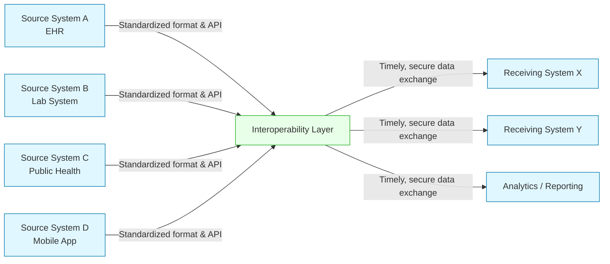

# Defining and Describing Interoperability (Data and Systems)

_Interoperability in data and systems is about making different technologies "speak the same or similar language" so information can move securely and be used meaningfully across boundaries. [^x1oa3y]_

In technical terms, interoperability is the ability of distinct information systems, devices, and applications to access, exchange, integrate, and cooperatively use data in a coordinated manner across organizational, regional, and national boundaries. [^gduna3] [^x1oa3y] [^q1higa] In healthcare, for example, it enables clinical data created in one system to be "gathered, stored, and communicated seamlessly to others," such as hospitals, clinics, pharmacies, and patients’ homes. [^gduna3] [^bj6sfq] [^ovkiy9] Interoperability matters because it underpins timely and secure data sharing for better decisions, more efficient operations, and improved outcomes—whether for individual patients, public health action, or humanitarian programs. [^gduna3] [^x1oa3y] [^bj6sfq] [^nkwi3k] True interoperability typically requires open standards, shared terminology, robust governance, and infrastructure that can normalize and route data between heterogeneous systems. [^gduna3] [^iv0wx5] [^nkwi3k] [^q1higa]

---

# Uses in Context

- In healthcare IT, interoperability is used to describe "the ability of different information systems, devices, and applications to access, exchange, and cooperatively use data in a coordinated manner… to provide timely and seamless portability of information."[^gduna3] [^ovkiy9]  
- Public health agencies frame interoperability as ensuring that data systems "at every level are required 'to speak the same or similar language'" so information can move between clinical and public health settings for faster action. [^x1oa3y] [^iv0wx5]  
- Humanitarian organizations use interoperability to ensure data-sharing between agencies is done "in a timely, automated and secure manner" to improve services for beneficiaries across programs and countries. [^nkwi3k]  
- Health insurers and care networks invoke interoperability as "the ability to securely exchange health information across the health care system," enabling information to flow "seamlessly and securely between doctors, hospitals, insurers and patients."[^bj6sfq]  
- Policy and standards bodies use the term in the context of adopting open standards—such as FHIR—for structuring and exchanging data so that "providers and devices" can "speak the same language."[^gduna3] [^iv0wx5]  
- Digital health and therapeutics research treats interoperability as a "fundamental" requirement for integrating new technologies and ensuring they can exchange data with electronic health records, remote monitoring tools, and other digital systems. [^g3woqd]

---

# History of Use

## Origins

- The general systems concept of interoperability—systems being able to operate together—emerged in the mid–late 20th century in computing, networking, and defense contexts, where different vendors’ systems needed to interconnect and exchange data using shared protocols and standards (e.g., early networking standards and HL7 in healthcare), though specific sources in this set of search results focus on sectoral definitions rather than the original coinage. [^gduna3] [^iv0wx5] [^g3woqd] [^ovkiy9]  
- In healthcare and public health data, influential definitions were formalized by organizations such as the [[Healthcare Information and Management Systems Society]] (HIMSS), which defined healthcare interoperability as the ability of systems to "access, exchange, and cooperatively use data" across boundaries to optimize health outcomes. [^gduna3]  
- Public health practice adapted the term to data flows between providers and health authorities, with the CDC describing Public Health Data Interoperability as providing tools and support to ensure "timely and secure sharing of data for public health action."[^x1oa3y] [^iv0wx5]

*(Because the provided search results focus on modern healthcare/public-health usage, they do not identify the very first coinage of "interoperability" in computing; the above bullets reflect where the term is formalized and operationalized in data/systems contexts, not necessarily its absolute origin.)*

## Evolution

- **1990s–2000s – Standardized messaging and vocabularies in healthcare.** Health data interoperability evolved with standards such as HL7 messaging and laboratory data standards, creating "a shared understanding of data across systems" as a foundation for accessing and using lab and clinical data. [^iv0wx5] [^g3woqd]  
- **2010s – Shift to open, API-based frameworks.** The emergence and adoption of Fast Healthcare Interoperability Resources (FHIR) as an "open-source framework" simplified how clinical data is structured and exchanged across platforms, making it easier for systems and devices to "speak the same language."[^gduna3] [^iv0wx5]  
- **Late 2010s–2020s – Ecosystem and policy frameworks.** National frameworks like the Trusted Exchange Framework and Common Agreement (TEFCA) were introduced to align stakeholders and advance "connected care" through standardized exchanges, [^gduna3] [^iv0wx5] [^q1higa] while agencies such as CMS published voluntary interoperability frameworks as blueprints for "modern health data exchange that puts patients and providers first."[^q1higa]  
- **2020s – Integration with digital therapeutics and remote tools.** Research emphasizes interoperability as "fundamental for advancing digital health and digital therapeutics," especially as wearable devices, mobile apps, and AI tools must integrate with existing health IT and public health systems. [^g3woqd] [^x1oa3y]

---

# Best Real-World Examples

- [Fast Healthcare Interoperability Resources (FHIR)](https://diagnostics.roche.com/global/en/healthcare-transformers/article/interoperability-in-healthcare-challenges.html) – [[Fast Healthcare Interoperability Resources]] - An open-source framework for structuring and exchanging health data that has become a leading example of interoperability standards, enabling different platforms to "speak the same language."[^gduna3]  
- [Trusted Exchange Framework and Common Agreement (TEFCA)](https://diagnostics.roche.com/global/en/healthcare-transformers/article/interoperability-in-healthcare-challenges.html) – A U.S. national framework providing a foundation for aligning stakeholders and advancing connected care by standardizing health information exchange trust and technical requirements. [^gduna3] [^iv0wx5]  
- [CDC Public Health Data Interoperability (PHDI)](https://www.cdc.gov/data-interoperability/php/about/index.html) – A CDC initiative that offers tools and support to ensure "timely and secure sharing of data for public health action" between clinical and public health systems. [^x1oa3y] [^iv0wx5]  
- [WFP–UNHCR Joint Hub Data Systems Interoperability](https://wfp-unhcr-hub.org/resources/data-systems-interoperability/) – A humanitarian collaboration focused on making agency systems interoperable so information sharing is "timely, automated and secure," improving services to displaced and vulnerable populations. [^nkwi3k]  
- [Health Information Exchanges (HIEs)](https://diagnostics.roche.com/global/en/healthcare-transformers/article/interoperability-in-healthcare-challenges.html) – Integration platforms that act as a "middleman—normalizing data across formats" and enabling systems to communicate without complex one-to-one connections. [^gduna3]  
- [CMS Interoperability Framework](https://www.cms.gov/health-technology-ecosystem/interoperability-framework) – A voluntary "open, standards-based" blueprint intended to modernize health data exchange, making it more market-friendly while prioritizing patients and providers. [^q1higa]  
- [ONC Laboratory Data Standards](https://healthit.gov/blog/standards/laboratory-data-standards-for-interoperability/) – U.S. lab data standards that "create a shared understanding of data across systems," underpinning interoperable flows of laboratory results between labs, providers, and public health agencies. [^iv0wx5]

---

# Case Studies

## 1. Making Fragmented Clinical Systems Work Together via FHIR and HIEs

In many healthcare organizations, clinical data are scattered across electronic health record (EHR) platforms, laboratory information systems, specialty tools, and patient-facing apps, making it difficult to assemble a complete, timely picture of a patient. [^gduna3] [^w2rzzf] To address this, providers have increasingly adopted open standards such as FHIR, described as an "open-source framework" that simplifies how data are structured and exchanged, so different systems and devices can share a common language. [^gduna3] Instead of building fragile, one-off connections between each pair of systems, organizations deploy Health Information Exchanges (HIEs) and other integration platforms that act as a "middleman—normalizing data across formats" and easing communication without extra complexity. [^gduna3] This combination of standard data models and shared infrastructure helps clinicians access more complete information at the point of care, reduces duplication, and supports system-wide efficiency—illustrating how interoperability relies not only on technology but on agreeing shared standards and governance. [^gduna3] [^iv0wx5] [^bj6sfq]

## 2. Public Health Data Interoperability for Faster Outbreak Response

Public health agencies often need to combine clinical data, lab results, and surveillance reports from multiple jurisdictions to detect and respond to outbreaks. [^x1oa3y] [^iv0wx5] The CDC’s Public Health Data Interoperability effort supports this by providing tools, resources, and standards so that data systems "at every level are required 'to speak the same or similar language'" and can share information in a timely and secure fashion. [^x1oa3y] This includes work on modernizing public health laboratory technologies, incentivizing laboratories to conform to common standards, and conditioning receipt of federal funding on the use of certified health IT and participation in frameworks like TEFCA. [^iv0wx5] As clinical and public health data "work together better," information can move more easily between them, enabling faster public health action and more coordinated responses to emerging threats. [^x1oa3y] [^iv0wx5] This case shows how interoperability is as much about policy levers and incentives as it is about technical standards.

## 3. Humanitarian Agencies Linking Data Systems to Improve Beneficiary Services

In displacement and food-security contexts, different agencies may maintain separate registration, assistance, and monitoring systems, which can cause duplication and gaps in service delivery. [^nkwi3k] The WFP–UNHCR Joint Hub on data systems interoperability was created to ensure that information sharing between their systems is "timely, automated and secure," ultimately "bringing better service to our beneficiaries."[^nkwi3k] By designing interoperable data exchanges, the agencies can coordinate assistance, reduce repeated data collection from vulnerable people, and improve targeting and continuity of support across programs and borders. [^nkwi3k] This humanitarian example demonstrates that interoperability principles—standardized data models, robust security, and shared governance—are applicable far beyond hospitals or government agencies, and can directly impact the quality and dignity of services received by beneficiaries.

***

# Sources

[^gduna3]: [Solving the challenges of interoperability in healthcare](https://diagnostics.roche.com/global/en/healthcare-transformers/article/interoperability-in-healthcare-challenges.html)
[^x1oa3y]: [About Public Health Data Interoperability | PHDI - CDC](https://www.cdc.gov/data-interoperability/php/about/index.html)
[^iv0wx5]: [Laboratory Data Standards for Interoperability - ONC Blog](https://healthit.gov/blog/standards/laboratory-data-standards-for-interoperability/)
[^bj6sfq]: [Building better care via data sharing & technology](https://www.bcbs.com/news-and-insights/article/healthcare-systems-data-and-technology)
[^nkwi3k]: [Data systems interoperability - WFP-UNHCR Joint Hub](https://wfp-unhcr-hub.org/resources/data-systems-interoperability/)
[^q1higa]: [Interoperability Framework - CMS](https://www.cms.gov/health-technology-ecosystem/interoperability-framework)
[^g3woqd]: [Interoperability as a Catalyst for Digital Health and Therapeutics - PMC](https://pmc.ncbi.nlm.nih.gov/articles/PMC12563453/)
[^w2rzzf]: [Challenges and Risks with Data Interoperability in Healthcare](https://www.hypercare.com/blog/challenges-and-risks-with-data-interoperability-in-healthcare)
[9]: [[PDF] Interoperability and Data Sharing](https://njsamss.org/images/downloads/31st_Annual_Conference_/interoperability_and_data_sharing.pdf)
[^ovkiy9]: [Healthcare Interoperability Standards: Advancing - Advantech](https://www.advantech.com/en-us/resources/industry-focus/healthcare-interoperability-standards-advancing-intelligent-hospital-solutions)
