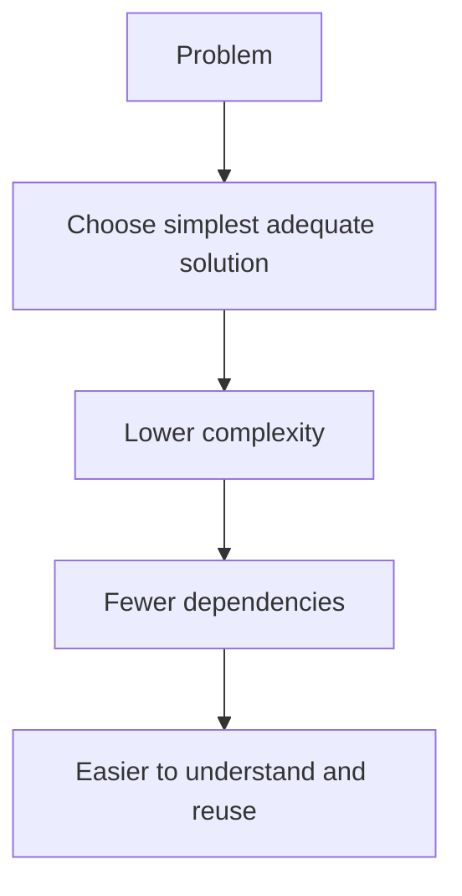

_“Keep It Simple, Stupid” is a blunt reminder that clarity beats cleverness when complexity starts getting in the way._ The phrase is commonly used as a design, engineering, and management heuristic: choose the simplest solution that still works, avoid unnecessary dependencies, and keep systems or documents easy to understand and reuse. [^xjr21y]

# Defining and Describing Keep it Simple, Stupid

- The phrase is usually expanded as **“Keep It Simple, Stupid”**, though some modern technical-writing sources soften it to **“Keep It Simple and Straightforward”**. [^xjr21y]

# Uses in Context

- In **technical writing**, KISS is used as a counterbalance to over-engineering content reuse: a source on single-sourcing says, “if the gains aren’t worth it, choose the simpler solution.”[^xjr21y]
- In **documentation architecture**, [[Vocabulary/Software Architecture|Software Architecture]], [[Vocabulary/Software Architecture Diagrams|Software Architecture Diagrams]] it is invoked to keep topics “stand alone” and avoid unnecessary links that create [[Vocabulary/Dependency Management|Dependency Management]]. [^xjr21y]
- In **programming**, it is used alongside ideas like [[concepts/DRY Principle|DRY Principle]] to argue that reusable functions and modules should not be made more complex than needed. [^xjr21y]
- In **software and [[Vocabulary/User Experience|UX]] discussions**, people invoke the phrase as a usability dictum when a product or policy feels needlessly complicated; one Microsoft community post quotes it directly as “keep it simple, stupid” (KISS). [^18bjpb]
- In **management and process design**, it is used as a shorthand for preferring the least complicated workable process, especially when extra structure adds little value. [^xjr21y]

# History of Use

## Origins

- The exact origin of the acronym **KISS** is not established in the provided results, but a modern technical-writing article explicitly defines it as **“Keep It Simple, Stupid”** and treats it as a named principle in documentation practice. [^xjr21y]
- The same source presents a polished variant, **“Keep It Simple and Straightforward,”** showing that the phrase has been softened in contemporary professional contexts while preserving the same core rule. [^xjr21y]
- In the supplied results, the earliest dated evidence is not a founding text but a later reuse in a Microsoft support/community context, where a commenter invokes the phrase as a “usability dictum.”[^18bjpb]

## Evolution

- **By the time of the single-sourcing article**, KISS had been adapted into technical communication as guidance for reuse, modularity, and avoiding unnecessary dependencies in documentation. [^xjr21y]
- **In the Microsoft community thread**, the phrase appears as a general usability complaint about account design, showing its movement from engineering shorthand into everyday product criticism. [^18bjpb]
- **In contemporary documentation practice**, the phrase is reframed more politely as “Keep It Simple and Straightforward,” suggesting an evolution from blunt admonition to professional heuristic. [^xjr21y]

# Best Real-World Examples

- [Single-sourcing guidance at Paligo](https://paligo.net/blog/single-sourcing/the-5-principles-of-single-sourcing/) — presents KISS as a counterweight to overcomplicated reuse strategies in technical documentation. [^xjr21y]
- [Microsoft Answers discussion](https://learn.microsoft.com/en-au/answers/questions/5511267/why-do-i-have-to-create-an-outlook-com-account-now) — uses KISS as a direct critique of a confusing account-sign-in flow. [^18bjpb]
- [DRY principle](https://paligo.net/blog/single-sourcing/the-5-principles-of-single-sourcing/) — often paired with KISS to show the tension between reuse and unnecessary complexity. [^xjr21y]
- [Single-source topic-based authoring](https://paligo.net/blog/single-sourcing/the-5-principles-of-single-sourcing/) — exemplifies KISS by favoring reusable, stand-alone content chunks. [^xjr21y]
- [Usability dictum](https://learn.microsoft.com/en-au/answers/questions/5511267/why-do-i-have-to-create-an-outlook-com-account-now) — the phrase appears as a shorthand for criticizing designs that confuse users. [^18bjpb]

# Case Studies

One clear case is technical documentation strategy. In Paligo’s discussion of single-sourcing, KISS is not treated as a vague slogan but as a practical rule for authoring reusable content: the article argues that documentation should be kept simple enough to stay reusable, stand alone, and avoid extra topic dependencies. [^xjr21y] It specifically warns that even helpful-looking cross-references can become liabilities if they create publication dependencies, and it recommends choosing the simpler strategy when the payoff for complexity is too small. [^xjr21y] This shows KISS functioning as an anti-overengineering principle, not a ban on sophistication.

A second case is product usability criticism in Microsoft’s support community. A commenter on an Outlook account question invokes the phrase “keep it simple, stupid” while complaining that the account-change process is wasting time and confusing users. [^18bjpb] The example matters because it shows KISS as a user-centered judgment: when a workflow requires aliases, sign-in preferences, or other steps that feel opaque, the phrase becomes a compact way to say the design has crossed the line from necessary structure into unnecessary friction. [^18bjpb]

A third case is the modern softening of the phrase in professional writing. The Paligo article explicitly restates KISS as **“Keep It Simple and Straightforward,”** which preserves the simplicity mandate while removing the insult embedded in the older wording. [^xjr21y] That shift suggests the idea has survived by becoming easier to use in formal settings: the core lesson remains simplicity, but the language has been adapted for documentation teams and other professional audiences. [^xjr21y]

***

# Sources

[^xjr21y]: [The 5 Principles of Single-Sourcing for Technical Writing | Paligo](https://paligo.net/blog/single-sourcing/the-5-principles-of-single-sourcing/)
[^18bjpb]: [Why do I have to create an Outlook.com account now when I already ...](https://learn.microsoft.com/en-au/answers/questions/5511267/why-do-i-have-to-create-an-outlook-com-account-now)
