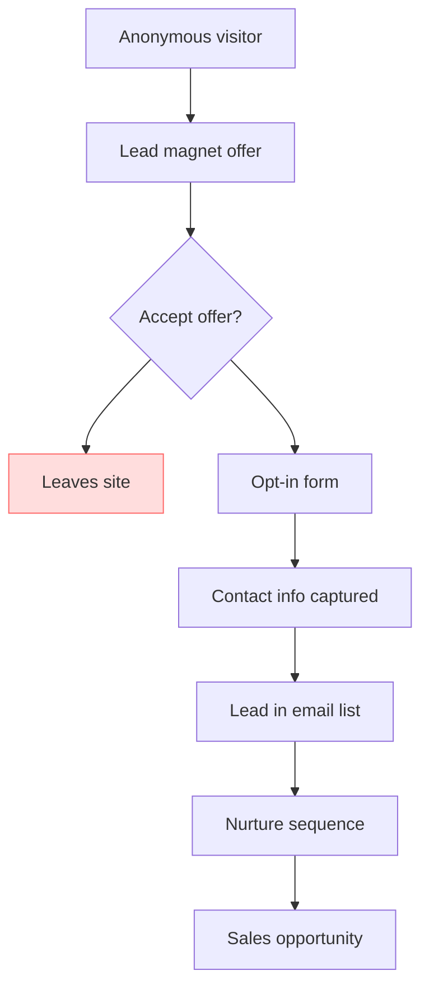

# **Lead Magnets**

[[Vocabulary/Lead Generation|Lead Generation]]

# Defining and Describing Lead Magnets

_Lead magnets are the small but powerful freebies that turn anonymous passersby into identifiable leads you can nurture over time._ [^fgkw5a] [^0j8x44] [^a6733y] [^ihs9jx]

A **lead magnet** is a *free, valuable resource or enticing offer*—such as a guide, checklist, webinar, discount, or tool—offered in explicit exchange for a prospect’s contact information, most often an email address. [^v3dr90] [^i2296t] [^fgkw5a] [^0j8x44] [^a6733y] [^w3su7m] [^thrs5w] [^ihs9jx] The goal is to **convert anonymous traffic into known leads** who can enter a sales or marketing funnel and be followed up with via email, CRM, or other channels. [^fgkw5a] [^0j8x44] [^a6733y] [^thrs5w] [^ihs9jx] Lead magnets matter whenever a business wants to build an owned audience instead of relying only on rented attention (ads, algorithms), and they are central to modern lead generation, especially in content marketing, SaaS, and B2B services. [^acggj0] [^0j8x44] [^a6733y] [^52rwwx] [^0mmqka] [^ihs9jx]

In practice, a lead magnet is described as “a free asset or special deal offered to customers in exchange for their contact details,” including “discount code, webinar, white paper, ebook, template, or another resource.” [^v3dr90] Glossaries emphasize that it is a “free, valuable resource—typically a PDF guide, template, checklist, video, or tool—that a marketer offers in exchange for a prospect's contact information (usually an email address).” [^i2296t] Other practitioners define it as a marketing tool that “offers value to your audience in exchange for their contact information” and “helps turn casual visitors into leads you can nurture and guide through your sales funnel.” [^fgkw5a] A lead magnet’s job, in many guides, is summarized as: **“turn anonymous traffic into a tracked list of prospects you can nurture by email toward a paid offer.”** [^0j8x44]

# Uses in Context

- Marketers use “lead magnet” to describe **any free resource offered for an email**, such as “checklists, templates, guides, webinars, quizzes, or free consultations,” in exchange for “someone's email address.” [^a6733y] This language highlights the term’s role in email list-building and permission-based follow-up.

- SaaS and digital product teams treat lead magnets as **conversion tools embedded in funnels**, where a lead magnet is “a free resource you give in exchange for an email” and “the topic gets people interested; the format decides whether they actually hand over the email.” [^thrs5w] Here, the term signals the bridge between content interest and data capture.

- Direct-response practitioners define a lead magnet as “a small, valuable offer you give away free to solve a specific problem your prospects face,” making it a device to **demonstrate value and qualify leads** at the same time. [^rp1n6s] The emphasis is on solving one narrow problem that points toward the paid solution.

- Sales and CRM platforms describe lead magnets as “an enticing offer or content that's used to attract potential customers or leads” that businesses “offer in exchange for the customer's contact information, such as their email address or phone number.” [^acggj0] In this context, “lead magnet” is a standard noun in the vocabulary of lead-generation campaigns and CRM workflows.

- Glossary writers and consultants explicitly tie the term to **list-building strategy**, stating: “The term was popularized by direct-response marketer Dan Kennedy in the 1990s, but the principle is decades older: get prospects on your list, nurture them with content, and eventually convert a percentage into paying customers.” [^ihs9jx] Here, “lead magnet” is invoked as a codified tactic in the older discipline of list-based direct marketing.

- Contemporary newsletters and blogs refine the term to mean “a complete solution to a narrow problem that you give away for free (or low cost)” where solving that narrow problem “reveals a bigger problem that your core offer solves.” [^cpo0i7] In this usage, “lead magnet” is about strategic problem-framing, not just a generic freebie.

# History of Use

## Origins

- A Swiss marketing glossary notes: “The term was popularized by direct-response marketer Dan Kennedy in the 1990s,” explicitly tying *lead magnet* to Kennedy’s work in direct-response and list-building, even though the underlying principle of trading value for contact details predates him. [^ihs9jx]

- Before the term, practices like **“free reports,” “special offers,” and “information premiums”** were used in direct mail to entice prospects to join mailing lists or request catalogs, but contemporary sources emphasize that the *label* “lead magnet” crystallized in the context of 1990s direct-response marketing and later online list-building. [^ihs9jx]

- Modern glossaries describe lead magnets as part of the shift from anonymous website traffic to **tracked, nurtured leads**, reinforcing that the concept evolved out of list-building and database marketing rather than corporate-brand advertising. [^i2296t] [^fgkw5a] [^0j8x44] [^ihs9jx]

## Evolution

- **1990s – Direct-response and list-building.** The term gains currency among direct-response marketers, associated with building lists: “get prospects on your list, nurture them with content, and eventually convert a percentage into paying customers,” with the lead magnet as the initial bait for list entry. [^ihs9jx]

- **2000s–2010s – Digital marketing and email automation.** As email service providers and marketing automation tools spread, sources describe lead magnets more systematically as “free, valuable resources” like PDFs, videos, and tools, used to “convert anonymous traffic into known leads who can be marketed to over time.” [^i2296t] [^fgkw5a] [^0j8x44]

- **2020s – Interactive and problem-centric lead magnets.** Recent guides highlight “cost calculators, maturity quizzes, free audits, benchmark tools, and custom generators” as the best interactive lead magnets, stressing personalized value delivered quickly. [^fg9ldp] Others redefine a lead magnet as a “complete solution to a narrow problem” that intentionally exposes a larger, paid problem. [^cpo0i7] This marks a shift from static freebies to more diagnostic, tailored experiences.

# Best Real-World Examples

- [Systeme.io](https://systeme.io) – An all-in-one marketing platform that showcases lead magnets like “PDF guide,” “checklist,” “video training,” “discount,” “free trial,” or “mini-course” to turn “anonymous traffic into a tracked list of prospects you can nurture by email toward a paid offer.” [^0j8x44]

- [Schmidt Consulting Group](https://www.schmidtconsulting.group) – A consultancy that breaks down “16 real campaign” lead magnet examples, including checklists, templates, guides, webinars, quizzes, and free consultations, illustrating broad application in B2B and services. [^a6733y]

- [Magnetly](https://www.magnetly.co) – A specialized lead-magnet service that frames a lead magnet as “a free resource you give in exchange for an email,” emphasizing how topic selection and format shape conversion, and showcasing “20+ real ones that convert.” [^thrs5w]

- [SocialRails](https://socialrails.com) – A marketing blog presenting “21 Lead Magnet Examples That Actually Convert,” such as “The 15-Point Social Media Post Checklist” as a single-page PDF, crystallizing the checklist-style lead magnet pattern. [^w3su7m]

- [IBLead](https://iblead.com) – A cold-email-focused service that uses and analyzes lead magnets like “checklist, database, template, or tool” as free offers that “give prospects immediate value in exchange for their contact information,” tailored for outbound email sequences. [^rp1n6s]

- [Dupple](https://dupple.com) – A startup popularizing interactive lead magnets—“cost calculators, maturity quizzes, free audits, benchmark tools, and custom generators”—aimed at delivering personalized value “in under 10 minutes,” which exemplifies the newer interactive, tool-based magnet. [^fg9ldp]

- [Cleverly](https://www.cleverly.co) – A B2B lead-generation agency that publishes “15+ Lead Magnet Ideas That Attract High-Quality Leads,” including examples like “10-Point SaaS Onboarding Health Checklist” and “Pre-Launch Security Audit for Fintech Startups,” showing applied use in high-intent B2B contexts. [^0mmqka]

# Case Studies

## SaaS Recruitment Platform: Interactive ROI Calculator

A B2B SaaS company offering recruitment software deployed an **Interactive ROI Calculator** as a lead magnet—a popup offering a “Calculate Your Hiring Cost Savings” tool where users input a few data points and receive an instant, personalized projection of savings. [^52rwwx] The campaign achieved a **12.3% conversion rate** on visitors who saw the offer, meaning over one in eight visitors opted in to access the calculator and results. [^52rwwx] This case illustrates how a lead magnet that delivers immediate, personalized financial insight can convert high-intent visitors more effectively than generic content downloads, especially when the magnet directly quantifies the value of the underlying SaaS product. [^fg9ldp] [^52rwwx]

## Project Management SaaS: Email Mini-Course

A project management SaaS launched a “5-Day Productivity Sprint” mini-course as a lead magnet, delivered via email to subscribers who opted in. [^52rwwx] The mini-course converted **9.8% of website visitors** exposed to the offer into leads, indicating that structured, time-bound learning experiences can function as compelling magnets for productivity-focused audiences. [^52rwwx] Because the content of the mini-course aligns with the core product’s promise (better project and time management), the lead magnet simultaneously educates prospects and showcases how the SaaS can help, demonstrating the strategic use of *educational* lead magnets in nurturing prospects toward trial or demo requests. [^fgkw5a] [^0j8x44] [^52rwwx]

## Marketing Automation Platform: Template Library

A marketing automation platform offered a “Marketing Campaign Template Library” as its primary lead magnet, including email sequences and landing page designs. [^52rwwx] This resource resulted in an **11.5% lead capture rate**, making it one of the platform’s strongest top-of-funnel assets. [^52rwwx] By providing done-for-you templates, the lead magnet directly addresses the prospect’s immediate obstacle—knowing what to send and how to structure campaigns—while subtly signaling that a more powerful, automated solution is available via the core product. [^rp1n6s] [^52rwwx] The case shows how **practical, plug-and-play assets** (templates and checklists) often outperform more general ebooks, because they reduce friction between learning and implementation, a central insight in modern lead magnet design. [^0j8x44] [^a6733y] [^w3su7m] [^thrs5w]

***

# Sources

[^v3dr90]: [What is a lead magnet? The ultimate guide (+10 examples)](https://www.zendesk.com/blog/sales/lead-magnet/)
[^i2296t]: [What is a lead magnet? Definition, examples, and how to create one](https://www.getpostkit.com/glossary/lead-magnet)
[^fgkw5a]: [What Is a Lead Magnet? Benefits, Examples & How to Create - Smarte](https://www.smarte.pro/blog/what-is-a-lead-magnet)
[^acggj0]: [Lead Magnets: A Complete Guide | Salesforce UK](https://www.salesforce.com/uk/marketing/lead-generation-guide/lead-magnet/?bc=OTH)
[^0j8x44]: [Lead Magnet: Definition + Best Examples](https://systeme.io/glossary/lead-magnet/)
[6]: [Case Studies in Lead Marketing: Real Strategies That Drive ...](https://leadmagnetmarketing.ie/%F0%9F%93%88-case-studies-in-lead-marketing-real-strategies-that-drive-results/)
[^rp1n6s]: [Lead Magnets for Cold Email - IBLead](https://iblead.com/en/blog/lead-magnets-cold-email-examples-case-study)
[^a6733y]: [Lead Magnet Examples That Work: 16 Real Campaign Breakdowns](https://www.schmidtconsulting.group/blog/lead-magnet-examples/)
[^w3su7m]: [21 Lead Magnet Examples That Actually Convert [2026] - SocialRails](https://socialrails.com/blog/lead-magnet-examples)
[^fg9ldp]: [15 Interactive Lead Magnet Examples That Work in 2026](https://dupple.com/learn/interactive-lead-magnet-examples)
[^cpo0i7]: [Lead Magnet Examples That Actually Convert in 2026 (With ...](https://thefloletter.com/p/lead-magnet-examples-that-actually-convert-in-2026-with-automated-follow-up)
[^52rwwx]: [Lead magnet ideas for SaaS: A Case Study in Converting Leads ...](https://leadyup.com/blog/lead-magnet-ideas-saas-case-study-2026)
[^thrs5w]: [Lead Magnet Examples: 20+ Real Ones That Convert (2026)](https://www.magnetly.co/blog/lead-magnet-examples)
[^0mmqka]: [15+ Lead Magnet Ideas That Attract High-Quality Leads (Not Just ...](https://www.cleverly.co/blog/lead-magnet-ideas)
[^ihs9jx]: [Lead Magnet – publy.ch Glossary](https://publy.ch/en/glossar/lead-magnet/)
