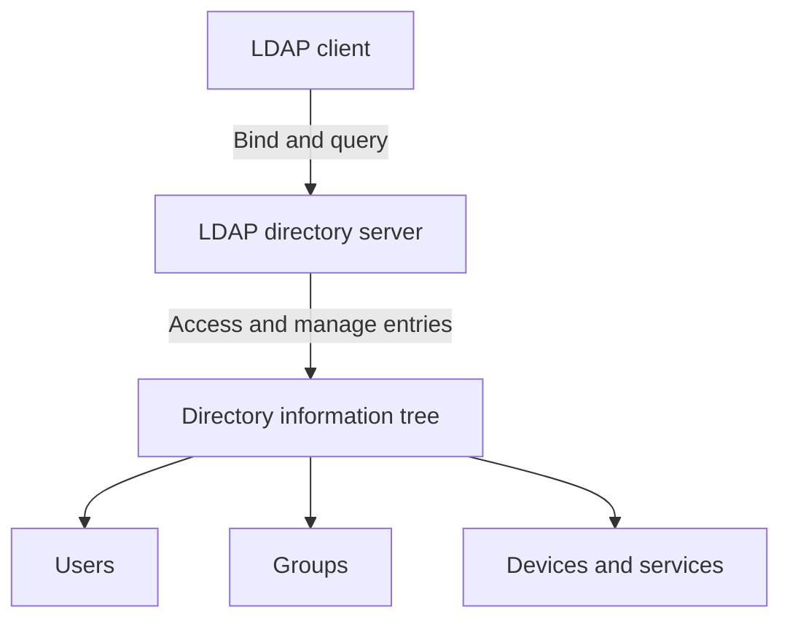

---
aliases:
  - LDAP
date_created: 2026-08-05
date_modified: 2026-08-06
tags:
  - Open-Specifications
cf_last_run: 2026-08-06T17:00:39.445Z
cf_last_run_model: Perplexity sonar-pro
---
[[Network Protocols]]

# Defining and Describing Lightweight Directory Access Protocol

_The Lightweight Directory Access Protocol (LDAP) is the “standard language applications use to talk to a directory” — a central, authoritative record of users, groups, and devices over IP networks._[^zoe0x1]  

LDAP is an **open, vendor-neutral, standardized network protocol** for accessing and maintaining directory information services over an IP network. [^zh16cy] [^iaw98a] [^amt47d] [^os4tjv] [^1rbgjp] It provides a **structured, hierarchical store of users, groups, devices, services, and organizational objects**, exposed as a directory that clients can query, add to, modify, and delete from. [^iaw98a] [^os4tjv] [^zoe0x1] LDAP is described as a “lightweight version of Directory Access Protocol (DAP)” designed as a simplified, more efficient alternative to the older X.500 DAP, optimized for TCP/IP networks and requiring less computing power and network resources. [^b6kmuc] [^amt47d] [^u5axc3] [^zoe0x1] [^npr5lf] Modern enterprise applications use LDAP primarily for **authentication, authorization, and directory services across an organization’s IT environments**, allowing diverse systems to share and manage identity information in a centralized way. [^zh16cy] [^1jyywn] [^1rbgjp] [^zoe0x1]

# Uses in Context

- LDAP is described as “a method of accessing and managing information in a distributed directory service,” giving applications a standard way to look up and manage identity data across an organization’s IT environment. [^zh16cy]  
- Security and identity platforms explain that LDAP “lets applications access and manage identity information in a centralized directory,” especially for enterprise authentication and authorization. [^zh16cy] [^1jyywn]  
- Vendor documentation notes that LDAP “provides a central location for accessing and managing directory services running on the Transmission Control Protocol/Internet Protocol (TCP/IP),” serving as a general-purpose directory service across heterogeneous platforms. [^b6kmuc] [^6r351j] [^h2jkqx] [^5jscir]  
- Guides for IT administrators state that LDAP “is commonly used for centralized authentication, directory services, and information lookups,” particularly in on‑premises and hybrid environments where direct directory lookups are needed for users, applications, devices, and service accounts. [^1jyywn] [^1rbgjp]  
- Explanatory glossaries emphasize that LDAP “exposes a hierarchical Directory Information Tree of entries identified by Distinguished Names,” allowing administrators to query and update entries representing users, devices, services, and policies. [^os4tjv]  
- Technical introductions describe LDAP as “the standard language applications use to talk to a directory: a central, authoritative record of every user, group, and device in an organization,” highlighting its role as the glue between applications and identity infrastructure. [^zoe0x1]  

# History of Use

## Origins

- LDAP was originally defined as a **lightweight alternative to X.500 Directory Access Protocol (DAP)**, designed to work efficiently over TCP/IP networks instead of the heavier OSI protocol stack. [^b6kmuc] [^amt47d] [^u5axc3] [^zoe0x1] [^npr5lf]  
- Historical overviews note that “Lightweight Directory Access Protocol (LDAP) is used to access and manage directory services over a TCP/IP network” and was “originally defined in RFC 1777 in 1995,” marking its first formal specification as an Internet-standard directory access protocol. [^u5axc3]  
- The full description of the LDAP family of specifications is collected in the “Lightweight Directory Access Protocol (LDAP) Technical Specification Road Map” (RFC 4510) and related documents such as RFC 4511, which define the current core protocol. [^iaw98a] [^8tnseq]  
- Standards-focused documentation explains that LDAP “was developed by an international committee called the Internet Engineering Task Force (IETF)” as a **general-purpose, network-based directory service** usable across heterogeneous platforms. [^6r351j] [^h2jkqx] [^5jscir]  

## Evolution

- **1995 – Initial specification (RFC 1777):** LDAP is first standardized as a “lightweight protocol” requiring fewer resources than X.500, enabling practical directory services over TCP/IP. [^u5axc3]  
- **2006 – LDAPv3 consolidation (RFC 4510/4511):** The IETF publishes the “Lightweight Directory Access Protocol (LDAP) Technical Specification Road Map” and a revised core protocol specification in RFC 4511, which together describe the modern LDAPv3 architecture and operations. [^iaw98a] [^8tnseq]  
- **2000s–present – Enterprise adoption and secure variants:** As enterprises standardized on centralized identity stores, LDAP became “the protocol for accessing and managing information contained in an LDAP directory,” with secure variants such as LDAPS (“Lightweight Directory Access Protocol over SSL/TLS”) encrypting client–server communication. [^zh16cy] [^1jyywn] [^zoe0x1] [^jjt4w5]  

# Best Real-World Examples

- [OpenLDAP](url) — A widely used open-source implementation of LDAP directory services, providing a hierarchical directory of users, groups, and other objects over IP networks. [^iaw98a] [^os4tjv] [^zoe0x1]  
- [389 Directory Server](url) — An open-source LDAP directory server offering scalable, centralized identity and policy storage for organizations that rely on LDAP-based authentication and authorization. [^iaw98a] [^os4tjv]  
- [FreeIPA](url) — An integrated identity and policy management solution that uses LDAP as the underlying protocol for its directory of users, groups, hosts, and services. [^iaw98a] [^1jyywn] [^os4tjv]  
- [Keycloak](url) — An open-source identity and access management system that can integrate with existing LDAP directories as a source of users and groups for authentication and single sign-on. [^zh16cy] [^1jyywn] [^1rbgjp]  
- [LastPass Enterprise Directory Integration](url) — A security product that explains how it uses LDAP to “access and manage directory services over a TCP/IP network,” synchronizing enterprise directories with its credential vault. [^u5axc3]  
- [Microsoft Active Directory](url) — A widely deployed directory service that exposes identity information via LDAP, making LDAP “the query and authentication layer that lets systems read from central identity directories such as Active Directory.”[^1jyywn] [^6r351j] [^zoe0x1] [^jjt4w5] [^h2jkqx] [^5jscir]  
- [Azure NetApp Files LDAP integration](url) — Cloud storage documentation that describes using LDAP as a “standard directory access protocol” to locate network objects and enforce identity-based access across heterogeneous platforms. [^6r351j] [^h2jkqx] [^5jscir]  

# Case Studies

### Case Study 1: Open-Source LDAP Directories as Enterprise Identity Backbone

Open-source LDAP implementations such as OpenLDAP and 389 Directory Server demonstrate how a standardized, vendor-neutral protocol can serve as the backbone of enterprise identity without reliance on a single incumbent vendor. [^iaw98a] [^os4tjv] [^zoe0x1] Organizations deploy these servers to maintain a **hierarchical Directory Information Tree of entries identified by Distinguished Names**, representing users, groups, devices, services, and policies. [^os4tjv] Applications throughout the environment use LDAP operations—bind, search, add, modify, delete—to authenticate users and retrieve authorization data from this central directory over TCP/IP networks. [^zh16cy] [^iaw98a] [^1rbgjp] [^zoe0x1] Because LDAP is defined by open IETF specifications like RFC 4511 and documented in the LDAP technical specification road map, different clients and servers can interoperate, illustrating LDAP’s role as a foundational **interoperability protocol** rather than a proprietary product feature. [^iaw98a] [^6r351j] [^8tnseq] This case shows how smaller open-source projects and independent administrators use LDAP to build robust identity platforms that big vendors later adopt or integrate with. [^iaw98a] [^1jyywn] [^os4tjv] [^zoe0x1]  

### Case Study 2: LDAP in Hybrid Enterprise Authentication (Active Directory and Beyond)

Many organizations still rely on **on‑premises and hybrid environments where direct directory lookups are needed for users, applications, devices, and service accounts**, making LDAP central to day‑to‑day authentication workflows. [^1jyywn] [^1rbgjp] In such setups, a central identity store like Microsoft Active Directory exposes directory records via LDAP, and LDAP becomes “the query and authentication layer that lets systems read from central identity directories such as Active Directory.”[^1jyywn] [^zoe0x1] Enterprise applications—VPNs, web apps, file servers, and cloud gateways—bind to the directory using LDAP to validate credentials and retrieve group memberships for authorization decisions. [^zh16cy] [^1jyywn] [^1rbgjp] [^jjt4w5] Security products like LastPass explain that they use LDAP to “access and manage directory services over a TCP/IP network” so they can synchronize user accounts and policies from the existing enterprise directory into their own systems. [^u5axc3] The emergence of LDAPS (“Lightweight Directory Access Protocol over SSL/TLS”) further illustrates how organizations adapted the protocol to encrypt communication between LDAP clients and servers, meeting modern security requirements while preserving interoperability. [^jjt4w5] This case highlights LDAP’s enduring role as a **bridge between legacy directories and modern security services** across heterogeneous infrastructures. [^zh16cy] [^1jyywn] [^6r351j] [^u5axc3] [^1rbgjp] [^jjt4w5] [^h2jkqx] [^5jscir]  

### Case Study 3: Centralized Identity for Diverse Applications via LDAP

In a typical multi-application enterprise, numerous systems—HR apps, internal tools, collaboration platforms, and infrastructure management interfaces—need to share a common notion of user identity and access rights. [^zh16cy] [^1jyywn] [^1rbgjp] [^zoe0x1] LDAP’s design as “a standardized set of rules, syntax, and conventions that specify how different software components communicate with each other and exchange data” allows these diverse systems to understand one another’s identity records via a common directory. [^zh16cy] By implementing an LDAP directory that stores “a central, authoritative record of every user, group, and device in an organization,” administrators can centralize identity lifecycle management while letting each application perform its own queries and updates. [^zoe0x1] Documentation from platforms and glossaries emphasize that LDAP is “an open standard for querying and managing directory information over IP networks,” making it suitable for environments that mix on‑premises servers, cloud services, and various OSes. [^iaw98a] [^6r351j] [^os4tjv] [^h2jkqx] [^5jscir] This case shows how LDAP operationalizes the idea of **centralized, shared identity infrastructure**, reducing duplication of user data and simplifying access control across a wide range of applications. [^zh16cy] [^iaw98a] [^1jyywn] [^os4tjv] [^1rbgjp] [^zoe0x1]

***

# Sources

[^b6kmuc]: [What is lightweight directory access protocol (LDAP) ...](https://www.redhat.com/en/topics/security/what-is-ldap-authentication)
[^zh16cy]: [What is LDAP? Lightweight directory access protocol](https://duo.com/learn/what-is-ldap)
[^iaw98a]: [Lightweight Directory Access Protocol (LDAP)](https://www.loginradius.com/protocol/lightweight-directory-access-protocol)
[^amt47d]: [What is LDAP? Lightweight Directory Access Protocol Explained](https://www.techprescient.com/glossary/ldap/)
[^1jyywn]: [What Is Lightweight Directory Access Protocol? Definition](https://nhimg.org/glossary/lightweight-directory-access-protocol/)
[^6r351j]: [Understand lightweight directory access protocol (LDAP) ...](https://learn.microsoft.com/en-us/azure/azure-netapp-files/lightweight-directory-access-protocol)
[^os4tjv]: [Lightweight Directory Access Protocol](https://paramountassure.com/glossary/what-is-ldap/)
[^u5axc3]: [Understanding Lightweight Directory Access Protocol (LDAP)](https://blog.lastpass.com/posts/lightweight-directory-access-protocol)
[^1rbgjp]: [How Does LDAP Work: Everything IT Administrators ...](https://www.trio.so/blog/how-does-ldap-work)
[^zoe0x1]: [What Is LDAP (Lightweight Directory Access Protocol)](https://stackandsystem.com/series/software-security-fundamentals/13a-ldap)
[^8tnseq]: [โปรโตคอลการเข้าถึงไดเร็กทอรีน้ำหนักเบา](https://hmn.in.th/wiki/Lightweight_Directory_Access_Protocol)
[^npr5lf]: [Was ist LDAP-Authentifizierung? Grundlagen & Vorteile](https://www.redhat.com/de/topics/security/what-is-ldap-authentication)
[^jjt4w5]: [LDAP vs LDAPS: Major Key Differences to Know](https://www.authx.com/blog/ldap-vs-ldaps/)
[^h2jkqx]: [Omówienie podstaw protokołu LDAP (Lightweight ...](https://learn.microsoft.com/pl-pl/azure/azure-netapp-files/lightweight-directory-access-protocol)
[^5jscir]: [Vysvětlení základů protokolu LDAP (Lightweight Directory ...](https://learn.microsoft.com/cs-cz/azure/azure-netapp-files/lightweight-directory-access-protocol)
