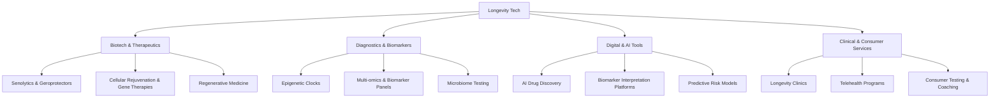

# Defining and Describing Longevity Tech

_Longevity tech is the emerging stack of science, software, and services aimed at extending healthy human lifespan rather than just treating late-stage disease._[^286vdp] [^izy4jm]

Longevity tech usually refers to the broad sector of “scientific and technological advancements aimed at prolonging the period of healthy human life,” including therapeutics, diagnostics, AI tools, and consumer services that target aging mechanisms and age-related disease risk. [^286vdp] [^izy4jm] It spans cellular rejuvenation, geroscience drugs, biomarkers and multi-omics testing, AI-driven drug discovery, and “longevity clinics” offering personalized prevention programs. [^286vdp] [^izy4jm] The field matters because aging is the biggest single risk factor for chronic diseases and because a “longevity trade” already represents a market estimated around $120 billion, with regulators beginning to clear first-in-kind trials such as “the first cellular rejuvenation trial” in humans. [^84npq4] [^izy4jm]

# Uses in Context

- Investors and analysts use “longevity tech” or “longevity sector” to describe a broad investment theme covering companies “developing therapies, diagnostics, and platforms to extend healthy lifespan,” often framed as a “$120 billion market” and “the longevity trade.”[^84npq4] [^286vdp]
- Policy and regulatory lawyers talk about “longevity companies” when outlining whether a business that offers “biomarker analysis, genomics or epigenetics testing, microbiome testing, or other services involving human biospecimens” triggers lab, medical, or privacy regulation. [^d47xmv]
- Venture and ecosystem reports describe longevity tech as a sector that “encompasses a broad spectrum of scientific and technological advancements aimed at prolonging the period of healthy human life,” positioning it as a distinct vertical alongside traditional biotech and digital health. [^286vdp]
- Academic and translational researchers increasingly discuss “longevity interventions” and “longevity biotechnology” in roadmaps for “advancing longevity interventions from research to clinical readiness,” linking basic aging biology to deployable technologies. [^izy4jm]
- Industry newsletters and law-firm blogs refer to “longevity clinics,” “longevity therapeutics,” and “longevity data platforms” to categorize specialized medical practices and software companies focused on preventive, lifespan-oriented care models. [^d47xmv] [^286vdp]

# History of Use

## Origins

- The phrase “longevity biotechnology” and related “longevity industry” language gained traction in the 2010s in biotech investing circles and aging-research communities to distinguish companies directly targeting aging mechanisms from traditional disease-specific pharma. [^286vdp] [^izy4jm]
- Early ecosystem mappings and investor reports began defining “the longevity sector” as comprising companies that “aim to prolong the period of healthy human life” through a mix of drugs, diagnostics, platforms, and services, helping standardize “longevity tech” as a category rather than a buzzword. [^286vdp]
- Academic discourse on “longevity interventions” and their pathway “from research to clinical readiness” emerged from geroscience and translational aging research groups, anchoring the term in peer‑reviewed work rather than marketing alone. [^izy4jm]

*(Searchable web sources focus on sector definitions and roadmaps rather than a single first coinage; the term appears to have emerged organically across investors, researchers, and founders in the 2010s.)*[^286vdp] [^izy4jm]

## Evolution

- **2010s – From anti-aging to longevity biotechnology.** Aging‑research advances and geroscience framing shifted language from loosely regulated “anti‑aging” products toward “longevity biotechnology” and “longevity interventions” grounded in mechanisms like senescence, epigenetic aging, and metabolic pathways. [^286vdp] [^izy4jm]
- **Late 2010s–early 2020s – Institutionalization and regulatory focus.** As dedicated longevity funds, conferences, and clinics appeared, law firms and policy advisors began treating “longevity companies” as a recognizable category, outlining regulatory roadmaps for products ranging from “biomarker analysis, genomics or epigenetics testing” to medical services and AI‑driven tools. [^d47xmv] [^286vdp]
- **2020s – Clinical trials and market framing.** With the FDA clearing “the first cellular rejuvenation trial” and commentators calling longevity “a $120 billion market,” the term “longevity tech” became tied to concrete clinical programs and investable themes rather than speculative futurism. [^84npq4] [^izy4jm]

# Best Real-World Examples

- [AVAIL Bio (Avant Technologies / AVAI)](https://markets.businessinsider.com/news/stocks/the-longevity-trade-is-no-longer-a-buzzword-it-s-a-120-billion-market-and-the-fda-just-cleared-the-first-cellular-rejuvenation-trial-1036053545) – A clinical-stage biotechnology company developing “cell-based therapies” and leading an FDA‑cleared “cellular rejuvenation trial,” exemplifying interventional longevity biotech. [^84npq4]
- [Representative longevity diagnostics companies profiled by Longevity Investors Conference](https://www.longevityinvestors.ch/post/the-global-longevity-investment-landscape-leading-investors-by-deal-count) – Multi-omics, biomarker, and epigenetic testing startups highlighted as part of “the longevity sector” focused on measuring and managing biological age. [^286vdp]
- [Academic “longevity interventions” programs described in geroscience roadmap](https://pmc.ncbi.nlm.nih.gov/articles/PMC12213962/) – Research initiatives moving candidate drugs and lifestyle interventions “from research to clinical readiness,” providing the scientific backbone for longevity tech. [^izy4jm]
- [Longevity clinics and service providers analyzed in regulatory guidance](https://www.afslaw.com/perspectives/longevity-lens/the-regulatory-roadmap-five-critical-questions-evaluating-regulatory) – Medical practices and consumer-facing services that offer “longevity” programs, biomarker-guided care, and subscription models, illustrating the services layer of longevity tech. [^d47xmv]
- [Longevity-focused investors and funds mapped by Longevity Investors Conference](https://www.longevityinvestors.ch/post/the-global-longevity-investment-landscape-leading-investors-by-deal-count) – Investment firms leading deal counts in companies that “aim to prolong the period of healthy human life,” showing how capital allocators organize around longevity tech as a distinct theme. [^286vdp]

# Case Studies

## Cellular Rejuvenation Trial as a Flagship Longevity-Tech Milestone

An illustrative case in longevity tech is the FDA’s clearance of what Business Insider describes as “the first cellular rejuvenation trial,” led by AVAIL Bio (trading as AVAI), a “clinical-stage biotechnology company developing cell-based therapies.”[^84npq4] This trial moves beyond treating a single age-related disease and instead targets underlying cellular aging processes, embodying the shift from symptomatic geriatric care to mechanistic intervention in aging biology. [^84npq4] [^izy4jm] The case shows how a startup-driven therapeutic platform can anchor a new regulatory and investment narrative: analysts now describe longevity as “a $120 billion market” and refer to this clearance as evidence that the “longevity trade is no longer a buzzword,” highlighting how concrete clinical programs help legitimize longevity tech. [^84npq4]

## Longevity Diagnostics and Regulatory Complexity

Another instructive case is the rise of longevity diagnostics and testing platforms, which law-firm guidance now explicitly addresses as “longevity companies” that must navigate multiple regulatory layers. [^d47xmv] Firms offering “biomarker analysis, genomics or epigenetics testing, microbiome testing, or other services involving human biospecimens” are told to evaluate whether they trigger federal Clinical Laboratory Improvement Amendments (CLIA) and state laboratory licensure, and to manage health‑data privacy and consent when data are used for “training AI systems” or targeted marketing. [^d47xmv] These companies often operate with direct‑to‑consumer subscription models, so they must also comply with consumer protection rules on “subscription services, automatic renewals,” and clear cancellation mechanisms. [^d47xmv] This case illustrates how longevity tech is not just a scientific challenge but a systems problem involving diagnostics validation, data governance, and consumer law.

## Building a Longevity Sector: Investors and Translational Roadmaps

A third case is the co‑evolution of dedicated longevity investors and academic translational roadmaps. The Longevity Investors Conference portrays “the longevity sector” as encompassing companies that “aim to prolong the period of healthy human life,” and publishes rankings of “leading investors by deal count,” effectively mapping an ecosystem of specialist funds backing longevity biotech, diagnostics, and platforms. [^286vdp] In parallel, a geroscience roadmap paper lays out milestones “to advance longevity interventions from research to clinical readiness,” specifying the stages required to move from preclinical aging biology to human trials and clinical deployment. [^izy4jm] Together, these investor mappings and scientific roadmaps show how longevity tech is solidifying as a coordinated field: capital, clinical translation, and regulatory planning are aligning around the shared goal of extending healthy lifespan rather than only treating disease once it appears. [^286vdp] [^izy4jm]

***

# Sources

[^84npq4]: [The Longevity Trade Is No Longer a Buzzword — It's a $120 Billion ...](https://markets.businessinsider.com/news/stocks/the-longevity-trade-is-no-longer-a-buzzword-it-s-a-120-billion-market-and-the-fda-just-cleared-the-first-cellular-rejuvenation-trial-1036053545)
[^d47xmv]: [The Regulatory Roadmap: Five Critical Questions for Evaluating ...](https://www.afslaw.com/perspectives/longevity-lens/the-regulatory-roadmap-five-critical-questions-evaluating-regulatory)
[^286vdp]: [The Global Longevity Investment Landscape: Leading Investors by ...](https://www.longevityinvestors.ch/post/the-global-longevity-investment-landscape-leading-investors-by-deal-count)
[^izy4jm]: [Bridging expectations and science: a roadmap for the future of ...](https://pmc.ncbi.nlm.nih.gov/articles/PMC12213962/)
