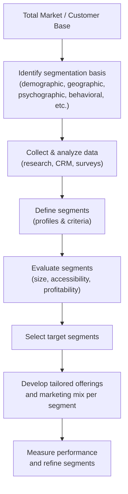

# Defining and Describing Market Segmentation

_Market segmentation is about **stopping “one-size-fits-all” marketing** and speaking differently to different groups that actually share needs and behaviors._

Market segmentation is the **strategic practice of dividing a broad market into smaller groups of customers with shared characteristics, needs, or behaviors** so that marketing, products, and services can be tailored to each group. [^isyn3g] [^mhu92y] [^y67tmj] [^c6jthj] It applies whenever an organization faces a heterogeneous audience and needs to decide *which groups to focus on* and *how to talk to them* most effectively. [^isyn3g] [^y67tmj] Segmentation matters because it allows firms to replace generic mass marketing with targeted campaigns that improve relevance, conversion rates, and return on investment by allocating resources to the most promising segments. [^isyn3g] [^y67tmj] [^e28y5i] In both B2C and B2B settings, segmentation underpins customer insight, product design, pricing, and channel strategies by clarifying *who* the customer really is in practical, actionable subgroups. [^mhu92y] [^y67tmj] [^pii13k]

# Uses in Context

- **Strategy and planning:** Marketing texts define market segmentation as a *“foundational marketing approach”* that lets businesses *“tailor their messaging, products, and services to specific customer groups rather than attempting to appeal to everyone.”*[^isyn3g] Organizations use it to decide which parts of the market to prioritize and where to deploy budget and sales effort. [^y67tmj] [^e28y5i]

- **Campaign targeting and personalization:** Companies group customers by shared characteristics *“to create tailored, highly personalized marketing campaigns,”* under the assumption that people in the same segment *“will respond similarly to marketing efforts.”*[^mhu92y] Email, digital ads, and CRM journeys are commonly segmented by demographics, interests, or behaviors. [^isyn3g] [^mhu92y] [^c6jthj]

- **Customer insight and product development:** Segmentation *“helps you to understand more about your customers’ wants and needs, to tailor products and marketing activity to meet these specific needs.”* [^y67tmj] Firms use segment profiles during product design, feature prioritization, and UX decisions to ensure offerings fit specific groups rather than an abstract “average user.” [^y67tmj] [^e28y5i] [^pii13k]

- **Resource allocation and profitability:** Practitioners emphasize that segmentation enables teams to *“focus your marketing and sales efforts where they’re most likely to pay off, thus maximizing your return on investment.”* [^y67tmj] Brandspeak similarly notes that the goal is to identify *“which groups of customers you can serve most effectively, and to develop a differentiated strategy for each one.”* [^e28y5i]

- **Research and market sizing:** Academic and teaching guides frame segmentation as part of a three‑step process: industry review, defining the *market segment*, and calculating *market size* for that segment (for example, U.S. college students as a 20 million–person segment). [^r0bnov] This is used in feasibility studies, business plans, and go‑to‑market analysis.

- **B2B account focus (firmographics and value):** Segmentation in B2B often uses *firmographic* data—industry, size, revenue, number of employees, locations—to cluster organizations, [^mhu92y] [^y67tmj] and some firms segment by *value*, i.e., how much customers are likely to spend, to prioritize high‑value accounts for account-based marketing and sales coverage. [^y67tmj]

# History of Use

## Origins

- The modern concept of **market segmentation** is widely attributed in marketing scholarship to **Wendell R. Smith**, who argued that *“market segmentation is an alternative to product differentiation as a marketing strategy”* in his 1956 *Journal of Marketing* article “Product Differentiation and Market Segmentation as Alternative Marketing Strategies.”[^c6jthj] Although contemporary web primers rarely cite him, they mirror his definition that segmentation is the *process of dividing a broad market into smaller groups of customers that share meaningful characteristics*. [^c6jthj] [^4lg3pf]

- Introductory resources from marketing education and research platforms (such as SurveyMonkey, MindTools, and business school guides) define segmentation in essentially the same way—as dividing an overall market or customer base into *“clearly defined subgroups of consumers who have common characteristics and priorities”*—reflecting the diffusion of Smith’s original academic framing into mainstream practice. [^y67tmj] [^c6jthj] [^4lg3pf]

## Evolution

- **1950s–1970s – From product-centric to customer-centric marketing:** Following Smith’s 1956 article, segmentation gradually became a core pillar of marketing thought, moving firms away from undifferentiated mass marketing toward differentiated strategies where specific segments are targeted with distinct offerings and messages. [^c6jthj] Introductory marketing courses and textbooks in this period began presenting segmentation, targeting, and positioning (STP) as a standard planning sequence, which underlies later practitioner guides that stress tailoring strategies to segments. [^y67tmj] [^r0bnov] [^4lg3pf]

- **1980s–2000s – Standardization of segmentation types:** Over time, practitioners converged on **four main bases of segmentation**—geographic, demographic, psychographic, and behavioral—as a widely taught taxonomy. [^mhu92y] [^y67tmj] [^4lg3pf] Educational resources now routinely state that *“markets tend to be segmented in four main ways”* along these lines, [^y67tmj] and B2B practice adds *firmographic* segmentation as the organizational counterpart to consumer demographics. [^mhu92y] [^y67tmj]

- **2000s–present – Data-driven and behavioral segmentation:** With digital channels, CRM, and analytics, segmentation has increasingly shifted from static demographic groupings to dynamic behavioral and value-based clusters. [^isyn3g] [^mhu92y] [^y67tmj] [^c6jthj] Modern guides emphasize using *“spending habits, browsing habits, interactions with your brand, [and] product feedback”* as behavioral criteria, [^mhu92y] and note that *behavioral targeting consistently outperforms demographic approaches because it focuses on actual customer actions and engagement patterns*. [^isyn3g] Tools and platforms position segmentation as a data analysis and customer research exercise that is continually refined. [^isyn3g] [^c6jthj] [^pii13k]

# Best Real-World Examples

- **[Spotify](https://www.spotify.com)** uses detailed behavioral and psychographic segmentation—listening history, playlists, moods, and interests—to generate personalized “Discover Weekly” and other curated lists for distinct listener segments, exemplifying behavior‑driven micro‑segmentation at scale. [^mhu92y] [^y67tmj] [^c6jthj]

- **[Nubank](https://nubank.com.br)**, a Latin American fintech, segments customers by digital behavior, credit risk, and financial needs to design differentiated card, savings, and lending products for under‑served populations, illustrating segmentation used to reach niche segments large banks historically ignored. [^c6jthj] [^pii13k]

- **[Warby Parker](https://www.warbyparker.com)** built its model around younger, price‑sensitive, style‑conscious consumers who were dissatisfied with incumbent eyewear pricing, using psychographic and demographic segmentation to shape its direct‑to‑consumer offering and messaging. [^y67tmj] [^e28y5i]

- **[Mailchimp](https://mailchimp.com)** popularizes email list segmentation for small businesses, allowing users to create campaigns targeted by demographics, purchase history, engagement, and interests—bringing segmentation techniques that were once enterprise‑only into accessible self‑serve tools. [^isyn3g] [^c6jthj] [^pii13k]

- **[Salesforce Marketing Cloud](https://www.salesforce.com/products/marketing-cloud/overview/)** (a large‑incumbent example) acts as an adopter and popularizer of segmentation, offering capabilities to segment audiences by demographics, firmographics, and omnichannel behaviors across email, mobile, and advertising for large enterprises. [^isyn3g] [^mhu92y] [^pii13k]

- **[Netflix](https://www.netflix.com)** segments viewers by viewing behavior and preferences to power recommendation rows and content promotion, showing how behavioral segmentation can replace traditional demographic targeting in digital media and entertainment. [^mhu92y] [^y67tmj] [^c6jthj]

# Case Studies

## Case Study 1: A Direct‑to‑Consumer Brand Uses Psychographic Segmentation to Outmaneuver Incumbents

A modern DTC eyewear company such as **Warby Parker** entered a mature eyewear market dominated by large incumbents by targeting a specific psychographic and demographic niche: younger, internet‑savvy, fashion‑conscious consumers frustrated with high prices and limited styles in traditional retail. [^y67tmj] [^e28y5i] Rather than address the entire eyewear market, the firm effectively defined a segment characterized by prioritizing design, transparency, and convenience, then tailored its product and marketing mix accordingly—offering stylish frames at lower prices, home try‑on, and a brand voice aligned with this group’s values. [^y67tmj] [^e28y5i] Marketing materials and brand storytelling reflected this segment’s lifestyle and beliefs more than generic age or income brackets, illustrating the use of psychographic variables like *lifestyle, values, hobbies, or interests* as core segmentation criteria. [^y67tmj] The result was rapid traction and loyalty within that defined segment, demonstrating how a smaller challenger can use segmentation to serve a specific group *more effectively* than broad‑based incumbents that treat the market as homogeneous. [^y67tmj] [^e28y5i]

## Case Study 2: Behavioral Segmentation in Subscription Media

Streaming services such as **Netflix** and music platforms like **Spotify** show the shift from static demographic segmentation to granular behavioral segmentation based on real usage data. [^mhu92y] [^y67tmj] [^c6jthj] Instead of primarily grouping customers by age or geography, these services create segments based on *“spending habits, browsing habits, [and] interactions with your brand”*—in this case, what users watch or listen to, how often they engage, and how they respond to specific content or recommendations. [^mhu92y] These platforms continuously collect and analyze behavioral patterns to identify clusters of users with similar tastes and engagement profiles, then deliver personalized content rows, playlists, and notifications for each segment. [^isyn3g] [^mhu92y] [^c6jthj] This reflects modern guidance that behavioral targeting *outperforms demographic approaches* because it focuses on actual actions and engagement patterns rather than surface‑level traits, [^isyn3g] and illustrates how segmentation has become an ongoing, data‑driven process where segments are refined as new behavioral data accumulates. [^isyn3g] [^c6jthj] [^pii13k]

## Case Study 3: B2B Firmographic and Value Segmentation for Focused Sales Effort

A B2B software startup using a self‑serve survey tool like **SurveyMonkey** or an insight platform like **Checkbox** might adopt firmographic and value-based segmentation to target its limited sales resources. [^y67tmj] [^c6jthj] [^pii13k] Instead of treating all potential business customers alike, it can segment organizations by **industry type, business size, number of employees, locations, and revenue**, which are standard firmographic variables used to classify B2B customers. [^mhu92y] [^y67tmj] It can further layer on a **value** dimension, grouping customers by *“how much they’re likely to spend on products based on their previous purchase history”* to differentiate high‑value accounts from low‑value ones. [^y67tmj] By focusing outbound sales and tailored onboarding materials on segments such as mid‑market technology companies with high potential spend, while serving very small businesses through self‑service channels, the startup implements the principle of concentrating marketing and sales effort where it is *“most likely to pay off.”*[^y67tmj] This case highlights how segmentation is not only about messaging but about structural decisions on coverage, pricing, and product packaging for distinct B2B segments. [^mhu92y] [^y67tmj] [^pii13k]

***

# Sources

[^isyn3g]: [Market Segmentation – Definition, FAQs & How HubSpot Helps](https://www.hubspot.com/glossary/market-segmentation)
[^mhu92y]: [Market segmentation: Examples and strategies - Adobe for Business](https://business.adobe.com/blog/basics/market-segmentation-examples)
[^y67tmj]: [Market Segmentation - MindTools](https://www.mindtools.com/ao3jpz8/market-segmentation/)
[^r0bnov]: [Market Segmentation & Size - MKTG 321 Principles of Marketing ...](https://tamu.libguides.com/c.php?g=492712&p=3371000)
[^e28y5i]: [What Is Market Segmentation? Definition, Types, Examples and ...](https://brandspeak.co.uk/blog/what-is-market-segmentation-definition-types-examples-and-benefits/)
[^c6jthj]: [Market Segmentation: Definitions, Examples, and Types](https://www.surveymonkey.com/learn/market-research/market-segmentation/)
[^4lg3pf]: [What is Market Segmentation? Definition, Types, and Benefits](https://www.theknowledgeacademy.com/blog/what-is-market-segmentation/)
[^pii13k]: [Market Segmentation: Research, Strategy, and Tools - Checkbox](https://www.checkbox.com/blog/market-segmentation)
[9]: [Market Segmentation: Definition, Types, Benefits & Strategy](https://insiderone.com/marketing-segmentation/)
