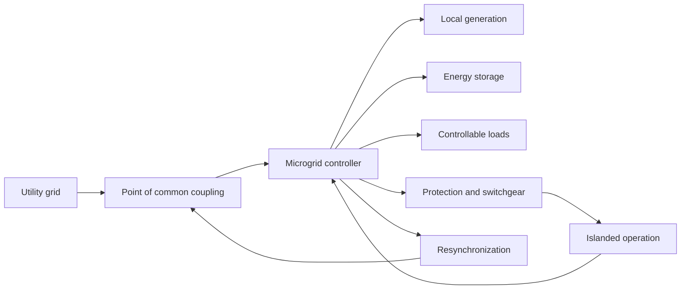

Microgrid operations manage localized energy networks that can function while connected to the main utility grid or independently during a power disruption. [^7uq0gy] [^rt0q6s] 
## Primary Modes of Operation

* Parallel (Grid-Connected) Mode: The microgrid runs synchronized with the main utility grid, drawing power, exporting excess energy, or lowering local demand charges. [^lbac0e] [^bwjf21] [^14xft4] 
* Islanded (Off-Grid) Mode: The microgrid disconnects from the main grid during an outage or disturbance. [[content-areas/AI-Factories-Datacenters/Concepts/Battery Energy Storage Systems]] (BESS) or backup generators instantly form and supply power to the local facility. [^rt0q6s] [^lbac0e] [^14xft4] 
* Reconnection Transition: The microgrid detects a stable utility grid, synchronizes frequency and voltage, and safely transitions back to parallel operation. [^lbac0e] 

## Core System Components

* [[Distributed Energy Resources]] (DERs): Includes on-site renewables (solar PV, wind) and conventional backup generators (diesel or natural gas).
* Energy Storage Systems (BESS): Batteries store excess energy and balance real-time fluctuations between local supply and demand.
* Energy Management System (EMS): The control "brain" that monitors voltage, frequency, fuel levels, and dispatches power using real-time data and safety standards like IEEE 1547. [^rt0q6s] [^lbac0e] [^bwjf21] [^14xft4] [^gj6ytf] 

# Defining and Describing Microgrid Operations

- 

_Microgrid operations are the coordinated control of local generation, storage, loads, and grid connections so an electrical system can remain reliable, economical, and resilient in both normal and emergency conditions._ [^l0fpm5] [^5i00vx]

A microgrid is a group of interconnected loads and distributed energy resources within defined electrical boundaries that operates as a controllable entity. [^l0fpm5] [^5i00vx] Microgrid operations apply when the system is connected to the utility grid, intentionally or involuntarily islanded, or transitioning between those states. [^l0fpm5] [^5i00vx] Core activities include economic dispatch, disturbance detection, islanding, voltage and frequency control, load shedding, restoration, black start, and reconnection. [^l0fpm5] [^0jhsfz] [^5i00vx]

# Uses in Context

- **Grid-connected dispatch:** Operators use the term to describe scheduling local generators, batteries, and flexible loads while the microgrid remains connected to the utility system. [^l0fpm5] [^5i00vx]
- **Island operation:** “Island operation” refers to controlled separation from the utility grid while local resources maintain supply and system stability. [^l0fpm5] [^qqcg3z]
- **Resilience planning:** Utilities and facility owners invoke microgrid operations when discussing continuity of service during outages, extreme weather, or other grid disturbances. [^5i00vx] [^72q7ot]
- **Energy management:** The phrase encompasses supervisory energy-management functions that dispatch resources, balance power and energy, and enforce operating constraints. [^5i00vx]
- **Restoration:** Engineers use it for coordinated load shedding, black-start sequences, sequential energization, and reconnection to the grid. [^0jhsfz] [^5i00vx]

# History of Use

## Origins

- The modern microgrid concept is commonly associated with Robert Lasseter’s work, including the 2002 paper *Microgrids: A Conceptual Solution*, which framed local resources and loads as an integrated system capable of coordinated operation. [^te8fgu]
- The foundational idea was to treat distributed generation and loads as a controllable local network rather than as isolated equipment; later definitions formalized the ability to operate both connected to and separated from the main grid. [^l0fpm5] [^5i00vx]
- The Consortium for Electric Reliability Technology Solutions, or CERTS, helped move the concept from theory toward demonstration through early-2000s research and pilot activity. [^te8fgu]

## Evolution

- **1990s–2002 — Conceptual framework:** Research on distributed generation developed the idea of coordinated local energy systems, with Lasseter’s work articulating microgrids as a distinct operational concept. [^te8fgu]
- **Early 2000s–2005 — Demonstration:** CERTS and related pilot projects explored coordinated control, intentional islanding, and improved reliability in practical distribution systems. [^te8fgu]
- **2010s–2020s — Advanced resilience and autonomy:** Microgrid operations expanded to include batteries, inverter-based resources, renewable forecasting, hierarchical and distributed control, black start, and resilience against extreme weather. [^0jhsfz] [^5i00vx] [^7mbq3b]

# Best Real-World Examples

- [CERTS Microgrid](https://www.energy.gov/) — an early research and demonstration effort centered on coordinated distributed resources and intentional islanding. [^te8fgu]
- [Microgrid Energy Management Systems](https://www.mdpi.com/1996-1073/19/14/3241) — supervisory systems that dispatch resources, balance energy, and coordinate grid-connected and autonomous modes. [^5i00vx]
- [Islanded Microgrid Control](https://www.studeersnel.nl/nl/document/technische-universiteit-delft/sociotechnology-of-future-energy-systems/a-review-of-decentralized-distributed-control-for-islanded-microgrids/151269591) — decentralized and distributed control approaches intended to sustain local service during outages. [^sm5vq6]
- [Black-Start Microgrid Operation](https://www.opal-rt.com/blog/9-effective-approaches-to-managing-energy-in-a-microgrid/) — operational procedures for restarting local generation and sequentially restoring a microgrid without utility support. [^0jhsfz]
- [Hybrid Renewable Microgrids](https://www.nature.com/articles/s41598-026-35529-y) — systems combining multiple energy sources and operating in grid-connected or islanded modes. [^72q7ot]
- [South African Load-Shedding Microgrids](https://www.mdpi.com/1996-1073/19/3/644) — hybrid systems using generation, storage, controllable loads, and hierarchical control to maintain service during utility interruptions. [^7mbq3b]

# Case Studies

**CERTS and the emergence of coordinated microgrid control.** The [[CERTS]] research effort represented an early transition from the idea of distributed generation toward an operational architecture in which local resources and loads could function as one system. [^te8fgu] Its significance was not simply the installation of additional generation: the work focused on coordinated controls, seamless separation from the utility grid, and autonomous operation after a disturbance. [^te8fgu] This helped establish the operational vocabulary still used today—grid-connected operation, islanding, local balancing, and reconnection. [^l0fpm5] [^te8fgu]

**Hierarchical control and resilient operation.** Contemporary microgrid research separates operational responsibilities across control layers: fast local controls stabilize voltage and frequency, while supervisory energy-management systems dispatch resources and coordinate constraints. [^5i00vx] [^7mbq3b] This architecture allows a microgrid to combine solar photovoltaic generation, storage, conventional generation, and controllable loads while preserving a transition path between normal and islanded operation. [^5i00vx] [^7mbq3b] The case demonstrates that microgrid operations are a continuing control problem rather than a single emergency switch: the system must manage dispatch, protection, load priorities, restoration, and reconnection as a sequence of coordinated decisions. [^0jhsfz] [^5i00vx]

**Hybrid microgrids during unreliable grid supply.** A South African case described in a 2026 systematic review involves a 5 MW hybrid microgrid combining combined heat and power, solar photovoltaic generation, diesel backup, and a microgrid controller. [^7mbq3b] Reported implementations in comparable load-shedding contexts achieved 95–100% availability while reducing diesel consumption by 23–37% and operating costs by 18–28%. [^7mbq3b] The example shows how microgrid operations can connect resilience goals with economic optimization: the controller does not merely keep the lights on, but selects among generation, storage, and load-management options according to system conditions. [^5i00vx] [^7mbq3b]

***

# Sources

[^l0fpm5]: [What Is a Microgrid? Architecture, Control, and Operation - GIEE](https://giee.org/what-is-a-microgrid-architecture-control-operation/)
[2]: [Microgrid Control System Design](https://nfmconsulting.com/knowledge/microgrid-control-design/)
[3]: [Microgrid Island Operation: Coordinated Control and ...](https://www.linkedin.com/posts/hakan-y%C3%BCksel-g%C3%BCzel-540a53199_advancedgridseries-microgrid-islandoperation-activity-7482777150123696129-i13I)
[4]: [Microgrid Technology Explained: How Modern Microgrids Work](https://powersecure.com/blog/microgrid-technology)
[^sm5vq6]: [A review of Decentralized & Distributed Control for Islanded Microgrids](https://www.studeersnel.nl/nl/document/technische-universiteit-delft/sociotechnology-of-future-energy-systems/a-review-of-decentralized-distributed-control-for-islanded-microgrids/151269591?origin=university-course-page)
[^qqcg3z]: [How Are Microgrids Controlled and Managed during Islanding Mode?](https://energy.sustainability-directory.com/learn/how-are-microgrids-controlled-and-managed-during-islanding-mode/)
[^te8fgu]: [Microgrids: A Conceptual Solution](https://documents.pserc.wisc.edu/documents/publications/papers/2004_general_publications/lasseterpesc04us.pdf) Robert H. Lasseter, Paolo Piagi, [[University of Wisconsin]]
[^0jhsfz]: [9 Effective Approaches to Managing Energy in a Microgrid](https://www.opal-rt.com/blog/9-effective-approaches-to-managing-energy-in-a-microgrid/)
[^5i00vx]: [Resilience of Microgrids to Extreme Weather Events: A Bibliometric Analysis and Review of Control Strategies (2016–2025)](https://www.mdpi.com/1996-1073/19/14/3241)
[10]: [Microgridscontrolstrategies_Asur...](https://www.scribd.com/document/978432261/Microgridscontrolstrategies-Asurveyofavailableliterature2020-copy)
[11]: [Types of Microgrid Control Architecture - Electrical Academia](https://electricalacademia.com/electric-power/types-of-microgrid-control-architecture/)
[12]: [www.mayfield.energy · technical-articles · anAn Introduction to Microgrid Systems — Mayfield Renewables](https://www.mayfield.energy/technical-articles/an-introduction-to-microgrid-systems/)
[13]: [Smart Microgrid Control and Operation](https://www.allpcb.com/allelectrohub/smart-microgrid-control-and-operation)
[^72q7ot]: [Cost-effective and sustainable operation of microgrids using Improved Whale Optimization Algorithm](https://www.nature.com/articles/s41598-026-35529-y)
[^7mbq3b]: [A Systematic Review of Hierarchical Control Frameworks in Resilient Microgrids: South Africa Focus](https://www.mdpi.com/1996-1073/19/3/644)
[^7uq0gy]: [https://en.wikipedia.org](https://en.wikipedia.org/wiki/Microgrid)
[^rt0q6s]: [https://www.youtube.com](https://www.youtube.com/watch?v=PQ6ZuTT2a8U&t=13)
[^lbac0e]: [https://www.mayfield.energy](https://www.mayfield.energy/technical-articles/microgrid-sequence-of-operations-documentation-explained/)
[^bwjf21]: [https://powersecure.com](https://powersecure.com/blog/microgrid-technology)
[^14xft4]: [https://www.youtube.com](https://www.youtube.com/watch?v=ZX9OHQGlU7Y&t=65)
[^gj6ytf]: [https://sunbeltsolomon.com](https://sunbeltsolomon.com/microgrids-for-commercial-applications/)