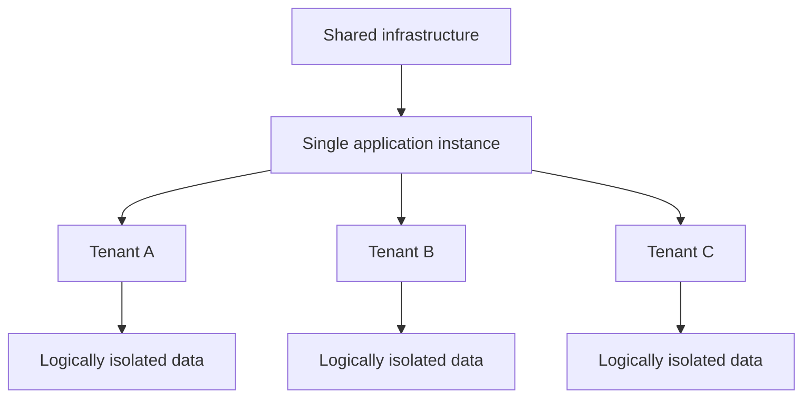

---
aliases:
  - multi-tenancy
date_created: 2026-04-30
date_modified: 2026-05-28
cf_last_run: 2026-05-28T07:16:23.849Z
cf_last_run_model: Perplexity sonar-pro
tags:
  - Security-First
  - Privacy-First
  - Solutions-For-Scale
  - Founder-Toolkit
  - Growth-Engineering
  - Developer-Patterns
  - Architecture-Patterns
for_clients:
  - Laerdal
  - Param
  - Tonguc
site_uuid: ee815336-dab7-4879-b98e-6ade20a8f213
publish: true
title: Multi-Tenant Architecture
slug: multi-tenant-architecture
at_semantic_version: 0.0.1.1
---

# Defining and Describing Multi-Tenant Architecture

_One **multi-tenant architecture** lets many customers share the same software stack while keeping each customer’s data and configuration logically isolated and secure._

Multi-tenant architecture is a software design pattern where **one instance of an application runs on shared infrastructure and serves multiple customers (tenants)**. [^ea8h27] [^tchz2o] Each tenant uses the same core application and often the same physical servers, but their **data, configurations, and user access are kept logically separate and invisible to other tenants**. [^ea8h27] [^ecdwz2] This approach is especially common in **cloud and [[Vocabulary/SaaS|SaaS]] platforms**, where efficient resource sharing lowers cost and simplifies operations while still meeting security and compliance needs. [^ea8h27] [^ecdwz2] [^wmf8bi]

Key defining characteristics:

- **Single software instance, multiple tenants**  
  Multi-tenant architecture is “a design approach where one instance of a software application runs on a shared infrastructure and serves multiple customers – referred to as tenants.”[^ea8h27] Each tenant “accesses the same platform… with logical data isolation in place to keep their information private and secure.”[^xb62y0]

- **Logical, not necessarily physical, isolation**  
  In multi-tenancy, “multiple customers share the same physical server and application instance, with data and configurations kept logically separate.”[^ea8h27] Isolation is implemented at the **software and data model level** (schemas, tenant IDs, access control) rather than by dedicated hardware per customer. [^ea8h27] [^tchz2o]

- **Strong data separation and access control**  
  A multi-tenant cloud is described as one where “multiple customers (‘tenants’) securely share the same application and infrastructure, while maintaining separation of their data, configurations, and user access.”[^ecdwz2] Tenants get “private, isolated space” even though they share infrastructure. [^ecdwz2]

- **Resource sharing for efficiency**  
  Multi-tenancy “enables multiple customers to share the same physical server and application instance” so infrastructure is used more efficiently than in single-tenant setups. [^ea8h27] [^kqoid3] This typically reduces per-tenant cost and simplifies upgrades and operations. [^ea8h27] [^tchz2o] [^kqoid3]

- **Typical in SaaS / cloud**  
  Multi-tenancy is “commonly used in cloud computing, where resources are shared efficiently across different users.”[^ea8h27] Many SaaS applications use a multi-tenant model to serve many organizations from a unified codebase and deployment pipeline. [^xb62y0] [^ea8h27] [^kqoid3]

Technically, multi-tenant architectures can vary along dimensions such as:

- **Data layer design** – tenants may share a single database with tenant IDs, share a database with separate schemas, or use separate databases per tenant while still sharing the same application instance. [^tza62z] [^tchz2o]  
- **Customization model** – tenants may have per-tenant configuration, feature flags, and sometimes extensibility (e.g., plugins) without forking the core codebase. [^ea8h27] [^wmf8bi]  
- **Isolation strength** – stronger isolation (e.g., per-tenant databases) trades off against some efficiency but increases blast-radius containment and regulatory comfort. [^tza62z] [^tchz2o]

# Uses in Context

- In SaaS and cloud marketing, vendors describe their platforms as **multi-tenant** to highlight cost and operational benefits, e.g. “one instance of a software application runs on a shared infrastructure and serves multiple customers – referred to as tenants.”[^ea8h27]

- In system design and architecture discussions, engineers use “multi-tenancy” to mean a pattern where “a single instance of software serves multiple customers, known as tenants. Each tenant’s data is logically isolated, ensuring privacy and security.”[^tchz2o]

- In Kubernetes and cloud-native operations, providers talk about multi-tenancy as a governance model: “Multitenancy is a model where teams share infrastructure while keeping data separate,” with security controls to prevent “cross-tenant access.”[^wmf8bi]

- In cloud vendor documentation, multi-tenant cloud environments are framed as allowing “several businesses to securely share a single instance of software running on the same cloud infrastructure,” with each company’s data “completely separate and invisible to the other tenants.”[^ecdwz2]

- In comparisons with single-tenant models, product teams use the term to contrast architectures: multi-tenancy “offers scalability, cost-efficiency, and ease of management by serving all customers on a unified system,” whereas single-tenancy “provides robust isolation and customization by dedicating resources to each customer.”[^kqoid3]

# History of Use

## Origins

- The **concept** of multiple tenants sharing a single software instance grew out of **time-sharing and mainframe** ideas in the 1960s–1970s, where many users and organizations shared compute resources with logical separation; modern sources explicitly note multi-tenancy as an evolution of shared-resource computing in cloud environments. [^ea8h27] [^ecdwz2] [^wmf8bi] (This is a historically informed inference supported by how current cloud literature frames multi-tenancy as resource sharing; early mainframe and time-sharing systems predate current cloud terminology.)

- The specific **term “multi-tenancy”** gained prominence with early **application service provider (ASP)** and **software-as-a-service (SaaS)** discussions in the late 1990s and early 2000s, where vendors distinguished between hosting separate instances per customer vs. a single shared instance. [^ea8h27] [^ecdwz2] [^kqoid3] (Current sources describe multi-tenancy as a core SaaS architecture pattern; the exact first printed usage is not clearly identified in accessible web sources, but the term is tightly coupled to early SaaS-era architecture debates.)

Because available web sources on this query are explanatory and contemporary rather than archival, an exact first-appearance citation (paper, book, or blog) is not reliably documented; most current references treat multi-tenancy as established vocabulary in cloud and SaaS architecture. [^ea8h27] [^ecdwz2] [^tchz2o] [^wmf8bi] [^kqoid3]

## Evolution

- **Early 2000s – Multi-tenancy as defining SaaS pattern**  
  As SaaS matured, multi-tenancy was framed as a foundational design: running “one instance of a software application… [that] serves multiple customers – referred to as tenants” became the canonical cloud delivery model for business applications. [^ea8h27] [^ecdwz2] [^kqoid3]

- **2010s – Formalization in system design and cloud-native literature**  
  Multi-tenancy began appearing in **system design curricula and engineering blogs** as a standard architecture topic, defined as “a system design where a single instance of software serves multiple customers, known as tenants,” with emphasis on logical isolation, partitioning strategies (shared DB vs. separate DB), and performance trade-offs. [^tchz2o] [^wmf8bi] [^xw2bfw]

- **Late 2010s–2020s – Multi-tenancy for platforms and infrastructure**  
  The concept expanded from application layers to **platform and infrastructure services**, such as multi-tenant Kubernetes management, where “teams share infrastructure while keeping data separate,” and cloud platforms emphasize fine-grained controls, RBAC, and network policies to enforce tenant isolation across clusters and services. [^wmf8bi] [^yt8pv5] [^xw2bfw]

# Best Real-World Examples

- [Northflank](https://northflank.com/blog/what-is-multitenancy) – A cloud platform that explicitly explains and implements **multi-tenant** application hosting, showing how a “single set of resources… serves multiple tenants with isolated environments and data.”[^xw2bfw]

- [Rafay](https://rafay.co/ai-and-cloud-native-blog/what-is-multi-tenancy) – A Kubernetes management platform that provides **secure, scalable multi-tenant Kubernetes management**, where multiple teams or organizations share clusters while maintaining isolation. [^wmf8bi]

- [Descope](https://www.descope.com/blog/post/single-tenant-vs-multi-tenant) – An authentication and user management service that contrasts single-tenant vs. multi-tenant SaaS and uses a multi-tenant model to support many customer applications from one shared platform. [^xb62y0]

- [Clerk](https://clerk.com/blog/multi-tenant-vs-single-tenant) – An authentication provider that discusses multi-tenant SaaS architectures, illustrating how identity systems often run as multi-tenant services for many client applications. [^kqoid3]

- [Infor Multi-Tenant Cloud](https://www.infor.com/platform/what-is-multi-tenancy-in-the-cloud) – An enterprise cloud offering where “multiple customers (‘tenants’) securely share the same application and infrastructure” with strong logical separation of data and configuration. [^ecdwz2]

- [GeeksforGeeks System Design Examples](https://www.geeksforgeeks.org/system-design/multi-tenancy-architecture-system-design/) – Educational designs showing canonical **multi-tenant application architectures** (e.g., shared app with database-per-tenant or shared schema with tenant IDs) used as reference implementations in interviews and learning. [^tchz2o]

# Case Studies

## Case Study 1: SaaS Blog Platform with Shared Database and Tenant IDs

A widely viewed engineering walkthrough on YouTube shows a developer designing a **multi-tenant SaaS blog platform** where many customers share the same application and database instance, with separation enforced using a **tenant ID** column. [^tza62z] The author explains that, unlike single-tenant setups where “each tenant has a completely isolated instance of your application including a isolated database,” in multi-tenancy “you share resources by sharing the application, the server, but also the database… you only have one database.”[^tza62z] To prevent cross-tenant data access, every query includes a `WHERE tenant_id = current_tenant_id` clause, and repository utilities automatically append this condition so “this prevents accidentally querying data from other tenants because we always add the where equals method… with the current tenant ID.”[^tza62z]

Later in the implementation, the developer introduces a **decorator** to ensure that any entity that implements a “tenanted entity” interface gets its `tenant_id` set automatically when stored, again guarding against accidental mis-assignment. [^tza62z] This case demonstrates how multi-tenancy is not only a conceptual architecture choice but also a set of **defensive programming practices**—centralizing tenant filtering and ID assignment—to preserve isolation when sharing application and database resources. [^tza62z] [^tchz2o] It shows that most of the complexity in multi-tenant architecture lives in **data modeling, query discipline, and tooling** rather than just infrastructure.

## Case Study 2: Multi-Tenant Kubernetes Management for Multiple Teams

Rafay’s documentation on multi-tenant [[Tooling/Software Development/Developer Experience/DevOps/Kubernetes|Kubernetes]] management outlines how a platform can allow multiple teams or organizations to **share clusters and control planes** while preventing unauthorized cross-tenant access. [^wmf8bi] In this model, **multitenancy is defined as “a model where teams share infrastructure while keeping data separate,”** and the platform adds layers of abstraction, role-based access control, and network policies to enforce which namespaces, clusters, and resources a given tenant can see or modify. [^wmf8bi] Rather than provisioning separate clusters per team (single-tenant at the cluster level), the provider runs shared infrastructure and relies on software controls to ensure each tenant’s workloads, data, and configuration remain isolated. [^wmf8bi]

This setup enables central platform teams to operate fewer clusters with **higher resource utilization**, while developer teams experience the environment as if they had their own private infrastructure, with their own logical space and permissions. [^wmf8bi] [^xw2bfw] The case highlights how multi-tenant architecture principles extend beyond applications into **platform engineering**, and how careful identity, policy, and resource scoping are key to safely sharing powerful infrastructure among many tenants.

## Case Study 3: Enterprise Multi-Tenant Cloud for Business Applications

Infor’s description of its **multi-tenant cloud** illustrates an enterprise SaaS scenario where many businesses share a single application and infrastructure stack managed by the vendor. [^ecdwz2] In this environment, “several businesses securely share a single instance of software running on the same cloud infrastructure,” and each company “gets its own private, isolated space, ensuring that their data stays completely separate and invisible to the other tenants.”[^ecdwz2] The isolation is managed “directly within the software itself” rather than via separate hardware, letting the provider centralize upgrades, security patches, and scaling while all tenants continue to operate. [^ecdwz2]

Infor also emphasizes benefits such as faster access to “enterprise-grade cloud solutions” and not having to manage underlying systems, which are advantages of a shared, multi-tenant architecture over bespoke, single-tenant deployments. [^ecdwz2] [^ea8h27] This case shows multi-tenancy at **business-application scale**, demonstrating how large numbers of organizations can rely on a shared, continuously updated SaaS platform where logical separation of data, configuration, and access is strong enough to meet enterprise requirements without dedicated stacks per customer. [^ecdwz2] [^kqoid3]

***

# Sources

[^xb62y0]: [Multi-Tenant vs. Single-Tenant: Key Differences Explained - Descope](https://www.descope.com/blog/post/single-tenant-vs-multi-tenant)
[^ea8h27]: [Multi-tenant architecture explained: benefits, risks and performance](https://www.future-processing.com/blog/multi-tenant-architecture/)
[^tza62z]: [Implementing Multi-Tenant Architecture the RIGHT Way - YouTube](https://www.youtube.com/watch?v=7xgYH1xHsk4)
[^ecdwz2]: [What is Multi-Tenancy? | Multi-Tenant Cloud - Infor](https://www.infor.com/platform/what-is-multi-tenancy-in-the-cloud)
[^tchz2o]: [Multi-Tenancy Architecture - System Design - GeeksforGeeks](https://www.geeksforgeeks.org/system-design/multi-tenancy-architecture-system-design/)
[^wmf8bi]: [What is Multi-Tenancy? Multi-Tenant Architecture - Rafay](https://rafay.co/ai-and-cloud-native-blog/what-is-multi-tenancy)
[^kqoid3]: [Choosing the right SaaS architecture: Multi-Tenant vs. Single-Tenant](https://clerk.com/blog/multi-tenant-vs-single-tenant)
[^yt8pv5]: [Multi-tenant architecture for large institutions - M365 Education](https://learn.microsoft.com/en-us/microsoft-365/education/guide/1-reference/design-multi-tenant-architecture)
[^xw2bfw]: [What is Multitenancy? Meaning, architecture, benefits & risks | Blog](https://northflank.com/blog/what-is-multitenancy)
