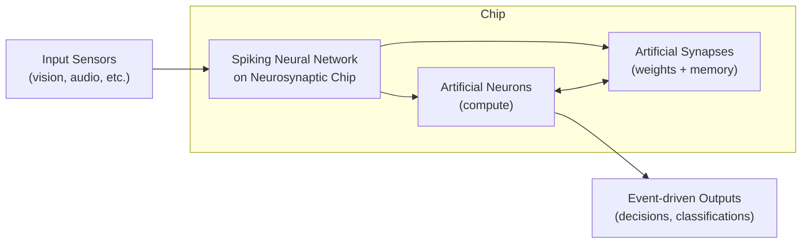

# Defining and Describing Neurosynaptic Computing Chips

_“Neurosynaptic computing chips” are brain‑inspired processors that integrate artificial **neurons** and **synapses** directly in hardware to perform computation and memory in one place, rather than shuttling data back and forth like conventional CPUs and GPUs. [^zz0lcw] [^mhw20b] [^fj4fhw]_

These chips implement networks of artificial neurons and synapses on silicon so that computation is performed through **spiking neural networks (SNNs)**—circuits that “fire” only when events (spikes) occur, closely mimicking biological brains. [^zz0lcw] [^mhw20b] They are designed for ultra‑low‑power, real‑time processing in domains such as edge AI, robotics, sensor fusion, and autonomous systems where continuous data movement is too slow and energy‑hungry. [^zz0lcw] [^mhw20b] [^o9ix3t] The term *neurosynaptic* became prominent with IBM’s TrueNorth architecture, which organizes hardware into “neurosynaptic cores” combining neurons, synapses, and communication in a single unit. [^37wi9v]

Neurosynaptic chips differ from von Neumann machines by **co-locating memory and compute** in dense arrays of neuron–synapse circuits, drastically reducing the energy and latency costs associated with moving data between separate memory and processor units. [^zz0lcw] [^mhw20b] [^fj4fhw] They embody neuromorphic computing’s core idea: “hardware that mimics neural and synaptic structures” to achieve highly parallel, event‑driven computation and on‑chip learning. [^zz0lcw] [^mhw20b]

# Uses in Context

- In **brain‑inspired hardware design**, the term is often used to emphasize that chip architectures explicitly implement both neurons and synapses in silicon; for example, IBM’s TrueNorth is described as packing “**4,096 neurosynaptic cores onto a single die, with 1 million neurons and 256 million synapses**.”[^37wi9v]

- In discussions of **energy‑efficient AI**, neurosynaptic chips are cited as a way to break the “von Neumann bottleneck,” since they “integrate [processing and memory] by using networks of artificial neurons and synapses, eliminating the energy‑intensive transfer of data.”[^mhw20b] [^fj4fhw]

- In **edge and real‑time AI**, neuromorphic/neurosynaptic chips are invoked as ideal for “demanding, real-time AI tasks requiring on-chip learning and adaptation, particularly in resource-constrained environments such as autonomous vehicles, robotics, and edge computing devices.”[^mhw20b] [^o9ix3t]

- In comparisons with [[Vocabulary/Graphics Processing Units|GPUs]] and CPUs, neurosynaptic chips are framed as radically more efficient: Intel reports that its neuromorphic Loihi 2 chip shows “**up to 100x**” energy savings over conventional CPUs and GPUs for some inference workloads, highlighting the benefits of neurosynaptic-style architectures. [^o9ix3t]

- In AI education and explainers, authors use *neurosynaptic* to underline that these chips “process information through **spiking neural networks**” where neurons and synapses are physically instantiated on chip, contrasting them with digital implementations of neural nets on standard processors. [^zz0lcw] [^37wi9v]

# History of Use

## Origins

- The phrase **“neurosynaptic core”** and the broader branding of “neurosynaptic chips” is strongly associated with IBM Research’s work on the **TrueNorth** architecture in the early 2010s, which described its basic building block as a *neurosynaptic core* combining configurable digital neurons, synapses, and spike‑based communication. [^37wi9v]  

- Public explainers on neuromorphic computing now reference TrueNorth as a canonical example: “IBM’s [[TrueNorth chip]] packs 4,096 neurosynaptic cores onto a single die, with 1 million neurons and 256 million synapses,” explicitly tying the neurosynaptic label to a concrete silicon implementation. [^37wi9v]

(Open-access overview sources discuss neurosynaptic cores and neuromorphic chips but do not always give a single first printed use; IBM’s early TrueNorth publications and press materials appear to be the point where “neurosynaptic core/chip” became a named architectural concept.) [^37wi9v]

## Evolution

- **2014–2015 – IBM TrueNorth and neurosynaptic cores.** IBM demonstrates a large-scale neuromorphic chip composed of thousands of “neurosynaptic cores,” each integrating neurons, synapses, and communication fabric, and popularizes the neurosynaptic terminology in both academic and public-facing descriptions of the architecture. [^37wi9v]

- **Late 2010s – Broader neuromorphic hardware ecosystem.** As other research groups and startups build neuromorphic chips (e.g., [[Vocabulary/Intel Loihi Chip]], [[BrainChip Akida]]), community resources describe “neuromorphic hardware systems and chips… engineered to mimic the efficiency and structure of the human brain,” emphasizing integrated neuron–synapse hardware even when the exact *neurosynaptic* label is not used. [^zz0lcw] [^mhw20b] [^74e936]

- **2020s – Focus on applications and software stacks.** Ecosystem guides and technical blogs characterize neuromorphic chips as **spiking, neurosynaptic-style architectures** optimized for event-driven processing, and highlight software frameworks (such as Lava, PyNN, [[snnTorch]]) as the bridge for deploying spiking models onto these neuron–synapse arrays for real-time, low-power AI. [^mhw20b] [^74e936]

# Best Real-World Examples

- **[IBM TrueNorth](https://www.teachfloor.com/blog/neuromorphic-computing)** – Digital neuromorphic chip composed of **4,096 neurosynaptic cores**, implementing ~1 million neurons and 256 million synapses on a single die as a flagship neurosynaptic architecture. [^37wi9v]

- **[Intel Loihi 2](https://www.hcltech.com/blogs/the-next-frontier-how-neuromorphic-computing-is-shaping-tomorrow)** – Experimental neuromorphic processor using spiking neurons and on-chip learning; Intel reports energy savings of up to 100× over CPUs/GPUs for certain inference tasks, illustrating the power‑efficiency potential of neurosynaptic-style designs. [^zz0lcw] [^o9ix3t]

- **[BrainChip Akida](https://www.hcltech.com/blogs/the-next-frontier-how-neuromorphic-computing-is-shaping-tomorrow)** – [[organizations/BrainChip]] Commercial neuromorphic SoC implementing spiking neural networks for always-on edge inference, cited as a notable neuromorphic hardware example alongside Loihi and TrueNorth. [^zz0lcw]

- **[Open Neuromorphic “THOR Ecosystem” hardware list](https://www.neuromorphiccommons.com/ecosystem.html)** – Community-curated catalog of neuromorphic chips and systems that “use networks of artificial neurons and synapses” with event-driven SNNs, showcasing multiple neurosynaptic-like architectures beyond large incumbents. [^mhw20b] [^74e936]

- **[Lava Software Framework](https://www.neuromorphiccommons.com/ecosystem.html)** – Open-source framework developed to program neuromorphic chips, providing tools to deploy spiking neural networks onto neuron–synapse hardware and demonstrating how software ecosystems are co-evolving with neurosynaptic architectures. [^mhw20b]

- **[snnTorch](https://www.neuromorphiccommons.com/ecosystem.html)** – A [[Tooling/AI-Toolkit/AI Programming Frameworks/PyTorch|PyTorch]]-based library for spiking neural networks that targets neuromorphic/neurosynaptic hardware, illustrating how mainstream deep learning workflows are being extended to brain-inspired chips. [^mhw20b]

# Case Studies

**IBM TrueNorth: Scaling neurosynaptic cores to a million-neuron chip**

IBM Research’s **TrueNorth** project, emerging in the early–mid 2010s, built one of the first large-scale neuromorphic chips explicitly organized around **neurosynaptic cores**. [^37wi9v] Each neurosynaptic core integrates configurable digital neurons, synaptic memory, and spike-based communication, and the full chip aggregates **4,096** of these cores into a single die with about **1 million neurons and 256 million synapses**. [^37wi9v] By co-locating computation (neurons) and memory (synapses) and using event-driven spikes instead of clocked arithmetic, TrueNorth demonstrates how neurosynaptic architectures can achieve extremely low power consumption for pattern-recognition workloads relative to traditional processors. [^zz0lcw] [^37wi9v] This design shows that neurosynaptic chips are not just theoretical: they can be fabricated at scale and used as a platform to explore brain-like computation and efficient inference in vision and signal-processing tasks. [^zz0lcw] [^37wi9v]

**Loihi 2 and the push toward practical, energy‑efficient edge AI**

Intel’s **Loihi 2** is an experimental neuromorphic processor that, while typically labeled as *neuromorphic* rather than *neurosynaptic* in marketing, embodies the same core principles of on-chip neurons, synapses, and spike-based communication that define neurosynaptic computing. [^zz0lcw] [^mhw20b] According to Intel, Loihi 2 has demonstrated **“energy savings of up to 100x over conventional CPUs and GPUs for certain inference tasks,”** underscoring the impact of event-driven neuron–synapse computation in practice. [^o9ix3t] The chip targets workloads such as pattern recognition, sensor fusion, and real-time decision-making at the edge, where its parallel, sparse, and spike-driven operations allow it to “sip power rather than guzzle it” compared with conventional accelerators. [^o9ix3t] This case illustrates how neurosynaptic-style architectures are moving from research prototypes toward system integration, influencing how edge AI systems are designed for power and latency constraints. [^zz0lcw] [^o9ix3t]

**THOR Ecosystem and open neuromorphic hardware as a community effort**

The **Neuromorphic Commons** and its **THOR Ecosystem** highlight a community-driven approach to neuromorphic hardware, cataloging systems that replace von Neumann designs with chips that “integrate [processing and memory] by using networks of artificial neurons and synapses” and rely on **Spiking Neural Networks (SNNs)**. [^mhw20b] [^74e936] [^fj4fhw] Rather than centering only large corporate designs, this ecosystem documents diverse chips and boards oriented toward research, prototyping, and specialized applications, all sharing the neurosynaptic premise of event-driven neuron–synapse arrays. [^mhw20b] [^74e936] The accompanying software stack—including tools like Lava, PyNN, and snnTorch—is presented as “the essential programming bridge” allowing developers to exploit synaptic plasticity and asynchronous spiking on these architectures. [^mhw20b] This case shows that neurosynaptic computing is evolving through a broader ecosystem of open tools and community-shared hardware, enabling smaller labs, startups, and independent researchers to experiment with brain-inspired chips rather than relying solely on incumbent platforms. [^mhw20b] [^74e936]

***

# Sources

[^zz0lcw]: [Neuromorphic Computing: The Next Frontier in AI | HCLTech](https://www.hcltech.com/blogs/the-next-frontier-how-neuromorphic-computing-is-shaping-tomorrow)
[^mhw20b]: [THOR Ecosystem - The Neuromorphic Commons](https://www.neuromorphiccommons.com/ecosystem.html)
[^o9ix3t]: [Brain-Inspired AI Is Coming Faster Than You Think - InvestorPlace](https://investorplace.com/hypergrowthinvesting/2025/09/beyond-gpus-why-neuromorphic-chips-could-power-the-future-of-ai/)
[^74e936]: [Neuromorphic Hardware Guide](https://open-neuromorphic.org/neuromorphic-computing/hardware/)
[^fj4fhw]: [Comparison of Neuromorphic Chips vs Conventional Semiconductors](https://eureka.patsnap.com/report-comparison-of-neuromorphic-chips-vs-conventional-semiconductors)
[^37wi9v]: [What Is Neuromorphic Computing? Definition, Architecture, and ...](https://www.teachfloor.com/blog/neuromorphic-computing)
