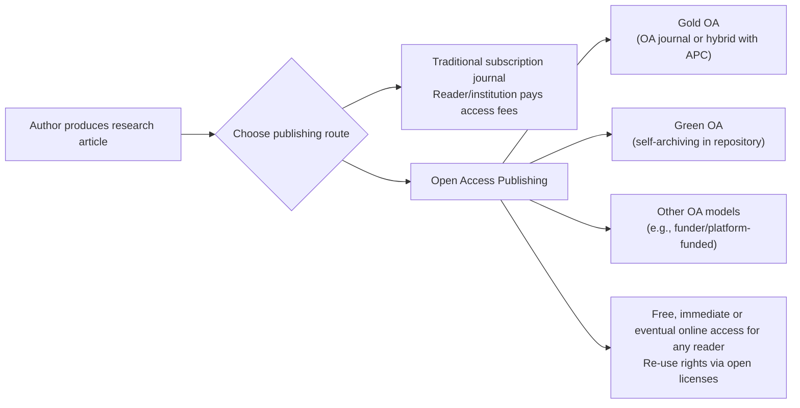

# Defining and Describing Open Access Publishing

_*Open access publishing is about making peer‑reviewed research free to read online—and free to reuse under clear terms—instead of locking it behind paywalls.*_

Open access (OA) publishing is a model in which scholarly research articles are made available online to any reader without subscription fees or pay‑per‑view charges, often described as “free, permanent and unrestricted access to scholarly research and outputs.”[^x3tegl][^dlrxk7] Open access typically combines free online availability with explicit reuse rights, such as Creative Commons licenses, so that “anyone can read, use, and build upon this scholarly content without access fees or subscription barriers.”[^x3tegl][^em460t] It applies across disciplines (science, medicine, humanities, social sciences) and can be implemented through OA journals (“gold” OA) or by self‑archiving works in institutional or subject repositories (“green” OA).[^x3tegl][^fgd751][^89v68j] OA matters because it broadens access to publicly funded research, increases the visibility and potential impact of authors’ work, and reduces geographic and economic barriers to knowledge.[^em460t][^mhyg3d][^89v68j]  

# Uses in Context

- Libraries, funders, and universities define OA as “the free, immediate, online availability of research articles coupled with the rights to use these articles fully in the digital environment.”[^em460t]  
- Policy and advocacy documents refer to OA as “a global movement aimed at ensuring scientific research is available for all to read at no cost to the reader, regardless of geographic, legal, or economic barriers.”[^89v68j]  
- Research offices and library guides explain that “open-access (OA) publications are peer-reviewed research articles that are accessible online to any reader without requiring a journal subscription or payment.”[^dlrxk7]  
- Institutional guidance for authors frames OA as a choice among routes: “You can choose to publish with an open access journal, pay to make traditional journal articles open, or self-archive your work on a subject or an institutional repository.”[^fgd751]  
- Publishing support pages emphasize the business model: because OA “allows authors to share their research freely, without cost to readers,” publishers “often charge Article Processing Charges (APCs) in order to maintain revenue.”[^x3tegl][^81uhll]  
- Author‑facing advice highlights OA’s benefits as “increased visibility & reach,” “higher potential of citation,” and “faster dissemination” of research results.[^mhyg3d][^89v68j]  

# History of Use

## Origins

- Modern open access publishing emerged from early‑2000s scholarly communication reform efforts, crystallized in the 2002 Budapest Open Access Initiative (BOAI), which defined OA as “free availability on the public internet” with rights to “use, distribute, and reproduce” literature, though that original text is summarized in later OA explanations rather than the search snippets here.[^em460t][^dlrxk7]  
- Library coalitions such as the Scholarly Publishing and Academic Resources Coalition (SPARC) helped popularize a concise definition: “Open Access is the free, immediate, online availability of research articles coupled with the rights to use these articles fully in the digital environment,” tying the term to both access and reuse rights in digital scholarship.[^em460t]  
- As digital repositories and early OA journals appeared, OA publishing became associated with making “scholarly work…available through the digital institutional repository, or publication through an Open Access Journal or an OA book,” linking the term directly to specific publishing channels.[^x3tegl][^fgd751]  

## Evolution

- **2000s – From concept to practice.** As more peer‑reviewed articles became available “without requiring a journal subscription or payment,” OA shifted from a purely advocacy term to a recognized publishing category distinguished in statistics and policy as “open-access (OA) publications.”[^dlrxk7]  
- **2010s – Differentiated routes and business models.** Library tutorials and institutional guides began systematically distinguishing “green open access, otherwise known as self‑archiving or repository open access,” from “gold open access” in which “the journal you have chosen to publish in is a fully open access journal” often funded by APCs.[^x3tegl][^fgd751][^89v68j]  
- **Late 2010s–2020s – Mainstreaming via funder and institutional support.** Universities developed structured programs telling authors they can “publish with an open access journal, pay to make traditional journal articles open…or self‑archive,” often backed by institutional APC funds or “Read and Publish agreements” that waive APCs in thousands of journals.[^fgd751][^89v68j][^84iuwx][^wo9mkc]  

# Best Real-World Examples

- [Directory of Open Access Journals (DOAJ)](https://doaj.org) – Widely used community‑curated index of open access journals, often referenced in institutional guidance as a tool for finding reputable OA venues (noted indirectly when guides discuss “standard library directory and database” contexts for journals and serials).[^em460t]  
- [arXiv](https://arxiv.org) – [[projects/Emergent-Innovation/Examples/arXiv|arXiv]] pioneering subject repository model that exemplifies “green” OA by providing free online access to preprints and postprints, aligning with practices described as self‑archiving in institutional repositories.[^fgd751][^89v68j]  
- [PubMed Central](https://www.ncbi.nlm.nih.gov/pmc/) – A major biomedical repository providing OA access to peer‑reviewed articles, reflecting the definition of OA publications as accessible “to any reader without requiring a journal subscription or payment.”[^dlrxk7]  
- [Lippincott Open Access](https://www.wolterskluwer.com/en/solutions/open-access-at-wolters-kluwer-health/lippincott-open-access) – A portfolio of over 260 open access medical journals where authors can “publish your healthcare research” with global visibility.[^7454sd]  
- [Loyola University Chicago eCommons / OA programs](https://libraries.luc.edu/openaccess/publish_open_access) – An institutional initiative where corresponding authors “can publish an unlimited number of open access articles without incurring Article Processing Charges” under certain publisher agreements, and can also self‑archive.[^fgd751]  
- [University of Utah Read & Publish APC fund](https://campusguides.lib.utah.edu/researchers/uu-oa-publish) – A university program under which APCs “are eligible to be paid by UU funds in many of the journals distributed by publishers with whom we have Read & Publish or similar agreements,” illustrating institutional support for OA publishing costs.[^84iuwx]  
- [Wichita State University Open Access Publishing Opportunities](https://libraries.wichita.edu/c.php?g=1504135) – An example of campus‑level OA deals allowing “any corresponding author with an email address ending in wichita.edu” to publish OA under negotiated arrangements.[^wo9mkc]  

# Case Studies

## Institutional OA Agreements at Loyola University Chicago

Loyola University Chicago demonstrates how universities can structurally support open access publishing by negotiating agreements that remove cost barriers for their authors.[^fgd751] Its library explains that “corresponding authors affiliated with Loyola University Chicago can publish an unlimited number of open access articles without incurring Article Processing Charges (APCs)” in selected journals, effectively shifting payment from individual researchers to centrally managed institutional budgets.[^fgd751] In addition, Loyola advises that authors interested in OA “have a variety of options,” including publishing in OA journals, paying to make articles in traditional journals open, or self‑archiving in institutional or subject repositories, giving concrete pathways that align with both gold and green OA models.[^fgd751] This case shows how OA publishing is operationalized not just as a philosophical stance but as a set of funded choices and workflows embedded in institutional policy and library services.[^x3tegl][^fgd751]  

## Read-and-Publish Models at the University of Utah

The [[University of Utah]] illustrates a different, but complementary, approach: integrating OA into “Read & Publish” agreements that tie subscription access and publishing fees together.[^84iuwx] Its resources for researchers state that “APCs for accepted manuscripts are eligible to be paid by UU funds in many of the journals distributed by publishers with whom we have Read & Publish or similar agreements,” turning OA APCs into a predictable institutional expense rather than a personal cost for authors.[^84iuwx] By explicitly listing key points about eligibility and coverage, the program makes OA publishing a default or low‑friction option across large publisher portfolios.[^84iuwx] This case highlights how OA publishing has evolved into a financial and contractual framework managed at the institutional level, aligning with the broader description that OA allows authors to share research “freely, without cost to readers” while publishers “often charge” APCs or are paid via negotiated deals instead.[^x3tegl][^81uhll][^84iuwx]  

## Green and Gold OA in Practice at James Cook University (JCU) Library

A video tutorial from James Cook University Library offers a practical view of how authors navigate green and gold OA routes.[^89v68j] It explains that in green OA, “otherwise known as self‑archiving or repository open access,” an author can upload the “author accepted manuscript…to their institutional repository,” where it becomes publicly discoverable either immediately or “after an embargo period, often 12 months depending on the publisher.”[^89v68j] In contrast, for gold OA “the journal you have chosen to publish in is a fully open access journal” and “these journals require an author to pay an article processing charge to make their work open access for anyone immediately upon publication,” often using funds from research grants or college budgets.[^89v68j] The same tutorial notes that authors at JCU can also take advantage of “read and publish agreements” under which the APC is “waived as part of the agreement” for thousands of journals.[^89v68j] Together, these practices embody the conceptual distinctions defined in OA guides—between free online access via repositories and publisher‑side OA business models—while keeping the common goal of research “available for all to read at no cost to the reader.”[^x3tegl][^em460t][^89v68j]  

***

# Sources

[^x3tegl]: [Understanding Open Access Publishing : Open Access-OA](https://clemson.libguides.com/openaccess)
[^em460t]: [Open Access Explained - Open Access Publishing - Research Guides](https://browse.welch.jhmi.edu/writing_publishing/oa_explanation)
[^mhyg3d]: [Open Access Publishing: Benefits & Challenges for Authors - Editage](https://www.editage.com/insights/benefits-and-challenges-of-open-access-publishing)
[^dlrxk7]: [Open-Access Publishing in a Global Context | NCSES | NSF](https://ncses.nsf.gov/pubs/nsf25347)
[^fgd751]: [Open Access: Publishing Your Own Work](https://libraries.luc.edu/openaccess/publish_open_access)
[^89v68j]: [Open Access Publishing - YouTube](https://www.youtube.com/watch?v=FktQepGQrOk)
[^81uhll]: [Publishing Open Access - Princeton University Library](https://library.princeton.edu/open)
[^84iuwx]: [Resources for Researchers: UU-funded Open Access Publishing](https://campusguides.lib.utah.edu/researchers/uu-oa-publish)
[^7454sd]: [Lippincott Open Access | Trusted Medical Publishing - Wolters Kluwer](https://www.wolterskluwer.com/en/solutions/open-access-at-wolters-kluwer-health/lippincott-open-access)
[^wo9mkc]: [Open Access Publishing Opportunities - Wichita State University](https://libraries.wichita.edu/c.php?g=1504135)
