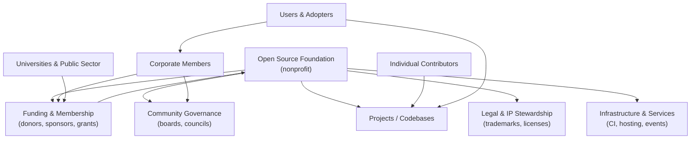

# Defining and Describing Open Source Foundations

_An open source foundation is the neutral, nonprofit “home” that holds a project’s trademarks, governance, and infrastructure so a community—not one company—can own and grow it over time._

Open source foundations are typically nonprofit organizations created to support, govern, and legally steward one or more open source projects or ecosystems. [^4ryuwa] [^1bnksd] They provide “foundation-quality support along with license management, governance, and outreach for OSS creators,” as one overview puts it. [^4ryuwa] These foundations matter because they offer vendor‑neutral governance, protect trademarks and licenses, handle fundraising and events, and provide infrastructure like code hosting and continuous integration that individual maintainers or ad‑hoc communities often cannot sustain alone. [^4ryuwa] [^ia7z2o] The model underpins many critical digital public goods, from the Linux kernel to cloud infrastructure and desktop environments, and is increasingly central to sustainability and security discussions in open source. [^4ryuwa] [^79lg5r] [^ia7z2o] [^cb0pf0] [^2qv1bw]

# Uses in Context

- To describe major ecosystem “umbrellas”: articles often group “The Linux Foundation, founded in 2000,” “Apache Software Foundation (ASF), founded in 1999,” and “Free Software Foundation (FSF)” as “the very biggest organizations of the OSS landscape,” highlighting their role as foundational stewards rather than single‑project teams. [^4ryuwa]
- To categorize supporting organizations beyond the biggest players, such as “GNOME Foundation: Founded in 2000 to coordinate the efforts of the GNOME Project,” “KDE e.V.: Founded in 1997 to coordinate the efforts of KDE Projects,” and “Software in the Public Interest (SPI): Founded in 1997, originally only for the Debian project, [and] now hosts around 35 projects.”[^4ryuwa]
- To frame infrastructure and sustainability debates, as in the joint statement that “open source infrastructure, whether backed by companies or community-led foundations, faces rising demands, fueled by enterprise-scale consumption, without commensurate investment in long-term sustainability.”[^ia7z2o]
- To describe governance and collaboration models, e.g., the Linux Foundation emphasizes “open governance and the open development of these open source code bases” as a core function of its foundation role. [^yej554]
- To explain funding and partnership mechanisms, such as foundations seeking “commercial and institutional partnerships that help fund infrastructure in proportion to usage” and encouraging organizations to “support foundations and projects directly, through membership, sponsorship, or by employing maintainers.”[^ia7z2o]
- To highlight security responsibility, with the Linux Foundation positioning itself as “the nonprofit organization enabling mass innovation through open source” while announcing $12.5 million in grants from multiple companies “to strengthen the security of the open source software ecosystem,” illustrating how foundations broker multi‑stakeholder investment into shared code. [^79lg5r] [^cb0pf0]

# History of Use

## Origins

- The concept of nonprofit entities dedicated to software freedom predates the term “open source” itself: the [[organizations/Free Software Foundation]] (FSF) was founded by Richard Stallman on October 4, 1985, as a 501(c)(3) nonprofit “to support the free software movement,” including stewardship of the GNU General Public License and related projects. [^1bnksd]  
- As “open source” gained prominence in the late 1990s, a wave of explicitly open‑source‑branded foundations emerged: the Apache Software Foundation (ASF) in 1999, the Linux Foundation in 2000 (through the consolidation of earlier Linux‑focused consortia), and the GNOME Foundation in 2000 to coordinate the GNOME desktop environment. [^4ryuwa]  
- Parallel efforts such as KDE e.V. (1997) and Software in the Public Interest (SPI, 1997) illustrate how the need to coordinate large volunteer communities, manage funds, and hold trademarks pushed projects to create dedicated legal entities that later came to be discussed collectively as “open source foundations.”[^4ryuwa]

## Evolution

- **1990s–early 2000s – From single‑project stewards to ecosystem umbrellas.** Early entities like FSF and SPI focused on specific projects or a small set of related efforts, but by 1999–2000 groups such as the Apache Software Foundation and the Linux Foundation were deliberately structured as umbrellas for multiple projects and broader “OSS landscape” influence. [^4ryuwa] [^1bnksd]
- **2000s–2010s – Expansion into infrastructure, standards, and outreach.** Foundations like OASIS Open (founded in 1993 but increasingly focused on open standards and “foundation-quality support along with license management, governance, and outreach”) and the OpenInfra Foundation (formerly the OpenStack Foundation, created in 2012 “to develop and support open-source infrastructure projects”) broadened the model from individual codebases to whole infrastructure and standards ecosystems. [^4ryuwa] [^2qv1bw]
- **2020s – Sustainability, security, and large‑scale consumption.** As enterprises and cloud providers depended more heavily on open infrastructure, a joint statement from multiple foundations argued that “open infrastructure is not free” and called for “practical and sustainable approaches that better align usage with costs,” emphasizing commercial partnerships, tiered access models, and direct financial support. [^ia7z2o] At the same time, the Linux Foundation announced major multi‑vendor security grants “to strengthen the security of the open source software ecosystem,” underscoring foundations’ roles as coordinators of cross‑industry investment. [^79lg5r] [^cb0pf0]

# Best Real-World Examples

- [Free Software Foundation](https://www.fsf.org) – A 501(c)(3) nonprofit founded by Richard Stallman in 1985 to support the free software movement and steward key copyleft licenses like the GNU GPL. [^1bnksd]
- [Apache Software Foundation](https://apache.org) – A nonprofit that grew from the Apache HTTP Server project into an umbrella for hundreds of open source projects with a strong emphasis on community‑over‑code governance. [^4ryuwa]
- [Linux Foundation](https://www.linuxfoundation.org) – A large umbrella foundation, founded in 2000, that serves as “the world's leading home for collaboration on open source software, hardware, standards, and data” and recently coordinated $12.5 million in security grants from multiple AI and cloud companies. [^4ryuwa] [^cb0pf0]
- [GNOME Foundation](https://www.gnome.org/foundation/) – A foundation created in 2000 “to coordinate the efforts of the GNOME Project,” supporting the GNOME desktop and related technologies used across many Linux distributions. [^4ryuwa]
- [KDE e.V.](https://ev.kde.org) – The legal and organizational home for KDE Projects, established in 1997 to coordinate development, manage finances, and represent the community behind the KDE desktop and associated applications. [^4ryuwa]
- [Software in the Public Interest (SPI)](https://www.spi-inc.org) – A nonprofit founded in 1997 “originally only for the Debian project,” now hosting around 35 projects and serving as the fiscal sponsor for widely used software like LibreOffice and PostgreSQL. [^4ryuwa]
- [OpenInfra Foundation](https://openinfra.org) – An open source foundation that “supports a global community of 110000 individuals to build and operate open infrastructure software,” evolving from its origins as the OpenStack Foundation in 2012. [^4ryuwa] [^2qv1bw]

# Case Studies

## Linux Foundation: Umbrella Governance and Security Coordination

The Linux Foundation, formed in 2000, has become one of the most prominent open source foundations, explicitly positioning itself as “the world's leading home for collaboration on open source software, hardware, standards, and data.”[^cb0pf0] [^4ryuwa] It hosts a broad portfolio of projects, from the Linux kernel to cloud native, networking, and automotive initiatives, providing governance structures, infrastructure, events, and marketing support. Building on its role as a neutral convenor for industry and community stakeholders, the foundation announced in March 2026 that it had secured “$12.5 million in total grants from Anthropic, AWS, GitHub, Google, Google DeepMind, Microsoft, and OpenAI to strengthen the security of the open source software ecosystem.”[^79lg5r] [^cb0pf0] This case illustrates how a mature open source foundation can aggregate resources from competing large companies, align them around shared public‑good goals (like security), and channel funding and expertise back into the broader ecosystem in a way individual projects or vendors would struggle to achieve on their own. [^79lg5r] [^cb0pf0]

## SPI and Desktop/Ecosystem Projects: Fiscal Sponsorship at Scale

Software in the Public Interest (SPI) originated in 1997 to provide a legal and financial home “originally only for the Debian project.”[^4ryuwa] Over time it evolved into a multi‑project foundation that “now hosts around 35 projects, some of which are umbrella projects themselves,” acting as a fiscal sponsor and legal steward for diverse open source efforts. [^4ryuwa] Among the most notable projects associated with SPI’s support are LibreOffice—described as “a popular alternative to the Microsoft Office suite of products”—and the PostgreSQL relational database, which the same overview identifies as a flagship open source database. [^4ryuwa] By offering shared back‑office functions (donation management, accounting, legal handling) and allowing projects to benefit from nonprofit status without forming their own entities, SPI demonstrates a lightweight foundation model focused on fiscal sponsorship. This shows how open source foundations can lower administrative barriers, enabling technically focused communities to concentrate on development while still accessing funding and legal protections. [^4ryuwa]

## OpenInfra Foundation: From Single Project to Open Infrastructure Ecosystem

The OpenInfra Foundation began in 2012 as the OpenStack Foundation, “with the intent to develop and support open-source infrastructure projects, including OpenStack.”[^4ryuwa] Over time, as cloud and edge computing needs diversified, the organization rebranded and broadened its remit, now describing itself as “an open source foundation supporting a global community of 110000 individuals to build and operate open infrastructure software.”[^2qv1bw] This shift from a single flagship project (OpenStack) to a portfolio of “open infrastructure” initiatives exemplifies how open source foundations can evolve from project‑centric to ecosystem‑centric, reflecting both technical trends and governance needs. The foundation not only coordinates code development but also organizes events, user groups, and cross‑project collaboration, reinforcing the idea that open source foundations serve as community builders and ecosystem stewards rather than just legal shells. [^4ryuwa] [^2qv1bw]

***

# Sources

[^4ryuwa]: [The Big Players in Open Source - SolarWinds Blog](https://www.solarwinds.com/blog/the-big-players-in-open-source)
[^1bnksd]: [Free Software Foundation - Wikipedia](https://en.wikipedia.org/wiki/Free_Software_Foundation)
[3]: [The foundations of software: open source libraries and their ...](https://ubuntu.com/blog/the-foundations-of-software-open-source-libraries-and-their-maintainers)
[^yej554]: [Inside the Linux Foundation's Open-Source Movement - YouTube](https://www.youtube.com/watch?v=-Xh7k5JtlH0)
[^79lg5r]: [Linux Foundation Announces $12.5 Million in Grant Funding from ...](https://www.prnewswire.com/news-releases/linux-foundation-announces-12-5-million-in-grant-funding-from-leading-organizations-to-advance-open-source-security-302715783.html)
[^ia7z2o]: [Open Infrastructure is Not Free: A Joint Statement on Sustainable ...](https://openssf.org/blog/2025/09/23/open-infrastructure-is-not-free-a-joint-statement-on-sustainable-stewardship/)
[^cb0pf0]: [Linux Foundation Announces $12.5 Million in Grant Funding from ...](https://www.linuxfoundation.org/press/linux-foundation-announces-12.5-million-in-grant-funding-from-leading-organizations-to-advance-open-source-security)
[^2qv1bw]: [OpenInfra Foundation: We build communities who write software ...](https://openinfra.org)
