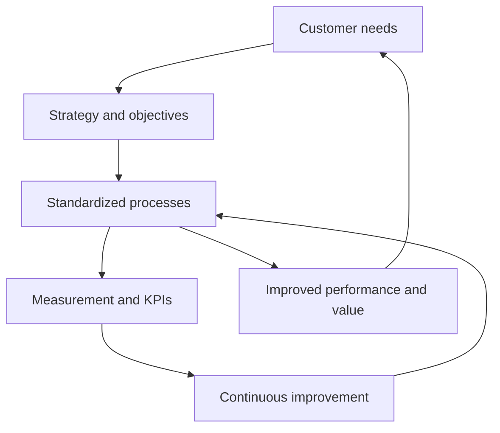

# Defining and Describing Operational Excellence

_*Operational excellence is the discipline of running an organization so that value flows to customers reliably, efficiently, and improves every cycle._  

**Operational Excellence (OE)** is commonly defined as the *systematic implementation of principles and tools designed to enhance organizational performance and create a culture focused on continuous improvement*. [^kiw28i] It focuses on optimizing processes, reducing waste and variation, and aligning people, technology, and metrics so the organization can **consistently deliver high-quality outcomes and value to customers and stakeholders**. [^kiw28i] [^py83tj] [^2674ri] In practice, OE functions as a **management philosophy** and often as a company’s “operating system”: it standardizes how work starts, moves, and finishes, embeds feedback loops, and uses data to drive ongoing improvements in efficiency, quality, safety, and customer satisfaction. [^py83tj] [^2674ri] [^24px0c]

Key characteristics typically associated with operational excellence include:  

- **Customer focus**: designing and improving operations around what customers value. [^kiw28i] [^2674ri]  
- **Continuous improvement**: an ongoing effort to improve products, services, or processes rather than one-off initiatives. [^kiw28i] [^py83tj] [^2674ri] [^24px0c]  
- **Standardization**: clearly documented and repeatable ways of working to reduce errors and variability. [^kiw28i] [^2674ri] [^24px0c]  
- **Efficiency and waste reduction**: eliminating non–value-adding activities, often drawing on Lean and similar methods. [^kiw28i] [^2674ri] [^uqo4co]  
- **Employee engagement and empowerment**: enabling people at all levels to identify problems and drive improvements. [^kiw28i] [^2674ri] [^24px0c]  
- **Data‑driven decision making**: using metrics and analytics to guide priorities and verify results. [^kiw28i] [^py83tj] [^2674ri]  
- **Strategic alignment**: connecting process improvements directly to business strategy and competitive advantage. [^kiw28i] [^py83tj] [^cm3iod]

# Uses in Context

- Management writers and consultants describe operational excellence as a **“management philosophy focused on delivering superior performance by continuously improving processes, decision-making, and value creation across the organization.”**[^py83tj]  
- In operations and supply-chain journals, OE is framed as **“the ability to consistently achieve high-performance outcomes through efficient, predictable, and sustainable processes, not just occasional peaks in performance.”**[^0v9m5u]  
- Digital‑workflow vendors position OE as a **“mindset where a company strives to improve every aspect of its operations… making processes better, faster, and more efficient to deliver the highest value to customers.”**[^2674ri]  
- Safety and quality practitioners invoke operational excellence as a **goal of pursuing “the highest level of efficiency, productivity, safety, and quality in workplace processes”** across industries like manufacturing, service, and construction. [^24px0c]  
- Continuous‑improvement communities often tie OE to Lean and Six Sigma, presenting it as the **systematic pursuit of superior performance by optimizing processes, resources, and decision-making to consistently deliver value to customers and stakeholders.**[^kiw28i] [^py83tj] [^cm3iod] [^uqo4co]

# History of Use

## Origins

- The *idea* of operational excellence draws heavily on earlier continuous‑improvement traditions such as **scientific management**, the Toyota Production System and Lean thinking, and **Six Sigma**, which emphasized standard work, waste elimination, and variation reduction. [^kiw28i] [^cm3iod] [^uqo4co]  
- Contemporary definitions of OE explicitly state that it **“leverages earlier continuous improvement methodologies such as Lean Thinking, Six Sigma, OKAPI, and scientific management”**, indicating it is an umbrella integration rather than a wholly new technique. [^kiw28i]  
- The *phrase* “operational excellence” gained prominence in late‑20th‑century management literature and consulting to describe organizations that execute strategy better than rivals by embedding continuous improvement into daily operations, though usage is spread across multiple authors rather than a single originating paper. [^cm3iod] [^uqo4co]

## Evolution

- **1990s–2000s – From cost and quality to strategic execution.** As Lean and Six Sigma diffused beyond manufacturing into services and healthcare, “operational excellence” began to denote *consistently executing your business strategy better than competitors*, not just cutting cost, tying process improvement directly to competitive advantage. [^cm3iod] [^uqo4co]  
- **2010s – Integration with culture and leadership.** OE frameworks increasingly highlighted culture, leadership, and employee engagement, emphasizing that excellence is “built through discipline, consistency, and the ability to adapt” rather than one-time projects or technology investments. [^kiw28i] [^2674ri] [^tce2go]  
- **2010s–2020s – Digitization and data‑driven operations.** With pervasive software and analytics, OE expanded to include standardized digital workflows, automation, and KPI dashboards, with some practitioners describing operational excellence as the **“operating system of the company”** that governs how requests enter queues, approvals happen, and performance is measured. [^2674ri] [^24px0c] [^pyz6q4]

# Best Real-World Examples

- [Toyota Production System](https://en.wikipedia.org/wiki/Toyota_Production_System) — A canonical model of operational excellence, integrating continuous improvement, waste elimination, and standardized work to deliver high quality and efficiency. [^kiw28i] [^cm3iod]  
- [Virginia Mason Medical Center](https://en.wikipedia.org/wiki/Virginia_Mason_Medical_Center) — A healthcare organization known for applying Lean and operational‑excellence principles to improve patient safety, reduce errors, and streamline care delivery. [^kiw28i] [^tce2go]  
- [Danaher Business System](https://en.wikipedia.org/wiki/Danaher_Corporation) — A conglomerate’s highly systematized continuous‑improvement model often cited as an exemplar of sustained operational excellence across diverse industrial businesses. [^kiw28i] [^cm3iod]  
- [Tervene Operational Excellence Platform](https://tervene.com/blog/operational-excellence/) — A software toolkit focused on daily management, problem‑solving, and Gemba‑walk support that helps manufacturers institutionalize OE practices on the shop floor. [^uqo4co]  
- [Moxo Workflow Orchestration](https://www.moxo.com/blog/what-is-operational-excellence) — A digital workflow platform that operationalizes OE principles via standardized, repeatable processes, approvals, and KPI reviews to improve client‑facing operations. [^2674ri]  
- [SixSigma.us Training Programs](https://www.6sigma.us/business-process-management-articles/pillars-of-operational-excellence/) — Education and certification offerings that promote Lean Six Sigma and the “7 core pillars of operational excellence,” helping organizations build internal capability. [^cm3iod]  
- [SafetyCulture Platform](https://safetyculture.com/topics/operational-excellence) — Tools for inspections, audits, and incident reporting that support operational excellence through better safety, quality, and process adherence in frontline environments. [^24px0c]

# Case Studies

**Case Study 1 – Lean‑Driven Operational Excellence in Healthcare (Virginia Mason)**  
Virginia Mason Medical Center in Seattle began systematically applying Lean principles in the early 2000s to redesign care delivery around patient value and operational excellence. [^kiw28i] [^tce2go] Drawing on concepts such as standardized work, visual management, and front‑line problem solving, the organization restructured processes to reduce variability, waiting, and errors in clinical pathways. [^kiw28i] Years of experience in this environment showed that OE in healthcare is *“not defined by size, technology, or one-time initiatives” but “built through discipline, consistency, and the ability to adapt without disrupting care”*. [^tce2go] Results included improved patient safety, better staff engagement, and more predictable operations, illustrating how operational excellence can translate Lean concepts from manufacturing into high‑risk service settings. [^kiw28i] [^tce2go]

**Case Study 2 – Daily Management and Shop‑Floor Excellence with Tervene**  
Tervene, a specialist platform for industrial operations, works with mid‑sized manufacturers to embed operational‑excellence practices into daily routines such as Gemba walks, problem‑solving meetings, and action‑tracking. [^uqo4co] Its approach emphasizes *continuously improving performance, reducing waste, and enhancing customer satisfaction* through structured daily management, standardized checklists, and real‑time issue escalation. [^uqo4co] By digitizing these routines, client plants can better track non‑conformities, assign countermeasures, and monitor KPIs, which leads to fewer recurring issues, more stable processes, and clearer accountability. [^uqo4co] This case illustrates how a focused startup can operationalize OE principles on the shop floor and help organizations move from ad‑hoc improvement projects to a sustained, systematized improvement engine. [^uqo4co]

**Case Study 3 – Operational Excellence as a Company Operating System (Moxo‑Style Workflows)**  
Moxo describes operational excellence as “running your organization through reliable, repeatable workflows that improve over time,” positioning OE as *“the operating system of the company.”*[^2674ri] In client implementations, organizations begin with one high‑impact workflow—such as client onboarding or approvals—defining clear intake, validation, and approval steps, then instrumenting the process with SLAs, cycle‑time metrics, and first‑pass yield measures. [^2674ri] Over time, these organizations expand standardized workflows across teams, using routine KPI reviews and feedback loops to refine processes and reduce errors. [^2674ri] The resulting shift—from fragmented, email‑driven work to structured, monitored workflows—demonstrates how operational excellence in a digital context can make outcomes more predictable while accelerating continuous improvement. [^2674ri]

***

# Sources

[^kiw28i]: [Operational excellence - Wikipedia](https://en.wikipedia.org/wiki/Operational_excellence)
[^py83tj]: [What is Operational Excellence? | Consultport Knowledge Center](https://consultport.com/simply-explained/what-is-operational-excellence/)
[^2674ri]: [Operational excellence 101: Definition, core principles, and ... - Moxo](https://www.moxo.com/blog/what-is-operational-excellence)
[^24px0c]: [Operational Excellence: How it Works | SafetyCulture](https://safetyculture.com/topics/operational-excellence)
[^0v9m5u]: [What It Really Means: Operational excellence](https://www.scmr.com/article/what-it-really-means-operational-excellence)
[^tce2go]: [What Operational Excellence Really Means](https://www.hcsgcorp.com/blog/the-unseen-foundation-of-high-quality-care-what-operational-excellence-really-means/)
[^pyz6q4]: [How To Achieve Operational Excellence | SS&C Blue Prism](https://www.blueprism.com/resources/blog/operational-excellence/)
[^cm3iod]: [The 7 Core Pillars of Operational Excellence: Your Complete Guide](https://www.6sigma.us/business-process-management-articles/pillars-of-operational-excellence/)
[^uqo4co]: [What is Operational Excellence? 2026 Guide, Principles & Tools](https://tervene.com/blog/operational-excellence/)
