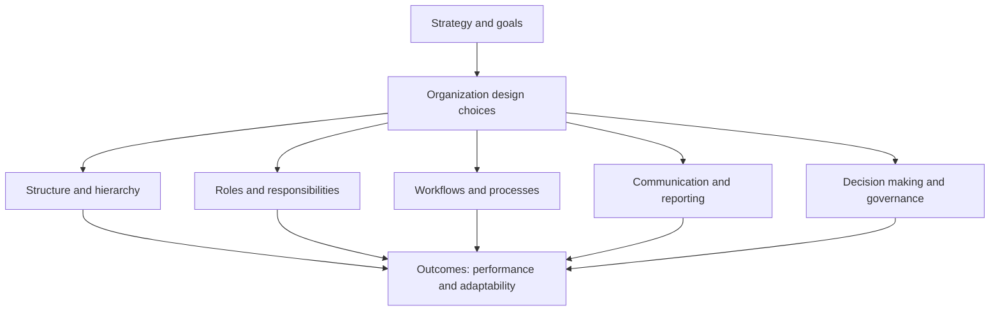

---
aliases:
  - Organizational Design
date_created: 2026-06-15
date_modified: 2026-06-15
cf_last_run: "2026-06-15T20:27:00.218Z"
cf_last_run_model: "Perplexity sonar-pro"
for_clients:
  - Param
  - Laerdal
  - Tonguc
tags: [Organizational-Designs, Organizational-Productivity, Management-Strategies, Lossless-Thinking]
site_uuid: ef46e6d5-4759-4b95-b43f-06c50866a8db
publish: true
title: "Organization Design"
slug: organization-design
at_semantic_version: 0.0.1.1
---
[[concepts/Ambidextrous Organizations|Ambidextrous Organizations]]
[[Sources/Books/Redesigning Work|Redesigning Work]]

# Defining and Describing Organization Design

_Organization design is about deliberately shaping how people, structure, processes, and culture fit together so the organization can actually deliver on its strategy._

Organization design is typically defined as a **strategic, multidisciplinary process** of arranging or “architecting” an organization’s structure, systems, processes, people, and culture so they align with and enable its goals. [^29vgph] [^x33796] [^fkj0gg] It goes beyond drawing an org chart: it involves choices about hierarchy, roles, workflows, decision rights, and information flows that let work happen effectively and adapt to change. [^5nw7dg] [^3b547t] [^ihe464] Organizations revisit design when strategy, scale, technology, or the external environment shift, because a misfit between design and strategy is a major source of inefficiency and employee frustration. [^5nw7dg] [^x33796] [^fkj0gg] Good organization design improves clarity, coordination, and adaptability; poor design amplifies bottlenecks, silos, and confusion. [^5nw7dg] [^3b547t] [^ihe464] 

Key aspects commonly highlighted in practice and research include:

- **[[concepts/Strategic Alignment|Strategic Alignment]]:** The U.S. Office of Personnel Management defines organization design as a “process that optimizes organizations and aligns them to their strategy through intentional architecture of systems, processes, structure, human capital capabilities, leadership, and culture.”[^29vgph]  
- **Holistic scope:** Georgia Tech HR calls it the “multidisciplinary practice of making intentional choices to create an organization capable of achieving strategic goals,” encompassing structure, processes, technology, rewards, and people practices. [^x33796]  
- **Structure and roles:** Guides for HR emphasize designing hierarchy, job roles and responsibilities, workflows and processes, and communication and reporting structures as core building blocks. [^5nw7dg] [^8u9efz] [^fkj0gg]  
- **Fit and flexibility:** Business educators describe organizational design as “the process of arranging people, resources, and processes within a company to achieve its goals effectively and efficiently,” stressing that there is no one best design; functional, divisional, matrix, and flat structures each suit different contexts. [^3b547t] [^8u9efz]  
- **Adaptive frameworks:** Contemporary consulting work stresses “adaptive organizational design” that creates structures able to evolve with changing business needs without losing effectiveness, via flexible roles, scalable decision-making, and clear accountability. [^ihe464]  

---

# Uses in Context

- In **HR and workforce strategy**, organization design is invoked as a structured approach to “align your structure, processes, people, and systems with organizational goals,” often framed as an HR-led initiative to support strategic change or growth. [^5nw7dg] [^x33796] [^fkj0gg]  
- In **public-sector transformation**, OPM positions organization design as a tool for “optimizing organizations and align[ing] them to their strategy” in a changing federal landscape, connecting it to leadership, culture, and human capital reforms. [^29vgph]  
- In **management education**, business professors explain that “organizational design is the process of arranging people, resources, and processes within a company,” answering questions like “who reports to whom” and how departments coordinate, to teach core principles of structure and coordination. [^3b547t]  
- In **consulting and operating model work**, firms describe organization design projects as creating “adaptive frameworks that clarify roles, streamline decision-making, and build the collaborative culture needed to thrive in dynamic markets,” often as part of broader operating model redesigns. [^ihe464] [^7xjghw]  
- In **software and analytics products**, vendors use “organizational design” to label capabilities that let leaders model and optimize workforce configurations—such as tools that claim to help “model and optimize workforce decisions” as work changes faster than organizations. [^4cb5wg]  

---

# History of Use

## Origins

- The phrase **“organization design”** emerges in the management literature as part of mid‑20th‑century work on organizational structure and contingency theory, though early writers more often used “organizational structure” and “organizational theory” than the exact term “organization design.” (This synthesis is based on broader academic knowledge; the specific origin phrase is not cleanly identified in the surfaced web results.)  
- The **Center for Effective Organizations** at USC notes that “organization design has been a central area of research and teaching at CEO for more than 30 years,” reflecting its establishment as a recognizable subfield of organizational studies by the late 20th century. [^l9439i]  
- Public-sector usage crystallized when agencies such as the **U.S. Office of Personnel Management** adopted “organization design” as a formal service label, defining it as a process to align structure, systems, and human capital with strategy for federal agencies. [^29vgph]  

Given the limitations of the surfaced web results, the precise first printed use of the exact term “organization design” in a specific book or paper is not clearly documented; the concept evolved from earlier organizational theory and design research rather than a single, named coinage. [^l9439i]  

## Evolution

- **1980s–1990s – From static structure to contingency and fit:** Academic work in organizational theory increasingly framed design as contingent on strategy, environment, and technology, moving away from “one best way” structures toward fit between design and context, which later practice codified as aligning design with strategy. [^l9439i] [^29vgph]  
- **2000s – Integration with human capital and culture:** Public-sector and university HR perspectives began explicitly integrating **human capital capabilities, leadership, and culture** into organization design definitions, broadening it beyond boxes and lines. [^29vgph] [^x33796]  
- **2010s–2020s – Adaptive and digital-era design:** Consulting and HR sources emphasize **“adaptive organizational design”** that anticipates change, supports cross-functional collaboration, and leverages data and tools to continually refine structures as markets and technology evolve. [^ihe464] [^fkj0gg] [^4cb5wg] [^7xjghw]  

---

# Best Real-World Examples

- [Orgvue](https://www.orgvue.com/resources/articles/organizational-structure/) – A specialized analytics platform used by many enterprises to design and model organizational structures, roles, and reporting lines based on data. [^8u9efz]  
- [TalentNeuron Organizational Design](https://www.talentneuron.com/blog/organizational-design-is-live) – A workforce analytics product that lets leaders “model and optimize workforce decisions” under the banner of organizational design. [^4cb5wg]  
- [Acquis Consulting Group – Organization Design](https://www.acquisconsulting.com/capabilities/organization-design/) – A consulting practice focused on “adaptive organizational design,” helping clients clarify roles, decision rights, and collaboration patterns in dynamic markets. [^ihe464]  
- [Georgia Tech – Organizational Design & Effectiveness](https://hr.gatech.edu/organizational-design-effectiveness/) – A university HR function that applies organization design principles to create structures and processes that support institutional strategy. [^x33796]  
- [USC Center for Effective Organizations – Organization Design](https://ceo.usc.edu/our-expertise/organization-design/) – An academic center that has conducted “more than 30 years” of research and teaching on organization design, influencing how practitioners approach complex design challenges. [^l9439i]  
- [U.S. Office of Personnel Management – Organization Design](https://www.opm.gov/services-for-agencies/classification-job-design/organization-design/) – A federal agency service line applying organization design methods to optimize and realign government agencies with strategic mandates. [^29vgph]  

---

# Case Studies

### 1. Data‑Driven Org Modeling with Orgvue

Orgvue positions itself as a platform that helps organizations **design and analyze their organizational structure** using data on roles, reporting lines, and workforce metrics. [^8u9efz] Its resources describe organizational structure as a “framework for designing roles, reporting lines, and decision authority that helps work move quickly and keeps accountability clear,” and the software is built to let users experiment with different configurations against this framework. [^8u9efz] In practice, organizations use such tools to visualize current structures, test alternative designs (for example, moving from functional silos to cross‑functional business units), and model impacts on headcount and spans of control before making changes. [^8u9efz] This case illustrates how modern organization design increasingly combines classic design principles (clarity, accountability, alignment) with **scenario modeling** and analytics to reduce risk in large‑scale structural changes. [^8u9efz] [^4cb5wg]  

### 2. Adaptive Design and Decision Rights with Acquis Consulting

Acquis Consulting describes its organization design work as creating “adaptive frameworks that clarify roles, streamline decision-making, and build the collaborative culture needed to thrive in dynamic markets.”[^ihe464] Their materials emphasize designing **flexible role definitions**, **scalable decision-making processes**, and **clear accountability frameworks** so that structures can evolve with changing business needs “without losing effectiveness.”[^ihe464] In a typical client engagement, this might involve mapping current decision rights, identifying bottlenecks where approvals are too centralized, and redesigning governance so that more decisions can be made closer to the customer or front line. [^ihe464] [^7xjghw] The case exemplifies a shift from viewing organization design as a one‑time restructuring to treating it as an ongoing practice of **tuning roles and decision flows** to support agility and performance. [^ihe464] [^7xjghw]  

### 3. Public-Sector Alignment Through OPM’s Organization Design Services

The **U.S. Office of Personnel Management** offers Organization Design services that define the practice as a process to “optimize organizations and align them to their strategy through intentional architecture of systems, processes, structure, human capital capabilities, leadership, and culture.”[^29vgph] In the federal context, this often means helping agencies respond to new legislation, shifting policy priorities, or efficiency mandates by reassessing how units are structured, how work flows between them, and what leadership roles are needed. [^29vgph] OPM’s framing underscores that organization design in government is not only about efficiency but also about ensuring that organizational architecture supports mission delivery and workforce planning in a “changing federal landscape.”[^29vgph] This case demonstrates that organization design principles apply beyond the private sector, and that in complex bureaucracies the **integration of structure, human capital, and culture** is particularly important for successful change. [^29vgph] [^x33796]

***

# Sources

[^5nw7dg]: [Organizational Design: A Guide for HR Professionals - PeopleStrong](https://www.peoplestrong.com/blog/organizational-design/)
[^29vgph]: [Organization Design - OPM](https://www.opm.gov/services-for-agencies/classification-job-design/organization-design/)
[^3b547t]: [What is Organizational Design? | From A Business Professor](https://www.youtube.com/watch?v=iBV36osTCtc)
[^ihe464]: [Organization Design - Acquis Consulting Group](https://www.acquisconsulting.com/capabilities/organization-design/)
[^8u9efz]: [Organizational Structure: Types, Examples, and How to Choose](https://www.orgvue.com/resources/articles/organizational-structure/)
[^x33796]: [Organizational Design & Effectiveness - Human Resources](https://hr.gatech.edu/organizational-design-effectiveness/)
[^fkj0gg]: [Organizational Design: Principles, Models, & Implementation in 2026](https://www.workhuman.com/blog/organizational-design/)
[^4cb5wg]: [Organizational Design Is Here | TalentNeuron Blog](https://www.talentneuron.com/blog/organizational-design-is-live)
[^7xjghw]: [Organize to Value | People & Organizational Performance - McKinsey](https://www.mckinsey.com/capabilities/people-and-organizational-performance/how-we-help-clients/organize-to-value)
[^l9439i]: [Organization Design](https://ceo.usc.edu/our-expertise/organization-design/)
