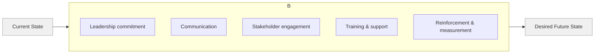

---
aliases:
  - Change Management
date_created: 2024-10-06
date_modified: 2026-05-25
cf_last_run: 2026-05-25T18:52:06.606Z
cf_last_run_model: Perplexity sonar-pro
---

# Defining and Describing Organizational Change Management

_Organizational change management is about deliberately guiding people from today’s way of working to a new one so that the change actually sticks and delivers value._[^vzw5s9] [^o4qhkg]  

Organizational change management (OCM) is commonly defined as a **systematic, structured approach to transitioning individuals, teams, and organizations from a current state to a desired future state**, using processes, tools, and techniques that focus on the *people side* of change. [^vzw5s9] [^zw0hbd] [^o4qhkg] [^c3i5sh] It is used whenever organizations implement significant shifts such as new technologies, restructurings, strategy changes, mergers, or culture transformations, and it matters because unmanaged change tends to create resistance, disruption, and failed initiatives. [^vzw5s9] [^zw0hbd] [^o4qhkg] [^90hzb8] Effective OCM spans **people, processes, systems/technology, and culture**, aiming to minimize disruption and resistance while increasing adoption, performance, and sustainability of the new way of working. [^vzw5s9] [^zw0hbd] [^90hzb8] [^c3i5sh]  

# Uses in Context

- In management and leadership education, OCM is described as a **“systematic approach to transitioning individuals, teams and entire organizations from a current state to a desired future state,”** providing a roadmap for transformation while *minimizing disruption and resistance*. [^vzw5s9]  
- In practical business guides, OCM is framed as a **“step-by-step method for implementing transformation”** that *emphasizes the people aspect of change* to promote adoption of new behaviors and systems and align stakeholders with organizational goals. [^zw0hbd]  
- Professional change practices often define OCM as **“an enabling framework for managing the people side of change,”** stressing that how an organization manages change affects performance, customer satisfaction, and employee experience. [^c3i5sh]  
- Higher-education and executive-training materials explain that OCM *“deploy[s] the necessary processes, tools and techniques used to manage the people side of change,”* turning strategic initiatives into sustainable improvements. [^o4qhkg]  
- Consulting and organizational-development literature links OCM to classic models (Lewin, Kotter, ADKAR) and positions it as the discipline that converts high-level change strategies into concrete communication, engagement, and reinforcement activities that make change stick. [^vzw5s9] [^o4qhkg] [^90hzb8] [^gw7gx4]  

# History of Use

## Origins

- Early foundations of change management as a discipline are often traced to social psychologist **Kurt Lewin**, whose three‑stage model of **Unfreeze–Change–Refreeze** (developed in the mid‑20th century) described how planned change moves organizations from a stable current state to a new, stabilized state; many modern OCM frameworks explicitly “build on the work of early authors” and keep this three-stage logic. [^o4qhkg] [^90hzb8]  
- The term **“organizational change”** and systematic discussion of managing it appear in mid‑to‑late 20th century organizational-behavior and OD (organizational development) literature, where change is defined as a *deliberate shift* in how an organization is arranged, operates, or how people behave together, intended to improve performance or respond to external pressure. [^90hzb8]  
- Practitioner-oriented uses of the explicit phrase **“change management”** grew with the rise of large-scale IT implementations and reengineering in the 1980s–1990s, as organizations recognized the need for structured methods focusing on people, not just technical rollout; later frameworks like Prosci’s ADKAR and Kotter’s 8-step model formalized the term as a distinct management practice. [^vzw5s9] [^o4qhkg] [^c3i5sh]  

## Evolution

- **1950s–1960s – Planned change and OD foundations:** Lewin’s three-stage model and early organizational development work established the idea that effective change requires preparation (unfreezing), transition (change), and institutionalization (refreezing), a structure still reflected in many OCM guides that describe similar stages. [^o4qhkg] [^90hzb8]  
- **1990s – Formalization of structured change frameworks:** John Kotter’s widely cited 8-step model (e.g., *“create urgency,” “build a guiding coalition,” “form a strategic vision,” “generate short-term wins,” “institute change”*) became an influential blueprint for leading major organizational change and popularized the idea of stepwise change leadership. [^vzw5s9] [^o4qhkg]  
- **Late 1990s–2000s – Individual-focused models and “people side of change”:** Prosci founder Jeff Hiatt introduced the **ADKAR** model (Awareness, Desire, Knowledge, Ability, Reinforcement), explicitly centering individual transitions as the foundation of organizational transformation and helping leaders diagnose where people struggle during transitions. [^vzw5s9] [^o4qhkg] [^c3i5sh]  
- **2010s–2020s – From discrete projects to continuous transformation:** Consulting analyses note that organizations now face “more frequent and concurrent changes,” requiring leaders to rethink traditional change-management tools and master a more complex, continuous level of change, sometimes described as “radical reinvention.”[^fk02fs]  

# Best Real-World Examples

- [Prosci](https://www.prosci.com) – A specialist firm that developed the **ADKAR** model and offers change-management research, training, and tools focused on managing the people side of change in organizations. [^vzw5s9] [^o4qhkg] [^c3i5sh]  
- [Kotter, Inc.](https://www.kotterinc.com) – Advisory firm founded by John Kotter that applies his **8-step process for leading change** to help organizations execute strategic transformations. [^vzw5s9] [^o4qhkg]  
- [NMS Consulting](https://nmsconsulting.com) – A consulting firm whose detailed guides on **organizational change types, 5 C’s, and stages** exemplify practitioner-driven OCM methods grounded in planned, deliberate shifts in structure, operations, and behavior. [^90hzb8]  
- [Eastern Washington University Online MBA – Organizational Leadership](https://online.ewu.edu) – Academic program that explicitly teaches **organizational change management** concepts, including core components (leadership commitment, strategic communication, stakeholder engagement, training) and major frameworks (Lewin, Kotter, ADKAR). [^vzw5s9]  
- [Arkansas State University Online – Change Management Strategies Guide](https://degree.astate.edu) – Educational resource that lays out a **step-by-step OCM process** (planning, communication, training, reinforcement) and illustrates how to build practical OCM plans. [^zw0hbd]  
- [ACE (American College of Education) – Change Management in Today’s Business Environment](https://ace.edu) – Practitioner-focused resource explaining change-management principles and models, used in leadership development and organizational practice. [^o4qhkg]  
- [Cornell University – Organizational Change Management](https://it.cornell.edu/change-management) – University resource that offers strategies and tips to “wield organizational change to your advantage,” reflecting how OCM is operationalized in institutional settings. [^7atl04]  

# Case Studies

## Case Study 1: Implementing New Technology with a People-Focused OCM Plan (Composite from Educational Guides)

Many universities and mid-sized organizations implementing new enterprise software (such as HR or student-information systems) have documented that **technical go‑live alone does not ensure adoption**, leading them to adopt structured OCM approaches like those outlined by Arkansas State University and Prosci. [^zw0hbd] [^c3i5sh] [^7atl04] Following the kind of process described by Arkansas State University, leaders start with **planning**, defining objectives for the new system, identifying key stakeholders (executives, managers, front-line users), and aligning the change with strategic priorities. [^zw0hbd] They then execute a **communication strategy** that transparently explains *why* the change matters, what will change, and what stakeholders can expect, using regular updates to maintain engagement and reduce uncertainty. [^zw0hbd] [^o4qhkg] In parallel, they design **training and support** tailored to different user groups, providing the knowledge and skills needed to use the system effectively and confidently. [^zw0hbd] [^o4qhkg] [^c3i5sh] After rollout, leaders apply **reinforcement mechanisms**—such as recognition, feedback loops, and performance measures tied to system use—to convert initial compliance into long-term adoption and to embed new processes into daily work. [^zw0hbd] [^o4qhkg] [^90hzb8] [^c3i5sh] This pattern illustrates OCM’s core insight: by treating change as a managed, people-centric process—not just a technical deployment—organizations increase adoption, reduce resistance, and realize the intended benefits of new technology. [^zw0hbd] [^o4qhkg] [^c3i5sh] [^7atl04]  

## Case Study 2: Culture and Behavior Change Using the 5 C’s and Classic Models

Consulting guidance such as NMS Consulting’s **5 C’s of organizational change** (Case for change, Clarity, Communication, Capability, Commitment) illustrates how organizations approach **culture and behavior change** systematically rather than relying on slogans. [^90hzb8] In a typical engagement, leaders first articulate a strong **case for change**, using customer, performance, or risk data rather than vague senior preferences, to help employees see why current behaviors must shift. [^90hzb8] They define **clarity** around specific outcomes and success measures, painting a concrete picture of what the organization will look like after the change. [^90hzb8] They then invest in **communication** that is regular and honest, explaining what will change and what will not, and in building **capability** through skills, tools, time, and budget so that people can work in the new way. [^90hzb8] Finally, they secure **commitment** via visible leader behaviors and aligned incentives, while using feedback loops and metrics to track both progress and impact. [^90hzb8] The process often draws explicitly on Lewin’s three stages (unfreeze by surfacing problems and questioning the current state; change by piloting new structures and behaviors; refreeze by stabilizing policies, performance measures, and rewards), showing how classic theory underpins modern OCM practice. [^o4qhkg] [^90hzb8] This kind of case demonstrates that culture change succeeds when managed as an integrated program of narrative, capability-building, and reinforcement—not as a one-time announcement. [^o4qhkg] [^90hzb8]  

## Case Study 3: Scaling Continuous Change in an Era of “Radical Reinvention”

Contemporary analyses from firms such as McKinsey describe organizations facing **“radical reinvention”** and “more frequent and concurrent changes,” moving beyond occasional large projects to near-continuous transformation. [^fk02fs] In these scenarios, leaders discover that traditional, linear change programs are insufficient; they must **rethink traditional change-management tools** and develop capabilities for ongoing sensing, experimentation, and adaptation. [^fk02fs] A typical large organization might be simultaneously shifting to hybrid work, digitizing customer channels, and restructuring business units, all while responding to competitive and regulatory pressures. [^fk02fs] Applying OCM at this scale involves creating **portfolios of change**, establishing predictable communication rhythms, and integrating change practices into everyday leadership behaviors so that employees are not overwhelmed by “change fatigue.”[^falqt7] [^fk02fs] Managers slow down critical messages, invite questions, and pay close attention to how people react to change, while building systems for feedback and course correction. [^falqt7] [^fk02fs] This case shows how OCM has evolved from supporting discrete projects to functioning as a **core organizational capability** for navigating continuous, overlapping changes in strategy, technology, and ways of working. [^falqt7] [^fk02fs]

***

# Sources

[^vzw5s9]: [Learn What Organizational Change Management is at EWU Online](https://online.ewu.edu/degrees/business/mba/organizational-leadership/definition-and-core-concepts/)
[^zw0hbd]: [Change Management Strategies for Effective Leadership](https://degree.astate.edu/online-programs/undergraduate/organizational-leadership/baol/change-management-strategies-guide/)
[^o4qhkg]: [Change Management in Today's Business Environment | ACE Blog](https://ace.edu/blog/change-management-explained-what-it-is-and-why-it-matters-in-business/)
[^90hzb8]: [Organizational Change: Types, 5 C's, Stages, Benefits and Examples](https://nmsconsulting.com/organizational-change-types-5-cs-stages-benefits-and-examples/)
[^falqt7]: [Our Favorite Management Tips on Organizational Change](https://hbr.org/2026/04/our-favorite-management-tips-on-organizational-change)
[^fk02fs]: [How change management can address radical transformation](https://www.mckinsey.com/capabilities/people-and-organizational-performance/our-insights/change-is-changing-how-to-meet-the-challenge-of-radical-reinvention)
[^c3i5sh]: [What is Change Management Training? The Complete Guide - Prosci](https://www.prosci.com/blog/what-is-change-management-training)
[8]: [Change Management Examples [+ 3 Real-Life Case Studies]](https://www.yourthoughtpartner.com/blog/change-management-examples)
[^gw7gx4]: [Top 10 change management models in 2026 - Zendesk](https://www.zendesk.com/blog/employee-service/hrsm/change-management-models/)
[^7atl04]: [Organizational Change Management - Cornell University](https://it.cornell.edu/change-management)
