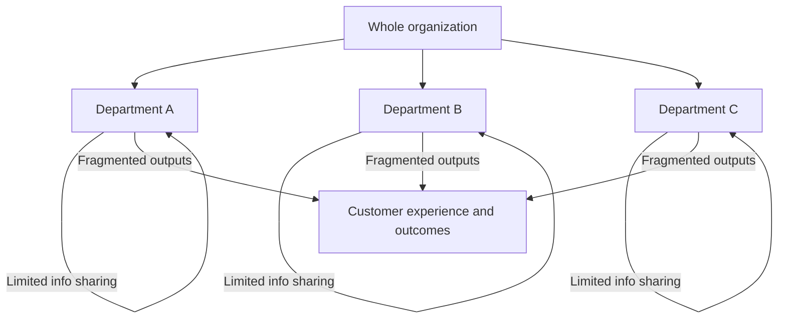

---
aliases:
  - siloed communication
  - Silos
  - Silo
date_created: 2026-06-15
date_modified: 2026-06-15
tags:
  - Organizational-Productivity
  - Organizational-Designs
  - Management-Strategies
  - Engineering-Management
  - Solutions-For-Scale
  - Lossless-Thinking
cf_last_run: 2026-06-15T19:10:20.346Z
cf_last_run_model: Perplexity sonar-pro
for_clients:
  - Param
  - Laerdal
  - Tonguc
site_uuid: dc6599ee-f57c-46f0-af3e-01238d7ba66e
publish: true
title: Organizational Silos
slug: organizational-silos
at_semantic_version: 0.0.1.1
---

[[concepts/Drag (on Productivity)|Drag (on Productivity)]]
[[concepts/Conway's Law|Conway's Law]]
[[Vocabulary/Digital Transformation|Digital Transformation]]

# Defining and Describing Organizational Silos

_Organizational silos are what happens when parts of a company become so focused on their own goals and data that they stop acting like one organization._

Organizational silos are **teams, departments, or business units that operate in isolation from the rest of the organization**, typically with their own goals, processes, tools, and information. [^q7dm7e] [^uf0ghe] [^l6rz5w] [^8mwspm] They arise when groups are “segmented off from the flow of information” in other parts of the business, leading to reduced collaboration, misaligned priorities, and duplicated work. [^uf0ghe] [^q7dm7e] Silos can be structural (org chart and reporting lines), informational (data and knowledge silos), cultural (us‑versus‑them mentality), or technological (disconnected systems). [^ja4ihz] [^q7dm7e] [^8mwspm] [^jm76z9] They matter because they “break collaboration, create bad data, and hurt customer experience,” directly undermining productivity, innovation, and organizational agility. [^q7dm7e] [^e06m20]

Organizational silos typically show up when companies grow, when functions specialize, or when incentives and tools are set up by department instead of end‑to‑end value streams. [^ja4ihz] [^q7dm7e] [^8mwspm] [^e06m20] They are sometimes intentionally created to protect focus or sensitive information, but in practice they often become “hidden barriers that drain productivity and stall growth.”[^ja4ihz] [^uf0ghe] Modern management, HR, and engineering leadership literature treats silo‑busting—through cross‑functional collaboration, shared systems of record, and integrated data—as a core capability of high‑performing organizations. [^ja4ihz] [^q7dm7e] [^uf0ghe] [^0yu7wt] [^e06m20]

# Uses in Context

- In everyday management language, **“organizational silos” describes isolated teams that hoard information and act independently**, such as when Twilio notes that silos occur when teams “operate in isolation… hoard information, use separate tools, and make decisions without visibility into what the rest of the company is doing.”[^q7dm7e]

- HR and people-operations content uses the term to highlight **barriers to collaboration and growth**, framing silos as “hidden barriers that drain productivity and stall growth” and calling for shared communication tools, standardized data, and 360‑degree feedback to reconnect teams. [^ja4ihz]

- Project and work‑management tools describe **siloed teams as those “segmented from the flow of information”** and prescribe central systems of record, transparent communication, and company‑wide goals as ways to “prevent harmful silos and encourage cross‑collaborative communication.”[^uf0ghe]

- Organizational development and mentoring providers define **organizational silos as “self-contained teams or departments that operate independently, with their own goals, objectives, and communication channels,”** emphasizing how this undermines knowledge sharing and career development. [^l6rz5w]

- Knowledge‑management practitioners extend the idea to **“knowledge silos,”** where “one individual or team holds information that’s not shared or distributed with others,” leading to duplicated work, inconsistent answers, and slower decision‑making. [^jm76z9]

- Lean and operational‑excellence experts use “organizational silos” when describing **local optimization and waste**, arguing that silos “create significant operational waste, leading to rework, fragmented customer experiences, and ‘local optimization’ where departments focus on their own metrics at the expense of the whole system.”[^e06m20]

# History of Use

## Origins

- The underlying **“silo” metaphor appears in management writing at least by the late 20th century**, drawing on the image of physical grain silos to describe departments that store resources separately and do not share them; contemporary definitions still echo this metaphor by emphasizing separation of “systems, processes, or information.”[^ja4ihz] [^8mwspm]  

- Modern HR and organizational‑development sources define **organizational silos** as a specific concept in business: “when a company has groups of experts separated by department, specialization, or location,” with limited information flow between them. [^8mwspm]  

- Corporate‑rebels style commentary and case‑based writing has popularized the term in critical narratives, for example claiming that “organizational silos killed the Titanic” because vital ice warnings were not shared across functions, illustrating the dangers of compartmentalized communication even in early 20th‑century organizations. [^7im3tr]

*(Most current treatments build on this metaphorical lineage rather than citing a single originating paper or book; contemporary articles standardize the definition but do not point to a definitive first use.)[^ja4ihz] [^q7dm7e] [^uf0ghe] [^8mwspm]*

## Evolution

- **1990s–2000s – From metaphor to structural critique:** As organizations grew more complex and matrixed, “silos” became a mainstream critical label for traditional function‑based structures, especially in management consulting and organizational‑change literature that emphasized cross‑functional processes and end‑to‑end value chains. [^8mwspm] [^e06m20]

- **2010s – Data and knowledge silos:** With widespread adoption of [[Vocabulary/SaaS|SaaS]] tools and departmental software stacks, discussion shifted from purely structural silos to **data silos**, where departments kept separate [[concepts/Explainers for Tooling/Databases|Databases]] and reporting metrics, and **knowledge silos**, where information was trapped in teams or individuals. [^2o5la3] [^q7dm7e] [^ja4ihz] [^jm76z9] Articles began tying silo‑busting to [[Vocabulary/Data Governance|Data Governance]], integration, and knowledge‑sharing platforms. [^q7dm7e] [^jm76z9]

- **2020s – Silo‑busting as a core capability:** Contemporary HR, collaboration, and operational‑excellence content treats breaking down organizational silos as a strategic imperative for customer experience, remote collaboration, and digital transformation, recommending systemic solutions such as cross‑functional collaboration rituals, “one central system of record,” and coordinated data governance across the enterprise. [^ja4ihz] [^q7dm7e] [^uf0ghe] [^e06m20]

# Best Real-World Examples

- [Asana](https://asana.com/resources/organizational-silos) — [[Tooling/Productivity/Workflow Management/Asana|Asana]] — Work‑management platform frequently cited as a “central system of record” to prevent harmful silos by connecting tasks, projects, and goals across teams. [^uf0ghe]

- [Twilio Segment](https://www.twilio.com/en-us/blog/insights/organizational-silos) — [[Tooling/Enterprise Jobs-to-be-Done/Segment|Segment]] — Customer data platform used as an example of integrating and centralizing data to break down data silos and support unified customer experience. [^q7dm7e]

- [Bloomfire](https://bloomfire.com/blog/knowledge-silos-in-workplace/) — Knowledge‑sharing platform that frames its value in terms of reducing “knowledge silos” by making institutional knowledge searchable and accessible. [^jm76z9]

- [Fuel50](https://fuel50.com/blog/how-to-break-organizational-silos/) — Talent‑marketplace and career‑pathing tool advocating visibility of skills and opportunities “across the organization” as a way to reduce siloed career paths and increase internal mobility. [^0yu7wt]

- [Chronus](https://chronus.com/blog/organizational-silo-busting) — Mentoring‑software provider highlighting mentoring programs as a mechanism for “breaking down organizational silos for better collaboration” between departments, seniority levels, and locations. [^l6rz5w]

- [Leanscape](https://leanscape.io/breaking-down-organization-silos-how-cross-functional-collaboration-is-the-key-to-operational-excellence) — Lean consultancy using cross‑functional collaboration practices and value‑stream thinking to show how removing organizational silos reduces operational waste and fragmented customer experiences. [^e06m20]

- [Paylocity](https://www.paylocity.com/resources/learn/articles/organizational-silos/) — HR and payroll platform using case‑style guidance for HR leaders on identifying silos via employee data, survey results, and lifecycle processes, then reconnecting them through shared tools and standardized metrics. [^ja4ihz]

# Case Studies

## Case Study 1: HR‑Led Silo Busting in a Growing Mid‑Size Company

An HR‑tech case example describes how HR leaders in a mid‑size organization used diagnostics and tooling to break down emerging silos as the company scaled. [^ja4ihz] Organizational silos had formed as “different parts of a business operate with their own specific systems, processes, or information,” with multiple teams maintaining their own versions of employee data and using incompatible tools. [^ja4ihz] HR started by asking targeted questions—such as whether “multiple teams work from their own version of employee data” and where survey data showed collaboration breakdowns—to pinpoint where silos were appearing across the employee lifecycle. [^ja4ihz]

Based on this assessment, they introduced **shared communication tools** to create “shared spaces for communication” so everyone could stay “on the same page” and connect in their daily workflows, reducing information hoarding by department. [^ja4ihz] They then **standardized metrics and data formats**, establishing clear rules for how data was collected, named, and formatted, including consistent date formats and performance measures, which improved interoperability and cross‑team reporting. [^ja4ihz] Finally, they **leveraged integrations** to keep data flowing across systems and implemented **360‑degree feedback** to break “cultural silos” by increasing transparency across roles and departments. [^ja4ihz] The case illustrates how HR can act as a cross‑organizational integrator, using both process and technology changes to dismantle silos that quietly accumulate during growth. [^ja4ihz]

## Case Study 2: Data Silos and Customer Experience in a Digital Business

A [[organizations/Twilio|Twilio]] Segment–based narrative shows how entrenched data silos can degrade customer experience and analytics quality, and how centralizing data helps. [^q7dm7e] [^2o5la3] The organization had separate tools and data stores by function—marketing, product, and support each collected and stored customer data independently, with teams “hoarding information, using separate tools, and making decisions without visibility into what the rest of the company is doing.”[^q7dm7e] This created inconsistent customer records, conflicting metrics, and an inability to see end‑to‑end journeys, a classic manifestation of organizational silos in data form. [^q7dm7e]

To address this, the company implemented a **data governance strategy**, defining common guidelines for how data was collected, accessed, and used so that a “single approach to data governance” replaced silo‑specific practices. [^q7dm7e] They then **integrated and centralized data**—capturing information from every storage tool, converting it into a single format, and making it accessible to analysis tools—effectively breaking down data silos through what Twilio describes as data orchestration. [^q7dm7e] [^2o5la3] With these silos removed, the organization could adopt a **customer data platform** as a central repository of first‑party data, enabling consistent segmentation and personalization across channels. [^q7dm7e] The case underscores how organizational silos in tooling and data structures can directly translate into poor customer experience, and how integrated data infrastructure becomes a lever for cultural as well as technical alignment. [^q7dm7e]

## Case Study 3: Siloed Operations and Systemic Failure – The Titanic Analogy

Corporate Rebels uses the Titanic disaster as a metaphorical case study of organizational silos and their potential for catastrophic outcomes. [^7im3tr] They argue that “organizational silos killed the Titanic,” noting that seven separate ice warnings were ignored or not properly acted upon because crucial information did not flow effectively between operational units, officers, and decision‑makers. [^7im3tr] In this narrative, each unit operated within its own remit and communication channel, leading to fragmented situational awareness despite multiple signals of danger. [^7im3tr]

The article contrasts this with “progressive organizations” that have learned from such failures by designing systems to ensure critical information crosses boundaries and is acted on jointly. [^7im3tr] Practices include cross‑functional coordination, shared dashboards, and cultural norms that encourage speaking up across hierarchy and function when risk is perceived. [^7im3tr] Although historical details are interpreted through a modern lens, the analogy powerfully illustrates the core idea behind organizational silos: when information and accountability are compartmentalized, even strong performance inside a silo can coincide with failure at the system level. [^7im3tr]

***

# Sources

[^ja4ihz]: [How HR Can Break Down Organizational Silos - Paylocity](https://www.paylocity.com/resources/learn/articles/organizational-silos/)
[^q7dm7e]: [Organizational silos in business: pros, cons & fixes | Twilio](https://www.twilio.com/en-us/blog/insights/organizational-silos)
[^7im3tr]: [Organizational silos: what the Titanic teaches us… | Corporate Rebels](https://www.corporate-rebels.com/blog/organizational-silos)
[^uf0ghe]: [Organizational silos: 4 common issues and how to prevent them](https://asana.com/resources/organizational-silos)
[^0yu7wt]: [Break Organizational Silos to Enhance Performance - Fuel50](https://fuel50.com/blog/how-to-break-organizational-silos/)
[^l6rz5w]: [Breaking Down Organizational Silos for Better Collaboration - Chronus](https://chronus.com/blog/organizational-silo-busting)
[^8mwspm]: [Silo Mentality: What Are Organizational Silos and Their Impact](https://helpjuice.com/blog/organizational-silos)
[^jm76z9]: [A Guide to Knowledge Silos in the Workplace - Bloomfire](https://bloomfire.com/blog/knowledge-silos-in-workplace/)
[^e06m20]: [How Cross-Functional Collaboration is the Key to Operational ...](https://leanscape.io/breaking-down-organization-silos-how-cross-functional-collaboration-is-the-key-to-operational-excellence)
[^2o5la3]: 2024, Oct. "[Breaking down data silos: What they are and how to eliminate them | Fullstory](https://www.fullstory.com/blog/breaking-down-data-silos/)". understanding what data silos are and how they impact your company. [Fullstory](https://www.fullstory.com).
