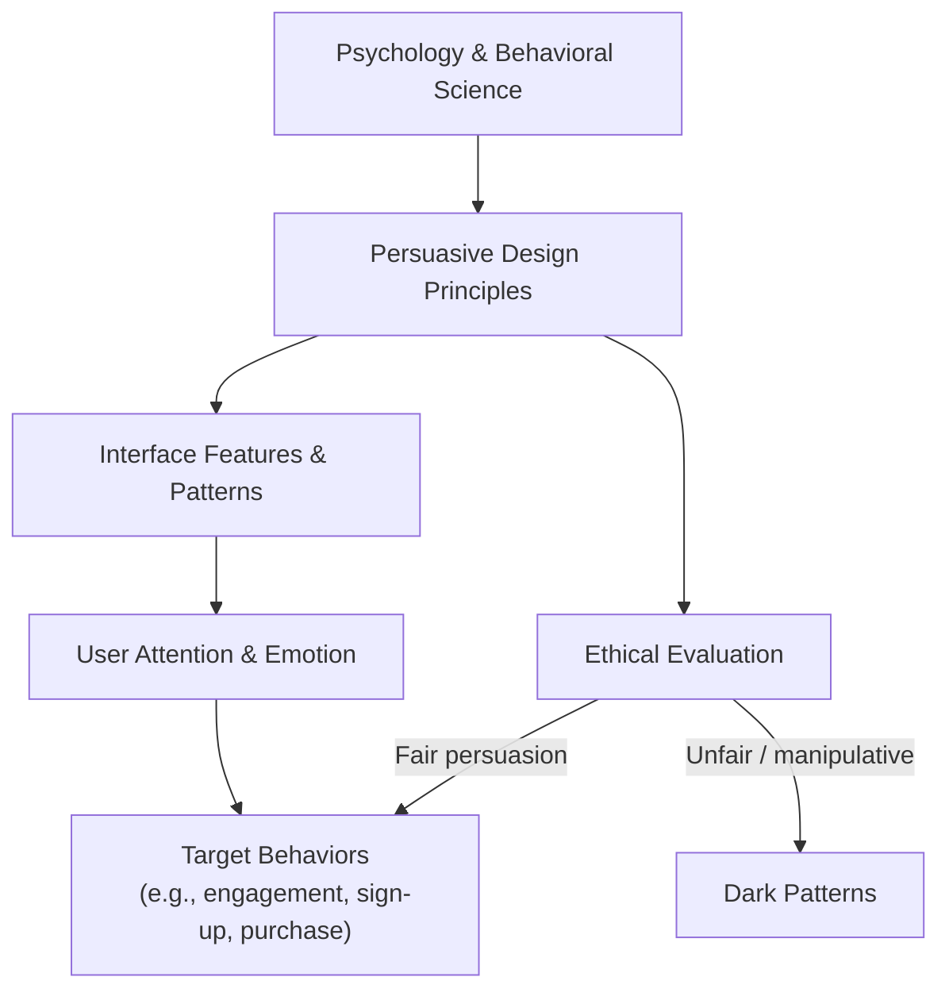

[[concepts/Persuasive Technology|Persuasive Technology]]
# Defining and Describing Persuasive Design

.webp)

_Design that doesn’t just look good but quietly **shapes what you do next** is what practitioners call persuasive design._

Persuasive design is a **design approach that intentionally guides users toward specific behaviours or decisions by tapping into psychological principles**, often through digital interfaces like apps, games, and websites. [^27hdhq] [^niy89y] It works by *incorporating subtle cues, such as colours, layout, messaging, and timing, that influence how users interact with digital products*. [^27hdhq] In UX and HCI, persuasive design is framed as a **method to change users’ attitudes, emotions, or behaviors**—for example, to reduce biases, encourage healthy habits, or keep people engaged longer. [^27hdhq] [^u31ft3] Because it sits at the intersection of psychology, technology, and ethics, it is both a powerful tool for “designing for impact” and a source of concern when it drifts into manipulation or “dark patterns.”[^niy89y] [^fx8rbu] [^y6hviq]

# Uses in Context

- In UX and product design, **persuasive design is explicitly defined as a “UX design method aimed at guiding user choices through an interface or digital product,” where “the aim is to persuade the user.”**[^niy89y] Teams use it when they want users to adopt a product, complete onboarding, or return frequently.

- In commercial digital products, practitioners describe it as **“features in digital apps or games that are intentionally created to keep users (in this case, children) engaged for longer… intended to capture and hold the user’s attention and make it hard to stop.”**[^y6hviq] This framing often appears in debates about screen time and “sticky” app mechanics for children.

- In HCI education and research, courses such as *Persuasive Design in HCI* at Carnegie Mellon University study “the design and evaluation of HCI technologies and environments that aim to change users’ attitudes, emotions, or behaviors,” including both “pitfalls and possibilities in designing for impact.”[^u31ft3]

- In critical and ethical design discourse, organizations concerned with digital ethics state that **“persuasive design is intrinsically a technique for manipulating the user,”** raising the question “is it legitimate for design to manipulate a user?” and linking persuasive design to attention design and dark patterns when persuasion becomes unfair. [^niy89y]

- In public-facing tech criticism and parenting advice, commentators describe “Persuasive Design Technology” as what makes it “such a struggle for parents to regulate screen time,” arguing that **loot boxes, autoplay, notifications, and infinite scroll** “work by lighting up the reward system in our brain” and significantly raising dopamine levels to keep people online. [^fx8rbu]

- In industry retrospectives, designers note a shift to adjacent labels, saying that **“today, the more useful version of this work is often called behavioral design: a way to align product experiences with the real drivers of human behavior”** while still relying on the same persuasive principles and techniques. [^1yvjb7]

# History of Use

## Origins

- The modern concept and term in HCI trace strongly to **BJ Fogg’s work at Stanford University**, where he founded the **Persuasive Technology Lab** (originally part of the Stanford captology program) and described his work as “design[ing] systems to influence human behavior.”[^fx8rbu] Popular accounts aimed at parents state that “Persuasive Design Technology was invented by a behavioral scientist at Stanford University named BJ Fogg,” who spent roughly ten years combining behavioral science with technology to “create apps that persuade and motivate us.”[^fx8rbu]

- Persuasive design as a design method is “largely rooted in **captology** (an acronym for *Computers As Persuasive Technology*),” an area BJ Fogg systematized in academic work around persuasive technologies. [^niy89y] Captology framed computers explicitly as tools for persuasion, and persuasive design emerged as the applied design practice drawing on those theories. [^niy89y]

*(Note: academic-origin details beyond these popular and practitioner descriptions come primarily from Fogg’s captology and persuasive technology publications, which underlie but are not fully quoted in these high-level sources.)*

## Evolution

- **Early 2000s–2010s – From persuasive technology to mainstream UX:** As captology moved from an academic niche into web and mobile product development, persuasive techniques (social proof, scarcity, commitment, triggers) were woven into everyday UX—login flows, notification systems, and engagement features—often without being explicitly labeled “persuasive design” in consumer products. [^27hdhq] [^niy89y]

- **2010s – Integration into HCI curricula and research:** Universities and HCI institutes began offering full courses on persuasive design, such as a project-based course on “technologies and environments that aim to change users’ attitudes, emotions, or behaviors,” with students building systems to “stimulate and sustain belief or behavior change.”[^u31ft3] This institutionalized persuasive design as a recognized subfield of HCI rather than just a marketing technique.

- **Late 2010s–2020s – Ethical critique, dark patterns, and rebranding as behavioral design:** Ethical design groups argued that persuasive design is “intrinsically a technique for manipulating the user,” distinguishing between benign attention design and unfair dark patterns when persuasion becomes deceptive. [^niy89y] At the same time, UX practitioners describe a shift where “the more useful version of this work is often called behavioral design,” emphasizing alignment with real human needs and distancing the practice from purely exploitative engagement-hacking. [^1yvjb7]

# Best Real-World Examples

- **[YouTube autoplay](https://sunnysideportland.org/2026/05/01/tech-tip-persuasive-design-and-why-its-so-sinister/)** – Autoplay that immediately queues the next video uses persuasive design to “make it such a struggle for parents to regulate screen time” by tapping into reward systems and reducing stopping points. [^fx8rbu]

- **[Infinite scroll in social media feeds](https://dl.acm.org/doi/10.1145/3719236.3719243)** – The endless feed and “scroll endlessly” pattern in social networks are cited as persuasive design features that repeatedly trigger the need to check notifications and likes, sustaining engagement. [^ls88lz]

- **[Loot boxes in video games](https://sunnysideportland.org/2026/05/01/tech-tip-persuasive-design-and-why-its-so-sinister/)** – Variable rewards and randomized “loot box” mechanics are used as persuasive design elements that “light up the reward system in our brain,” making games much harder to stop playing. [^fx8rbu]

- **[Children’s mobile apps studied in persuasive app design research](https://fluentresearch.com/persuasive-app-design-and-its-impact-on-children-rethinking-responsibility/)** – Experimental apps with systematically varied persuasive features (timers, rewards, prompts) show that such design “doesn’t make apps more appealing, they just make them harder to leave,” especially for children with lower self-regulation. [^y6hviq] [^n4y5dr]

- **[Behavioral-design–oriented product experiences described in Smashing Magazine](https://www.smashingmagazine.com/2026/03/persuasive-design-ten-years-later/)** – Contemporary digital products that “align product experiences with the real drivers of human behavior” use persuasive patterns like social proof, framing, and commitment to help users build habits, often discussed under the umbrella of behavioral design. [^1yvjb7] [^27hdhq]

- **[Persuasive Design in HCI student projects](https://www.hcii.cmu.edu/course/persuasive-design-hci)** – HCI students prototype and evaluate systems intended to “stimulate and sustain belief or behavior change” (e.g., encouraging healthy or prosocial behaviors), explicitly applying persuasive design frameworks in controlled environments. [^u31ft3]

# Case Studies

## Persuasive App Design and Children’s Ability to Disengage

A research collaboration summarized by Fluent Research examined how **persuasive design features in children’s apps affect their ability to stop playing**, focusing on interactions with self-regulation. [^y6hviq] In this study—described as “first-of-its-kind” in the academic article it reports on—researchers built or selected apps that varied in **low, moderate, and high levels of persuasive design**, such as reward structures and prompts intended “to keep users (in this case, children) engaged for longer.”[^y6hviq] [^n4y5dr] Children’s self-regulation abilities were measured, and their disengagement from different app versions was observed.

The findings show that **children liked the apps equally, regardless of the number of persuasive design features**, implying that high persuasive design doesn’t make apps more fun, but “just makes them harder to leave.”[^y6hviq] Children with high self-regulation could disengage “consistently, regardless of whether the app employed low, moderate, or high PD,” but children with low self-regulation “disengaged more easily from low-PD apps” and “took significantly longer and needed more support” when using apps with moderate or high persuasive design. [^y6hviq] The lead researcher emphasized that “if persuasive features override a child’s available strategies and capacities, then the child is no longer in control.”[^y6hviq] This case illustrates how persuasive design can differentially affect vulnerable users and supports regulatory and ethical arguments that developers do not need manipulative features to create enjoyable products. [^y6hviq]

## Persuasive Patterns in Social Media: Notifications and Endless Scrolling

A critical design project documented in an ACM paper investigated **persuasive patterns embedded in social media**, particularly features that “trigger the need to check notifications and ‘likes,’ as well as to scroll endlessly.”[^ls88lz] The researchers analyzed common interface elements in major social networks—such as badge notifications, like counters, and infinite scroll—and framed them as persuasive design patterns that structurally encourage frequent checking and prolonged engagement. [^ls88lz] Rather than simply cataloging patterns, the project used critical design methods to provoke reflection on how these persuasive features shape everyday behavior.

The project showed that the **combination of intermittent social rewards (likes, comments) and the absence of natural stopping cues (through infinite scroll)** keeps users in a loop of checking and scrolling, which aligns with descriptions from public critics that these patterns “light up the reward system in our brain” and make screen time hard to regulate. [^ls88lz] [^fx8rbu] By framing these elements explicitly as persuasive design, the work highlights the gap between seemingly neutral UI choices and their behavioral consequences. It also demonstrates how designers and researchers outside large incumbents can surface and critique entrenched engagement patterns, contributing to ongoing calls for more ethical or “humane” alternatives to persuasive design. [^niy89y] [^ls88lz]

## From Persuasive Design to Behavioral Design in Practice

An article in Smashing Magazine reflects on **“Persuasive Design: Ten Years Later,”** noting that practitioners increasingly use the term **behavioral design** as “the more useful version of this work,” defined as a way to “align product experiences with the real drivers of human behavior.”[^1yvjb7] The author, writing from long-term practice rather than a big-tech marketing perspective, describes how early enthusiasm for persuasive design—focused on getting users to click, sign up, or stay longer—evolved into a more nuanced approach that emphasizes desired outcomes for both users and organizations. [^1yvjb7] This includes using principles like social proof, framing, and commitment not only to drive engagement but to support beneficial behavior changes, such as healthier habits or better financial decisions. [^1yvjb7] [^27hdhq]

The narrative explains that while the **underlying psychological mechanisms and interface tactics remain similar**, the framing shift from “persuasive” to “behavioral” design reflects practitioner awareness of the ethical pitfalls identified by critics who argue that persuasive design is “intrinsically a technique for manipulating the user.”[^niy89y] [^1yvjb7] By centering the *fit* between human motivations and product goals, this case shows one way the field is attempting to preserve the constructive potential of persuasive design (e.g., designing for impact in health or prosocial behavior) while distancing itself from exploitative engagement-hacking and dark patterns. [^u31ft3] [^niy89y] [^1yvjb7]

***

# Sources

[^27hdhq]: [Persuasive design: shaping user decisions in the digital world](https://www.future-processing.com/blog/persuasive-design/)
[^niy89y]: [Persuasive design / Topics / Designers Éthiques](https://designersethiques.org/en/topics/persuasive-design)
[^u31ft3]: [Persuasive Design in HCI - Human-Computer Interaction Institute](https://www.hcii.cmu.edu/course/persuasive-design-hci)
[^fx8rbu]: [Tech Tip: Persuasive Design and Why It's So Sinister](https://sunnysideportland.org/2026/05/01/tech-tip-persuasive-design-and-why-its-so-sinister/)
[^y6hviq]: [29 Aug Persuasive App Design and its Impact on Children](https://fluentresearch.com/persuasive-app-design-and-its-impact-on-children-rethinking-responsibility/)
[^n4y5dr]: [Effects of Persuasive App Design and Self‐Regulation on Young ...](https://onlinelibrary.wiley.com/doi/full/10.1155/hbe2/8187768)
[^ls88lz]: [A Critical Design Project on Persuasive Patterns in Social Media](https://dl.acm.org/doi/10.1145/3719236.3719243)
[^1yvjb7]: [Persuasive Design: Ten Years Later - Smashing Magazine](https://www.smashingmagazine.com/2026/03/persuasive-design-ten-years-later/)
