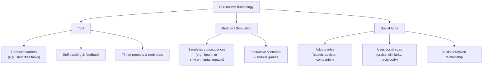

Developed at [[organizations/Stanford University|Stanford University]] by [[Sources/People/B.J. Fogg|B.J. Fogg]], evolved into the [[organizations/Stanford Persuasive Technology Institute]]

Discusses [[Reputation Systems]]. 

[[Sources/Books/Hooked|Hooked]]

# Defining and Describing Persuasive Technology

_Persuasive technology is digital or computational technology deliberately designed to change what people think or do, without using force or deception._

Persuasive technology is generally defined as **interactive systems that aim to influence attitudes or behaviors without coercion**, often through tailoring, feedback, reminders, and social cues. [^q3fiys] Oinas-Kukkonen and Harjumaa describe *persuasive technology (PT)* as “technology that attempts to influence people’s behaviour without coercion.”[^q3fiys] Drawing on B.J. Fogg’s foundational work in *Persuasive Technology: Using Computers to Change What We Think and Do*, the field studies how computers, apps, and other digital artifacts can function as **tools, media, or social actors** to shape decisions and habits. [^uw0920] [^vqllo9] It matters because such systems underlie health apps, learning platforms, social media, and many AI-driven services, raising both powerful opportunities for positive behavior change and serious ethical concerns. [^uw0920] [^q3fiys] [^wsfx6a]

# Uses in Context

- In **behavior-change interventions**, persuasive technologies are widely used to help people meet “various types of behavioural goals,” especially in domains like health, environment, and lifestyle, where they “help users meet various types of behavioural goals” and do so “without coercion.”[^q3fiys]

- In **personalized digital coaching**, next‑generation systems “dynamically adapt to users’ needs, contexts, and preferences,” moving from static rule-based nudges to AI-driven interactions that adjust messages, timing, and difficulty to sustain engagement. [^q3fiys] [^wsfx6a]

- In **commercial and public communication**, university courses describe persuasive technologies as the “strategic use of technologies to affect attitudes, beliefs and behaviors,” asking questions like “How does Facebook make you buy more products? Do fitness trackers help people lose weight?”[^cqr9c0]

- In **personalization research**, recent work reviews “personalised persuasive technologies (PTs)” that build static or dynamic user profiles and deliver “three types of personalised interventions: personalised goals, personalised messages, or personalised timing of reminders.” [^q3fiys]

- In **critical design and HCI scholarship**, researchers analyze “digital persuasive technologies” and “persuasive patterns in social media” to understand how interface features are deliberately crafted to steer attention, engagement, or disclosure. [^2ar53b]

# History of Use

## Origins

- The modern field of persuasive technology is closely associated with **B.J. Fogg**, whose 2003 book *Persuasive Technology: Using Computers to Change What We Think and Do* posed questions such as: “Can computers change what you think and do? Can they motivate you to stop smoking, persuade you to buy insurance, or convince you to join the Army?” [^vqllo9] This work framed computers as actively persuasive agents rather than neutral tools. [^vqllo9]

- Fogg also introduced **“captology”** (an acronym from *Computers As Persuasive Technologies*) as a research area focused on “the birth of ‘Captology’—the study of computers as persuasive technologies,” emphasizing systems where “the technology itself… becomes the persuasive force” and “isn’t just delivering persuasion… [but] actively executing a persuasive strategy.”[^uw0920]

- Later definitional refinement came from **Oinas-Kukkonen & Harjumaa (2008)**, who characterized persuasive technology as “technology that attempts to influence people’s behaviour without coercion,” providing a widely cited formal definition in behavior-change and HCI research. [^q3fiys]

## Evolution

- **2000s – From concept to early systems:** Following Fogg’s early work, persuasive technology moved from theoretical framing into experimental systems in HCI, with computers conceptualized in a “functional triad” as **tools, media, and social actors** that can reduce barriers, simulate outcomes, and use social cues like praise or reciprocity to influence users. [^uw0920]

- **2010s – Health and ubiquitous computing:** Persuasive technology became “a growing area of research within HCI and ubiquitous computing,” particularly “to motivate healthy behavior,” coinciding with the emergence of commercial wearable trackers and mobile health apps as real-world testbeds. [^qqz704]

- **2013–2024 – Personalisation and multi-domain use:** A systematic review of 56 publications between 2013 and 2024 documents how persuasive technologies have become increasingly **personalised**, building user profiles and employing combinations of behavior-change techniques (such as self-monitoring) across domains like health, sustainability, and finance. [^q3fiys]

- **2020s – Human–AI and adaptive systems:** Recent calls for “next-generation persuasive technologies for human–AI interaction and behavior change” describe an evolution from simple behavior-change tools to “complex, interactive systems that dynamically adapt to users’ needs, contexts, and preferences,” integrating explainability and affective computing. [^wsfx6a] [^q3fiys]

# Best Real-World Examples

- **[Fitbit](https://www.fitbit.com)** – Commercial wearable devices that exemplify persuasive technology “to motivate healthy behavior,” using self-monitoring, feedback, and reminders to nudge activity and sleep habits. [^qqz704] [^q3fiys]

- **[MyFitnessPal](https://www.myfitnesspal.com)** – A diet and activity tracking app that uses self-monitoring, goal-setting, and feedback—techniques identified as common in personalised persuasive technologies—to support weight management and healthier eating. [^q3fiys]

- **[Zombies, Run!](https://zombiesrungame.com)** – A gamified fitness app that uses story-based simulation and interactive missions, reflecting persuasive media’s ability to provide “vicarious experience” and demonstrate cause and effect to motivate running behavior. [^uw0920]

- **[Forest](https://www.forestapp.cc)** – A focus app that employs timeboxing, progress visualization, and mild loss aversion (a tree dies if you leave) as persuasive patterns to reduce phone distraction and encourage sustained attention. [^2ar53b]

- **[Opower](https://www.oracle.com/utilities/opower/)** – Utility reports and digital dashboards that use social comparison (showing neighbors’ energy use) as a persuasive pattern to promote energy conservation, aligning with research on persuasive feedback and social proof. [^uw0920] [^wsfx6a]

- **[Smoke-free mobile cessation apps](https://smokefree.gov/tools-tips/apps)** – Health-focused persuasive technologies that combine reminders, tailored messages, and self-monitoring to support smoking cessation, illustrating PT in public health interventions. [^q3fiys] [^qqz704]

- **[Recycling & sustainability feedback platforms](https://www.frontiersin.org/research-topics/75786/next-generation-persuasive-technologies-for-human-ai-interaction-and-behavior-changeundefined)** – Systems that provide feedback on recycling or energy-saving behaviors, using simulations and timely prompts to promote pro-environmental actions. [^wsfx6a] [^q3fiys]

# Case Studies

**1. Wearable activity trackers as large-scale persuasive health technologies**

With the rise of consumer wearables in the 2010s, commercial activity trackers became a prominent real-world instantiation of persuasive technology “to motivate healthy behavior,” and were recognized as a growing area within HCI and ubiquitous computing. [^qqz704] Devices such as fitness bands and smartwatches embed multiple persuasive design elements identified in the literature: **self-monitoring** of steps and sleep, real-time feedback, goal setting (e.g., daily step targets), and reminders or prompts delivered at opportune times, all techniques highlighted as common in personalised persuasive technologies. [^q3fiys] [^qqz704] Studies and marketplace adoption demonstrate that these systems can increase physical activity and awareness, but they also surface issues around long-term adherence, over-reliance on extrinsic feedback, and data privacy, illustrating both the potential and the ethical complexity of persuasive technology in everyday life. [^q3fiys] [^qqz704] [^wsfx6a]

**2. Personalized persuasive systems and adaptive behavior-change support**

A recent review of 56 publications from 2013–2024 on **personalised persuasive technologies** shows how PT has evolved from one-size-fits-all systems to finely tuned, adaptive interventions. [^q3fiys] These systems build **static or dynamic user profiles** and then deliver one or more of three intervention types: “personalised goals, personalised messages, or personalised timing of reminders,” allowing the technology to adjust difficulty, tone, and schedule to each individual’s context and responsiveness. [^q3fiys] The review reports that personalised technologies were generally **more effective than one-size-fits-all**, often combining multiple behavior-change techniques, with self-monitoring as the most common, and that users not only evaluated personalization positively but “wanted to know how it was achieved” and appreciated **empathetic support** when they failed to meet goals. [^q3fiys] This case shows persuasive technology moving toward **human–AI interaction**, where algorithmic adaptation, explainability, and affective computing become central design concerns. [^q3fiys] [^wsfx6a]

**3. Next-generation persuasive technologies in human–AI interaction**

As AI capabilities expanded, researchers began framing “next-generation persuasive technologies for human–AI interaction and behavior change,” emphasizing a shift from simple, rule-based nudges to “complex, interactive systems that dynamically adapt to users’ needs, contexts, and preferences.”[^wsfx6a] These systems might leverage machine learning to detect when a user is most receptive, adjust messaging strategies over time, and coordinate multiple channels (mobile, wearables, conversational agents) to sustain engagement in areas like health, sustainability, or education. [^wsfx6a] [^q3fiys] At the same time, there is a growing call for **practical design considerations** to integrate explainability—so users understand why they are being nudged—and affective computing, so systems can respond with empathy when users struggle, reflecting user feedback that they value transparency and supportive, non-judgmental responses. [^q3fiys] [^wsfx6a] This trajectory highlights how persuasive technology has become bound up with broader debates about AI ethics, autonomy, and the governance of algorithmic influence.

***

# Sources

[^uw0920]: [Persuasive Technology by B.J. Fogg: The Psychology of How Tech ...](https://www.youtube.com/watch?v=NoGVYxPJem4)
[^q3fiys]: [Personalising persuasive technologies for behaviour change](https://academic.oup.com/iwc/advance-article/doi/10.1093/iwc/iwag006/8514182)
[^cqr9c0]: [CMN 178: Persuasive Technologies - Communication - UC Davis](https://communication.ucdavis.edu/cmn-178-persuasive-technologies)
[^wsfx6a]: [Next-Generation Persuasive Technologies for Human–AI Interaction ...](https://www.frontiersin.org/research-topics/75786/next-generation-persuasive-technologies-for-human-ai-interaction-and-behavior-changeundefined)
[^2ar53b]: [A Critical Design Project on Persuasive Patterns in Social Media](https://dl.acm.org/doi/10.1145/3719236.3719243)
[^qqz704]: [Persuasive technology in the real world - ACM Digital Library](https://dl.acm.org/doi/10.1145/2556288.2557383)
[^vqllo9]: [Persuasive Technology - 1st Edition | Elsevier Shop](https://shop.elsevier.com/books/persuasive-technology/fogg/978-1-55860-643-2)
