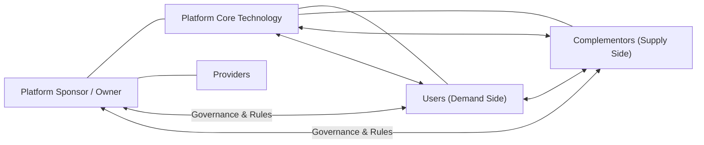

# Defining and Describing Platform Ecosystems

*_A platform ecosystem is a digital meeting ground where many independent actors build, transact, and innovate on top of a shared foundation, creating value for each other as much as for the platform itself._*

A platform ecosystem is “a complex system within which different actors interact with each other through a platform in order to create value.”[^3ap2c4] In the strategy literature, a business platform is defined as “a set of products, services, or technologies… that form a technological basis on which other companies can develop complementary services, products, and technologies, generating potential network effects.”[^3ap2c4] Platform ecosystems matter because they turn linear product businesses into multi‑sided value networks where users, partners, and developers co‑create offerings and reinforce each other’s participation. [^3ap2c4] [^nvr2p8] [^u1760e]

In a typical digital platform ecosystem, the main players include the **sponsor (or owner)**, who holds key IP rights and sets membership rules; the **provider**, who offers the main technologies and acts as a point of contact; **users** on the demand side; and **complementors** on the supply side, who “develop content and apps complementary to the platform” via its interfaces. [^3ap2c4] These ecosystems are often discussed as a specific type of **digital ecosystem**, a “dynamic, interconnected network of technologies, platforms, services, and participants – organizations, partners, and users.”[^ldfcg9]

---

# Uses in Context

- **Digital business strategy and “platform thinking.”** Companies use “platform ecosystems” to describe a shift from a linear value chain (“you build → you sell → customers use”) to “a multi-sided value network” where partners and customers “build, connect, and grow atop shared foundations.”[^nvr2p8]  
- **Multi‑sided market design.** Strategy and innovation guides invoke the term when explaining how a platform connects different market sides (buyers, sellers, developers) and must solve the “chicken and egg problem” where sellers will not join without buyers and buyers hesitate to join without sufficient offerings. [^3ap2c4]  
- **Architecture and API strategy.** In software design, platform ecosystems are used to justify modular, “API-driven systems” where microservices, APIs, and secure multi-tenant infrastructure allow external developers to “plug into these components, extend them, or even create new ones.”[^nvr2p8]  
- **Digital transformation and industry “super platforms.”** Business articles describe “super platform ecosystems” as “giants that have reshaped how we live and work,” encompassing multiple platforms, services, and devices in one sprawling network. [^g95ze5]  
- **Management and ecosystem theory.** Academic work speaks of “digital platform ecosystems” as an “omnipresent phenomenon that challenges incumbents by changing how we consume and provide digital products and services.”[^u1760e] Recent research extends this to “inter-platform ecosystems” where different platforms become complementors to each other. [^ee01a0]  

---

# History of Use

## Origins

- The *ecosystem* metaphor in business strategy is rooted in James F. Moore’s early 1990s work on “business ecosystems,” which framed firms as co‑evolving communities rather than isolated competitors. [^u1760e]  
- The specific concept of **digital platform ecosystems** was elaborated in information systems and management research in the 2000s and early 2010s; a synthesis from the University of St. Gallen describes “digital platforms” as an “omnipresent phenomenon” reshaping provision and consumption of digital products and services and explicitly analyzes “digital platform ecosystems.”[^u1760e]  
- Platform ecosystem discussions draw on earlier economic work on **two‑sided or multi‑sided markets**, where a platform intermediates between distinct user groups and generates cross‑side network effects; this economic framing underlies modern definitions that emphasize complementors and network effects. [^3ap2c4] [^u1760e]  

Given the terminology and referencing patterns, the “platform ecosystem” label itself appears to have crystallized in academic and practitioner strategy discourse rather than being coined by a single large incumbent vendor, building on independent research in platform economics and digital ecosystems. [^u1760e] [^ldfcg9]

## Evolution

- **2000s–early 2010s – From platforms to platform ecosystems.** As software platforms became central in industries like mobile and enterprise software, researchers and practitioners shifted from speaking of a single “platform” to “platform ecosystems” that explicitly include sponsors, providers, users, and complementors, all interacting through the platform to “create and exchange value.”[^3ap2c4] [^u1760e]  
- **Mid‑2010s – Digital platform ecosystems as a competitive threat to incumbents.** Systematic reviews describe digital platforms as challenging incumbents by changing “how we consume and provide digital products and services,” highlighting how ecosystem dynamics—especially complementor innovation—erode traditional linear business models. [^u1760e] [^ldfcg9]  
- **2020s – Inter‑platform ecosystems and “super platforms.”** New research introduces “inter-platform ecosystems,” in which platforms become complementors to each other, extending ecosystem theory beyond a single focal platform. [^ee01a0] In parallel, business commentators describe “super platform ecosystems” as conglomerations of multiple platforms and devices that dominate usage across domains. [^g95ze5]  

---

# Best Real-World Examples

- **[Shopify](https://www.shopify.com/blog/digital-ecosystem)** – An e‑commerce platform that has evolved into a digital ecosystem of merchants, app developers, and service providers, often cited as a core component of broader retail “digital ecosystems.”[^nvr2p8] [^g95ze5]  
- **[Twilio](https://jetsoftpro.com/blog/platform-thinking-ecosystem-strategy/)** – A communications API company that exemplifies platform thinking, exposing modular services (SMS, voice, auth) via APIs so external developers can build diverse applications, forming a developer‑centric ecosystem. [^nvr2p8]  
- **[Salesforce AppExchange](https://jetsoftpro.com/blog/platform-thinking-ecosystem-strategy/)** – A marketplace where independent software vendors and partners build and distribute apps atop Salesforce’s CRM platform, supported by revenue‑sharing and governance models typical of platform ecosystems. [^nvr2p8]  
- **[AWS Marketplace](https://jetsoftpro.com/blog/platform-thinking-ecosystem-strategy/)** – A cloud platform marketplace where third‑party software providers offer services atop AWS infrastructure, illustrating ecosystem enablement through APIs, multi‑tenant infrastructure, and governance layers. [^nvr2p8]  
- **[Healthcare API platforms aligning with HIPAA](https://jetsoftpro.com/blog/platform-thinking-ecosystem-strategy/)** – Sector‑specific platform ecosystems where compliance (e.g., HIPAA) is built into the platform from “day one,” enabling an ecosystem of healthcare apps and integrations under strict regulatory constraints. [^nvr2p8]  
- **[Fintech platforms conforming to PSD2, PCI DSS, or GDPR](https://jetsoftpro.com/blog/platform-thinking-ecosystem-strategy/)** – Financial platforms that open APIs to third‑party developers while meeting regulations like PSD2 and PCI DSS, enabling innovation partners and service partners to build new financial services on top. [^nvr2p8]  

---

# Case Studies

## From Product to Platform Ecosystem: A Modular SaaS Vendor’s Transition

A common platform ecosystem story is the evolution of a standalone SaaS product into a multi‑sided ecosystem through deliberate architectural and strategic changes. One widely described path involves four phases: **core stabilization**, **API enablement**, **ecosystem enablement**, and **governance and monetization**. [^nvr2p8] In the first phase, the company refactors its product into “modular, API-driven systems” using microservices, containerization (e.g., Docker/Kubernetes), and CI/CD pipelines to ensure scalability and maintainability. [^nvr2p8]  

Once the core is stable, the firm **exposes core services through public or partner APIs**, investing in developer experience via clear documentation, SDKs, sandbox environments, and versioned APIs. [^nvr2p8] This API enablement invites external developers to start integrating but does not yet constitute a full ecosystem. The pivot comes with **ecosystem enablement**, where the company builds tools like marketplaces or app stores, defines revenue‑sharing models, and launches developer portals so partners can “create value” on top of the platform. [^nvr2p8] Finally, the firm formalizes **governance and monetization**, defining onboarding policies, data usage rules, and compliance, and deciding whether APIs will be free or monetized, often with tiered access plans. [^nvr2p8] This staged path illustrates that platform ecosystems are outcomes of deliberate product, architecture, and governance choices, not just of having an API.

## Solving the “Chicken and Egg” Problem in a New Platform Ecosystem

New platforms face a classic “chicken and egg problem”: “a platform cannot acquire sellers if there are no customers on it and… it is unlikely that a buyer will use it if there is not a sufficient variety of offers.”[^3ap2c4] A typical strategy, described in platform‑building guides, is to **subsidize or otherwise incentivize one side of the market**—for example, offering low fees, marketing support, or development grants to early complementors so they populate the platform with attractive offerings. [^3ap2c4] The platform sponsor first **identifies the sides of the market to be connected** (e.g., users vs. complementors) and then decides which side to seed with targeted incentives. [^3ap2c4]  

As the ecosystem grows, the sponsor also designs a “business model that revolves around a collaborative governance model between all parties involved” and establishes clear “rules of participation” for all actors. [^3ap2c4] This includes membership requirements, internal rules, and mechanisms for resolving disputes or removing bad actors, ensuring that value exchanges among users and complementors remain attractive. [^3ap2c4] The case of solving the chicken‑and‑egg problem thus shows how platform ecosystems depend not just on technology but on market design, incentives, and governance structures.

## Inter‑Platform Ecosystems: Platforms as Each Other’s Complementors

Recent research introduces the notion of **inter‑platform ecosystems**, where platforms themselves act as complementors to other platforms rather than merely hosting complementors. [^ee01a0] In such settings, a platform may provide services via APIs or integrations to another platform (for instance, a payments platform embedded in a commerce platform), creating a higher‑order ecosystem in which multiple platforms are interconnected and mutually reinforcing. [^ee01a0] [^nvr2p8] This extends traditional ecosystem theory, which typically centers on a single focal platform sponsor and its direct complementors, to configurations where several platforms co‑evolve and co‑create value together. [^ee01a0] [^u1760e]  

By examining how governance, value sharing, and technical integration work across multiple platforms, inter‑platform ecosystem cases highlight the growing complexity of digital business environments. They also show that many modern digital ecosystems are not isolated “walled gardens” but part of broader digital and data ecosystems—“dynamic, interconnected network[s] of technologies, platforms, services, and participants” that span organizational boundaries. [^ldfcg9] [^ee01a0]

***

# Sources

[^3ap2c4]: [Platform ecosystem: complete guide to digital ecosystems | B‑PlanNow](https://b-plannow.com/en/platform-ecosystem-digital-ecosystems-between-theory-and-real-life-cases/)
[^nvr2p8]: [Platform Thinking: How Products Evolve into Scalable Ecosystems](https://jetsoftpro.com/blog/platform-thinking-ecosystem-strategy/)
[^ee01a0]: [Inter‐platform ecosystems - Carballa‐Smichowski - SMS](https://sms.onlinelibrary.wiley.com/doi/10.1002/smj.70070)
[^u1760e]: [[PDF] Digital platform ecosystems - Alexandria (UniSG)](https://alexandria.unisg.ch/bitstreams/75a6c644-fc8f-4d7f-8288-e43870c5edb5/download)
[^ldfcg9]: [What is a Digital Ecosystem? - Torry Harris Integration Solutions](https://www.torryharris.com/ae-en/insights/articles/digital-ecosystem)
[6]: [Types Of Platforms: Design The Right One! - Dr Gary Fox](https://www.garyfox.co/types-of-platforms/)
[^g95ze5]: [Digital Ecosystem: 2026 Guide to Business Networks - Shopify](https://www.shopify.com/blog/digital-ecosystem)
[8]: [What Is a Data Ecosystem? - Salesforce](https://www.salesforce.com/data/data-ecosystem/)
