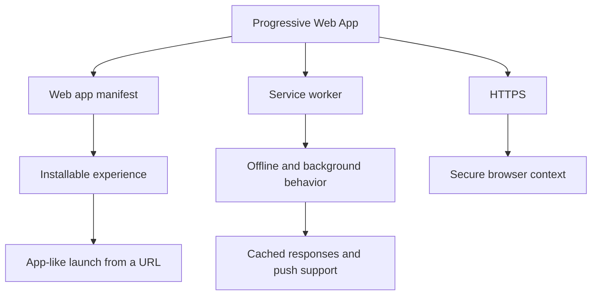

---
aliases:
  - PWAs
  - PWA
date_created: 2026-08-23
date_modified: 2026-08-23
site_uuid: 2802d9f7-b0dc-4a43-92c7-b2be3689cd26
publish: true
title: Progressive Web Apps
slug: progressive-web-apps
at_semantic_version: 0.0.0.5
cf_last_run: 2026-08-23T04:12:23.527Z
cf_last_run_model: Perplexity sonar-pro
tags:
  - Web-Development
  - Frontend-Development
  - Market-Standard-Practices
  - Software-Development
  - Technology-Trends
---

# Defining and Describing Progressive Web Apps

- _Progressive Web Apps are a way to make a website behave more like an installable app without giving up the reach of the web._ [^oym6q3] [^cy2t4b] [^lm12k4]
- Progressive Web Apps, or PWAs, are commonly described as combining a **web app manifest** for installability, a **service worker** for offline and background behavior, and **HTTPS** for secure operation. [^cy2t4b] [^84ph20] [^n7g97g]
- They matter because they let a site offer app-like features such as home-screen installation, offline access, push notifications, and a standalone launch experience while still being delivered through a URL. [^cy2t4b] [^lm12k4] [^84ph20]

- 

# Uses in Context

- PWAs are used to describe websites that can be installed like apps and opened from a device’s home screen. [^cy2t4b] [^lm12k4] [^n7g97g]
- The term is often invoked when a product supports offline use through caching and service workers. [^cy2t4b] [^84ph20] [^n7g97g]
- It is also used for web products that provide push notifications and background synchronization. [^cy2t4b] [^84ph20] [^hn5ohg]
- In product and design discussions, PWAs are framed as a way to reduce dependence on app stores while still offering a native-like experience. [^lm12k4] [^3u95a7]
- In technical guides, the phrase is tied to a specific stack: manifest, service worker, and secure origin. [^cy2t4b] [^84ph20] [^n7g97g]

# History of Use

## Origins

- One widely repeated origin account says Alex Russell coined the term **“Progressive Web Apps”** in 2015, describing a new class of web pages meant to match native apps in responsiveness, discoverability, performance, and user experience. [^oym6q3]
- Another account says the concept was jointly proposed in 2015 by **Alex Russell** and designer **Frances Berriman**. [^3u95a7]
- The origin framing in later guides centers on the same idea: a web-first app model that adds installability and offline behavior on top of a normal website. [^oym6q3] [^cy2t4b] [^3u95a7]

## Evolution

- **2015:** The concept is presented as a new class of web experience that should progressively enhance from basic web pages toward app-like behavior. [^oym6q3] [^3u95a7]
- **Later years:** The definition becomes more operationalized around the trio of **manifest**, **service worker**, and **HTTPS**, especially in implementation guides and developer documentation. [^cy2t4b] [^84ph20] [^n7g97g]
- **Recent guides:** PWAs are increasingly described in practical terms such as offline-first browsing, app installability, and background capabilities like push handling and sync. [^cy2t4b] [^84ph20] [^hn5ohg]

# Best Real-World Examples

- [Wikipedia](https://www.wikipedia.org/) — commonly used as a canonical large-scale web app example with offline and app-like access patterns in PWA discussions. [^lm12k4] [^84ph20]
- [Twitter Lite](https://x.com/) — often cited in PWA discussions as an early high-profile web experience emphasizing speed and mobile usability. [^lm12k4] [^3u95a7]
- [Pinterest](https://www.pinterest.com/) — frequently referenced in PWA writeups for app-like engagement on the web. [^lm12k4] [^3u95a7]
- [Uber](https://www.uber.com/) — used in PWA examples to show how a web app can offer mobile-friendly access with reduced friction. [^lm12k4] [^3u95a7]
- [Spotify](https://www.spotify.com/) — invoked in PWA discussions as an example of a rich, app-like browser experience. [^lm12k4] [^84ph20]
- [PWABuilder](https://www.pwabuilder.com/) — a tooling example that helps existing websites become installable PWAs. [^1dq8rz]
- [Workbox](https://developer.chrome.com/docs/workbox/) — a service worker library associated with PWA implementation and caching strategies. [^hpxbk4] [^84ph20]

# Case Studies

Twitter Lite is one of the most cited PWA case studies because it showed how a web product could be redesigned around speed, mobile usability, and app-like behavior without relying solely on a native app distribution model. Later PWA guides use it as shorthand for the idea that a well-built web app can feel “native” while remaining accessible through a URL. [^lm12k4] [^3u95a7]

Pinterest is another common case study in PWA writing because it exemplifies how a content-heavy service can use web capabilities to improve engagement and responsiveness on mobile devices. In PWA discussions, Pinterest is used to show that the model is not limited to simple brochure sites; it can support large, dynamic products that benefit from offline-aware caching and installability. [^lm12k4] [^3u95a7]

Wikipedia appears in PWA-oriented examples because it illustrates the value of offline access and lightweight installation for an information service. In practice, it shows what PWAs are best at: giving a familiar website app-like persistence and reach, especially for reading and repeat use in low-connectivity settings. [^lm12k4] [^84ph20]

***

# Sources

[^oym6q3]: [What Is a PWA? Capabilities, Benefits, Examples](https://www.iwdagency.com/blogs/news/what-is-pwa/)
[^hpxbk4]: [PWA Complete Guide 2025: Native-Quality Web Experiences](https://www.youngju.dev/blog/culture/2026-03-24-pwa-progressive-web-apps-complete-guide-2025.en)
[3]: [PWA 2: Web App Manifest & Service Workers | PDF - Scribd](https://www.scribd.com/document/911162840/PWA-2)
[^cy2t4b]: [PWA & Offline - fearchitect](https://fearchitect.com/topics/pwa-offline)
[^lm12k4]: [Practical Context](https://dev.to/hongster85/progressive-web-apps-pwas-understand-in-3-minutes-3ohc)
[^1dq8rz]: [PWABuilder Suite Documentation — Development Tools PWA (free)](https://pwa.directory/directory/pwabuilder-suite-documentation)
[7]: [Progressive Web Apps 2026: Complete Development Guide](https://www.digitalapplied.com/blog/progressive-web-apps-2026-complete-development-guide)
[^84ph20]: [PWA (Progressive Web App): Service Workers, Offline ...](https://www.back4app.com/glossary/progressive-web-app-pwa/)
[^3u95a7]: [Has PWA Failed? — Ideals, Reality, and What Was Passed ...](https://zenn.dev/aecomet/articles/pwa-what-happened?locale=en)
[^n7g97g]: [workbox の存在を知らずに PWA を実装してハマった話](https://qiita.com/taka_yayoi/items/789dc3af5cd70c50ae80)
[11]: [SciTePress - Publication Details](https://www.scitepress.org/Link.aspx?doi=10.5220/0006353703440351)
[12]: [pwa-development - Skill - Smithery](https://smithery.ai/skills/alinaqi/pwa-development)
[13]: [Manifest and Service Workers in PWAs](https://dev.to/lucaspereiradesouzat/manifest-and-service-workers-in-pwas-5dmc)
[^hn5ohg]: [How to debug PWAs: Manifest, SW, cache, and tests](https://mundobytes.com/en/debug-progressive-web-apps-pwas/)
[15]: [Core Concepts | vite-pwa/vite-plugin-pwa | DeepWiki](https://deepwiki.com/vite-pwa/vite-plugin-pwa/1.1-core-concepts)
