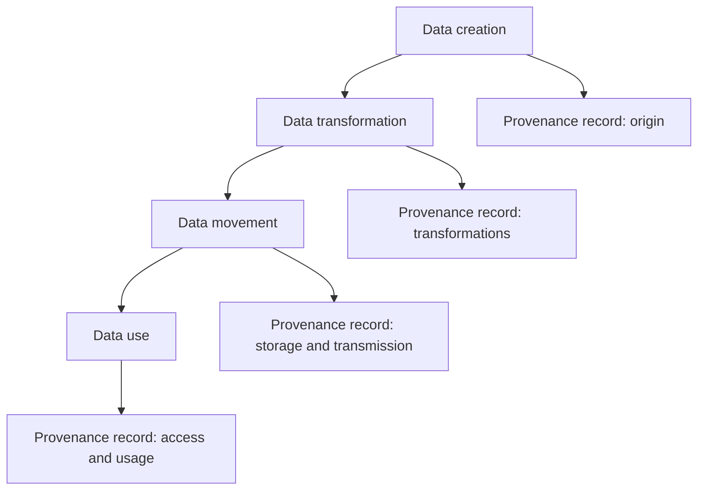

---
aliases:
  - Data Provenance
  - Content Provenance
date_created: 2026-08-20
date_modified: 2026-08-21
site_uuid: 81381ce4-448b-492c-9286-52d2746af1eb
publish: true
title: Provenance
slug: provenance
at_semantic_version: 0.0.1.1
tags:
  - Conceptual-Frameworks
  - Trending-Lingo
cf_last_run: 2026-08-21T17:28:40.943Z
cf_last_run_model: Perplexity sonar-pro
for_clients:
  - FullStackVC
  - Lossless
  - Laerdal
---
[[Tooling/Portfolio/Vana|Vana]]

The record of where a piece of content actually came from — as distinct from where it claims to come from.

The term is borrowed, not invented: it's standard in archives and art history (an object's [[chain of custody]]) and in data engineering as data provenance / lineage — there's even a [[organizations/W3C|W3C]] PROV standard. My use here is narrower than either.

# Defining and Describing Provenance (for Data)

_Data provenance is the story of where data came from, what happened to it, and who touched it, captured in a form that others can audit and trust. [^v488wl] [^8jancr] [^mxut89] [^rh3gnu]_

In data and [[concepts/Explainers for AI/Artificial Intelligence|AI]], **provenance** (or **data provenance**) is the *documented history* of a data object: its origin, every transformation or movement it undergoes, and its chain of custody across systems and users. [^v488wl] [^8jancr] [^9a6mb9] [^l1llmd] [^mxut89] [^ovg1dm] [^rh3gnu] [^9mk491] It applies wherever decisions, models, or research depend on data whose reliability must be demonstrable rather than taken on faith, from scientific datasets to regulatory reporting and machine learning training corpora. [^8jancr] [^tzv43e] [^dqj9nw] [^9mym5g] [^ovg1dm] [^rh3gnu] [^837cvt] Provenance matters because it is the “[[Trust Layers|trust layer]]” underneath data use: it enables verification of authenticity, integrity, compliance, and reproducibility by answering “where did this come from, what was done to it, and can I rely on it for this decision?” [^l1llmd] [^mxut89] [^62hju4] [^83894q] [^837cvt]

At its core, data provenance is typically described as a “documented record of where a piece of data came from, what happened to it at every stage, and who handled it,” covering origin, transformation history, and ownership or custody across its lifecycle. [^v488wl] [^9a6mb9] [^l1llmd] [^mxut89] [^ovg1dm] [^rh3gnu] [^9mk491] It is closely related to, and often equated with, **data lineage** or “data ancestry,” but with a stronger emphasis on source authenticity, conditions of creation, and the authority or trust that the data carries rather than only its movements through pipelines. [^tzv43e] [^ovg1dm] [^62hju4] [^83894q] In security and AI contexts, provenance is increasingly defined as a “comprehensive, cryptographically verifiable record” with a tamper‑proof chain of custody, enabling teams to trace any poisoned or unreliable sample back to its source. [^9mym5g] [^837cvt]

# Uses in Context

- In **research data management**, “data provenance is the documented history of a research data object: where it came from, what happened to it, and who or what acted on it, from collection or generation through every transformation to its current state,” allowing peer reviewers, re‑users, and auditors to trust and verify datasets. [^8jancr] [^tzv43e]

- In general [[Vocabulary/Data Governance|Data Governance]], “data provenance is the documented history of a piece of data across its lifecycle: where it originated, who created or owns it, what transformations and movements it has undergone, and how it has been accessed and used over time,” supporting trust, accountability, and compliance. [^mxut89] [^ovg1dm] [^rh3gnu] [^9mk491]

- In business data and compliance, provenance is framed as the ability “to trace every data point back to its official source with timestamps,” establishing a documented chain of custody that shows origin, acquisition time, and maintenance history for decisions that rely on official registries or authoritative records. [^dqj9nw] [^l1llmd]

- In AI and [[Vocabulary/Machine Learning|Machine Learning]], “data provenance in AI is the complete documented history of training data — its origin, collection methodology, every transformation applied, who handled it, and how it arrived in its current form,” often implemented as cryptographically verifiable logs to prevent or investigate data poisoning. [^9a6mb9] [^9mym5g] [^837cvt]

- In [[Vocabulary/Cybersecurity|Cybersecurity]] and incident response, data provenance is used to “record where data comes from, who accesses it, and how it changes,” building a forensic chain of custody that tracks each piece of data from creation through transformations, access events, and storage locations across its lifecycle. [^rh3gnu] [^9mym5g]

- In explanations of [[concepts/Explainers for Tooling/Databases|Database]] query results and scientific workflows, provenance is defined as “the process of determining the origin and derivation of data outputs,” used to explain why particular results appear and to audit complex computational pipelines. [^74j87h] [^l1llmd] [^8jancr]

# History of Use

## Origins

- The term **“provenance”** itself comes from art and archival practice, denoting the documented history of an object’s ownership and origin; computer scientists adapted it to data and databases to describe systematic tracking of the origin and derivation of data outputs. [^74j87h] [^l1llmd]

- An influential early formalization in computer science defines “data provenance (the process of determining the origin and derivation of data outputs)” in the context of explaining database query results and auditing scientific workflows, indicating that the term was established in database research rather than corporate marketing. [^74j87h]

- In research data management, organizations supporting reproducible science describe data provenance as the documented trail that accounts for the origin of a piece of data and where it has moved, emphasizing its role in transparency and confidence or validity of research data. [^8jancr] [^tzv43e]

## Evolution

- **Early 2000s–2010s (databases and workflows):** Provenance was primarily a research topic in databases and scientific workflow systems, focusing on formal models for explaining query results and providing audit trails of computational steps in e‑science environments. [^74j87h] [^8jancr] [^l1llmd]

- **2010s–early 2020s (data governance and lineage):** The concept broadened into enterprise data governance, where it was often linked to or contrasted with “data lineage” and “data ancestry,” emphasizing metadata about data creation, modification, and transmission across systems to support compliance and analytics. [^tzv43e] [^ovg1dm] [^62hju4] [^83894q]

- **Mid‑2020s (AI, security, and verifiability):** With the rise of large‑scale AI, authors define “data provenance in AI” as complete, sometimes cryptographically verifiable histories of training, validation, and testing data, highlighting chain‑of‑custody, tamper‑proof logging, and dataset‑level provenance for explaining and securing models against poisoning and bias. [^9a6mb9] [^9mym5g] [^837cvt]

# Best Real-World Examples

- **[Claru](url)** — a startup glossary and tooling stack that defines data provenance as the documented history of AI training data’s origin, collection methodology, transformations, and custody, focusing on trusted datasets for model development and deployment. [^9a6mb9] [^837cvt]

- **[Inferensys](url)** — a security‑oriented platform that implements “comprehensive, cryptographically verifiable” data provenance to establish tamper‑proof chains of custody for machine‑learning datasets and to trace poisoned samples back to their source. [^9mym5g]

- **[Saber](url)** — a data observability product that describes data provenance as documentation of data origins, movements, transformations, and dependencies, creating an auditable trail to trace any data point back to its source and every operation applied. [^ovg1dm]

- **[AFIP research initiative](url)** — a research‑driven organization that defines data provenance as the documented history of a piece of data from origin through transformations, movement, and use, explicitly framing it as a five‑question model (who, what, when, where, why) for trusted data. [^l1llmd]

- **[OpenCorporates’ provenance tooling](url)** — a civic data company that uses provenance to “trace every data point back to its official source with timestamps,” linking business data to government registries to support auditors and compliance professionals. [^dqj9nw]

- **[Komprise](url)** — an adopter in the data management space that explains data provenance as documented history of data across its lifecycle (origin, ownership, transformations, movements, access and use) to support AI and governance, popularizing the concept for enterprise audiences. [^mxut89] [^83894q]

- **[NHL/NNLM research data services](url)** — library and research infrastructure efforts that promote data provenance as the documented trail of origin and movement of research data, encouraging transparent chains of information for re‑use and adaptation by other researchers. [^tzv43e] [^8jancr]

# Case Studies

## OpenCorporates: Provenance for Official Business Data

[[OpenCorporates]], a company focused on transparency in global company data, presents provenance as “the ability to trace every data point back to its official source with timestamps.” [^dqj9nw] In practice, this means that each critical field in their business datasets is linked to the government registry from which it was obtained, along with “last‑updated timestamps” that record when the information was fetched or refreshed. [^dqj9nw] By documenting the exact origin, acquisition time, and maintenance history, OpenCorporates provides a clear chain of custody that auditors and compliance teams can inspect rather than accepting the data as a black box. [^dqj9nw] [^l1llmd]

This approach changed how downstream users engage with business data: instead of treating aggregate datasets as static, they can evaluate reliability on a field‑by‑field basis, checking provenance back to official records before making regulatory or risk decisions. [^dqj9nw] The case illustrates data provenance as a practical, non‑corporate innovation where a smaller specialist outpaces larger incumbents by making origin and authority first‑class features of a data product rather than hidden implementation details. [^dqj9nw] [^l1llmd]

## Scientific Workflows and Reproducible Research

In scientific computing, data provenance is described as “the process of determining the origin and derivation of data outputs,” particularly for explaining database query results and auditing complex workflows. [^74j87h] Research data services emphasize that provenance provides “a documented trail that accounts for the origin of a piece of data and where it has moved from to where it is presently,” and that its purpose is to tell researchers the origin, changes to, and details supporting confidence or validity of research data. [^tzv43e] [^8jancr] In a typical workflow, each step—data collection, cleaning, transformation, analysis, and visualization—is accompanied by provenance metadata recording who acted, what was done, when, and under what conditions. [^8jancr] [^l1llmd] [^9mk491]

When properly implemented, this provenance record allows other researchers, peer reviewers, or the future self of the original investigator to reconstruct and verify how results were produced, detect errors or biases introduced at particular stages, and reuse datasets with a clear understanding of their history. [^8jancr] [^tzv43e] [^74j87h] The case shows that data provenance is not merely an enterprise buzzword but a core mechanism for reproducibility and scientific integrity, emerging from academic and infrastructure communities rather than being invented by large commercial platforms. [^8jancr] [^tzv43e] [^74j87h]

## AI Training Data Security and Data Poisoning Prevention

Security‑focused AI practitioners describe data provenance as “the comprehensive, cryptographically verifiable record of a dataset’s origin, lineage, and all transformations applied throughout its lifecycle,” specifically to address the risk of data poisoning. [^9mym5g] In such systems, each sample of training, validation, or testing data is accompanied by a verifiable audit trail that records where it came from, who accessed or modified it, what processes were applied (preprocessing, labeling, filtering), and when each event occurred. [^9mym5g] [^837cvt] This creates a tamper‑proof chain of custody “from initial acquisition through preprocessing, labeling, and ingestion into a training pipeline,” enabling security teams to trace any suspicious or poisoned sample back to its source. [^9mym5g]

Deploying this level of provenance changes how AI teams respond to attacks and compliance questions: they can selectively roll back or exclude compromised segments of the dataset, demonstrate responsible sourcing to regulators, and explain model behavior by linking outputs to specific data subsets and their history. [^9mym5g] [^837cvt] The case underlines that the cutting‑edge innovation around data provenance in AI is being driven by specialized security and tooling startups, which treat provenance not only as metadata for governance but as a security control in its own right. [^9mym5g] [^9a6mb9] [^837cvt]

***

# Sources

[^v488wl]: [What Is Data Provenance? Definition and Source Origin - TrueScreen](https://truescreen.io/articles/data-provenance-definition-source-authenticity/)
[^8jancr]: [Data Provenance: Definition & Standards](https://casrai.org/guides/data-provenance)
[^9a6mb9]: [Data Provenance — Definition, Standards & AI Training Data | Claru](https://claru.ai/glossary/data-provenance)
[^l1llmd]: [Data Provenance - Origin Tracking and Chain of Custody | AFIP](https://afip.org/research/data-provenance/)
[^tzv43e]: [Data Provenance](https://www.nnlm.gov/resources/data/data-glossary/data-provenance)
[^mxut89]: [Data Provenance: Definition and Why It Matters for AI | Komprise](https://www.komprise.com/glossary_terms/data-provenance/)
[^dqj9nw]: [When auditors ask “where did this data come from?” Can ...](https://blog.opencorporates.com/2025/11/18/data-provenance-explained/)
[^9mym5g]: [Data Provenance: Definition, Importance & ML Security](https://inferensys.com/glossary/preemptive-algorithmic-cybersecurity/data-poisoning-prevention/data-provenance)
[^ovg1dm]: [Data Provenance: Definition, Examples & Use Cases - Saber](https://www.saber.app/glossary/data-provenance)
[^rh3gnu]: [What Is Data Provenance? Examples & Best Practices](https://www.sentinelone.com/cybersecurity-101/data-and-ai/data-provenance/)
[^62hju4]: [Data Lineage vs. Data Provenance: What's the Difference? - DataHub](https://datahub.com/blog/data-lineage-vs-data-provenance/)
[^9mk491]: [What is Data Provenance? Definition, Process & Key Metrics](https://www.hyperbots.com/glossary/data-provenance)
[^83894q]: [Data Provenance vs. Data Lineage: Differences & AI Use ...](https://www.snowflake.com/en/data-governance/data-lineage/data-provenance/)
[^837cvt]: [What Is Dataset provenance? Definition & Examples](https://nhimg.org/glossary/dataset-provenance/)
[^74j87h]: [[2601.04722] Does Provenance Interact? - arXiv](https://arxiv.org/abs/2601.04722)
