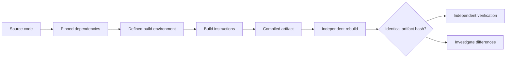

[[Tooling/Software Development/Developer Experience/DevOps/Porrfor|Porrfor]]
[[organizations/NixOS|NixOS]]
[[Tooling/Software Development/Developer Experience/DevOps/Docker|Docker]]
[[ContainerD]]
[[concepts/Explainers for Tooling/Development Sandboxes|Sandboxes]]
[[Vocabulary/Containers|Containers]]
[[Vocabulary/Ephemeral Environments|Ephemeral Environments]]
[[concepts/Explainers for Tooling/Metadata Engines|Metadata Engines]]
[[concepts/Infrastructure-as-Code|Infrastructure-as-Code]]

# Defining and Describing Reproducible Builds

- [IMAGE 1: Independent rebuild comparison showing identical software artifact hashes]
- _Reproducible builds turn software compilation from an act of trust into an independently checkable result._
- A reproducible build is a build process in which the same source code, dependencies, build instructions, and environment produce **bit-for-bit identical artifacts** when rebuilt independently. [^06jnav] [^6cr5nd] [^0yr2ut] This lets users verify that a distributed binary corresponds to published source code without trusting a single developer or build server. [^7cocad] [^cz7bzr]
- The approach applies wherever compiled or packaged software is distributed, including operating-system packages, browsers, mobile applications, and language ecosystems. [^7cocad] [^50k0r8] It matters because a matching artifact hash provides evidence that the published binary was not altered during or after the build process. [^6kt40z] [^7l2a17]

# Uses in Context

- **Software supply-chain security:** [[concepts/Software Supply Chains|Software Supply Chains]] Reproducible builds let users and auditors compare an independently generated artifact with the publisher’s release and detect build-time tampering. [^7cocad] [^6kt40z]
- **Package-distribution quality:** Projects use reproducibility testing with [[Vocabulary/Packages and Libraries|Packages]] to identify nondeterministic timestamps, file ordering, environment leakage, and unstable dependency resolution. [^50k0r8] [^f7gnvg]
- **Decentralized trust:** The method reduces reliance on a project’s build infrastructure because separate parties can rebuild and compare outputs. [^7cocad] [^cz7bzr]
- **Release engineering:** Teams use pinned toolchains, resolved dependencies, clean build environments, and recorded build metadata to make releases repeatable. [^cz7bzr] [^f7gnvg]
- **Binary verification:** The term is invoked when a project claims that users can recreate a release whose cryptographic digest matches the distributed binary. [^7cocad] [^0yr2ut]

# History of Use

## Origins

- The modern reproducible-builds effort emerged from Debian development in **2013**, when Debian contributors began organizing work to make packages independently rebuildable. [^sp2xjs] [^a36dln]
- The central formulation used by the Reproducible Builds project is that, given the same source code, build environment, and build instructions, “any party can recreate bit-by-bit identical copies” of specified artifacts. [^0yr2ut]
- Early work focused on Debian’s package ecosystem, where large-scale rebuilding exposed nondeterminism in package metadata, timestamps, file ordering, and build tooling. [^sp2xjs] [^50k0r8]

## Evolution

- **2013–2014 — Debian-wide experimentation:** The first mass rebuild reported in the search results found approximately 24% of Debian packages reproducible in September 2013; after fixes to `dpkg` and common build helpers, the figure rose to about 67% by January 2014. [^sp2xjs]
- **2015 — Standardized timestamp control:** Debian-related tooling adopted `SOURCE_DATE_EPOCH` to replace varying build timestamps with a defined timestamp, addressing a common source of byte-level differences. [^50k0r8]
- **2010s–2020s — Expansion beyond Debian:** Reproducible-build techniques spread to projects and ecosystems including Tor Browser, Bitcoin Core, F-Droid, Linux distributions, mobile applications, and language package managers. [^06jnav] [^7cocad] [^sp2xjs] [^50k0r8]

# Best Real-World Examples

- [Debian](https://www.debian.org/) — A large-scale distribution effort that has worked toward reproducible packages since 2013 and uses reproducibility testing across its archive. [^7cocad] [^sp2xjs]
- [Tor Browser](https://www.torproject.org/) — Has used reproducible builds since 2013 so independent parties can compare rebuilt browser binaries with official releases. [^7cocad]
- [Bitcoin Core](https://bitcoincore.org/) — Uses independently verifiable release-building practices as part of its security model. [^06jnav]
- [F-Droid](https://f-droid.org/) — Applies reproducibility principles to independently built Android applications and package verification. [^06jnav]
- [rebuilderd](https://reproducible-builds.org/docs/rebuilderd/) — A service that monitors package repositories and attempts to reproduce published results automatically. [^o0sknp]
- [GitLab](https://about.gitlab.com/) — Describes reproducible builds through the related properties of hermetic inputs, bit-for-bit output equality, and cryptographic verification. [^cz7bzr]
- [NixOS](https://nixos.org/) — Represents a declarative-build approach in which precisely specified inputs can support independent reconstruction and comparison of system artifacts. [^df8kgv]

# Case Studies

**Debian’s archive-wide effort.** Debian developers began the modern project in 2013, treating reproducibility as a distribution-wide engineering problem rather than a property of one compiler or package. [^sp2xjs] [^a36dln] Mass rebuilds revealed that only about 24% of packages initially reproduced identically; improvements to packaging tools and common build helpers raised that share to about 67% within several months. [^sp2xjs] The case shows that reproducibility can improve through systematic measurement, shared fixes, and repeated rebuilding rather than through a single architectural change.

**Tor Browser’s release verification.** The Tor Project has shipped reproducible Tor Browser builds since 2013. [^7cocad] Users or independent builders can obtain the source at a release version, follow the project’s build instructions, use the specified toolchain, and compare the resulting binary’s digest with the distributed release. [^7cocad] This demonstrates the security value of reproducibility for privacy-sensitive software: the publisher’s infrastructure need not be the sole source of evidence about what code entered the binary.

**Independent rebuild services and broader ecosystems.** Tools such as `rebuilderd` monitor official package repositories and attempt to reproduce observed results automatically. [^o0sknp] The same basic practice has also been applied across [[Debian]], Bitcoin Core, Tor Browser, and F-Droid, which independently converged on byte-identical rebuilds as a trust mechanism. [^06jnav] This illustrates the concept’s evolution from a Debian packaging initiative into a general supply-chain practice based on transparent inputs, deterministic processes, and comparison of artifact hashes. [^06jnav] [^cz7bzr]

***

# Sources

[^06jnav]: [Reproducible Builds and Byte-Identity as a Trust Primitive | Zylos Research](https://zylos.ai/research/2026-07-29-reproducible-builds-byte-identity-release-verification/)
[^7cocad]: [Reproducible Builds: The Only Way to Verify Your Software ...](https://dev.to/havenmessenger/reproducible-builds-the-only-way-to-verify-your-software-wasnt-tampered-with-31h)
[^6cr5nd]: [Causes and Canonicalization of Unreproducible Builds in ...](https://www.computer.org/csdl/journal/ts/5555/01/11223991/2blA5hBU7WE)
[4]: [Reproducible Builds (Grade A) - Claude Skill](https://www.skillsdirectory.com/skills/claude-dev-suite-reproducible-builds)
[^o0sknp]: [Reproducible Builds: Reproducible Builds in February 2026 - AILinuX](https://ailinux.me/reproducible-builds-reproducible-builds-in-february-2026/)
[^sp2xjs]: [Reproducible Builds in Language Package Managers](https://nesbitt.io/2026/02/24/reproducible-builds-in-language-package-managers.html)
[^6kt40z]: [Kettle: Attested Builds](https://confidential.ai/docs/resources/kettle)
[^0yr2ut]: [What reproducible builds actually prove - SSD Nodes](https://www.ssdnodes.com/learn/reproducible-builds-explained)
[^50k0r8]: [What Is Reproducible Builds? | Supply Chain Security](https://safeguard.sh/resources/blog/what-is-reproducible-builds)
[^7l2a17]: [safeguard.sh › resources › blogBuild Reproducibility Verification Guide - safeguard.sh](https://safeguard.sh/resources/blog/build-reproducibility-verification-guide)
[11]: [Debian 14 cracks down on unreproducible packages](https://www.theregister.com/oses/2026/05/11/debian-14-cracks-down-on-unreproducible-packages/5238094)
[^cz7bzr]: [Reproducible Builds - The GitLab Handbook](https://handbook.gitlab.com/handbook/security/product-security/security-platforms-architecture/application-security/reproducible-builds/)
[^f7gnvg]: [Hermetic Build Systems](https://www.cleanstart.com/knowledge-hub/what-are-reproducible-builds)
[^a36dln]: [Reproducible Builds Debian: A Decade-Long View](https://safeguard.sh/resources/blog/reproducible-builds-debian-long-view)
[^df8kgv]: [Reproducible Builds in October 2025](https://lists.reproducible-builds.org/pipermail/rb-general/2025-November/003923.html)
