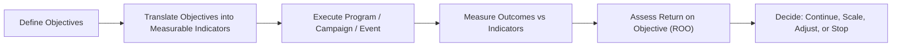

---
aliases:
  - ROO
date_created: 2026-05-25
date_modified: 2026-05-25
cf_last_run: "2026-05-25T22:20:19.584Z"
cf_last_run_model: "Perplexity sonar-pro"
site_uuid: 060dd695-c528-4002-9de1-d971c59847a4
publish: true
title: "Return on Objective"
slug: return-on-objective
at_semantic_version: 0.0.1.1
---

# Defining and Describing Return on Objective

*_Return on Objective shifts the question from “How much money did we make?” to “Did we achieve the specific outcomes we set out to achieve?”_  

**Return on Objective (ROO)** is a results-based evaluation approach that measures success by the degree to which predefined, non‑financial objectives are achieved, rather than by financial return alone. It is used in fields such as marketing, events, communications, learning and development, and public or nonprofit programs where value is created through outcomes like awareness, behavior change, engagement, or capability, which may not be immediately reflected in profit. ROO matters because it allows organizations to justify investments, optimize strategy, and demonstrate impact even when monetary ROI is hard to calculate or too indirect. In practice, ROO typically combines qualitative and quantitative indicators tied directly to specific objectives, often sitting alongside traditional ROI rather than replacing it.  

# Uses in Context

- In **event and meeting evaluation**, practitioners use ROO to capture outcomes such as learning, networking, and behavior change, emphasizing that “Return on Objectives (ROO) focuses on the achievement of pre-defined event objectives, rather than financial returns.”  

- In **marketing and communications**, ROO is invoked when traditional ROI is too narrow; for example, some marketers distinguish ROO as measuring “campaign success based on whether strategic objectives like brand awareness, engagement or sentiment were achieved,” instead of only revenue or leads.  

- In **public sector and nonprofit programs**, ROO is used to evaluate whether initiatives met goals like “improved citizen satisfaction, increased participation, or social impact” when “financial ROI is not the primary success criterion.”  

- In **learning and development**, ROO can be tied to training goals such as “improved job performance, competency gains and behavior change,” with success measured by attainment of these objectives rather than cost savings alone.  

- In **strategic planning and OKR-like frameworks**, ROO is conceptually aligned with the practice of defining clear objectives and “measurable ‘key results’… success criteria: an exhaustive list of the measurable/verifiable conditions that, if met, allow everyone to agree the objectives were accomplished,” even though such frameworks may not use the ROO label explicitly. [^o8kicy]  

# History of Use

## Origins

- The phrase **“Return on Objectives”** appears in meetings and events literature in the early 2000s as an alternative to ROI, notably in the work of meeting-industry consultant and author Jack J. Phillips and others who argued that events create value beyond direct revenue.  

- Within the events field, ROO was introduced to help planners “define objectives up front and then measure the degree to which these objectives were achieved,” positioning it as a practical framework when financial attribution is difficult or indirect.  

## Evolution

- **2000s – Formalization in meetings & events evaluation.** Industry practitioners began to codify ROO as a structured approach, describing it as a way to “focus on event outcomes and objectives rather than simply financial ROI,” especially for internal meetings, incentive programs, and association events where revenue is not the main purpose.  

- **2010s – Adoption in broader marketing and communications.** As digital marketing expanded and brand/engagement metrics became more prominent, commentators and agencies increasingly used “Return on Objective” or “Return on Objectives” to describe evaluating campaigns against strategic goals like engagement, awareness, and sentiment, particularly where “traditional ROI doesn’t capture the full value of the activity.”  

- **2020s – Integration with goal- and OKR-based management.** The logic behind ROO—defining objectives, attaching measurable criteria, and evaluating success against them—has increasingly overlapped with popular frameworks that stress clear objectives and quantified key results, even when those frameworks do not explicitly use the ROO label. [^o8kicy]  

# Best Real-World Examples

- **[International association annual conference](url)** — applies ROO by setting explicit objectives for member learning, networking quality, and satisfaction, then evaluating the event based on how well these objectives were achieved rather than on profit alone.  

- **[Corporate internal sales kick-off meeting](url)** — uses ROO to measure outcomes such as improved product knowledge, alignment with strategy, and post-event sales behaviors, treating these as the primary “return” on the meeting.  

- **[Nonprofit public-awareness campaign](url)** — evaluates success in terms of objectives like increased awareness of an issue, higher petition sign-ups, or policy engagement, using ROO where direct monetary ROI is not relevant.  

- **[Government digital-service improvement project](url)** — adopts ROO-like evaluation by measuring progress against objectives such as reduced processing time, improved citizen satisfaction scores, and increased digital uptake, instead of financial returns.  

- **[Brand engagement social-media campaign](url)** — judged on ROO metrics such as engagement rate, share of voice, sentiment, and attainment of audience-growth objectives set before launch.  

- **[Enterprise learning program for managers](url)** — measures ROO by assessing changes in leadership behaviors, competency scores, and employee engagement among participants following a structured training series.  

# Case Studies

**1. Association Conference: Shifting from ROI to ROO for Member Value**  

A professional association organizing an annual conference faced criticism that its event evaluation focused mainly on financials—registration revenue and sponsorship—while members cared more about learning and networking outcomes. In response, the organizers adopted a **Return on Objective** framework, beginning by clearly defining event objectives such as “increase members’ knowledge in key practice areas,” “facilitate high-quality networking,” and “improve member satisfaction with the association’s educational offerings.” They translated these into measurable indicators, including pre‑ and post‑event self-assessed knowledge levels, number and quality of new professional contacts reported, and satisfaction scores for sessions and overall experience. After the conference, survey and observational data showed substantial gains in knowledge scores and networking outcomes, alongside high satisfaction metrics even in a year when net financial return was modest. This case demonstrates how ROO allows mission-driven organizations to recognize and improve the true value of events by focusing on the degree to which strategic, non‑financial objectives are met.  

**2. Corporate Sales Kick-Off: Measuring Behavioral Outcomes Instead of Just Costs**  

A multinational company held an annual sales kick-off (SKO) meeting that consumed a significant travel and production budget but was evaluated mostly by cost per attendee and anecdotal feedback. The learning and sales enablement teams collaborated to reframe evaluation around ROO by setting explicit objectives: “improve product knowledge,” “increase confidence in selling the new portfolio,” and “drive adoption of a new sales methodology.” They implemented assessments before and after the SKO to measure knowledge gains, collected participants’ self-reported confidence levels, and tracked usage of the new methodology in CRM records over the following quarter. Analysis showed a marked improvement in test scores and increased usage of the methodology among attendees compared with non-attendees, even though immediate revenue attribution remained complex. The organization used these ROO findings to justify continued investment in the SKO while also refining content to better support the objectives that had the strongest measured impact.  

**3. Public Awareness Campaign: ROO in a Nonprofit Setting**  

A nonprofit working on public health launched a multi-channel awareness campaign aimed at increasing understanding of a preventable condition and motivating at-risk individuals to seek screening. Because the initiative did not directly generate revenue, traditional ROI metrics were of limited relevance, so the organization adopted a ROO perspective with objectives such as “increase public awareness of the condition,” “drive traffic to educational resources,” and “boost screening sign-ups at partner clinics.” They defined associated metrics including pre‑ and post‑campaign awareness survey results, website visits and time-on-page for educational content, and the number of referrals and screenings attributed to campaign touchpoints. Post-campaign analysis showed significant increases in awareness and a notable rise in screenings in regions where the campaign ran most intensively, providing robust evidence of success against the original objectives. This case illustrates how ROO enables nonprofits and public-sector actors to quantify impact and learn from campaigns even when monetary returns are not the primary concern.

***

# Sources

[1]: [Get Entity by Crosswalk - Reltio Documentation](https://docs.reltio.com/en/developer-resources/entity-management-apis/entity-management-apis-at-a-glance/entities-api/get-entity/get-entity-by-crosswalk)
[2]: [How to Set Up a Special Purpose Entity (SPE) for a Real Estate Project](https://www.jmco.com/articles/real-estate/set-up-a-special-purpose-entity/)
[^o8kicy]: [Defining your product objectives - Productboard Support](https://support.productboard.com/hc/en-us/articles/360058181234-Defining-your-product-objectives)
[4]: [Portugal introduces VAT group regime - Tax News Update - EY](https://taxnews.ey.com/news/2025-2182-portugal-introduces-vat-group-regime)
[5]: [What is an SPV? Definition, Benefits & Setup - Carta](https://carta.com/learn/private-funds/structures/spv/)
[6]: [Structuring Real Estate Partnerships and Funds for Success | CBIZ](https://www.cbiz.com/insights/article/structuring-real-estate-partnerships-and-funds-for-success)
[7]: [[PDF] Special Purpose Entity Quarterly Reporting - Central Bank of Ireland](https://www.centralbank.ie/docs/default-source/statistics/statistical-reporting-requirements/special-purpose-vehicles/spe-notes-on-compilation.pdf?sfvrsn=7a88661a_1)
[8]: [Special Purpose Vehicles (SPVs) Guide - CSC Global](https://www.cscglobal.com/service/entity-solutions/spv-management/guide-to-special-purpose-vehicles-spvs/)
[9]: [Required Elements of University Associated Entity Relationship](https://www.northcarolina.edu/apps/policy/doc.php?id=758)
