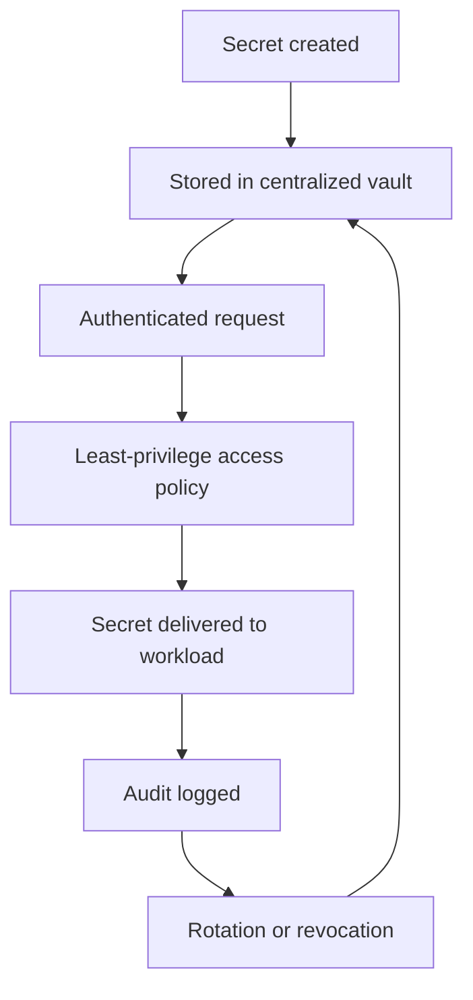

[[SecretSpec]]
[[1Password]]
[[Dashlane]]

https://youtu.be/BqekRTA6VCs?si=M8TBlGbLUoAPzmKQ

_Secrets management is the discipline of controlling sensitive credentials so they are never left to chance._ [^273esw] [^9kwdcv]

Secrets management is the practice of storing, distributing, rotating, revoking, and auditing secrets such as passwords, API keys, tokens, certificates, and encryption keys, with access restricted to the identities that actually need them. [^273esw] [^t3opm5] [^9kwdcv] It matters most in cloud, [[Vocabulary/Dev Ops|DevOps]], and zero-trust environments, where machines and services exchange credentials continuously and where credential leakage can become a broad security incident. [^tf9dnc] [^t3opm5] [^sch98b]

# Defining and Describing Secrets Management

- 

Secrets management is a security discipline and operational system for secrets that centralizes control, enforces least privilege, and supports lifecycle operations like rotation and auditing. [^273esw] [^t3opm5] [^sch98b] HashiCorp’s documentation describes Vault as an “identity-based secrets and encryption management system” that “centralizes secret management, rotates old credentials, generates credentials on demand, audits client interactions, and supports regulatory compliance.”[^273esw] AWS similarly defines Secrets Manager as a service that helps manage, retrieve, and rotate credentials “throughout their lifecycles.”[^t3opm5]

# Uses in Context

- In cloud security guidance, secrets management refers to protecting passwords, [[projects/Augment-It/High-Level-Architecture/API|API]] keys, [[projects/Emergent-Innovation/Standards/OAuth|OAuth]] tokens, database credentials, and similar material used by applications and infrastructure. [^t3opm5] [^48x24o]
- In Kubernetes, the term is invoked around protecting `Secret` objects, with guidance to enable encryption at rest, apply least-privilege RBAC, and consider external secret store providers. [^sch98b]
- In OWASP-oriented guidance, secrets management is framed as a full lifecycle discipline: “created, stored, accessed, rotated, revoked, audited.”[^9nr9ub]
- In zero-trust discussions, secrets management is described as the mechanism that ensures the “right keys” are given to the “right hands” at the “right time.”[^qqake1]
- In enterprise tooling, the phrase often means a centralized vault or manager that brokers secrets to humans and machines through policy and auditing. [^tf9dnc] [^k8e075]
- In DevOps and platform engineering, it is used to reduce secret sprawl, eliminate hardcoded credentials, and automate renewal or revocation. [^b0fqkz] [^9kwdcv]

# History of Use

## Origins

The modern term emerged from security and infrastructure practice rather than from a single canonical academic origin. [^273esw] [^9kwdcv] Contemporary sources describe it as a discipline centered on secrets’ lifecycle management—generation, storage, distribution, rotation, audit, and revocation—rather than merely as a storage problem. [^9nr9ub] [^9kwdcv] One early widely adopted product framing came from HashiCorp Vault documentation, which positioned Vault as an identity-based system for secrets management and defined a “secret” broadly as anything tightly controlled, such as “tokens, API keys, passwords, encryption keys or certificates.”[^273esw]

## Evolution

- 2014–2016: The idea expanded from simple credential storage toward centralized lifecycle control, with tooling emphasizing storage, dynamic generation, rotation, and auditing rather than static vaulting alone. [^273esw] [^ay7y5i]
- 2020–2024: OWASP and cloud providers increasingly framed secrets management as a lifecycle and governance problem spanning CI/CD, containers, cloud providers, and multi-cloud systems. [^9nr9ub] [^sch98b] [^t3opm5]
- 2025–2026: Enterprise guidance shifted toward workload identity, short-lived credentials, automation, and zero-trust access models, with emphasis on eliminating long-lived secrets and improving auditability. [^qqake1] [^c8q8ow] [^m93z3y] [^9kwdcv]

# Best Real-World Examples

- [HashiCorp Vault](https://www.hashicorp.com/en/products/vault) — identity-based secrets management for humans, machines, and AI agents. [^tf9dnc] [^273esw]
- [AWS Secrets Manager](https://aws.amazon.com/secrets-manager/) — managed secret storage, retrieval, and rotation for application and database credentials. [^t3opm5]
- [Kubernetes Secrets](https://kubernetes.io/docs/concepts/configuration/secret/) — built-in secret objects paired with encryption at rest, RBAC, and external store recommendations. [^sch98b]
- [OWASP Secrets Management Cheat Sheet](https://cheatsheetseries.owasp.org/) — community guidance that codifies lifecycle best practices for secrets. [^9nr9ub]
- [Azure Key Vault](https://learn.microsoft.com/en-us/azure/security/fundamentals/secrets-best-practices) — Microsoft’s platform guidance emphasizes granular access control, rotation, safe distribution, and logging. [^48x24o]
- [Infisical](https://infisical.com/blog/secrets-management-complete-guide) — a newer secrets-management platform that presents the field as generation, storage, distribution, access control, rotation, revocation, and destruction. [^9kwdcv]
- [External Secrets Operator](https://external-secrets.io/) — a cloud-native pattern for syncing external secrets into Kubernetes workloads, often used to reduce manual handling. [^m93z3y]

# Case Studies

[[organizations/HashiCorp|HashiCorp]] Vault is one of the clearest examples of how secrets management evolved from “store credentials somewhere safe” into a lifecycle platform. [^273esw] Vault’s documentation says it “centralizes secret management,” “rotates old credentials,” “generates credentials on demand,” and “audits client interactions,” which captures the shift from static secret storage to dynamic access governance. [^273esw] HashiCorp later emphasized “identity-based secrets management,” showing how the category broadened from vaulting secrets to brokering them through identity and policy for both humans and machines. [^tf9dnc]

[[Tooling/Software Development/Cloud Infrastructure/Amazon Web Services|AWS]] Secrets Manager shows how a large cloud provider popularized the category at scale rather than originating it. [^t3opm5] AWS describes the service as a way to manage, retrieve, and rotate database credentials, application credentials, OAuth tokens, API keys, and other secrets “throughout their lifecycles,” which reflects the now-standard cloud framing of secrets as operational assets that must be renewed and audited continuously. [^t3opm5] This is a strong example of a platform vendor codifying best practices that were already taking shape in security and DevOps communities. [^t3opm5] [^9nr9ub]

[[Tooling/Software Development/Developer Experience/DevOps/Kubernetes|Kubernetes]] illustrates the operational challenge that made secrets management a distinct discipline in cloud-native systems. [^sch98b] Kubernetes documentation recommends encryption at rest for Secrets, least-privilege RBAC, restricting access to specific containers, and using external secret store providers, which shows that native secret objects alone are not enough for strong protection. [^sch98b] In practice, this pushed teams toward external vaults, secret operators, and identity-aware access patterns to reduce exposure and automate rotation. [^sch98b] [^m93z3y] [^9kwdcv]

***

# Sources

[1]: [Extended Version: It Should Be Easy but... New Users Experiences and Challenges with Secret Management Tools](https://arxiv.org/abs/2509.09036v1)
[2]: [Bezpečnost a správa tajemství](https://www.econommy.eu/bezpecnost-a-sprava-tajemstvi/)
[3]: [Securing Non-Human Identities: Emerging Challenges and ...](https://lorojournals.com/index.php/emsj/article/view/1480)
[^qqake1]: [The Role of Secrets Management in Zero Trust Architecture | Entro](https://entro.security/blog/the-role-of-secrets-management-in-zero-trust-architecture/)
[5]: [Journal articles: 'DevOps Secrets Management'](https://www.grafiati.com/en/literature-selections/devops-secrets-management/journal/)
[^c8q8ow]: [Hashicorp Resources](https://developer.hashicorp.com/well-architected-framework/secure-systems/secrets/manage-leaked-secrets/prevent-leaked-secrets-access-controls)
[7]: [HashiCorp Vault + External Secrets Operator: Zero-Trust ...](https://ayedo.de/posts/vault-eso-secrets-management/)
[8]: [Managing Cryptographic Keys and Secrets 1758287745](https://www.scribd.com/document/923560832/Managing-Cryptographic-Keys-and-Secrets-1758287745)
[9]: [Secret Management Architecture: Secure Every Key, Token, and ...](https://codelit.io/blog/secret-management-architecture)
[^48x24o]: [Best practices for protecting secrets](https://learn.microsoft.com/en-us/azure/security/fundamentals/secrets-best-practices)
[11]: [Key management secrets engine - Vault | HashiCorp Developer](https://developer.hashicorp.com/vault/docs/secrets/key-management)
[^tf9dnc]: [HashiCorp Vault | Identity-based secrets management](https://www.hashicorp.com/en/products/vault)
[13]: [Vault Enterprise | Self-managed identity-based security](https://www.hashicorp.com/en/products/vault/vault-enterprise)
[^273esw]: [How Vault works - HashiCorp Developer](https://developer.hashicorp.com/vault/docs/about-vault/how-vault-works)
[^m93z3y]: [How Vault Secrets Operator (VSO) automates ...](https://www.hashicorp.com/en/blog/how-vault-secrets-operator-vso-automates-secret-management-for-enterprises-on-kub)
[16]: [Vault product documentation](https://developer.hashicorp.com/vault/docs)
[^k8e075]: [The HashiCorp Vault Adoption Guide](https://www.hashicorp.com/en/resources/adopting-hashicorp-vault)
[18]: [Hashicorp Vault: An Introduction to the Secrets Management ...](https://admantium.medium.com/hashicorp-vault-an-introduction-to-the-secrets-management-application-5e73ca2fba23)
[^b0fqkz]: [Solutions to secret sprawl: A 4-part framework](https://www.hashicorp.com/en/blog/solutions-to-secret-sprawl)
[20]: [How HashiCorp Vault Solves The Top 3 Cloud Security ...](https://www.hashicorp.com/en/resources/how-hashicorp-vault-solves-the-top-3-cloud-security)
[21]: [S1 E1 - Learn Hashicorp Vault - An Introduction - Dev Setup ...](https://www.youtube.com/watch?v=FCWPU3ZuY7A)
[22]: [Hashicorp Vault: Secret Management Engines](https://dev.to/admantium/hashicorp-vault-secret-management-engines-48nb)
[23]: [How to Use Vault for Secret Management](https://oneuptime.com/blog/post/2026-02-02-vault-secret-management/view)
[^ay7y5i]: [Secrets engines | Vault](https://developer.hashicorp.com/vault/docs/secrets)
[25]: [Hashicorp Vault | KeeperPAM and Secrets Manager](https://docs.keeper.io/keeperpam/secrets-manager/integrations/hashicorp-vault)
[^9nr9ub]: [OWASP Secrets Management Cheat Sheet: What You ...](https://infisical.com/blog/owasp-secrets-management-cheat-sheet)
[27]: [OWASP secrets management cheat sheet for production ...](https://nhimg.org/articles/owasp-secrets-management-cheat-sheet-for-production-systems/)
[28]: [AWSSecretsManager (AWS SDK for Java - 1.12.787)](https://docs.aws.amazon.com/it_it/AWSJavaSDK/latest/javadoc/com/amazonaws/services/secretsmanager/AWSSecretsManager.html)
[^t3opm5]: [What is AWS Secrets Manager? - ...](https://docs.aws.amazon.com/secretsmanager/latest/userguide/intro.html)
[30]: [OWASP Secrets Management & Environment Variables ...](https://aquilax.ai/blog/owasp-secrets-management-environment-variables)
[^sch98b]: [Secrets | Kubernetes](https://kubernetes.io/docs/concepts/configuration/secret/)
[32]: [[{"title":"OWASP Secrets Management Cheat Sheet","url":"https://cheatsheetseries.owasp.org/cheatsheets/Secrets_Management_Cheat_Sheet.html","used_for":"중앙화된 비밀관리 정책, CI/CD 자격증명 범위 제한, 회전·감사 로그 기준 참고"},{"title":"OWASP CI/CD Security Cheat Sheet","url":"htt](https://agentmit.com/tip_tech/52)
[33]: [OWASP 密钥管理备忘单：你需要知道什么| 登链社区| 区块链技术社区](https://learnblockchain.cn/article/25221)
[34]: [Gestione dei segreti nel cloud - AWS Secrets Manager](https://aws.amazon.com/it/secrets-manager/)
[35]: [Trình quản lý thông tin bí mật của AWS](https://aws.amazon.com/vi/secrets-manager/)
[36]: [AWS Secrets Manager](https://aws.amazon.com/de/secrets-manager/)
[37]: [Cloud Password Management, Credential Storage - AWS Secrets Manager - AWS](https://aws.amazon.com/secrets-manager/)
[38]: [कॉन्फ़िगरेशन फाइल का उपयोग करके सीक्रेट्स का प्रबंधन - Kubernetes](https://kubernetes.io/hi/docs/tasks/configmap-secret/managing-secret-using-config-file/)
[39]: [Secrets](https://kubernetes.io/pt-br/docs/concepts/configuration/secret/)
[^9kwdcv]: [Secrets Management: The Complete Guide](https://infisical.com/blog/secrets-management-complete-guide)
