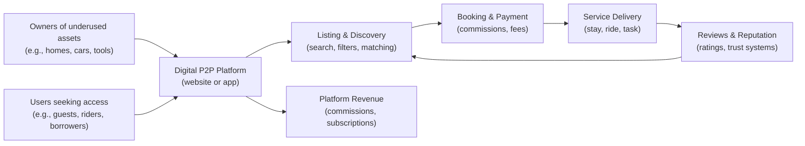

# Defining and Describing Sharing Economy

_A sharing economy is what happens when online platforms let people turn underused assets—like spare rooms, cars, or skills—into shared resources and income._

The sharing economy is an economic model in which “goods or services are shared between private individuals, either free of charge or for a fee, typically through the internet.”[^nynbj6] It is based on collaboration within a community of individuals who use peer‑to‑peer (P2P) online platforms to share or exchange goods or services, with the platform acting mainly as an intermediary that facilitates transactions among users rather than owning the assets itself. [^82ruwv] [^nynbj6] [^k9prig] In practice, it allows people to earn money from “unused or underutilized assets” by renting them out or granting temporary access, often at lower prices than traditional markets. [^82ruwv] [^nynbj6] This model matters because it can reduce waste by optimizing resource use, challenge existing regulations and incumbents in sectors like housing and mobility, and raise new questions about trust, labor, and taxation. [^82ruwv] [^nynbj6] [^k9prig] [^aq8lsw]

# Uses in Context

- In business and management writing, “sharing economy business model” describes platforms where individuals exchange goods or services and “share access to them, while the company’s role is to facilitate transactions among platform users.”[^82ruwv]  
- Public policy and tax authorities use the term to classify “economic activity undertaken through a digital platform (such as a website or an app) where people share assets or services for a fee,” including ride‑sourcing, short‑term housing rental, and task services. [^k9prig]  
- Labor and tax discussions often merge it with the “gig economy,” which U.S. tax guidance defines as “activity where people earn income providing on-demand work, services or goods,” often via apps or websites. [^aq8lsw]  
- In popular and academic discourse it is frequently equated with “collaborative consumption,” framed as “an economic system in which goods or services are shared between private individuals,” and as “generating income by sharing personal assets, minimizing intermediaries between the owner and the user.”[^nynbj6] [^cv4dah]  
- Sustainability advocates invoke the sharing economy as a way to “reduce waste” by optimizing the use of resources and reducing the need to produce new goods or discard unused ones. [^82ruwv] [^nynbj6]  

# History of Use

## Origins

- The contemporary discourse around the sharing economy is closely linked to the concept of “collaborative consumption” popularized by Rachel Botsman and Roo Rogers in the 2010 book *What’s Mine Is Yours: How Collaborative Consumption Is Changing the Way We Live*, which argued that digitally enabled sharing models were reshaping access to goods and services. [^nynbj6]  
- Commentators trace the rise of the sharing‑economy model to the aftermath of the 2008 financial crisis, when “a group of young entrepreneurs in the tech and startup ecosystem” in places like Silicon Valley sought to respond to new economic constraints with “a model focused on reducing waste by sharing resources.”[^nynbj6]  

## Evolution

- **Late 2000s–early 2010s – From crisis response to mainstream platforms.** Early ventures in ride‑sharing, peer‑to‑peer accommodation, and other asset‑sharing services turned the crisis‑era idea of sharing under‑used resources into scalable online platforms, embedding collaborative consumption into consumer culture. [^nynbj6] [^cv4dah]  
- **Mid‑2010s – Regulatory and tax recognition.** Tax agencies and regulators began defining and treating the “sharing economy” as a distinct category of digital‑platform activity, describing it as economic activity where people “share assets or services for a fee” via apps and websites, encompassing ride‑sourcing, short‑term rentals, and on‑demand services. [^k9prig] [^aq8lsw]  
- **Late 2010s–2020s – Blurred boundaries with the gig and access economies.** Official guidance and public discussion increasingly used “sharing economy,” “gig economy,” and “access economy” interchangeably, describing on‑demand work and rental of assets as parts of the same broader phenomenon of income generation through digital platforms. [^aq8lsw] [^nynbj6]  

# Best Real-World Examples

- [Airbnb](https://www.airbnb.com/) – Peer‑to‑peer platform for “renting out all or part of a house or unit on a short-term basis,” a canonical example of sharing underused housing space via a digital platform. [^k9prig] [^cv4dah]  
- [BlaBlaCar](https://www.blablacar.com/) – Long‑distance ride‑sharing service where drivers share spare seats with passengers for a fee, exemplifying ride‑sourcing and shared car use. [^k9prig] [^cv4dah]  
- [Turo](https://turo.com/) – Peer‑to‑peer car sharing platform that lets owners rent out personal vehicles when not in use, aligning with “sharing assets, such as personal assets like boats, cars or caravans.”[^k9prig]  
- [TaskRabbit](https://www.taskrabbit.com/) – Platform that matches people needing tasks done with individuals willing to “perform tasks and activities for other people, like odd jobs, cleaning or running errands,” illustrating service-based sharing. [^k9prig] [^aq8lsw]  
- [Neighbor](https://www.neighbor.com/) – Marketplace for renting out underused storage and parking space, an example of sharing “storage or business spaces, like car parking spaces or offices.”[^k9prig]  
- [LendingClub](https://www.lendingclub.com/) – Early peer‑to‑peer lending platform enabling individuals to lend and borrow money directly via an online intermediary, often discussed as a financial extension of the sharing economy model. [^cv4dah]  

# Case Studies

## Peer-to-Peer Housing: Short-Term Rentals and Urban Tourism

Platforms enabling people to rent out all or part of their homes on a short‑term basis have become emblematic of the sharing economy. [^k9prig] [^cv4dah] An individual with a spare room or vacant apartment can list the space on a digital platform, which provides listing tools, search and discovery, payment processing, and review systems; in return, the platform typically earns revenue “from the commissions that platforms charge on transactions and from the subscriptions users purchase to access ancillary services or advanced features.”[^82ruwv] This model illustrates how the sharing economy allows owners to “generate income by sharing personal assets” and gives travelers alternative, often lower‑cost accommodation options that challenge traditional hotels. [^nynbj6] [^cv4dah] At the same time, it highlights regulatory challenges—especially in “housing or mobility”—where rapid growth can create “legislative gaps, legal (and, above all, fiscal) inequalities, and bitter disputes” over taxation, zoning, and neighborhood impacts. [^82ruwv] [^k9prig] [^cv4dah]  

## Ride-Sourcing and On-Demand Transport

Ride‑sourcing services—also called ride‑sharing—are a central case of the sharing economy in mobility. [^k9prig] Drivers use their personal cars, an underused asset, to provide transportation “for a fare” coordinated through a digital platform that matches them with passengers, processes payments, and manages ratings. [^k9prig] [^aq8lsw] Tax authorities categorize this as a sharing‑economy activity because it is “economic activity undertaken through a digital platform … where people share assets or services for a fee,” and as part of the broader gig or access economy in which people “earn income providing on-demand work, services or goods.”[^k9prig] [^aq8lsw] This case shows both the strengths of the model—more flexible work opportunities, increased transport options, and better utilization of private vehicles—and the tensions around labor classification, safety standards, and fairness in competition with traditional taxi services. [^k9prig] [^aq8lsw] [^cv4dah]  

## Task and Service Platforms: From Odd Jobs to Professional Work

Service‑oriented platforms extend the sharing economy beyond physical assets to human time and skills. Individuals can use digital marketplaces to “perform tasks and activities for other people, like odd jobs, cleaning or running errands,” or to “provide professional services, like web or trade services,” earning income on a flexible, per‑task basis. [^k9prig] [^aq8lsw] These platforms operate as digital intermediaries that “match workers’ services or goods with customers via apps or websites,” taking commissions on each transaction and often providing reputation systems through reviews and ratings to manage trust. [^aq8lsw] [^82ruwv] The case of task and service platforms demonstrates how sharing‑economy principles—peer‑to‑peer exchange, platform intermediation, and reputation‑based trust—can be applied to labor markets, blurring the line between casual peer help and structured gig work while raising new policy questions about taxation, benefits, and protections for independent workers. [^k9prig] [^aq8lsw] [^cv4dah]

***

# Sources

[^82ruwv]: [Sharing economy business model: how it works and when it's worth it](https://b-plannow.com/en/sharing-economy-business-model-how-it-works-and-when-its-worth-it/)
[^nynbj6]: [Collaborative Consumption: What It Is, Types, and Examples | EAE](https://www.eaebarcelona.com/en/blog/collaborative-consumption)
[^k9prig]: [Sharing economy | Australian Taxation Office](https://www.ato.gov.au/tax-and-super-professionals/for-tax-professionals/prepare-and-lodge/tax-time/before-you-lodge/sharing-economy)
[^aq8lsw]: [Gig economy tax center | Internal Revenue Service](https://www.irs.gov/businesses/gig-economy-tax-center)
[5]: [Sharing Economy Market Analysis, Size, and Forecast 2026-2030](https://www.technavio.com/report/sharing-economy-market-industry-analysis)
[^cv4dah]: [Sharing economy and tourism: Who wins and who loses?](https://paulbelleflamme.com/?p=906)
