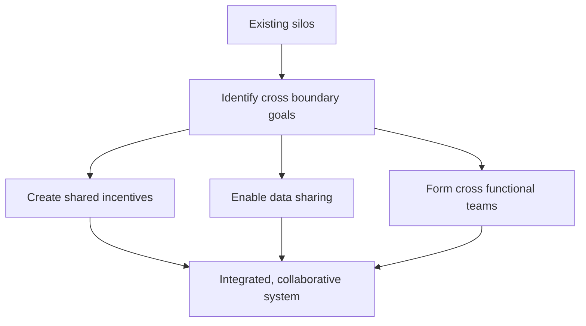

---
aliases:
  - Silo-busting
  - silo-busting
date_created: 2026-06-15
date_modified: 2026-06-15
site_uuid: 5d6e5778-c852-4af4-8497-3b779509d6a6
publish: true
title: Silo‑Busting
slug: silo-busting
at_semantic_version: 0.0.1.1
cf_last_run: 2026-06-15T19:39:09.227Z
cf_last_run_model: Perplexity sonar-pro
tags:
  - Lossless-Thinking
  - API-Designs
  - Engineering-Management
  - Management-Strategies
for_clients:
  - Laerdal
  - Param
  - Tonguc
  - Reach-U
---

# Defining and Describing Silo‑Busting

_“Silo‑busting” is the deliberate practice of breaking down organizational, data, or sector boundaries so people, systems, and decisions connect instead of competing or duplicating effort. [^jo20ws] [^koun2t] [^hk8o8q]_

In management and policy writing, **silo‑busting** usually refers to initiatives that counteract “organizational silos” — self‑contained teams or departments that operate independently with their own goals, incentives, and communication channels. [^jo20ws] [^hk8o8q] It matters because siloed structures drive duplicated effort, conflicting priorities, higher costs, and missed opportunities for innovation and coordinated action. [^36asgx] [^hk8o8q] In sectors such as healthcare, energy, and legal services, authors increasingly frame silo‑busting as essential to address rising costs, fragmented data, and inconsistent outcomes by enabling cross‑functional collaboration and shared intelligence. [^c4s83u] [^36asgx] [^koun2t]

# Uses in Context

- In organizational development, **“breaking down [[concepts/Organizational Silos|Organizational Silos]]”** is described as creating “self-contained teams or departments that operate independently, with their own goals, objectives, and communication channels” and then designing structures and practices so these groups collaborate instead of optimize in isolation. [^jo20ws] Authors present silo‑busting here as strengthening communication, alignment, and shared culture across departments to reduce duplication and conflict. [^jo20ws] [^hk8o8q]

- In strategy analysis for U.S. healthcare, Nathan Kaufman argues that skyrocketing costs, shortages, and inconsistent outcomes are “driven by siloed areas optimizing their own incentives,” and calls for governance, payment, and operational changes that align incentives across hospitals, physicians, and payers. [^36asgx] In this context, silo‑busting means redesigning incentives and decision rights so actors do not maximize their own revenue or metrics at the expense of overall system performance. [^36asgx]

- In cross‑departmental data work, legal‑technology commentators emphasize “building bridges and working across silos with legal data intelligence,” noting that the biggest cause of silos “is departmental structures” with different goals and incentives. [^koun2t] Here, silo‑busting is about integrating data, workflows, and tooling so legal teams, compliance, and business units share insights instead of keeping separate, incompatible datasets. [^koun2t]

- In energy‑system governance, the European DSO Entity describes one of its core aims as “silo breaking,” explicitly “uniting electricity, gas, and hydrogen DSOs on one platform from an integrated energy system approach.”[^c4s83u] Silo‑busting in this context refers to multi‑vector energy planning and regulation that cuts across historically separate infrastructures, market rules, and technical standards. [^c4s83u]

- In organizational design guides, analysts contrast “siloed organizational structures” — which “lead to duplication of efforts, conflicting priorities, and missed opportunities for synergy or innovation” — with more networked or matrixed designs. [^hk8o8q] Silo‑busting is presented as re‑architecting structures, performance metrics, and communication flows to create cross‑functional collaboration and shared accountability. [^hk8o8q]

# History of Use

## Origins

- The imagery of **“silos”** to describe isolated departments dates at least to late‑20th‑century management writing, where authors used “organizational silos” or “functional silos” as a metaphor for departments hoarding information and pursuing their own goals. [^jo20ws] [^hk8o8q] Management texts and consulting reports from that period began advising leaders to “break down silos” to improve communication and agility, embedding silo‑busting in mainstream organizational change vocabularies. [^jo20ws] [^hk8o8q]

- Digital‑era commentaries on knowledge management and collaboration extended the metaphor from organizational units to **data silos**, emphasizing that separate databases and tools prevent “data intelligence” and whole‑system analytics. [^koun2t] In these writings, silo‑busting means integrating systems and data flows so insights travel across traditional boundaries. [^koun2t]

- In infrastructure and policy circles, especially in Europe’s energy transition discussions, the term was adopted to describe **cross‑vector coordination** — e.g., DSO Entity’s 2026 work programme refers to “silo breaking” as uniting electricity, gas, and hydrogen distribution system operators “from an integrated energy system approach.”[^c4s83u] This usage generalizes silo‑busting from intra‑firm management to multi‑stakeholder, multi‑sector coordination. [^c4s83u]

## Evolution

- **1990s–2000s – Organizational change and knowledge management.** As organizations digitized and globalized, management literature framed silo‑busting as a response to rigid functional hierarchies and poor knowledge sharing, advocating cross‑functional teams, shared databases, and collaborative cultures. [^jo20ws] [^hk8o8q]

- **2010s – Data and analytics integration.** With the rise of big data and specialized SaaS tools, commentators highlighted “data silos” across departments, arguing that true “data intelligence” required breaking down these silos through integrated platforms, common data models, and governance. [^koun2t] [^hk8o8q]

- **2020s – System‑level and sector‑wide integration.** Policy and industry bodies in complex systems such as healthcare and energy increasingly use silo‑busting language to argue for **system‑of‑systems coordination**, aligning incentives, governance, and data across institutions and infrastructures rather than only within single organizations. [^c4s83u] [^36asgx] [^koun2t]

# Best Real-World Examples

- [Chronus](https://chronus.com/blog/organizational-silo-busting) – Uses mentoring and people‑development programs to help “break down organizational silos,” explicitly targeting independent departments and promoting cross‑departmental relationships and knowledge transfer. [^jo20ws]

- [HFMA – Nathan Kaufman analysis](https://www.hfma.org/administration/how-silos-undermine-u-s-healthcare/) – Profiles how siloed incentives in U.S. healthcare drive costs and poor outcomes, and outlines approaches that effectively “bust” silos between hospitals, physicians, and payers by restructuring payment and governance. [^36asgx]

- [E‑discovery Channel](https://ediscoverychannel.com/2025/06/17/building-bridges-and-working-across-silos-with-legal-data-intelligence/) – Advocates “building bridges and working across silos with legal data intelligence,” highlighting tools and practices that integrate legal, compliance, and business data sources previously trapped in departmental silos. [^koun2t]

- [European DSO Entity Annual Work Programme](https://eudsoentity.eu/wp-content/uploads/2026/01/DSO-Entity_AnnualWorkProgramme2026.pdf) – Positions “silo breaking” as a core task in uniting electricity, gas, and hydrogen distribution system operators on one platform to support an integrated EU energy system. [^c4s83u]

- [FourWeekMBA – Siloed Organizational Structure](https://fourweekmba.com/siloed-organizational-structure/) – Provides a structured analysis of siloed organizational structures and outlines solutions that exemplify silo‑busting, such as cross‑functional teams and shared KPIs to reduce duplication and conflicting priorities. [^hk8o8q]

- [Legal‑data integration projects highlighted by E‑discovery Channel](https://ediscoverychannel.com/2025/06/17/building-bridges-and-working-across-silos-with-legal-data-intelligence/) – Describe specific corporate initiatives where legal data is unified across business units, demonstrating silo‑busting in practice by centralizing and standardizing information once scattered in multiple repositories. [^koun2t]

# Case Studies

## Cross‑functional mentoring as a silo‑busting mechanism (Chronus)

Chronus, a mentoring‑software provider, discusses **organizational silos** as “self-contained teams or departments that operate independently, with their own goals, objectives, and communication channels.”[^jo20ws] It presents mentoring programs that deliberately match people across departments and hierarchies as a way to counteract these silos, fostering informal communication channels and shared understanding. [^jo20ws] By creating relationships that cut across structural boundaries, organizations using such programs report better collaboration, reduced misalignment, and greater visibility into other teams’ work, demonstrating how people‑centric interventions can be powerful tools for silo‑busting without reorganizing formal structures. [^jo20ws] [^hk8o8q]

## Incentive alignment in U.S. healthcare (HFMA / Nathan Kaufman)

In an analysis for the Healthcare Financial Management Association (HFMA), consultant Nathan Kaufman argues that U.S. healthcare’s “skyrocketing costs, frequent shortages and inconsistent outcomes are driven by siloed areas optimizing their own incentives.”[^36asgx] He points to hospitals, physicians, and payers each pursuing financial and operational objectives that often conflict, leading to overuse of profitable services, underinvestment in prevention, and fragmentation of care. [^36asgx] Silo‑busting in this case involves payment reforms (such as value‑based arrangements), governance structures that bring stakeholders under shared accountability, and data‑sharing mechanisms that coordinate decisions across the continuum of care. [^36asgx] [^koun2t] The case illustrates that breaking silos is not only about communication but about redesigning incentives and authority so entire systems optimize for patient outcomes and long‑term sustainability. [^36asgx]

## Integrated energy systems and “silo breaking” (European DSO Entity)

The European DSO Entity’s 2026 Annual Work Programme explicitly lists “silo breaking” as part of its mandate to support “an integrated energy system approach” for electricity, gas, and hydrogen distribution system operators (DSOs). [^c4s83u] Historically, these networks were planned, regulated, and operated separately, with distinct technical rules, market designs, and governance structures. [^c4s83u] By creating a platform that unites different DSOs, developing shared technical rules, and cooperating with transmission system operators and their association ENTSO‑E, the DSO Entity aims to coordinate investment, operations, and innovation across energy carriers. [^c4s83u] This sector‑level silo‑busting case shows how breaking silos can mean aligning codes, standards, and planning processes across infrastructures, enabling more efficient integration of renewables, flexibility services, and cross‑vector energy flows than isolated planning would allow. [^c4s83u] [^hk8o8q]

***

# Sources

[^c4s83u]: [[PDF] Annual Work Programme 2026 | DSO Entity](https://eudsoentity.eu/wp-content/uploads/2026/01/DSO-Entity_AnnualWorkProgramme2026.pdf)
[^36asgx]: [Nathan Kaufman: How silos undermine U.S. healthcare | HFMA](https://www.hfma.org/administration/how-silos-undermine-u-s-healthcare/)
[^jo20ws]: [Breaking Down Organizational Silos for Better Collaboration - Chronus](https://chronus.com/blog/organizational-silo-busting)
[^koun2t]: [Building Bridges and Working Across Silos with Legal Data ...](https://ediscoverychannel.com/2025/06/17/building-bridges-and-working-across-silos-with-legal-data-intelligence/)
[^hk8o8q]: [Siloed Organizational Structure: 2026 Guide & Solutions](https://fourweekmba.com/siloed-organizational-structure/)
