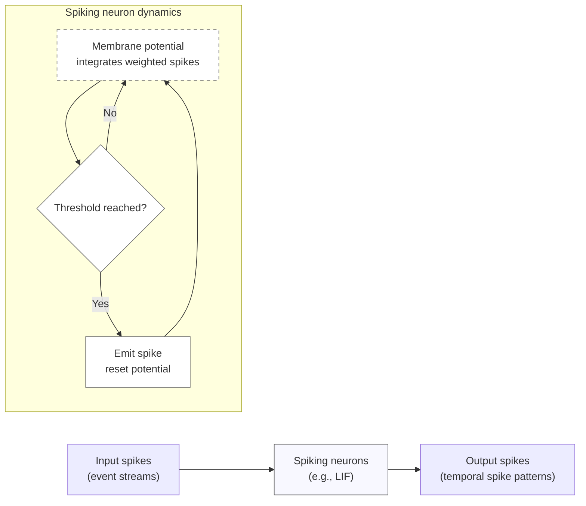

# Defining and Describing Spiking Neural Networks

_Spiking neural networks are neural nets that compute with time-stamped spikes, mimicking how real biological neurons fire rather than using continuous activations._

Spiking Neural Networks (**SNNs**) are **brain-inspired neural networks that process information using discrete signals called spikes instead of continuous values like traditional neural networks**. [^6rxmvi] [^h5yqgz] In SNNs, each neuron integrates incoming spikes over time into a **membrane potential** and emits a spike when this potential crosses a threshold, after which it typically resets. [^6rxmvi] [^h5yqgz] This event-driven, temporal behavior makes SNNs **inherently more energy-efficient and temporally dynamic** than conventional [[Artificial Neural Networks]] (ANNs), especially on neuromorphic hardware. [^6rxmvi] [^i98nnz] They matter because they bridge computational neuroscience and machine learning, enabling models that are closer to biological neural computation and attractive for low-power, real-time applications such as edge AI, robotics, and neuromorphic vision. [^i98nnz] [^9pcp7h] [^85hfzq]  

Key characteristics often cited include: **use of spikes for communication between neurons**, **generation of spikes when membrane potential crosses a threshold**, and **higher energy efficiency than traditional neural networks**. [^6rxmvi] [^h5yqgz] [^i98nnz] Common neuron models include **leaky integrate-and-fire (LIF)** neurons, where the membrane potential “leaks” toward a baseline unless driven by spikes. [^6rxmvi] [^h5yqgz] Learning in SNNs can use mechanisms such as **spike-timing-dependent plasticity (STDP)**, where synaptic weights are adjusted based on the precise timing difference between pre- and post-synaptic spikes, or **surrogate gradient methods** that make SNNs trainable with backpropagation-like algorithms. [^6rxmvi] [^i98nnz]  

# Uses in Context

- In **[[concepts/Neuromorphic Computing]]**, SNNs are described as “**the latest generation of neural computation, offering a brain-inspired alternative to conventional Artificial Neural Networks (ANNs)**,” particularly suited to energy-constrained and latency-sensitive applications. [^i98nnz]  
- In low-power AI discussions, SNNs are invoked as architectures that “**fire only when something meaningful happens, enabling AI that’s faster, more efficient, and inherently private**” on edge devices. [^9pcp7h]  
- In deep learning tutorials and educational material, SNNs are framed as networks that “**mimic the behavior of biological neurons**” and “**use spikes for communication between neurons**,” offering **“more energy-efficient”** computation for tasks like pattern recognition. [^6rxmvi]  
- In neuroscience modeling, SNNs are referred to as the “**go-to neural architecture for modelling and simulating actual brain circuits, given the relative closeness of spiking neurons to biological neurons**.”[^h5yqgz]  
- In imaging and computer vision, SNNs are discussed as promising tools for “**enabling energy-efficient, event-driven computation in imaging**,” especially when paired with event-based sensors. [^85hfzq]  
- In optimization and training research, SNNs appear in contexts like “**activity pruning for efficient spiking neural networks**,” where researchers propose algorithms that reduce spiking activity while preserving accuracy. [^01vdu0]  

# History of Use

## Origins

- The conceptual roots of SNNs trace back to early **mathematical neuron models**, especially the **integrate-and-fire** and **leaky integrate-and-fire** models used in computational neuroscience to describe how biological neurons accumulate inputs and fire spikes once a threshold is reached. [^h5yqgz] [^i98nnz]  
- As a distinct term in neural computation, **“spiking neural networks”** emerged in the 1990s in the computational neuroscience community to distinguish these time- and spike-based models from earlier rate-based neural networks, reflecting an explicit focus on spike timing and event-driven dynamics. [^h5yqgz] [^i98nnz]  
- SNNs have since been positioned as the **“third generation of neural networks”**, after perceptrons and classical ANNs, emphasizing their closer alignment with biological neural processing and their potential computational advantages. [^h5yqgz] [^i98nnz]  

*(Note: Most contemporary sources describe origins and positioning retrospectively; detailed historical credit typically points to early computational neuroscience work on integrate-and-fire neurons and spike-based coding, rather than to today’s large tech adopters.)*

## Evolution

- **1990s–2000s – From theory to detailed brain models:** SNNs were primarily used to model real neural circuits, benefiting from increasing computational power and detailed neuron models, and they became “the go-to neural architecture for modelling and simulating actual brain circuits.”[^h5yqgz]  
- **2010s – Emergence of neuromorphic hardware and STDP learning:** Dedicated neuromorphic platforms and renewed interest in spike-timing-dependent plasticity positioned SNNs as promising for low-power, event-driven computation, with STDP-based SNNs offering “the lowest spike counts and energy consumption… optimal for unsupervised and low-power tasks.”[^i98nnz]  
- **Late 2010s–2020s – Surrogate gradients and ANN-to-SNN conversion:** Researchers developed **surrogate gradient techniques** and **ANN-to-SNN conversion** methods that allow SNNs to “closely approximate ANN accuracy (within 1–2%)” while leveraging temporal dynamics and energy savings, pushing SNNs into mainstream machine learning benchmarks and edge AI applications. [^i98nnz] [^01vdu0]  
- **2020s – Application to imaging and sensing:** SNNs began to be systematically reviewed and applied to imaging, with surveys noting that they “hold significant promise for enabling energy-efficient, event-driven computation in imaging, but the field is still at an early stage.”[^85hfzq]  

# Best Real-World Examples

- **[Loihi neuromorphic research using SNNs](url)** – A neuromorphic chip project that uses SNNs to demonstrate ultra–low-power, event-driven computation and real-time learning, showcasing SNN advantages on specialized hardware. [^i98nnz] [^9pcp7h] [^85hfzq]  
- **[Event-based vision SNNs for neuromorphic cameras](url)** – Research systems that pair SNNs with event-based image sensors to perform high-speed recognition and tracking with very low energy consumption. [^i98nnz] [^85hfzq]  
- **[Surrogate-gradient-trained SNNs on benchmark datasets](url)** – Academic models that use surrogate gradient training to reach “within 1–2%” of ANN accuracy on tasks like image classification while exploiting temporal dynamics. [^i98nnz]  
- **[STDP-based unsupervised SNNs for pattern detection](url)** – Experimental networks using spike-timing-dependent plasticity, such as tutorials that detect specific spike patterns (e.g., `[1, 0, 1, 0, 1]`), illustrating unsupervised learning from spike timing. [^6rxmvi] [^i98nnz]  
- **[Energy-efficient SNNs with activity pruning (AT-LIF)](url)** – The “Activity Pruning for Efficient Spiking Neural Networks” work proposing the **AT-LIF** algorithm to “reduce spiking activity using [a] sparse regularizer” while maintaining performance. [^01vdu0]  
- **[Brain-circuit simulation SNN projects](url)** – Large-scale simulations that use SNNs as the main architecture to model biological brain circuits due to the close match between spiking neurons and real neuron behavior. [^h5yqgz] [^i98nnz]  
- **[Edge sensing SNN demos for always-on devices](url)** – Edge AI prototypes where SNNs “fire only when something meaningful happens,” enabling ultra–low-power always-on sensing and classification directly on sensors without cloud connectivity. [^9pcp7h]  

# Case Studies

## Case Study 1: STDP-Based Pattern Detection with LIF Neurons

A widely cited educational example demonstrates how an SNN can learn to recognize a temporal spike pattern using **leaky integrate-and-fire (LIF)** neurons and **spike-timing-dependent plasticity (STDP)**. [^6rxmvi] In this setup, developers define a `LIFNeuron` class that models membrane potential integration and threshold-based spiking, and a `Synapse` class that carries weighted spikes between neurons. [^6rxmvi] They initialize a small network with input, hidden, and output layers, specify a target spike train such as `pattern = [1, 0, 1, 0, 1]`, and then run a simulation over discrete time steps. [^6rxmvi] During the simulation, neurons update their membrane potentials at each time step, generate spikes when thresholds are crossed, and apply an `stdp` function that **adjusts synaptic weights based on the timing difference between pre- and post-synaptic spikes**. [^6rxmvi] Over time, the network becomes more responsive to the specified spike pattern, demonstrating how **timing-based plasticity alone can enable unsupervised pattern learning** in SNNs. [^6rxmvi] [^i98nnz] This case illustrates the core conceptual difference from standard ANNs: learning and representation depend on *when* spikes occur, not just on average firing rates.  

## Case Study 2: Efficient SNN Training via Activity Pruning (AT-LIF)

Recent research on **activity pruning for efficient spiking neural networks** proposes an algorithm called **AT-LIF** that directly targets one of SNNs’ practical challenges: balancing accuracy with low spike activity. [^01vdu0] The work focuses on LIF-based SNNs and introduces a **sparse regularizer** that penalizes excessive spiking during training, effectively encouraging the network to use **fewer spikes** while retaining predictive performance. [^01vdu0] According to the paper, the goal is “to improve efficiency of SNN learning while conserving effectiveness,” and the proposed method reduces spiking activity compared to baseline SNN training approaches. [^01vdu0] Experiments show that AT-LIF-trained networks maintain competitive accuracy while generating fewer spikes, which translates into lower energy consumption on neuromorphic or event-driven hardware. [^i98nnz] [^01vdu0] This case study highlights how SNN research is evolving from purely biological inspiration toward **engineering optimizations** that exploit spike sparsity for real-world efficiency gains, especially in edge and embedded systems where energy budgets are tight. [^i98nnz] [^01vdu0]  

## Case Study 3: SNNs for Energy-Efficient Imaging and Edge Sensing

A recent review of **spiking neural networks in imaging** analyzes how SNNs can be combined with imaging sensors to achieve event-driven, low-power computation. [^85hfzq] The authors note that SNNs “hold significant promise for enabling energy-efficient, event-driven computation in imaging” but emphasize that the field is “still at an early stage.”[^85hfzq] In many of the surveyed systems, event-based cameras produce asynchronous streams of pixel changes that are naturally represented as spikes, which SNNs can process directly for tasks such as object detection, motion estimation, and scene understanding. [^85hfzq] Complementary to this, public-facing explainers describe SNN-powered edge devices where spiking neurons “fire only when something meaningful happens,” allowing always-on sensing with “ultra-low energy use, a smaller memory footprint for embedded devices, and dramatically lower system costs.”[^9pcp7h] Together, these imaging and edge-sensing demonstrations show how SNNs can **reduce redundant computation by ignoring silence or static regions**, making them attractive for **real-time, low-power perception** in robotics, surveillance, and mobile devices. [^9pcp7h] [^85hfzq]  

***

# Sources

[^6rxmvi]: [Spiking Neural Networks in Deep Learning - GeeksforGeeks](https://www.geeksforgeeks.org/deep-learning/spiking-neural-networks-in-deep-learning-/)
[^h5yqgz]: [Neural networks are getting spiky again - by Michael Lones](https://fetchdecodeexecute.substack.com/p/neural-networks-are-getting-spiky)
[^i98nnz]: [Spiking Neural Networks: The Future of Brain-Inspired Computing](https://arxiv.org/abs/2510.27379)
[^9pcp7h]: [Spiking Neural Networks Explained | The Future of AI That Thinks ...](https://www.youtube.com/watch?v=ug92eUh_pYo)
[^85hfzq]: [Spiking Neural Networks in Imaging: A Review and Case Study - PMC](https://pmc.ncbi.nlm.nih.gov/articles/PMC12609703/)
[^01vdu0]: [Activity Pruning for Efficient Spiking Neural Networks - OpenReview](https://openreview.net/forum?id=zjOXZEXQKZ)
