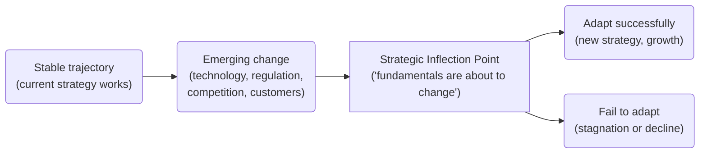

---
aliases:
  - Strategic Inflection Point
  - Inflection Point
  - Inflection Points
  - inflection point
  - inflection points
date_created: 2025-08-17
date_modified: 2026-05-25
site_uuid: 37dbcc54-f96a-4f5e-987b-032f1ed67846
publish: true
title: Strategic Inflection Points
slug: strategic-inflection-points
at_semantic_version: 0.0.1.1
authors:
  - Michael Staton
for_clients:
  - Laerdal
  - Param
cf_last_run: 2026-05-25T21:03:00.017Z
cf_last_run_model: Perplexity sonar-pro
---

# Defining and Describing Strategic Inflection Points

_**Strategic inflection points** are moments when the underlying forces in a business or industry shift so dramatically that “the old strategic picture dissolves and gives way to the new.”_

The term is most closely associated with Intel’s longtime CEO **Andrew S. Grove**, who popularized it in his 1996 book *Only the Paranoid Survive* to describe “a time in the life of a business when its fundamentals are about to change.” In Grove’s framing, a strategic inflection point can be triggered by new technologies, regulatory shifts, competitor moves, or changes in customer behavior that alter the trajectory of an organization or sector. Such points matter because they represent forks in the road: handled well, they create outsized growth opportunities; mishandled, they often precede decline or obsolescence. Contemporary strategists, investors, and operators extend the idea to entire industries—such as manufacturing, real estate, or software engineering culture—when “macro view” conditions suggest that past assumptions no longer hold and new strategies are required. [^0srn1y] [^w9dl96] [^23t0ld]

# Uses in Context

- In strategy literature and executive practice, the term denotes a **major structural shift** in a firm’s environment: Grove defines it as “a point in the life of a business when its fundamentals are about to change” and warns that if managers miss it, “the company can die.”
- In manufacturing consulting, analysts describe the sector as being “at a **strategic inflection point**” when technology, labor dynamics, and global competition are transforming “the backbone of economic development and industrial competitiveness,” requiring new growth models and operational approaches. [^w9dl96]
- Advisory-board practitioners use the phrase “navigating **Strategic Inflection Points (Macro View)**” to highlight how boards with macroeconomic expertise help leadership **anticipate** these shifts—rather than merely react—when scaling private companies. [^0srn1y]
- Engineering leadership coaches refer to scaling “inflection points that break engineering organizations,” emphasizing that each scaling step forces a trade-off where “standardization enables efficiency but kills innovation; autonomy enables innovation but creates chaos,” which aligns with the idea of strategic inflection points in organizational design. [^338ves]
- Asset managers describe asset classes like commercial **real estate** as being “at an inflection point” when evolving demand patterns and geopolitical risk mean “targeted strategies” are required instead of traditional playbooks, implicitly invoking the strategic-inflection logic of reassessing fundamentals. [^23t0ld]
- Wealth and entity-structuring advisors, while not always using the full term, echo the concept when they argue that strategic structuring is “a foundational risk and control tool” that protects owners when circumstances change significantly, not merely a tax tactic—another case of preparing for inflection points in control and liability. [^c659g6]

# History of Use

## Origins

- The phrase **“strategic inflection point”** is widely attributed to **Andrew S. Grove**, then CEO of Intel, who introduced and elaborated it in his 1996 book *Only the Paranoid Survive: How to Exploit the Crisis Points That Challenge Every Company*. Grove used the term to explain how shifts such as the rise of the microprocessor and changes in industry structure forced Intel to abandon its memory-chip business and bet the company on microprocessors, framing these as moments when “a 10X change” in key forces renders old strategies obsolete.
- Grove’s examples and subsequent talks located the idea squarely in **high-technology and semiconductor competition**, but he explicitly generalized the concept to any business facing dramatic changes in technology, competition, or regulation where management must choose between strategic reinvention and decline.

## Evolution

- **Late 1990s–2000s – From Intel-specific to general strategy concept.** Strategy scholars, business-school cases, and management writers adopted “strategic inflection point” as a general label for disruptive shifts, often teaching Grove’s Intel memory-to-microprocessor pivot as the canonical example and applying the term to other industries undergoing technological disruption.
- **2010s – Sectoral and macroeconomic framing.** Consultants and sector analysts began using the term for entire industries—e.g., manufacturing now “finds itself at a strategic inflection point” due to automation, global supply chains, and changing demand—highlighting systemic change rather than single-firm crises. [^w9dl96]
- **2020s – Governance and capital allocation usage.** Advisory-board and investment literature increasingly speak of boards helping firms navigate “Strategic Inflection Points (Macro View)” and describe asset classes like real estate as being “at an inflection point” where “targeted strategies” are required in response to evolving demand and geopolitical risk, extending the concept into governance, macro strategy, and portfolio management. [^0srn1y] [^23t0ld]

# Best Real-World Examples

- [Intel](https://www.intel.com) — Grove’s decision in the 1980s–1990s to exit commodity DRAM memory and focus on microprocessors is the textbook **strategic inflection point**, reshaping Intel’s business model and the PC industry.
- [TSMC](https://www.tsmc.com) — The rise of foundry manufacturing and fabless design marked a strategic inflection point in semiconductors, shifting value from integrated device makers to specialized manufacturers and design houses.
- [Shopify](https://www.shopify.com) — The company’s pivot from simple online store tools to a broader commerce infrastructure and payments ecosystem reflects navigating an inflection where e‑commerce fundamentals and merchant needs changed.
- [SpaceX](https://www.spacex.com) — Reusable rockets and drastically lower launch costs represent a strategic inflection point for space launch economics, altering industry structure and competitive dynamics.
- [Zoom](https://zoom.us) — The acceleration of remote work during the COVID-19 pandemic created a strategic inflection point in enterprise communication, rapidly shifting expectations for video-first collaboration.
- [Open-source Kubernetes ecosystem](https://kubernetes.io) — Container orchestration and cloud-native patterns triggered a strategic inflection point in how applications are deployed and managed, changing the economics and control points of infrastructure.
- [Morgan Stanley Real Estate Strategies](https://www.morganstanley.com) — Their characterization of real estate as “at an inflection point” requiring “targeted strategies” exemplifies how investors respond when the fundamental drivers of a sector shift. [^23t0ld]

# Case Studies

## Intel’s Memory-to-Microprocessor Pivot

In the 1980s, Intel faced intense competition from Japanese memory manufacturers, eroding margins and threatening its core DRAM business. Andrew Grove describes this period as a **strategic inflection point**: the economics and competitive dynamics of memory had changed so profoundly that Intel’s traditional strategy no longer made sense. Grove recounts asking then-chairman Gordon Moore what they would do if they were replaced; they concluded a new management team would exit memory, and they decided to act on that logic themselves, redirecting investment toward microprocessors. This strategic choice effectively abandoned Intel’s original business but positioned the company to become the dominant supplier of microprocessors for personal computers, illustrating how recognizing and acting decisively at a strategic inflection point can determine a firm’s long-term fate.

## Manufacturing at a Sector-Wide Strategic Inflection Point

Contemporary manufacturing is increasingly described as “at a strategic inflection point” where long-standing assumptions about cost structures, geography, and technology are breaking down. [^w9dl96] Platform01 Consulting, for example, argues that manufacturing—“long viewed as a backbone of economic development and industrial competitiveness”—now faces simultaneous challenges: digitalization, supply-chain fragility, and shifting customer expectations. [^w9dl96] They recommend responses such as **controlled expansion** into adjacent markets or new geographies and a “forensic view of the cash conversion cycle,” including receivables discipline, inventory rationalization using demand-driven and AI-based forecasting, and strategic payables management. [^w9dl96] This case shows how the strategic inflection point concept applies beyond single firms to entire sectors, emphasizing that new tools, markets, and financial practices are required when the old operational logic no longer supports growth. [^w9dl96]

## Advisory Boards as Tools for Navigating Strategic Inflection Points

For private companies, especially those scaling rapidly, law and advisory firms frame **advisory boards** as mechanisms to navigate “Strategic Inflection Points (Macro View).”[^0srn1y] A Bradley analysis notes that board members with macroeconomic expertise “help the leadership team anticipate, not just react to” such inflection points, improving the probability of “successful, efficient scale.”[^0srn1y] They emphasize structuring boards with “three to five independent experts” across operational leadership, market strategy, and capital or dealmaking, and compensating them with equity to align long-term interests. [^0srn1y] In this narrative, the strategic inflection point concept underpins governance design: rather than assuming continuity, companies proactively assemble external perspectives to detect when fundamentals are shifting and to adjust strategy before crisis forces change. [^0srn1y]

***

# Sources

[^0srn1y]: [The Role of Advisory Boards in Scaling: A Competitive Edge for ...](https://www.bradley.com/insights/publications/2025/10/the-role-of-advisory-boards-in-scaling-a-competitive-edge-for-private-companies-part-two)
[^c659g6]: [Why Use Multiple Entities? 5 Ways Strategic Structuring Protects ...](https://privatewealthlawgroup.com/why-use-multiple-entities-5-ways-strategic-structuring-protects-more-than-just-taxes/)
[^w9dl96]: [The Growth Conundrum in Manufacturing: Challenges and Strategic ...](https://www.platform01consulting.com/insights/the-growth-conundrum-in-manufacturing-challenges-and-strategic-solutions)
[^338ves]: [The Inflection Points That Break Engineering Organizations](https://jasonsullivan.me/articles/scrappy-to-scalable-inflection-points/)
[^23t0ld]: [Real Estate at an Inflection Point | Morgan Stanley](https://www.morganstanley.com/im/en-gb/intermediary-investor/insights/articles/real-estate-at-an-inflection-point.html)
