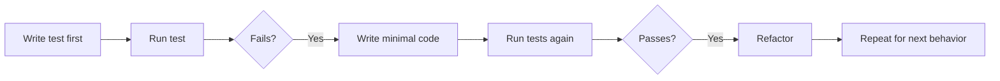

---
aliases:
  - TDD
date_created: 2025-04-18
date_modified: 2026-06-16
cf_last_run: 2026-06-16T01:20:51.400Z
cf_last_run_model: Perplexity sonar-pro
---

<iframe 
  style="aspect-ratio:16/9;width:100%;height:auto" 
  src="https://www.youtube.com/embed/U3MVU6JpocU?si=i84FmkbjN0xfMOF5" 
  title="YouTube video player" 
  frameborder="0" 
  allow="accelerometer; autoplay; clipboard-write; encrypted-media; gyroscope; picture-in-picture; web-share" 
  referrerpolicy="strict-origin-when-cross-origin" 
  allowfullscreen
></iframe>

https://youtu.be/tL89VP3nuwc?is=RNmBPSzpO0WOtdwC

[[Tooling/Software Development/Frameworks/Vitest|Vitest]]

> [!NOTE] [[Poe AI]] explains [[concepts/Test-Driven Development|Test-Driven Development]]
### **What Is Test-Driven Development (TDD)?**

Test-Driven Development (TDD) is a software development methodology where tests are written **before** writing the actual implementation code. It follows a strict cycle, often referred to as the **Red-Green-Refactor Cycle**:

1. **Red**: Write a test for a new feature or functionality. At this stage, the test will fail because the feature isn’t implemented yet.
2. **Green**: Write just enough code to make the test pass. The focus is on correctness, not optimization.
3. **Refactor**: Clean up the code, making it more efficient or readable, while ensuring the test still passes.

This process repeats for every new feature, ensuring that the software evolves in small, testable increments.

---

### **Where Did TDD Come From?**

TDD is closely associated with **Extreme Programming (XP)**, a software development methodology introduced in the late 1990s by **Kent Beck**. He formalized TDD in his book _"Test-Driven Development by Example"_ (2002). The approach promotes writing clean, maintainable, and bug-free code by focusing on testing as a first-class citizen in the development process.

---

### **Why Do Companies Practice TDD?**

Companies adopt TDD for several reasons, particularly when they value software quality, maintainability, and reliability.

#### **Advantages of TDD**

1. **Higher Code Quality**:
    
    - Writing tests first forces developers to think about the requirements and edge cases upfront.
    - Reduces bugs and ensures functionality meets expectations.
2. **Better Code Design**:
    
    - Encourages modular, decoupled, and single-responsibility code, as smaller units of functionality are easier to test.
3. **Faster Debugging and Maintenance**:
    
    - When issues arise, tests pinpoint where the problem is, making debugging faster.
    - Well-tested codebases are easier to refactor or extend confidently.
4. **Fewer Regression Bugs**:
    
    - Tests act as a safety net to ensure that new changes don’t break existing functionality.
5. **Improved Collaboration**:
    
    - Tests serve as clear documentation, helping team members understand how the system is expected to behave.
6. **Alignment with Business Goals**:
    
    - When combined with Acceptance Testing, TDD ensures that code directly addresses business requirements.

#### **Challenges of TDD**

- **Initial Overhead**: Writing tests first can slow down progress initially but pays off in the long term.
- **Learning Curve**: Developers new to TDD may find it challenging to adopt.
- **Not Always Practical**: For exploratory or highly dynamic development, writing tests beforehand can seem restrictive.

---

### **[[concepts/State of the Art|State of the Art]] Test Frameworks and Libraries in the React and JavaScript Ecosystem**

The [[React]] and [[JavaScript]] ecosystem offers rich testing tools for various aspects of development, including unit, integration, end-to-end, and performance testing.

#### **Unit Testing Frameworks**

1. **[[Jest]]**:
    
    - Developed by Facebook, Jest is a comprehensive testing framework designed for JavaScript and React.
    - Features:
        - Built-in mocking.
        - Snapshot testing for React components.
        - Parallel test execution.
    - Why It's Popular:
        - Easy setup, great documentation, and seamless integration with React.
2. **[[Tooling/AI-Toolkit/Generative AI/Mocha|Mocha]]**:
    
    - A flexible and feature-rich testing framework for JavaScript.
    - Features:
        - Highly customizable.
        - Works with assertion libraries like Chai.
    - Why It's Popular:
        - Great for TDD workflows in backend and frontend JavaScript.
3. **[[Vitest]]**:
    
    - A modern, fast testing framework designed as a "Vite-native" alternative to Jest.
    - Features:
        - Lightning-fast execution.
        - Built-in mocking and snapshot testing.
    - Why It's Popular:
        - Ideal for projects using Vite or modern JavaScript tooling.

#### **Assertion Libraries**

1. **Chai**:
    
    - A popular assertion library for JavaScript.
    - Features:
        - Supports BDD (e.g., `expect`, `should`) and TDD (e.g., `assert`) styles.
        - Can be paired with Mocha for advanced testing.
2. **Expect (Jest)**:
    
    - The built-in assertion library for Jest.
    - Features:
        - Intuitive syntax for making assertions.
        - Works seamlessly with Jest’s testing features.

#### **React Component Testing**

1. **React Testing Library (RTL)**:
    
    - A popular library for testing React components by focusing on user interactions and behavior.
    - Features:
        - Encourages testing components as users interact with them (e.g., clicking, typing).
        - Works well with Jest.
    - Why It's Popular:
        - Avoids testing implementation details, ensuring more robust tests.
2. **Enzyme**:
    
    - A testing utility for React developed by Airbnb.
    - Features:
        - Allows shallow, mount, and full DOM rendering of components.
    - Why It's Losing Popularity:
        - Less compatible with modern React features (e.g., hooks), and React Testing Library is preferred for its simplicity.

#### **End-to-End (E2E) Testing**

1. **[[Tooling/Software Development/Developer Experience/DevTools/Cypress|Cypress]]**:
    
    - A modern E2E testing framework for JavaScript applications.
    - Features:
        - Built-in time travel and debugging.
        - Great for testing UI workflows.
    - Why It's Popular:
        - Easy to set up, fast execution, and excellent developer experience.
2. **[[Tooling/Software Development/Developer Experience/DevTools/Playwright|Playwright]]**:
    
    - A newer E2E testing framework from Microsoft.
    - Features:
        - Supports multiple browsers (Chromium, Firefox, WebKit).
        - Powerful API for browser automation.
    - Why It's Popular:
        - Robust and developer-friendly, with features like screenshot comparison and video recording.
3. **[[Tooling/Software Development/Developer Experience/DevTools/Puppeteer|Puppeteer]]**:
    
    - A Node.js library for controlling headless Chrome/Chromium.
    - Features:
        - Great for testing browser interactions.
    - Why It's Popular:
        - Ideal for testing web applications and automating repetitive tasks.

#### **Mocking and State Testing**

1. **msw (Mock Service Worker)**:
    
    - Mock network requests in tests and during development.
    - Features:
        - Intercepts fetch/XHR requests for testing APIs.
    - Why It's Popular:
        - Simplifies testing API-dependent components.
2. **Mocking in [[Jest]]**:
    
    - Jest's built-in mocking capabilities allow you to mock dependencies like APIs, modules, or functions.
3. **[[Redux]] Testing Utilities**:
    
    - Libraries like `redux-mock-store` and `@reduxjs/toolkit` provide tools for testing Redux state and actions.

#### **Visual Regression Testing**

1. **Storybook with Testing Addons**:
    
    - Storybook allows for isolated development of React components, and addons like Chromatic enable visual regression testing.
    - Features:
        - Snapshot testing for UI.
        - Visual diffing tools.
2. **[[Tooling/AI-Toolkit/Generative AI/Code Generators/Percy|Percy]]**:
    
    - A visual testing platform that integrates with [[concepts/Continuous Integration and Continuous Delivery|CI/CD]] pipelines.
    - Features:
        - Automated visual comparisons between builds.

---

### **Conclusion**

Test-Driven Development is an effective methodology for writing reliable, maintainable code, especially in the age of AI-assisted coding. By adopting TDD, companies can ensure that their software aligns with business requirements, avoids regressions, and is easier to maintain. In the React and JavaScript ecosystem, state-of-the-art frameworks like Jest, React Testing Library, Cypress, and Playwright empower developers to create robust tests that enhance the development process.

[[concepts/Explainers for Tooling/Test Pyramid Architecture|Test Pyramid Architecture]]

# Defining and Describing Test-Driven Development

- 
- _Test-driven development is a “test-first” way of building software: you write the test before the code, then make the code pass, then clean it up._[^ivoro3] [^4054kj] [^lkmrv4]
  
Test-driven development (TDD) is a software development technique in which automated tests are written before the corresponding production code, and the code is then refined through repeated test-and-refactor cycles. [^ivoro3] [^lkmrv4] IBM describes it as “an approach to software development in which software tests are written before their corresponding functions,” and notes that it “reverses the traditional development process by putting testing before development.”[^ivoro3] In practice, TDD is used when teams want rapid feedback, safer change, and a disciplined way to specify behavior before implementation. [^4054kj] [^lkmrv4] [^0wuo95]

# Uses in Context

- TDD is invoked as a way to “write automated tests before they develop the code,” especially in software engineering discussions about quality and maintainability. [^4054kj]
- It is described as a process where developers “write a test for a specific piece of functionality that doesn’t yet exist,” then make it fail, then make it pass. [^4054kj]
- IBM frames TDD as a development strategy where coders “first write tests to check each individual element or function” before writing code. [^ivoro3]
- TDD is often associated with the “red-green-refactor cycle,” a shorthand used to describe the repeated loop of failing test, minimal implementation, and cleanup. [^ivoro3] [^4054kj]
- Microsoft’s Visual Studio documentation uses TDD in a practical [[concepts/Explainers for Tooling/Text Editors or IDEs|IDE]] context, showing how a test can drive the creation of a class and a method during development. [^q4z3a2]
- TDD is also discussed in team-process terms, including “sustainable pace,” defect reduction, and long-lived codebases. [^pd2oh5] [^od7zdv]

# History of Use

## Origins

Test-driven development emerged from the test-first practices of the Extreme Programming movement and was later popularized through software engineering books and practitioner writing rather than by a single large vendor. [^ivoro3] [^lkmrv4] [^0wuo95] IBM’s current overview presents TDD as a structured process with a “red-green-refactor cycle,” but that is a later codification of a practice that the wider Agile and XP communities had already been using. [^ivoro3] [^lkmrv4] The terminology and method are now common in developer tooling and training materials, but the conceptual origin is generally attributed to practitioner-driven agile methods rather than incumbent tech giants. [^ivoro3] [^lkmrv4] [^0wuo95]

## Evolution

- 1990s–2000s: TDD became widely associated with Agile and Extreme Programming practice, where tests were used to specify behavior before implementation. [^lkmrv4] [^0wuo95]
- 2000s–2010s: The process was standardized in popular explanations as the “red-green-refactor” loop, making TDD easier to teach and repeat across teams. [^ivoro3] [^4054kj]
- 2010s–2020s: Major tooling vendors such as Microsoft and cloud/platform companies presented TDD as a mainstream workflow in IDEs and developer playbooks, showing its adoption in professional software delivery. [^q4z3a2] [^od7zdv] [^0wuo95]

# Best Real-World Examples

- [IBM Test-Driven Development overview](https://www.ibm.com/think/topics/test-driven-development) — a concise description of TDD as writing tests before functions and iterating through refactoring. [^ivoro3]
- [Visual Studio TDD quick start](https://learn.microsoft.com/en-us/visualstudio/test/quick-start-test-driven-development-with-test-explorer?view=visualstudio) — a step-by-step example of creating a class and method from tests. [^q4z3a2]
- [Tricentis TDD explainer](https://www.tricentis.com/learn/test-driven-development) — a vendor explanation that defines TDD as tests driving production code. [^lkmrv4]
- [AWS Builder article on TDD](https://builder.aws.com/content/39SpPWJSdhaiRverDlqZOkw2tG3/advantages-and-disadvantages-of-test-driven-development) — a practitioner-oriented discussion of benefits and tradeoffs. [^od7zdv]
- [Singapore Government Software Delivery Playbook](https://docs.developer.tech.gov.sg/docs/software-delivery-playbook/practices/test-driven-development) — a public-sector playbook presenting TDD as a delivery practice. [^0wuo95]
- [Ben Sampica’s “Test-Driven Development: The Video Game”](https://www.bensampica.com/blog/tdd/) — an independent practitioner explanation emphasizing pacing, minimal code, and refactoring. [^pd2oh5]

# Case Studies

One concrete adoption path is Microsoft’s Visual Studio guidance, which walks developers through creating a C# class library and MSTest project, writing a test first, generating missing types from the test, and then running the test until it fails and later passes. [^q4z3a2] That workflow shows TDD as an IDE-supported practice rather than just an abstract methodology: the test file becomes the design prompt, and the implementation is built to satisfy the test. [^q4z3a2] It also illustrates how larger tooling vendors act as popularizers of TDD by embedding it into everyday developer tools. [^q4z3a2]

A second example comes from Ben Sampica’s practitioner essay, which frames TDD as a “video game” with a deliberately tiny goal: get the test to green, commit immediately, then refactor safely. [^pd2oh5] His description emphasizes how TDD can reduce risk by letting developers make “quick and dirty” changes first and then improve structure after the behavior is locked in by tests. [^pd2oh5] This case shows the concept’s appeal in small-team and individual practice, where the method is valued as much for workflow discipline as for defect prevention. [^pd2oh5]

A third case study is the Singapore Government’s Software Delivery Playbook, which presents TDD as a delivery practice for writing “a test describing a feature you want to add” before writing the code that makes it pass. [^0wuo95] In that context, TDD is not treated as niche craftsmanship but as an organizational standard that supports predictable software delivery. [^0wuo95] That illustrates how the concept moved from originators and practitioner communities into formal process documentation used by institutions. [^0wuo95]

***

# Sources

[^ivoro3]: [What is Test-Driven Development (TDD)? - IBM](https://www.ibm.com/think/topics/test-driven-development)
[^4054kj]: [What is Test-Driven Development? TDD Explained for PMs - YouTube](https://www.youtube.com/watch?v=B8TRYzbj_W4)
[3]: [Should Test-Driven Development (TDD) Be Used MORE In Software ...](https://www.youtube.com/watch?v=6yb7jKpxTjM)
[^pd2oh5]: [Test-Driven Development: The Video Game | Ben Sampica](https://www.bensampica.com/blog/tdd/)
[^q4z3a2]: [Test-driven development - Visual Studio (Windows) - Microsoft Learn](https://learn.microsoft.com/en-us/visualstudio/test/quick-start-test-driven-development-with-test-explorer?view=visualstudio)
[^od7zdv]: [Advantages and Disadvantages of Test-Driven Development](https://builder.aws.com/content/39SpPWJSdhaiRverDlqZOkw2tG3/advantages-and-disadvantages-of-test-driven-development)
[^lkmrv4]: [What is test-driven development (TDD)? - Tricentis](https://www.tricentis.com/learn/test-driven-development)
[^0wuo95]: [NEXT Test-Driven Development (TDD) - Software Delivery Playbook](https://docs.developer.tech.gov.sg/docs/software-delivery-playbook/practices/test-driven-development)
