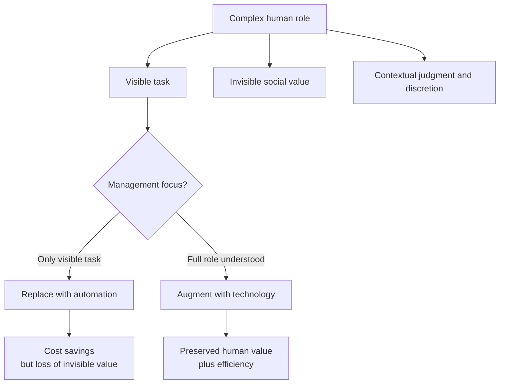

https://youtu.be/f-QzIum9bNU?si=TocrCcaSBRWNd77J

https://theconversation.com/the-doorman-fallacy-why-careless-adoption-of-ai-backfires-so-easily-268380

https://en.wikipedia.org/wiki/Rory_Sutherland_(advertising_executive)#cite_note-16

https://www.challengingintelligence.com/rodin/the-doorman-fallacy-in-the-age-of-ai/

https://www.sahilbloom.com/newsletter/the-doorman-fallacy

https://www.jaakkoj.com/concepts/doorman-fallacy

# Defining and Describing The Doorman Fallacy

_The doorman fallacy is the mistake of reducing a rich, multi-layered human role to its most visible task, then declaring it “replaceable” by a cheaper technology or process._[^rgg9dq] [^5ke5k6]

The term comes from British advertising executive Rory Sutherland’s story of a hotel that fires its doorman after installing an automatic door, assuming that “opening the door” is the doorman’s only value. [^1nd0r9] [^rgg9dq] [^2nx7nt] In reality, the doorman also greets guests, signals prestige, deters trouble, helps with taxis and bags, and provides subtle emotional and social value that is hard to quantify. [^1nd0r9] [^rgg9dq] [^5ke5k6] The doorman fallacy applies whenever organizations, engineers, or policymakers chase efficiency by automating or stripping down roles based only on their most obvious functions, ignoring hidden, contextual, or relational value. [^vbjn4d] [^rgg9dq] [^5ke5k6] It matters especially in discussions of AI, automation, and “lean” management, where failing to see this invisible value can lead to worse service, weaker trust, and long-term strategic damage despite short-term cost savings. [^vbjn4d] [^rgg9dq] [^9easew]

# Uses in Context

- Used in management and AI debates to warn against “reducing rich and complex human roles to a single task and replacing people with AI,” which “fails to acknowledge the intricate interactions and adaptability that humans contribute to their jobs.”[^rgg9dq]  
- Invoked in automation strategy as a critique of approaches that “prize efficiency above all else” and “completely ignore what is lost in the process of automation.”[^vbjn4d]  
- Cited in business writing as a mental model: “It arises when you ground your understanding of value in only the most visible function or skills, while failing to appreciate the full scope of tangible and intangible contributions.”[^5ke5k6]  
- Used by philosophers and social commentators as shorthand for “when you define a job by its most visible elements and ignore everything else about it.”[^fdcj58]  
- Employed in discussions of AI deployment in services like hospitality, customer support, and healthcare as a warning that careless adoption “backfires so easily” when organizations underestimate the human elements of roles. [^rgg9dq] [^9easew]  

# History of Use

## Origins

- The phrase **“doorman fallacy”** is attributed to British advertising executive **Rory Sutherland**, who popularized it in talks and media by telling “a famous story about a London hotel who wanted to fire a doorman” after installing an automatic door to save money. [^1nd0r9] [^2nx7nt]  
- The term is explicitly linked in secondary sources to Sutherland’s 2019 book **_Alchemy_**, which one analysis notes as where “the term was introduced…He uses the example of a hotel doorman to demonstrate how businesses can miscalculate the value of a person’s contributions to their role.”[^rgg9dq]  
- In Sutherland’s formulation, the fallacy is “when we define a job by its most visible elements and ignore everything else about it,” using the doorman as the archetypal case. [^fdcj58]  

## Evolution

- **2019–2021 – Management and mental-model circles.** After _Alchemy_, the story diffused into business and productivity writing, where authors reframed it as a general principle about hidden value in roles and relationships, summarizing it as grounding value “in only the most visible function or skills” while missing intangible contributions. [^5ke5k6]  
- **Early–mid 2020s – AI and automation debates.** As generative AI and large-scale automation spread, writers in AI ethics and organizational analysis began using the doorman fallacy as a key caution: organizations are “falling for what is known as the doorman fallacy: reducing rich and complex human roles to a single task and replacing people with AI.”[^rgg9dq] [^vbjn4d]  
- **2020s – Broader philosophical framing.** Commentators in communities like Effective Altruism extend it beyond business efficiency, arguing that “seen in this light, the Doorman Fallacy offers more than a critique of business efficiency. It becomes a lens through which to examine the trajectory of human labor, dignity, and meaning in an AI-driven world.”[^9easew]  

# Best Real-World Examples

- [Automatic hotel lobby doors replacing traditional doormen in urban hotels](), where cost-cutting overlooks “enhancing guest experience, providing security, and adding prestige.”[^1nd0r9] [^rgg9dq]  
- [Chatbot-based customer support systems deployed as full replacements for human agents](), which focus on answering queries but sacrifice empathy, trust-building, and nuanced problem-solving that human staff provide. [^vbjn4d] [^rgg9dq] [^9easew]  
- [Self-service checkouts in supermarkets and retail](), adopted for speed and labor savings but often eroding the social interaction, informal security, and guidance roles played by human cashiers. [^vbjn4d] [^rgg9dq]  
- [AI triage and symptom-checker tools in healthcare portals](), used to replace initial human contact rather than augment clinicians, potentially missing the relational and interpretive work nurses and front-desk staff do. [^rgg9dq] [^9easew]  
- [Automated moderation tools in online communities](), applied to replace human moderators instead of supporting them, over-focusing on rule enforcement while under-valuing community trust, contextual judgment, and conflict mediation. [^9easew]  
- [Fully automated “smart office” visitor-management kiosks](), which substitute badges and QR codes for receptionists, ignoring the latter’s informal security screening, wayfinding help, and cultural signaling to visitors. [^vbjn4d] [^5ke5k6]  

# Case Studies

### 1. The Hotel Doorman and the Automatic Door

In Rory Sutherland’s canonical illustration, a London hotel decides to eliminate its doorman after installing an automatic door, reasoning that the doorman’s role is simply to open and close the door and can therefore be automated to “save some money.”[^1nd0r9] [^2nx7nt] Once the doorman is gone, the hotel also loses a cluster of less visible functions: the doorman “held taxis for people,” “kept undesirables away,” offered “a familiar face for returning guests,” and “added prestige to your hotel.”[^1nd0r9] Sutherland emphasizes that the doorman “did so much more than just open and close the door” and that these “intangibles” were never captured in the narrow functional analysis that justified his removal. [^1nd0r9] [^fdcj58] This case shows the doorman fallacy in pure form: by defining the job by its most visible element and optimizing only for surface efficiency, management destroys a set of social, emotional, and reputational benefits that were central to the hotel’s value proposition. [^1nd0r9] [^rgg9dq] [^5ke5k6]  

### 2. Careless AI Adoption in Service Organizations

Contemporary analyses of AI adoption describe organizations “falling for what is known as the doorman fallacy” when they replace human workers whose roles are “rich and complex” with AI systems that only replicate a single, easily measurable task. [^rgg9dq] For example, companies deploy chatbots or automated decision tools because they can answer FAQs or process forms quickly, while ignoring that employees also “provide valuable contributions in subtle ways” that affect “the overall success of the organization and the satisfaction of customers.”[^rgg9dq] An article on AI strategy argues that this fallacy “completely ignores what is lost in the process of automation because it prizes efficiency above all else,” and warns that careless adoption “backfires so easily” when it degrades trust, experience, or long-term outcomes. [^vbjn4d] [^rgg9dq] As a corrective, these authors recommend broadening the definition of efficiency to include customer experience and long-term results, and using AI to **augment** rather than replace roles that rely on context, personal engagement, and trust. [^vbjn4d] [^rgg9dq] [^9easew] This case study demonstrates how the doorman fallacy operates at scale in AI transformation programs, not just in isolated anecdotes.  

### 3. The Doorman Fallacy as a Lens on Human Labor and Meaning

In philosophical and future-of-work discussions, particularly in communities such as the Effective Altruism forum, writers extend the doorman fallacy beyond specific business decisions to critique a broader cultural tendency to undervalue the non-instrumental aspects of work. [^9easew] One essay argues that, “seen in this light, the Doorman Fallacy offers more than a critique of business efficiency. It becomes a lens through which to examine the trajectory of human labor, dignity, and meaning in an AI-driven world.”[^9easew] On this view, the error is not only about mispricing hidden services but also about treating human roles as bundles of tasks rather than as sources of identity, community, and moral agency. [^9easew] Debates about replacing teachers, caregivers, or therapists with AI-driven systems often reveal this deeper dimension: even where AI can perform narrow instructional or diagnostic tasks, it lacks the relational, ethical, and symbolic functions that those roles embody. [^rgg9dq] [^9easew] This expanded use of the doorman fallacy shows how a concrete management anecdote evolved into a more general critique of reductionist thinking in labor and technology policy.  

***

# Sources

[^1nd0r9]: [What is the Doorman Fallacy? - YouTube](https://www.youtube.com/watch?v=9_l12-nmYQo)
[^vbjn4d]: [The doorman fallacy (in the age of AI) - Challenging Intelligence |](https://www.challengingintelligence.com/rodin/the-doorman-fallacy-in-the-age-of-ai/)
[^rgg9dq]: [The 'doorman fallacy': why careless adoption of AI backfires so easily](https://theconversation.com/the-doorman-fallacy-why-careless-adoption-of-ai-backfires-so-easily-268380)
[^fdcj58]: [The Doorman Fallacy When you reduce something to its most visible ...](https://www.facebook.com/philosophyminis/videos/sutherland-the-doorman-fallacywhen-you-reduce-something-to-its-most-visible-elem/958297340416486/)
[^2nx7nt]: [Sutherland: The Doorman Fallacy - YouTube](https://www.youtube.com/shorts/CWf03RbJapw)
[^5ke5k6]: [The Doorman Fallacy | The Curiosity Chronicle - Sahil Bloom](https://www.sahilbloom.com/newsletter/the-doorman-fallacy)
[^9easew]: [The Doorman Fallacy — EA Forum](https://forum.effectivealtruism.org/posts/SpQvNfwDhrKikaHkx/the-doorman-fallacy)
