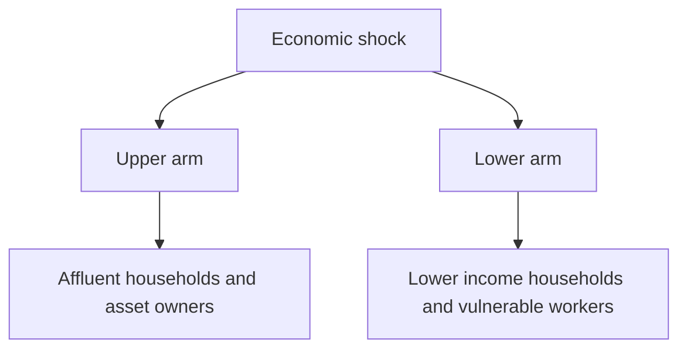

---
aliases:
  - K-Economy
date_created: 2026-10-09
date_modified: 2026-10-10
tags:
  - Policy-Tailwinds
  - Impact-Investors
  - Global-Macroeconomics
  - Gig-Economy-Examples
  - Lossless-Thinking
site_uuid: b5747d53-5387-4cc6-899c-46a74fd5bac5
publish: true
title: The K-Shaped Economy
slug: the-k-shaped-economy
at_semantic_version: 0.0.0.1
cf_last_run: 2026-10-10T04:15:53.190Z
cf_last_run_model: Perplexity sonar-pro
---

# Defining and Describing The K-Shaped Economy

- _A K-shaped economy is one in which prosperity rises for some groups while worsening for others at the same time._
- The term describes sharply divergent economic outcomes following a recession, pandemic, or other shock: high-income households, asset owners, and stronger sectors move upward, while lower-income households, financially vulnerable workers, and weaker sectors stagnate or decline. [^0czhf1] [^lvy26o]
- It is an analytical shorthand rather than a formal academic classification. [^lvy26o] The “upper arm” commonly represents rising income, wealth, spending, or employment among affluent households, while the “lower arm” represents deteriorating conditions among poorer households. [^0czhf1] [^nuo5eb]
- The concept matters because strong aggregate indicators can conceal substantial differences in lived economic conditions across income groups, sectors, and communities. [^xbe8rp]

# Uses in Context

- **Macroeconomic analysis:** Analysts use “K-shaped recovery” to describe a post-downturn rebound in which some parts of the economy expand while others continue to contract or lag. [^lvy26o]
- **Distributional analysis:** The term is used to compare high- and low-income households’ movements in wealth, wages, spending, and financial security. [^0s4qqb]
- **Pandemic commentary:** During the COVID-19 recovery, it described the contrast between digitally enabled businesses and higher-income households that recovered quickly and service workers or small businesses that recovered more slowly. [^8o9q7o]
- **Consumer research:** Researchers and journalists use it to explain divergent consumer confidence and spending, including affluent consumers spending confidently while less wealthy households struggle to meet basic costs. [^rp378a]
- **Investment discussion:** The framework is applied to markets when stock-market and home-price gains benefit asset owners while inflation, borrowing costs, or weaker credit conditions pressure lower-income households. [^rkj2y0] [^8om6ww]
- **Public-policy debate:** Policymakers invoke the term to question whether headline growth, employment, or spending figures accurately represent conditions across the income distribution. [^xbe8rp] [^ngze6j]

# History of Use

## Origins

- The term **entered popular use in 2020** during discussion of the uneven economic recovery from the COVID-19 pandemic. [^rp378a] [^0s4qqb]
- Its early context was a debate over whether the recovery would resemble a V, U, or L; observers used “K-shaped” to describe simultaneous upward and downward trajectories rather than a single national recovery path. [^rkj2y0]
- Public accounts attribute the term’s pandemic popularization to commentary surrounding the unequal recovery, including social-media usage that framed the experience of different groups as “K-shaped.” [^p2lgjc] [^rp378a]

## Evolution

- **2020 — Pandemic recovery:** “K-shaped recovery” became a widely used label for the split between rapidly recovering higher-income households and businesses and more exposed lower-wage workers, service businesses, and financially vulnerable households. [^xbe8rp] [^8o9q7o] [^0s4qqb]
- **2025 — Broader popular usage:** The term expanded beyond labor-market recovery to describe divergent consumer outlooks, spending patterns, corporate performance, wages, and wealth accumulation. [^rp378a] [^0s4qqb]
- **2026 — Empirical qualification:** Federal Reserve-affiliated research emphasized that there is no single accepted definition and tested whether household outcomes actually moved in opposite directions. Some research found a canonical K pattern, while other findings described a bifurcated recovery in which both income groups’ spending grew but at sharply different rates. [^0czhf1] [^ngze6j]

# Best Real-World Examples

- [COVID-19 pandemic recovery](https://fedcommunities.org/research/worker-perspectives-economic-context-methodology/) — a widely cited example of high-income and digitally enabled segments recovering faster than exposed service workers and small businesses. [^xbe8rp] [^8o9q7o]
- [U.S. household income distribution](https://www.richmondfed.org/publications/research/economic_brief/2026/eb_26-23) — Richmond Fed research defines a K-shaped outcome as improving conditions for high-income households alongside worsening conditions for low-income households. [^0czhf1]
- [Affluent consumer spending](https://fortune.com/article/what-is-k-shaped-economy-wealth-inequality-explained/) — wealthier households’ asset gains and stronger spending illustrate the upper arm of the K. [^rkj2y0]
- [Lower-income household finances](https://www.pbs.org/newshour/economy/bessent-said-the-k-shaped-economy-is-over-heres-what-financial-experts-say) — comparatively weaker wage, wealth, and spending outcomes illustrate the lower arm. [^0s4qqb]
- [U.S. payments data](https://www.atlantafed.org/research-and-data/publications/policy-hub-papers/2026/05/18/03-k-shaped-economy-or-not-evidence-from-payments-survey) — survey evidence tests whether higher- and lower-income consumer spending actually moved in opposite directions. [^ngze6j]
- [Stock and housing asset gains](https://www.gulf-times.com/morearticles/business?pgno=142) — rising financial and housing assets can support affluent consumers even as inflation and tighter credit pressure poorer households. [^8om6ww]

# Case Studies

The **COVID-19 recovery** is the defining case. Higher-income households and large corporations often benefited from digitalization, financial-market gains, and the ability to work remotely, while low-income service workers and small businesses faced greater exposure to shutdowns and slower recovery. [^8o9q7o] The contrast produced the now-standard image of the upper arm representing rising wealth and income and the lower arm representing persistent vulnerability. [^xbe8rp] [^rp378a] The case shows that a national recovery can be positive in aggregate while remaining sharply unequal across occupations, assets, and income groups.

The **asset-driven divergence in household consumption** illustrates how wealth can reinforce the upper arm. Affluent Americans benefited from appreciation in stocks and homes, while lower-income households faced higher living costs, mortgage rates, and shrinking access to credit. [^rkj2y0] One reported estimate attributed nearly half of U.S. consumer spending in the second quarter of 2025 to the top 10 percent of wealthiest Americans. [^rkj2y0] This case shows why spending growth alone does not establish broad-based prosperity: the source and distribution of spending matter.

The **debate over payments evidence** demonstrates the concept’s analytical limits. The canonical K-shaped account predicts falling spending among lower-income consumers and rising spending among higher-income consumers, but Atlanta Fed research reported that both groups’ spending increased, albeit at sharply different rates. [^ngze6j] Richmond Fed researchers likewise noted that definitions vary according to how households are grouped and which outcomes are measured. [^0czhf1] The case shows that “K-shaped” is useful as a shorthand for divergence, but empirical analysis must specify the population, time period, and metric being compared.

***

# Sources

[^0czhf1]: [Is the US Economy K-Shaped? Evidence From the Past Three ...](https://www.richmondfed.org/publications/research/economic_brief/2026/eb_26-23)
[^xbe8rp]: [Worker Perspectives | Economic Context and Methodology](https://fedcommunities.org/research/worker-perspectives-economic-context-methodology/)
[^rkj2y0]: [What is the K-shaped economy, where the rich are getting ...](https://fortune.com/article/what-is-k-shaped-economy-wealth-inequality-explained/)
[^nuo5eb]: [Explaining the K-Shaped Economy | Richmond Fed](https://www.richmondfed.org/podcasts/speaking_of_the_economy/2026/speaking_2026_06_17_k-shaped_economy)
[^lvy26o]: [K-Shaped Economy - Causes, Examples, and Market Impact](https://www.fe.training/free-resources/investment-banking/k-shaped-economy/)
[^8om6ww]: [Gulf Times](https://www.gulf-times.com/morearticles/business?pgno=142)
[^ngze6j]: [www.atlantafed.org · research-and-dataK-shaped Economy or Not? Evidence from a Payments Survey](https://www.atlantafed.org/research-and-data/publications/policy-hub-papers/2026/05/18/03-k-shaped-economy-or-not-evidence-from-payments-survey)
[^p2lgjc]: [Here's why everyone's talking about a 'K-shaped' economy](https://www.theglobeandmail.com/investing/markets/commodities/ESH24/pressreleases/36382190/here-s-why-everyone-s-talking-about-a-k-shaped-economy/)
[^8o9q7o]: [Understanding the K-Shaped Economy: Recovery and ...](https://www.linkedin.com/posts/klatch_a-k-shaped-economy-or-k-shaped-recovery-activity-7391140754011693056-dgru)
[^rp378a]: [When Did Everything Become 'K-Shaped'?](https://www.nytimes.com/2025/12/19/business/k-shaped-economy.html)
[11]: [What is a K-Shaped Recovery? The ABCs of Economics](https://www.rbcdirectinvesting.com/learn/en/di/hubs/now-and-noteworthy/article/what-is-a-k-shaped-recovery/kedfim3z)
[^0s4qqb]: [Bessent said the K-shaped economy ‘is over.’ Here’s what financial experts say](https://www.pbs.org/newshour/economy/bessent-said-the-k-shaped-economy-is-over-heres-what-financial-experts-say)
[13]: [COVID's uneven recovery still haunts the economy](https://www.marketplace.org/story/2025/11/11/kshaped-economy-mirrored-by-covids-uneven-recovery)
[14]: [The K-Shaped Economy in 2026](https://www.usbank.com/corporate-and-commercial-banking/insights/economy/macro/k-shaped-economy.html)
[15]: [K-Shaped Recovery Economics: Structural Divergence After the Polycrisis](https://maseconomics.com/k-shaped-recovery-economics-structural-divergence-after-the-polycrisis/)
