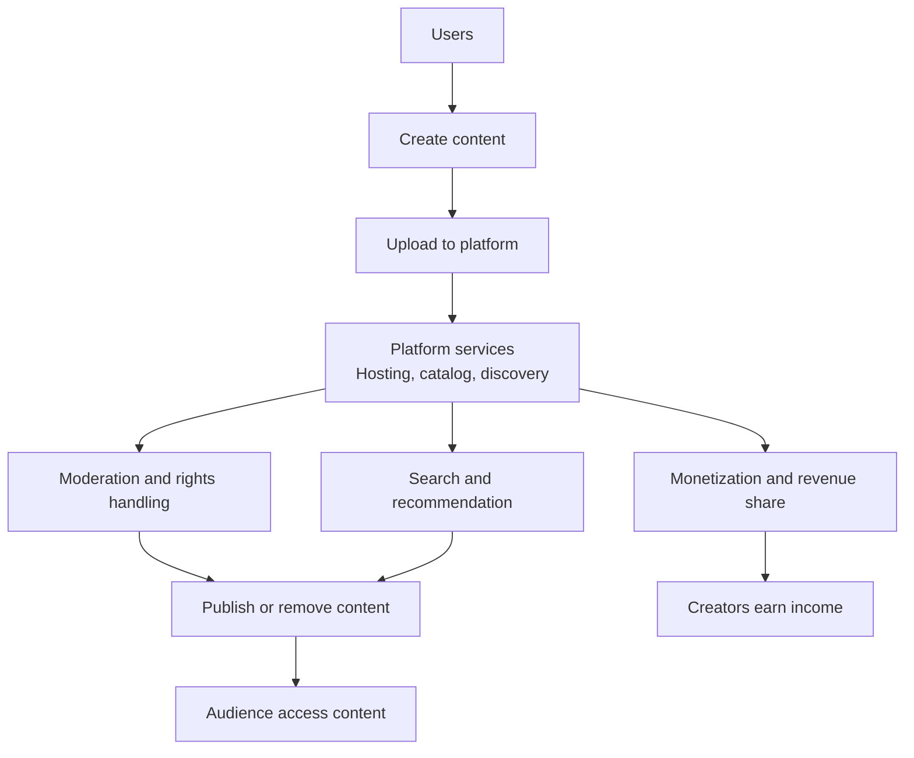

---
aliases:
  - user generated content
  - User-Generated Content
  - UGC-Communities
date_created: 2024-11-02
date_modified: 2026-06-06
cf_last_run: 2026-06-06T04:14:32.016Z
cf_last_run_model: Perplexity sonar-pro
---

[[Sources/UGC Communities/Quora|Quora]]
[[organizations/Reddit|Reddit]]
[[Sources/Media/HackerNews|HackerNews]]
[[Sources/Media/Substack|Substack]]

# Defining and Describing UGC-Platforms

_UGC-platforms are digital services built around content that users themselves create, upload, and share, rather than content produced only by the platform owner._

In most industry and legal discussions, **UGC-platforms** (user-generated content platforms) are online services where the primary value comes from users posting their own text, images, video, audio, or other media, while the platform provides hosting, discovery, moderation, and monetization layers.[3] These platforms matter because they concentrate both creative opportunity (for “UGC creators” who now work with brands and advertisers) and legal risk (around copyright, defamation, and safe-harbor rules such as the DMCA).[3][4] The term applies across social networks, video‑sharing sites, game platforms, and creator marketplaces, wherever “users generate and upload content” and the platform intermediates access, search, and monetization.[1][3] In business and policy debates, UGC-platforms are key to understanding modern online advertising, influencer and creator economies, and the regulatory treatment of intermediaries.[3][4]

# Uses in Context

- In legal and compliance writing, “UGC platforms” are discussed as services that must handle copyright notices and takedown requests, with warnings that “ignoring copyright claims on UGC platforms can lead to lawsuits, statutory damages, and loss of DMCA safe harbor protection.”[3]
- In brand and marketing guidance, UGC-platforms are the places where “UGC creators make money working with brands” by producing content *for* or *on* these platforms, often without needing large followings, but leveraging the platform’s distribution and ad tools.[4]
- In game backend documentation, platform providers describe adding UGC capabilities to games so that “creators can review and access draft items before publishing them” and, once published, “all players can access the item in the public catalog,” explicitly referring to this workflow as a **UGC system** within the platform.[1]
- In SEO and growth tactics, many social and creator networks are implicitly treated as UGC-platforms when they are listed as “profile creation sites” where users build profiles and add content and links, relying on the fact that these services host user-created material and public profiles.[2]
- In policy reports and law-firm blogs, the term “UGC platforms” is invoked to distinguish intermediaries that host third‑party content from traditional publishers, because these platforms “rely on user-uploaded content” and thus fall under special liability regimes like the DMCA’s safe-harbor for service providers.[3]

# History of Use

## Origins

- The underlying idea of user-generated content emerged in the early Web 2.0 era, as services like early blogs, forums, and media-sharing sites made it easy for ordinary users to publish online; in this context, policy and legal commentary began referring to “user-generated content platforms” to distinguish them from editorially controlled media.[3]
- Legal analyses of the DMCA and similar regimes adopted “UGC platforms” as a category label for online services that “host and transmit content uploaded by users” and must therefore manage copyright notices, counter-notices, and takedowns to maintain safe-harbor status.[3]
- As social networks, video-sharing sites, and creator communities expanded, marketing and business literature started to treat “UGC platforms” as a distinct business type, emphasizing network effects, creator ecosystems, and advertising-based monetization built around user submissions.[3][4]

*(Search results do not surface a clean “first coinage” of the exact phrase “UGC-platforms”; the term appears to have arisen organically in legal and industry writing around user-generated content and DMCA-style regulation.[3])*

## Evolution

- **2000s – Web 2.0 and legal framing:** As interactive websites with comments, uploads, and social features spread, policy writers began to group them as “user-generated content platforms,” focusing on how DMCA safe harbors applied to services that store and transmit user uploads.[3]
- **2010s – Creator economy and platform design:** With the rise of influencers and creators, industry and marketing texts shifted to describing UGC-platforms as ecosystems where individuals could earn by “working with brands” and monetizing their content through platform tools, sponsorships, and ad revenue shares.[4]
- **2020s – Structured UGC systems in vertical platforms:** Cloud and backend providers now ship explicit “UGC” modules—such as catalog APIs for draft, publish, and search of UGC items—so that games and apps can embed full UGC workflows within their own platforms.[1] At the same time, legal discussions highlight growing risk for “UGC platforms” that fail to respond properly to copyright claims.[3]

# Best Real-World Examples

- [PlayFab UGC system](https://learn.microsoft.com/en-us/gaming/playfab/economy-monetization/economy-v2/ugc/quickstart) – A backend service that lets games implement UGC workflows where users create draft items, then publish them so “all players can access the item in the public catalog.”[1]
- [Mediacube UGC creator programs](https://mediacube.io/en-US/blog/how-ugc-creators-make-money) – A media company describing how “UGC creators make money working with brands,” illustrating how platforms and intermediaries support user-content monetization.[4]
- [Typical UGC social and creator networks](https://www.w3era.com/blog/seo/profile-creation-sites-list/) – Numerous services listed as “profile creation sites” (such as LinkedIn, GitHub, Behance, and others) operate fundamentally as UGC-platforms where users build public profiles and share their own content.[2]
- [Law-firm guidance on UGC platforms](https://patentpc.com/blog/legal-risks-of-ignoring-copyright-claims-on-ugc-platforms) – Legal practitioners use “UGC platforms” to describe services whose main activity is hosting user-uploaded content and that must respond to copyright notices under the DMCA to avoid liability.[3]
- [Game titles integrating UGC catalogs via backend](https://learn.microsoft.com/en-us/gaming/playfab/economy-monetization/economy-v2/ugc/quickstart) – Online games that let players design and upload items (e.g., skins, levels, or mods) using a UGC backend exemplify domain-specific UGC-platforms inside the gaming ecosystem.[1]

# Case Studies

**1. Game backend UGC system (PlayFab)**  
Microsoft’s PlayFab documentation describes how a game can implement a full UGC workflow as part of its own platform: players authenticate to receive an entity token, then “create ‘draft’ UGC items by calling the CreateDraftItem API with the 'Type':'ugc' parameter.”[1] Creators can “review and access draft items before publishing them,” and when ready, the game or creator calls `PublishDraftItem`; after this publish call succeeds, “all players can access the item in the Public Catalog.”[1] The platform provides additional APIs so a title entity can “get draft item IDs for a particular player” and run catalog searches over published UGC, returning paginated results.[1] This case illustrates how a UGC-platform, even when embedded inside a single game, separates user roles (creator vs. consumer), content states (draft vs. published), and platform responsibilities (authentication, cataloging, search, and access control) into a coherent service layer.[1]

**2. Legal risk management for UGC-platforms**  
A law-firm analysis of “legal risks of ignoring copyright claims on UGC platforms” explains that platforms hosting user uploads can face serious liability if they mishandle takedown notices.[3] Under the DMCA, service providers can qualify for safe-harbor protections if they implement a notice-and-takedown process and “expeditiously remove or disable access” to allegedly infringing content once notified.[3] The article warns that if a UGC-platform “ignores or delays responses to copyright claims,” it can be sued for contributory or vicarious infringement and lose safe-harbor status, exposing it to statutory damages per infringed work.[3] This case study shows that operating a UGC-platform is not just a technical exercise in hosting and search; it requires robust legal and operational processes for rights management and user disputes.[3]

**3. UGC creators and brand collaborations on platforms**  
Mediacube’s guide on “How UGC Creators Make Money Working With Brands” treats UGC-platforms as the main stage for paid collaborations between individual creators and advertisers.[4] It emphasizes that “you don’t need followers to become a UGC creator,” because the value lies in producing authentic content (e.g., product reviews, demos, or testimonials) that brands can use in ads and on their own channels, often originating on or tailored for major social or video platforms.[4] The article outlines steps for creators—building a portfolio, setting rates, and pitching to brands—while assuming the existence of UGC-platforms that handle hosting, analytics, and advertising tools.[4] This narrative highlights how UGC-platforms underpin the broader creator economy by enabling individuals to generate income from user-produced media without owning distribution infrastructure themselves.[4]

***

# Sources

[1]: [User Generated Content (UGC) quickstart - PlayFab - Microsoft Learn](https://learn.microsoft.com/en-us/gaming/playfab/economy-monetization/economy-v2/ugc/quickstart)
[2]: [Profile Creation Sites List 2026 — Dofollow + High DA - W3era](https://www.w3era.com/blog/seo/profile-creation-sites-list/)
[3]: [Legal Risks of Ignoring Copyright Claims on UGC Platforms](https://patentpc.com/blog/legal-risks-of-ignoring-copyright-claims-on-ugc-platforms)
[4]: [How UGC Creators Make Money Working With Brands - Mediacube](https://mediacube.io/en-US/blog/how-ugc-creators-make-money)
