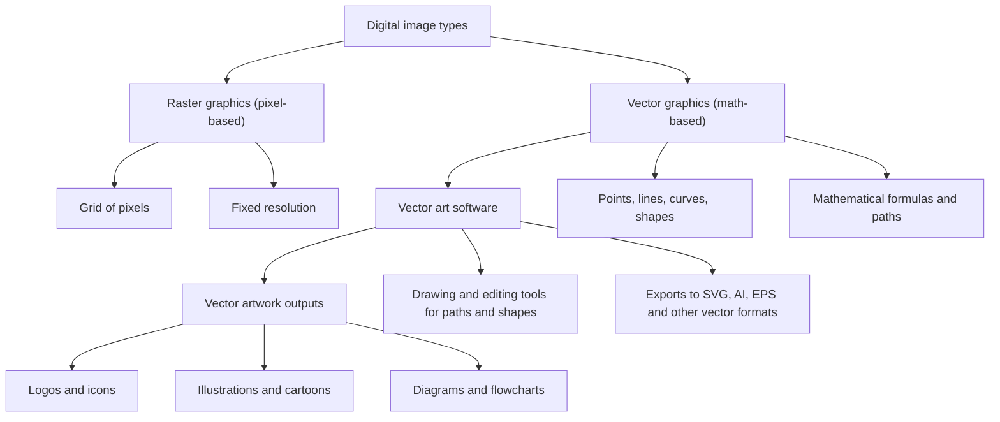

---
aliases:
  - Vector Graphics Software
  - Vector Graphics Editor
date_created: 2026-06-09
date_modified: 2026-07-24
cf_last_run: 2026-07-24T14:59:40.252Z
cf_last_run_model: Perplexity sonar-pro
---

[[Tooling/Creative/Affinity Design Suite|Affinity Design Suite]]
[[Tooling/Enterprise Jobs-to-be-Done/Adobe Illustrator|Adobe Illustrator]]
[[Tooling/Productivity/Inkscape|Inkscape]]

# Defining and Describing Vector Art Software

_Vector art software is the family of design tools that let you draw with **mathematical shapes** instead of pixels, so your artwork can be scaled from icon size to a billboard without ever going blurry.[2][3][6][7][9][10][11][12][15]_

Vector art software is a specialized class of **vector graphics software**: programs that create and manipulate images defined by points, lines, curves, and shapes based on mathematical formulas rather than pixels.[6][9][10][12][15] These tools interpret paths and shapes as a set of *instructions*—such as “draw a curve from point A to point B with control handles at C and D, filled with this colour”—and render them at whatever resolution your screen or printer requires.[2][3][11] They matter in any context where designs must remain crisp at multiple sizes, which is why they are the standard for logos, icons, illustrations, diagrams, and other “clean, geometric, and scalable” artwork.[3][7][9][11][12]

### What Vector Art Software Does

Vector art software:

- Provides drawing tools for **paths** (lines and curves), **shapes**, fills, strokes, and typography that are all defined by mathematical expressions.[2][3][6][11][12][15]
- Stores images as **mathematical descriptions of shapes**—points, lines, curves, and fills—rather than a fixed grid of pixels.[2][3][6][11][12][15]
- Renders artwork at display time by recalculating the pixel output at any requested resolution, making graphics *resolution independent* and “infinitely scalable.”[3][7][9][10][11][12]
- Supports common vector formats such as **SVG, AI, EPS**, which are used widely for logos, icons, diagrams, and other scalable assets.[3][5][8][11]
- Is used for both **artistic and technical illustrations**, including cartoons, clip art, logos, typography, diagrams, and flowcharts.[5][7]

### Vector vs. Raster: Core Distinction

Across guides and tutorials, vector images are consistently defined as graphics that “utilize paths defined by points, lines, curves, and shapes…based on mathematical expressions,” whereas raster images store “tiny colour squares (pixels) arranged in a grid.”[1][2][3][6][7][9][10][11][12][14][15] Vector artwork is thus *resolution independent* and can be “scaled infinitely without quality loss,” while raster imagery is fixed-resolution and will blur or pixelate when enlarged.[2][3][7][9][10][11][12][15]

# Uses in Context

- Design educators and tools explain that **vector graphics software** “enables designers to create images using mathematical formulas instead of pixels, resulting in graphics that can be scaled infinitely without quality loss,” emphasizing its use for logos, icons, and illustrations.[6][9][10][11][12]
- University image guides note that “typically vector art is created in illustration applications such as Adobe Illustrator or CorelDRAW,” and that such vector illustrations are “great for logos, illustrations/artwork, animations, and text.”[7]
- Practical comparison guides describe vector images as “a set of instructions” like *“draw a curve from point A to point B with control handles at C and D, filled with this colour”*, language that directly reflects how vector art software structures and stores artwork.[2][11]
- Tutorials aimed at designers highlight that vector graphics are “always resolution independent” and can be resized “infinitely larger or smaller” while still printing clearly, framing vector art tools as essential for brand identity and print production.[7][9][10][11][12]
- Introductory lessons on vector graphics repeatedly state that “vector graphics are made up of points, lines, curves, and shapes that are all defined by mathematical formulas,” using examples such as creating logos in a “vector program” as the canonical use case.[6][9][10][12][15]

# History of Use

## Origins

- The term **vector graphics software** emerges in educational and technical contexts to distinguish programs that operate on mathematical vector descriptions from raster image editors; instructional materials define it as “a specialized type of digital design program that allows users to create and manipulate images based on mathematical formulas rather than pixels.”[6]
- Early commercial vector drawing applications—such as those later branded as illustration tools—help solidify the colloquial term **vector art software**, since educational guides note that “typically vector art is created in illustration applications such as Adobe Illustrator or CorelDRAW.”[7]
- As open-source tools like Inkscape are described as “a free and open-source software vector graphics editor” used for cartoons, logos, diagrams, and flowcharts, they reinforce the usage of “vector graphics editor” and “vector art” as linked concepts.[5][8]

Given the emphasis in guides and educational sources, the term *vector graphics software* appears to originate in technical and training literature rather than in the marketing of large incumbent companies, with “vector art” arising as the practitioner’s label for artwork produced in such tools.[6][7]

## Evolution

- **1990s–2000s – Desktop illustration era.** As illustration applications became the standard for logo and print design, university guides documented that “typically vector art is created in illustration applications such as Adobe Illustrator or CorelDRAW,” embedding the term “vector art” in formal teaching materials.[7]
- **2000s–2010s – Open-source and multi-platform editors.** The emergence of projects like Inkscape, described as a “free and open-source software vector graphics editor…used for both artistic and technical illustrations,” broadened access to vector art tools beyond commercial incumbents and normalized the term “vector graphics editor” in open-source culture.[5][8]
- **2020s – Cross-platform, non-subscription tools.** Reviews of modern alternatives such as Affinity Designer frame them as “professional vector” tools that target use cases like “logo design, icon creation, illustration, brand identity, print production, and UI asset creation,” indicating a shift toward accessible, high-end vector art software outside the traditional subscription ecosystems.[4][13]

# Best Real-World Examples

- **[Inkscape](url)** – A *free and open‑source software vector graphics editor* released under the GPL, used for cartoons, clip art, logos, typography, diagrams, and flowcharts.[5][8]
- **[Affinity Designer](url)** – A cross‑platform **vector graphics editor** by Serif, positioned as a “professional vector tool” covering most common illustration and branding tasks.[4][13]
- **[Illustration applications such as Adobe Illustrator](url)** – University guides cite these as typical environments where “vector art is created,” especially for logos and illustrations.[7]
- **[CorelDRAW](url)** – Alongside Illustrator, named in research guides as a primary application for creating vector art for illustrations, animations, and text.[7]
- **[SVG-based workflows](url)** – Many vector art tools center their pipelines around SVG, a format that stores “vector graphics” as mathematical descriptions of shapes and is used for scalable on-screen graphics.[3][5][8][11]
- **[Mobile/Inky deployments of Inkscape](url)** – Android solutions that “run Inkscape on Android” reflect how vector art software is being adapted beyond desktop systems while still providing full vector editing capabilities.[8]

# Case Studies

## Inkscape and the Open-Source Vector Art Ecosystem

Inkscape is described as “a free and open-source software vector graphics editor released under a GNU General Public License (GPL) 2.0 or later,” explicitly positioning it as a community-driven alternative to proprietary illustration tools.[5] It is used for “both artistic and technical illustrations such as cartoons, clip art, logos, typography, diagrams, and flowcharts,” showing that open-source vector art software can cover the full spectrum of typical vector use cases.[5] By relying on vector graphics to “allow for sharp printouts and renderings at unlimited resolution” and avoiding a fixed pixel grid, Inkscape demonstrates the core principle of vector art software: resolution-independent graphics suitable for print and screen at any scale.[5][3][7][9][11] The project’s use of scalable formats such as SVG, and its deployment through tools like Inky that run Inkscape on Android, illustrates how an open-source initiative can pioneer accessible, cross-platform vector art creation outside incumbent ecosystems.[5][8]

## Affinity Designer as a Modern Professional Vector Tool

Affinity Designer is reviewed as “Serif’s vector graphics editor” that “targets the same market as Illustrator: logo design, icon creation, illustration, brand identity, print production, and UI asset creation.”[4] It is characterized as “a professional vector tool that covers 90% of what most designers use Illustrator for,” highlighting how a relatively lean, newer entrant can match or exceed incumbent capabilities in core vector art workflows.[4] This positioning shows vector art software evolving toward affordable, high-performance tools that still provide advanced features—precise path editing, robust typography, export pipelines—without relying on legacy subscription models.[4] Affinity Designer’s success exemplifies how specialized vector art software from a smaller company can reshape professional practice by offering modern workflows for cross-platform illustration and branding, while relying on the same mathematical, resolution-independent foundations that define vector graphics.[2][3][4][6][11][12]

## Educational Guides and the Codification of “Vector Art”

University research guides and design tutorials play a significant role in codifying how practitioners understand vector art software. One guide explains that “vector images keep track of points and the equations for the lines that connect them,” emphasizing that such images are “made up of paths or line art that can [be] infinitely scalable because they work based on algorithms rather than pixels.”[7] The same guide notes that “typically vector art is created in illustration applications such as Adobe Illustrator or CorelDRAW,” explicitly linking the term “vector art” to a class of software tools rather than to a file format alone.[7] Lessons on vector graphics software further describe it as enabling designers to “create and manipulate images based on mathematical formulas rather than pixels,” reinforcing the conceptual distinction between vector art programs and raster editors.[6] Collectively, these educational materials show how teachers, not corporate marketing, formalized the idea of “vector art software” as the standard toolkit for producing resolution‑independent logos, icons, and illustrations.[6][7][9][10][11][12][15]

***

# Sources

[1]: [Vector vs raster images](https://medium.com/@projektiden/vector-vs-raster-images-06e256b76493)
[2]: [Vector vs Raster Images: The Complete 2026 Guide to File ...](https://www.digitalpolo.com/vector-vs-raster-explained/)
[3]: [Vector vs Raster Graphics: When to Use Each — QuicklySave](https://www.quicklysave.com/guides/vector-vs-raster/)
[4]: [Affinity Designer Review 2026: Professional Vectors Without ...](https://www.uiguides.com/tools/affinity-designer-review)
[5]: [Inkscape](https://en.wikipedia.org/wiki/Inkscape)
[6]: [What is Vector Graphics Software? | Features, Benefits & ...](https://study.com/academy/lesson/what-is-vector-graphics-software-features-benefits-examples.html)
[7]: [Raster vs. Vector Images - All About Images - Research Guides](https://guides.lib.umich.edu/c.php?g=282942&p=1885352)
[8]: [Inky - Run Inkscape on Android – Apps on Google Play](https://play.google.com/store/apps/details?id=tech.ula.inkscape&hl=en_GB)
[9]: [Raster vs Vector, Resolution & DPI Explained | Understanding ...](https://www.youtube.com/watch?v=uKQ0ugsjuyI)
[10]: [The Difference Between Raster and Vector (And Why It's Critical for Designers)](https://www.youtube.com/watch?v=bR0LxQwLx2E)
[11]: [Raster vs Vector Graphics: The Definitive Comparison (with ...](https://www.svggenie.com/blog/raster-vs-vector-complete-comparison)
[12]: [How Do Vector Graphics Differ From Raster For Design? - Graphic Design Nerd](https://www.youtube.com/watch?v=8VJLyJOjC4I)
[13]: [Affinity Designer - Wikipedia, entziklopedia askea.](https://eu.wikipedia.org/wiki/Affinity_Designer)
[14]: [What is Raster (Bitmap image) )or Vector Images | Difference, Examples & When to Use Raster / Vector](https://www.youtube.com/watch?v=ShOqSeq8bYU)
[15]: [Graphic Design की दुनिया: Raster और Vector में फर्क// Beginner’s Guide to Raster & Vector Graphics](https://www.youtube.com/watch?v=o-uUqU28ie4)
