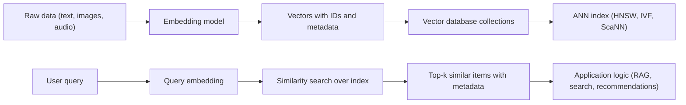

Vector databases date back to the early 2000s, with significant developments occurring over the years. The first commercial vector database was released in 2010 by a company called VectorWise, which was later acquired by Actian in 2011 [^pmy0ys]

[[Tooling/AI-Toolkit/AI Infrastructure/LanceDB|LanceDB]]
[[Tooling/AI-Toolkit/AI Infrastructure/Weaviate|Weaviate]]
[[Tooling/Software Development/Databases/Qdrant|Qdrant]]
[[ChromaDB]]
[[Tooling/Software Development/Databases/Pinecone|Pinecone]]

***

# Footnotes
***

# Vector Databases: Infrastructure for Semantic Search and High‑Dimensional Data

Vector databases are specialized data management systems designed to store, index, and query high‑dimensional numerical representations of data—known as embeddings—so that applications can retrieve information by meaning and similarity rather than by exact keyword or ID matches. [^333yt4] [^i64c68] [^k3za30] [^2z6ca7] They have emerged as a core component of modern AI stacks because they efficiently handle dense vectors produced by machine learning models from text, images, audio, and other unstructured inputs, enabling use cases such as semantic search, recommendation systems, multi‑modal retrieval, and retrieval‑augmented generation (RAG). [^333yt4] [^i64c68] [^k3za30] [^2z6ca7] In contrast to traditional relational databases, which focus on structured records and exact lookups, vector databases optimize approximate nearest neighbor (ANN) similarity search at scale, using metrics like cosine similarity, Euclidean distance, and dot product over thousands of dimensions. [^333yt4] [^i64c68] [^k090fc] [^ylyu5g] Over the last several years, open‑source projects such as Milvus, Weaviate, Qdrant, and Vespa have pioneered production‑grade vector databases, while incumbents have integrated vector search capabilities into existing systems like PostgreSQL (via pgvector), SQL Server, Elasticsearch, MongoDB, Redis, and Oracle’s Autonomous AI Vector Database. [^k090fc] [^ricck4] [^gw6a1o] [^norzy0] [^9ydbr9] [^s7lgqg] [^0mvt3u] [^5otyzk] [^ylyu5g] Together, these developments make vector databases a foundational element of AI‑driven applications that must reason over large volumes of unstructured, high‑dimensional data in real time. [^i64c68] [^k3za30] [^2z6ca7]

## Defining and Describing Vector Databases

[IMAGE 1: Conceptual diagram of a vector database pipeline showing raw text and images flowing into an embedding model, then into a vector index, with query vectors returning similar items to an application.]

_Vector databases are what let software “remember” and compare meaning rather than just matching strings or IDs._

A vector database is a specialized type of database designed to store, index, and search high‑dimensional vector representations of data, commonly referred to as embeddings. [^333yt4] [^i64c68] [^k3za30] [^2z6ca7] These embeddings are dense numerical arrays produced by machine learning models that capture semantic meaning, context, and relationships within the original data, such that similar items are located near each other in a continuous high‑dimensional space. [^333yt4] [^i64c68] [^k3za30] [^2z6ca7] Unlike traditional databases, which rely on exact matches or simple range predicates, vector databases use similarity search techniques—such as cosine similarity, Euclidean distance, or dot product—to find items that are semantically or visually similar to a query rather than identical to it. [^333yt4] [^i64c68] [^k3za30] [^2z6ca7] [^ylyu5g] This design makes them particularly important for tasks such as semantic search, recommendation systems, clustering, classification, multi‑modal search, and cross‑lingual matching, all of which depend on comparing complex items by meaning rather than by literal representation. [^333yt4] [^i64c68] [^k3za30] [^2z6ca7] In practice, vector databases act as a core retrieval substrate in many AI applications, translating user queries into vectors and rapidly returning the nearest neighbors among millions or billions of stored embeddings. [^i64c68] [^k3za30] [^2z6ca7] [^dp4qoo]

### Formal Definition and Core Concepts

From a formal perspective, a vector database can be defined as a data management system whose primary data type is a numerical vector \( \mathbf{v} \in \mathbb{R}^d \), where \(d\) denotes the dimensionality of the embedding space. [^333yt4] [^i64c68] [^k3za30] [^2z6ca7] Each stored record typically consists of at least a unique identifier, one or more vector fields, and optional metadata fields containing structured information such as labels, timestamps, categories, or scores. [^gw6a1o] [^k3za30] [^im0zjp] [^g1lnmq] The database organizes these vectors using specialized index structures optimized for nearest neighbor queries, particularly approximate nearest neighbor (ANN) algorithms that trade exactness for very large gains in speed and scalability. [^i64c68] [^k090fc] [^2z6ca7] [^dp4qoo] [^ylyu5g] Query processing in a vector database revolves around similarity search: given a query vector \( \mathbf{q} \), the system computes distances between \( \mathbf{q} \) and candidate vectors according to a configured metric and returns the top‑\(k\) closest items. [^k090fc] [^k3za30] [^2z6ca7] [^ylyu5g] Common distance functions include cosine similarity, which measures the angle between normalized vectors, Euclidean (L2) distance, which measures absolute differences in feature values, and dot product, which is especially useful when embedding models are trained with dot‑product‑based objectives. [^333yt4] [^i64c68] [^k3za30] [^2z6ca7] [^ylyu5g]

The notion of embeddings is central to understanding what vector databases actually store. [^333yt4] [^i64c68] [^k3za30] [^2z6ca7] Embeddings are dense numerical representations of data such as words, sentences, images, or audio, mapped into a continuous high‑dimensional space where similar items are positioned closer together and dissimilar ones are farther apart. [^333yt4] [^i64c68] [^k3za30] [^2z6ca7] They are typically generated by machine learning models that capture semantic meaning, context, and relationships within the data, including transformer‑based language models for text and convolutional neural networks (CNNs) or vision transformers for images. [^333yt4] [^i64c68] [^k3za30] [^im0zjp] For example, a sentence transformer model like `all-MiniLM-L6-v2` converts each sentence into a 384‑dimensional vector whose components encode semantic features, with embeddings for “exploring hiking trails in the Alps” being close to other outdoor‑travel sentences but far from “training deep neural networks.”[^im0zjp] Because embeddings abstract away from surface forms and encode deeper patterns, vector databases can operate on meaning rather than on exact string equality or keyword overlap, enabling applications such as semantic search, recommendations, and classification to function more robustly across paraphrases and multilingual inputs. [^333yt4] [^i64c68] [^k3za30] [^2z6ca7] [^im0zjp]

Internally, a vector database provides the full suite of database functionalities—storage, indexing, query execution, consistency, backup, and scaling—specialized for vector data. [^ricck4] [^gw6a1o] [^dp4qoo] As one technical explainer puts it, the difference between an ANN library and a vector database is that “a library gives you that one specific powerful tool, fast approximate nearest neighbor search, while a database gives you the entire suite of data management services.”[^dp4qoo] This means that production‑grade vector databases must handle not only similarity search but also ingestion pipelines, schema management, durability, fault tolerance, and concurrent queries over dynamically evolving datasets. [^i64c68] [^ricck4] [^gw6a1o] [^dp4qoo] [^im0zjp] Cloud‑native vector databases such as [[Tooling/Software Development/Databases/Milvus|Milvus]], [[Tooling/AI-Toolkit/AI Infrastructure/Weaviate|Weaviate]], [[Tooling/Software Development/Databases/Qdrant|Qdrant]], [[Tooling/Software Development/Databases/Pinecone|Pinecone]], and [[Vespa]] have been built from the ground up to support scalable ANN search, multi‑tenant isolation, and operational features like replication and backups, often exposing simple APIs or query languages for developers. [^ricck4] [^1pk8dr] [^gw6a1o] [^im0zjp] [^9ydbr9] Meanwhile, relational and search‑engine systems such as PostgreSQL (via pgvector), SQL Server, Elasticsearch, MongoDB, Redis, and Oracle’s Autonomous AI Vector Database integrate vector types and indexes into existing engines so that vectors sit alongside traditional rows and documents. [^k090fc] [^norzy0] [^s7lgqg] [^0mvt3u] [^5otyzk] [^ylyu5g]

### Embeddings and High‑Dimensional Spaces

Embeddings are the bridge between raw unstructured data and the numerical vectors that vector databases store and query. [^333yt4] [^i64c68] [^k3za30] [^2z6ca7] They work by converting raw inputs—such as text, images, or audio—into dense numerical vectors that preserve the meaning and relationships among items. [^333yt4] [^i64c68] [^k3za30] [^2z6ca7] In a typical pipeline, input data is processed through an appropriate machine learning model, such as a transformer for text or a CNN for images, which extracts key features indicative of semantics, style, or content. [^333yt4] [^i64c68] [^k3za30] [^im0zjp] These features are then encoded into fixed‑length vectors in a high‑dimensional space, where similar items are positioned close together and dissimilar ones are farther apart, creating a geometric representation of semantic similarity. [^333yt4] [^i64c68] [^k3za30] [^2z6ca7] [^im0zjp] This spatial arrangement allows similarity to be measured mathematically via distance metrics—cosine similarity, Euclidean distance, dot product—thereby enabling applications such as search, recommendations, and classification to operate on meaning rather than exact matches. [^333yt4] [^i64c68] [^k3za30] [^2z6ca7] [^ylyu5g]

To make this more concrete, consider text embeddings produced by a sentence transformer model. [^im0zjp] The model takes sentences like “Exploring hiking trails in the Alps” and “Planning a backpacking trip in the mountains” and maps them to 384‑dimensional vectors that occupy nearby positions in vector space, reflecting their shared outdoor travel semantics. [^im0zjp] In contrast, a sentence such as “Optimizing SQL queries in a data warehouse” would be mapped to a region of the space far from the hiking cluster, because the model’s learned representation encodes very different semantic features. [^im0zjp] For images, a vision model might reduce a photo to a 512‑dimensional vector capturing colors, shapes, textures, and objects, while for short texts like tweets, a model might produce 128‑dimensional vectors encoding sentiment, topic, and style. [^i64c68] [^k3za30] [^2z6ca7] One industry description likens vectors to “a DNA strand for data: a string of numbers encoding its essence,” underscoring that high‑dimensional vectors serve as compact but information‑rich fingerprints for complex inputs. [^i64c68] These fingerprints are what vector databases store and compare, rather than raw pixels or character sequences, which would be too unwieldy and semantically opaque for efficient similarity search. [^333yt4] [^i64c68] [^k3za30] [^2z6ca7]

High‑dimensional spaces introduce unique computational challenges and necessitate specialized indexing strategies. [^i64c68] [^2z6ca7] [^dp4qoo] [^ylyu5g] As the dimensionality \(d\) increases to hundreds or thousands, naive exact nearest neighbor search—computing distances from a query to every stored vector—is computationally prohibitive for large datasets because the cost grows linearly with the number of vectors and the dimensionality of each. [^i64c68] [^k090fc] [^2z6ca7] [^dp4qoo] Moreover, phenomena often referred to as the “curse of dimensionality” mean that intuitive low‑dimensional structures do not necessarily generalize, making traditional spatial indexes like k‑d trees or R‑trees ineffective beyond modest dimensionalities. [^i64c68] [^2z6ca7] [^dp4qoo] [^ylyu5g] As a result, vector databases rely heavily on approximate nearest neighbor algorithms that can identify near‑optimal neighbors with sub‑linear time complexity and acceptable trade‑offs between accuracy, memory usage, and latency. [^i64c68] [^2z6ca7] [^dp4qoo] [^ylyu5g] Popular ANN methods include Hierarchical Navigable Small World (HNSW) graphs, Inverted File (IVF) indexes, and algorithmic frameworks such as ScaNN; these structures allow vector databases to answer similarity queries over millions or billions of embeddings in milliseconds. [^i64c68] [^k090fc] [^2z6ca7] [^ylyu5g]

Another important aspect of high‑dimensional embeddings is the choice of similarity metric and its alignment with the training objective of the underlying model. [^k3za30] [^2z6ca7] [^ylyu5g] Cosine similarity is often preferred for text embeddings, especially those produced by transformer models, because it measures the angle between vectors and is invariant to magnitude, capturing semantic alignment regardless of sentence length. [^333yt4] [^k3za30] [^im0zjp] [^ylyu5g] Dot product is commonly used in recommendation systems and collaborative filtering, where the magnitude of vectors represents importance or activity levels, and embedding models are often trained using dot‑product‑based loss functions. [^i64c68] [^k3za30] [^ylyu5g] Euclidean distance is suitable for clustering, anomaly detection, and spatial data applications, where absolute differences in feature values matter, and has historically been used in k‑means clustering and other vector‑space analyses. [^333yt4] [^i64c68] [^k3za30] [^ylyu5g] The Redis Vector Library documentation, for instance, recommends cosine similarity for text similarity and document comparison, dot product for recommendation systems, and Euclidean distance for count‑based user profiles or spatial data, illustrating how metric choice must match both data characteristics and model training. [^ylyu5g] Vector databases reflect these choices in their configuration knobs, allowing collections to specify distance metrics per vector field so that queries behave appropriately for their embedding type. [^ricck4] [^gw6a1o] [^im0zjp] [^ylyu5g]

### System Architecture and Indexing

At a high level, a vector database’s architecture can be understood as a pipeline from unstructured inputs to indexed embeddings to similarity‑based retrieval. [^i64c68] [^ricck4] [^gw6a1o] [^dp4qoo] [^im0zjp] Raw data, such as text documents, images, audio clips, or events, flows through an embedding service—often powered by external machine learning models—that converts each item into one or more vectors. [^333yt4] [^i64c68] [^k3za30] [^2z6ca7] [^im0zjp] The resulting vectors, along with identifiers and metadata payloads, are ingested into the database via APIs or client libraries, which assign them to collections or tables configured with vector parameters such as dimensionality and chosen distance metric. [^ricck4] [^1pk8dr] [^gw6a1o] [^norzy0] [^im0zjp] [^g1lnmq] The system then builds and maintains ANN indexes over these vectors, using structures like HNSW graphs, IVF partitions, or ScaNN‑style quantization to support efficient k‑nearest neighbor queries. [^i64c68] [^k090fc] [^norzy0] [^2z6ca7] [^ylyu5g] When a query arrives, the application first encodes it into a vector using the same or a compatible embedding model, then submits it to the vector database, which runs similarity search over the relevant index and returns the top matching items along with their associated metadata, possibly filtered or reranked using additional criteria. [^i64c68] [^gw6a1o] [^k3za30] [^2z6ca7] [^im0zjp] [^s7lgqg] [^0mvt3u]

A simplified flowchart of this architecture can be illustrated as follows:

In this architecture, collections act as logical groupings—analogous to tables—that hold vectors and associated payloads. [^ricck4] [^1pk8dr] [^gw6a1o] [^norzy0] [^im0zjp] [^g1lnmq] For example, Qdrant uses collections to store embeddings with a specified size and distance metric, such as a 384‑dimensional collection with cosine distance for text embeddings produced by `all-MiniLM-L6-v2`. [^im0zjp] [^g1lnmq] Each vector is stored alongside a unique ID and optional payload metadata, such as topic labels, tags, or other structured fields that can be indexed for filtering. [^gw6a1o] [^k3za30] [^im0zjp] [^g1lnmq] Qdrant’s API, for instance, allows developers to define payload indexes on fields like `topic`, enabling the database to quickly filter results by category while performing similarity search on the embedding space. [^im0zjp] Similarly, Weaviate stores both objects and vectors, allowing vector search to be combined with keyword filtering and structured constraints, with fault tolerance and scalability characteristic of cloud‑native databases. [^gw6a1o] Milvus focuses on scalable vector ANN search and supports data management operations such as collection creation, insertion, deletion, and index building, targeting AI applications that must organize and search vast amounts of unstructured data. [^ricck4]

Indexing is the core technical differentiator between vector databases and systems that merely store vectors as generic arrays. [^i64c68] [^k090fc] [^norzy0] [^2z6ca7] [^dp4qoo] [^ylyu5g] Exact k‑nearest neighbor search involves calculating the distance between a given vector and all other vectors in a dataset, sorting the results, and selecting the closest neighbors according to the chosen metric. [^k090fc] [^2z6ca7] [^ylyu5g] While conceptually simple, this exact approach becomes untenable for large datasets, especially when embeddings number in the tens or hundreds of millions and dimensionalities exceed several hundred, because each query would require billions of floating‑point operations. [^i64c68] [^k090fc] [^2z6ca7] [^dp4qoo] [^ylyu5g] Approximate nearest neighbor algorithms circumvent this by constructing index structures that allow the database to probe only a small subset of vectors likely to contain the nearest neighbors, thereby reducing query time dramatically while maintaining high recall. [^i64c68] [^2z6ca7] [^dp4qoo] [^ylyu5g] HNSW builds a multi‑layer navigable small‑world graph that allows greedy search from entry points to converge rapidly to nearby nodes, achieving high recall with low latency but using more memory. [^ylyu5g] IVF partitions the space into clusters and stores inverted lists of vectors per cluster; queries only scan vectors in the closest clusters, trading some accuracy near cluster boundaries for improved memory efficiency. [^ylyu5g] ScaNN, often used in Postgres extensions and cloud services, is designed to balance speed, accuracy, and memory usage at very large scales, making it suitable for memory‑constrained environments. [^norzy0] [^ylyu5g]

Modern systems expose these index choices as configuration options. For example, SQL Server’s vector search feature allows developers to create a vector index using `CREATE VECTOR INDEX` and then use the `VECTOR_SEARCH` function to run approximate search, choosing between exact k‑nearest neighbor and ANN search depending on performance needs. [^k090fc] PostgreSQL’s pgvector extension supports HNSW and ScaNN indexes for vector columns, enabling high‑performance similarity search directly in relational tables. [^norzy0] Redis, through its Redis Vector Library, simplifies indexing and querying, supporting ANN algorithms like HNSW and IVF and making it easier to manage similarity metrics and performance trade‑offs. [^ylyu5g] These capabilities demonstrate how vector indexing has moved from specialized libraries like FAISS, Annoy, HNSWlib, and ScaNN into full database systems, giving developers not only fast ANN search but also transactional semantics, access control, backups, and integration with broader application ecosystems. [^dp4qoo] [^ylyu5g]

Beyond indexing, the architecture of vector databases often emphasizes cloud‑native deployment, elasticity, and multi‑tenant isolation. [^ricck4] [^1pk8dr] [^gw6a1o] [^im0zjp] [^9ydbr9] [^5otyzk] Milvus is described as a high‑performance, cloud‑native vector database built for scalable vector ANN search, powering AI applications by efficiently organizing and searching vast amounts of unstructured data. [^ricck4] Weaviate is similarly characterized as an open‑source, cloud‑native vector database that stores both objects and vectors, enabling semantic search at scale and combining vector similarity search with keyword filtering, RAG, and reranking in a single query interface. [^gw6a1o] Qdrant provides both self‑hosted and managed cloud deployments, with features such as cluster creation, API key management, and region selection, designed for low‑latency semantic search and recommendations. [^im0zjp] [^g1lnmq] Vespa positions itself as a large‑scale vector database for AI retrieval, combining vector search, ranking, and machine learning in one engine, emphasizing high throughput and low latency for large deployments. [^9ydbr9] On the managed‑service side, Pinecone is presented as a fully managed vector database that enables fast storage, indexing, and search of high‑dimensional embeddings without requiring users to manage infrastructure, while Oracle’s Autonomous AI Vector Database offers enterprise‑grade reliability, security, and compliance for semantic search, RAG, and agentic applications via easy‑to‑use vector APIs. [^1pk8dr] [^5otyzk] These offerings show how vector databases have matured from experimental systems into robust infrastructure for both startups and large enterprises. [^i64c68] [^ricck4] [^1pk8dr] [^gw6a1o] [^im0zjp] [^9ydbr9] [^5otyzk]

## Uses in Context

Vector databases are invoked primarily in the context of AI‑driven applications that must understand and retrieve information by meaning rather than by exact syntax or identifiers. [^333yt4] [^i64c68] [^k3za30] [^2z6ca7] [^0mvt3u] A common use is semantic search, where a user’s natural language query is embedded into a vector and compared against a corpus of document embeddings to return results that “mean the same thing even with different words,” rather than just matching keywords. [^333yt4] [^i64c68] [^k3za30] [^2z6ca7] [^0mvt3u] [^ylyu5g] In this context, vector databases underpin search experiences that feel more intelligent and tolerant of paraphrasing, synonyms, and even cross‑lingual variation, often combining vector similarity with traditional lexical ranking to maximize relevance. [^i64c68] [^k3za30] [^2z6ca7] [^s7lgqg] [^0mvt3u] Another widespread use is retrieval‑augmented generation (RAG), where a large language model is augmented with a vector database so that the model can retrieve semantically relevant context from a knowledge base and ground its outputs in factual information. [^gw6a1o] [^k3za30] [^2z6ca7] [^5otyzk] RAG pipelines typically embed both questions and knowledge documents, store those embeddings in a vector database, and then, at query time, use similarity search to fetch the most relevant passages for the model to condition on, enabling more accurate and context‑aware responses. [^gw6a1o] [^k3za30] [^2z6ca7] [^5otyzk]

Recommendation systems are another major domain where vector databases are invoked. [^i64c68] [^k3za30] [^2z6ca7] [^ylyu5g] By embedding users, items, and interaction histories into a shared vector space, recommendation engines can treat “your watch history as a vector” and then “find shows with similar vibes in seconds,” matching clicks and preferences to similar items in e‑commerce, media, and social platforms. [^i64c68] [^k3za30] [^2z6ca7] [^ylyu5g] Vector databases power these systems by enabling fast similarity search over large catalogs of products or content, often mid‑transaction or in real time, which is crucial for personalized experiences such as “customers also bought” recommendations or “because you watched X” suggestions. [^i64c68] [^k3za30] [^2z6ca7] Because vector similarity is not tied to specific keywords or categories, these systems can surface items that are related by deeper patterns than simple genre or tag overlap, leading to more diverse and serendipitous recommendations. [^i64c68] [^k3za30] [^2z6ca7] [^ylyu5g]

Multi‑modal search and object detection represent another cluster of uses. [^i64c68] [^k3za30] [^2z6ca7] In multi‑modal search, embeddings from text, images, audio, and even structured data are mapped into a shared or aligned vector space, enabling queries like “find images similar to this photo” or “retrieve songs that feel like this clip,” which rely on comparing items across different modalities. [^i64c68] [^k3za30] [^2z6ca7] Vector databases store these embeddings and support similarity search so that a query vector derived from text can retrieve image vectors that encode similar semantics, or vice versa. [^i64c68] [^k3za30] [^2z6ca7] [^0mvt3u] Object detection systems, meanwhile, can use vector embeddings of visual features to identify and track objects in images or video, with vector databases storing reference embeddings and supporting nearest‑neighbor lookups for classification or tracking. [^2z6ca7] In fraud detection and anomaly detection, vector similarity can be applied to behavioral embeddings, allowing systems to identify transactions or user activities that are semantically similar to known fraudulent patterns or anomalous clusters, even when the surface details differ. [^i64c68] [^ylyu5g]

Vector databases are also increasingly invoked in enterprise database and search contexts as extensions or complements to traditional systems. [^xjg4p5] [^k090fc] [^norzy0] [^s7lgqg] [^0mvt3u] [^5otyzk] [^ylyu5g] For example, the pgvector extension for PostgreSQL helps organizations store, index, and search high‑dimensional vectors directly within their existing relational database, enabling them to add semantic features without migrating data to a separate system. [^norzy0] SQL Server’s vector search feature similarly allows developers to define vector columns and indexes and run k‑nearest neighbor queries alongside traditional SQL operations, integrating vector similarity into established data workflows. [^k090fc] Elasticsearch’s dense vector search capabilities and MongoDB’s vector search functionality bring vector similarity into search‑engine and document‑database ecosystems, allowing developers to combine vector search with keyword filtering and scoring using native query languages. [^s7lgqg] [^0mvt3u] Redis has added vector similarity search capabilities via the Redis Vector Library, making it possible to build low‑latency semantic caches, AI agent memory, and recommendation systems with vectors stored in an in‑memory data store. [^k3za30] [^ylyu5g] Oracle’s Autonomous AI Vector Database extends the company’s database offerings with fully managed vector APIs and enterprise‑grade reliability and security, targeting AI developers and data scientists building semantic search, RAG, and agentic applications. [^5otyzk] In these contexts, vector databases are not viewed as replacements for traditional databases but as complementary tools that handle unstructured, high‑dimensional data, while relational systems continue to manage structured business records and transactions. [^xjg4p5] [^norzy0] [^0mvt3u] [^5otyzk]

In popular technical discourse, vector databases are often discussed in contrast to ANN libraries and in relation to productionization of AI workloads. [^dp4qoo] [^ylyu5g] Tutorials and crash courses emphasize that while libraries like FAISS, Annoy, HNSWlib, and ScaNN are “absolutely king for quick prototyping and research,” a vector database is “the whole package,” built for production applications with constantly changing data, such as real‑time e‑commerce recommendation engines. [^dp4qoo] This framing highlights that the term “vector database” is invoked when discussing not just similarity search algorithms but the broader systemic concerns of durability, scaling, data consistency, and operational management. [^i64c68] [^ricck4] [^gw6a1o] [^dp4qoo] [^im0zjp] [^9ydbr9] [^5otyzk] It is also increasingly used in discussions of AI infrastructure and “AI‑ready” data stacks, where vector databases are described as “a game‑changer for tackling the messy, complex, multidimensional data that powers machine learning, real-time analytics, and personalized experiences.”[^i64c68] Marketing and technical blogs stress that vector databases “handle high-dimensional data like champs, speed up similarity searches, and scale with your wildest ambitions,” underscoring their perceived importance in next‑generation data platforms. [^i64c68] [^k3za30] [^2z6ca7]

## History of Use

### Origins

The term “vector database” is relatively new and emerged as practitioners recognized that fast approximate nearest neighbor search alone was not sufficient for production AI applications; what was needed was a full database system built “from the ground up to store, manage, index, and query your vectors.”[^dp4qoo] Early work on nearest neighbor search, dimensionality reduction, and embeddings dates back decades in information retrieval and machine learning, but these efforts were focused on algorithms and models, not on dedicated data management systems for vectors. [^i64c68] [^2z6ca7] [^dp4qoo] [^ylyu5g] As machine learning models producing embeddings became mainstream—especially transformer‑based language models and deep vision models—the need for infrastructure to store and search large volumes of high‑dimensional vectors became pressing. [^333yt4] [^i64c68] [^k3za30] [^2z6ca7] Initially, developers relied on libraries such as FAISS, Annoy, HNSWlib, and ScaNN for ANN search inside bespoke applications, but these were fundamentally libraries rather than databases, lacking features like data consistency, backups, and multi‑tenant scaling. [^dp4qoo] [^ylyu5g] Over time, open‑source projects such as Milvus, Weaviate, Qdrant, and Vespa emerged as some of the first systems explicitly branded and architected as “vector databases,” focusing on production‑grade ANN search and data management for embeddings. [^ricck4] [^gw6a1o] [^im0zjp] [^9ydbr9]

Milvus is described as a high‑performance, cloud‑native vector database built for scalable vector ANN search, powering AI applications by efficiently organizing and searching vast amounts of unstructured data. [^ricck4] This position as a dedicated vector database, rather than simply a search engine or ANN library, marks it as one of the early open‑source projects to popularize the term in relation to production systems. Weaviate, characterized as an open‑source, cloud‑native vector database that stores both objects and vectors and enables semantic search at scale, similarly helped crystallize the idea of a database that natively supports vector embeddings and combines them with structured filtering and RAG. [^gw6a1o] Qdrant, described as an open‑source vector database that stores embeddings and enables fast similarity search based on meaning, supporting semantic search, recommendations, and RAG with low latency, is another early entrant focused squarely on vector data management. [^im0zjp] Vespa positions itself as a large‑scale vector database for AI retrieval, combining vector search, ranking, and machine learning in one engine, further reinforcing the notion that vectors deserve their own tailored database infrastructure. [^9ydbr9] Collectively, these open‑source projects pioneered the practice of building and labeling systems as “vector databases,” focusing on embeddings and ANN search as first‑class concerns rather than as add‑ons to existing relational or search engines. [^ricck4] [^gw6a1o] [^im0zjp] [^9ydbr9]

### Evolution

As the concept matured, vector databases evolved in several significant ways, particularly in integration, scalability, and feature breadth. [^i64c68] [^k090fc] [^gw6a1o] [^norzy0] [^k3za30] [^2z6ca7] [^s7lgqg] [^0mvt3u] [^5otyzk] [^ylyu5g] An early inflection point was the recognition that vector databases and traditional databases are complementary, not competitive: a traditional database is “perfect for structured business data and transactions,” while a vector database is ideal for “building smart, AI-driven features where understanding similarity and context is key.”[^xjg4p5] Industry blogs emphasize that vector databases are “not meant to replace traditional databases”; instead, they serve different purposes, with traditional databases best for storing and managing structured data like customer records and transactions, and vector databases designed for storing and searching high‑dimensional vector representations of unstructured data such as text, images, and audio. [^xjg4p5] [^i64c68] [^k3za30] [^2z6ca7] This understanding led to architectures where applications use both systems together: relational databases handle transactional operations, while vector databases power AI‑driven search, recommendations, and RAG. [^xjg4p5] [^norzy0] [^0mvt3u] [^5otyzk]

A second major inflection point was the integration of vector search capabilities into incumbent database and search platforms, effectively hybridizing the concept of vector databases. [^k090fc] [^norzy0] [^s7lgqg] [^0mvt3u] [^ylyu5g] PostgreSQL’s pgvector extension allows vectors to be stored, indexed, and queried directly in relational tables, supporting similarity search via operators like `<->` for Euclidean distance and providing ANN indexes such as HNSW and ScaNN for performance. [^norzy0] SQL Server introduced vector search and vector indexes, allowing developers to run both exact k‑nearest neighbor searches and approximate searches using T‑SQL commands, thereby embedding vector similarity into a mature database engine. [^k090fc] Elasticsearch added dense vector search to its query language, enabling k‑nearest neighbor queries over `dense_vector` fields and combining vector search with lexical search for best results. [^s7lgqg] MongoDB’s vector search feature similarly brings numerical embeddings into a document database environment, offering “advanced search techniques that use numerical representations of data to understand meaning, context, and semantic similarity.”[^0mvt3u] Redis evolved from a key‑value store into a platform supporting vector similarity search via the Redis Vector Library, simplifying indexing and querying of embeddings and aligning with use cases such as semantic caching, recommendation systems, AI agent memory, and RAG. [^k3za30] [^ylyu5g] Oracle’s Autonomous AI Vector Database further demonstrates the trend of incumbents adopting vector database concepts, providing fully managed vector APIs with enterprise‑grade reliability, security, and compliance. [^5otyzk] These developments show that the concept of a vector database has expanded from standalone specialized systems to a set of capabilities that can be embedded into a wide variety of data platforms. [^k090fc] [^norzy0] [^s7lgqg] [^0mvt3u] [^5otyzk] [^ylyu5g]

A third evolutionary thread is the deepening of AI‑specific features and integration patterns within vector databases. [^i64c68] [^gw6a1o] [^k3za30] [^2z6ca7] [^im0zjp] [^5otyzk] [^ylyu5g] Vector databases increasingly emphasize support for RAG, multi‑modal search, and agentic applications, highlighting features such as combining vector similarity search with keyword filtering, leveraging retrieval‑augmented generation, and reranking results using machine learning models. [^gw6a1o] [^k3za30] [^2z6ca7] [^5otyzk] Weaviate, for example, provides a query interface that unifies vector search with keyword filtering, RAG, and reranking, positioning itself as a comprehensive retrieval engine for LLM‑based applications. [^gw6a1o] Qdrant tutorials illustrate pipelines that integrate sentence‑transformer models with vector storage and payload indexing, enabling semantic search constrained by metadata filters such as topic fields. [^im0zjp] [^g1lnmq] Oracle’s Autonomous AI Vector Database emphasizes its role in quickly building semantic search, RAG, and agentic applications through vector APIs, aligning the database directly with contemporary AI workflows. [^5otyzk] Redis documentation frames vector similarity as “the foundation for semantic search, RAG, recommendation systems, AI agent memory, and most modern AI features,” making vector databases central to AI engines rather than peripheral tools. [^ylyu5g] These evolutions underscore that the concept of vector databases has shifted from purely technical storage and retrieval engines to strategic AI infrastructure components tightly coupled with model pipelines and application logic. [^i64c68] [^gw6a1o] [^k3za30] [^2z6ca7] [^im0zjp] [^5otyzk] [^ylyu5g]

## Best Real‑World Examples

To illustrate how the concept of vector databases manifests in practice, the following table summarizes several prominent systems that exemplify different approaches—open‑source projects, managed services, and integrated features in existing platforms—all of which operationalize high‑dimensional vector storage and similarity search.

| Example                                                                                                                | Type                                          | Illustrative Role in Vector Databases                                                                                                                                                                                                                                                       |
| ---------------------------------------------------------------------------------------------------------------------- | --------------------------------------------- | ------------------------------------------------------------------------------------------------------------------------------------------------------------------------------------------------------------------------------------------------------------------------------------------- |
| [Milvus](https://github.com/milvus-io/milvus)[^ricck4]                                                                 | Open‑source, cloud‑native vector database     | Milvus is a high‑performance vector database built for scalable vector ANN search, powering AI applications by efficiently organizing and searching vast amounts of unstructured data and providing core data management features for embeddings. [^ricck4]                                 |
| [Weaviate](https://github.com/weaviate/weaviate)[^gw6a1o]                                                              | Open‑source, cloud‑native vector database     | Weaviate stores both objects and vectors, enabling semantic search at scale and combining vector similarity search with keyword filtering, RAG, and reranking in a single query interface, with fault tolerance and scalability akin to cloud‑native databases. [^gw6a1o]                   |
| [Qdrant](https://github.com/qdrant/qdrant)[^im0zjp] [^g1lnmq]                                                          | Open‑source vector database                   | Qdrant stores embeddings and enables fast similarity search based on meaning, supporting semantic search, recommendations, and RAG with low latency, and provides rich APIs for collections, payload indexing, and filtered queries. [^im0zjp] [^g1lnmq]                                    |
| [Pinecone](https://www.geeksforgeeks.org/data-science/introduction-to-pinecone-vector-database/)[^1pk8dr]              | Managed vector database service               | Pinecone is a fully managed vector database for AI applications that enables fast storage, indexing, and search of high‑dimensional embeddings, supporting semantic search and recommendations without requiring users to manage infrastructure. [^1pk8dr]                                  |
| [Vespa](https://vespa.ai/vector-database/)[^9ydbr9]                                                                    | Large‑scale vector database and search engine | Vespa is a large‑scale vector database for AI retrieval, combining vector search, ranking, and machine learning in one engine, designed for high‑throughput search and complex retrieval applications. [^9ydbr9]                                                                            |
| [pgvector for PostgreSQL](https://cloud.google.com/discover/what-is-pgvector)[^norzy0]                                 | Open‑source extension for relational database | pgvector extends PostgreSQL with vector data types and ANN indexes such as HNSW and ScaNN, allowing organizations to store, index, and search high‑dimensional vectors directly within relational tables using standard SQL, thereby hybridizing relational and vector databases. [^norzy0] |
| [SQL Server Vector Search](https://learn.microsoft.com/en-us/sql/sql-server/ai/vectors?view=sql-server-ver17)[^k090fc] | Vector indexing in enterprise database        | SQL Server’s vector search feature introduces vector indexes and functions like `VECTOR_SEARCH` for approximate nearest neighbor queries, integrating vector similarity search into a mature relational database engine used widely in enterprises. [^k090fc]                               |

Each of these examples illustrates a different facet of the vector database concept, from pioneering open‑source systems optimized for ANN search, to managed services focused on developer experience, to extensions and features that bring vectors into established relational and search ecosystems. [^ricck4] [^1pk8dr] [^gw6a1o] [^norzy0] [^im0zjp] [^9ydbr9] [^g1lnmq]

## Case Studies

### Case Study 1: Pinecone and Managed Semantic Search for AI Applications

Pinecone represents a managed‑service approach to vector databases that abstracts away infrastructure complexity and focuses on enabling developers to quickly build semantic search and recommendation features. [^1pk8dr] It is described as “a fully managed vector database for AI applications that enables fast storage, indexing and search of high-dimensional embeddings, supporting semantic search and recommendations without managing infrastructure.”[^1pk8dr] In practical terms, this means that a developer building a semantic search application does not need to provision servers, configure ANN indexes, or worry about replication; instead, they sign up for an account, obtain an API key, and connect to the Pinecone service via a client library such as the Python SDK. [^1pk8dr] Pinecone provides an administrative dashboard and APIs for creating indexes, which act as logical containers for embeddings, each configured with parameters like dimensionality and similarity metric. [^1pk8dr]

A typical workflow begins with the developer creating an account on Pinecone and logging in to access the dashboard and API credentials. [^1pk8dr] They then retrieve an API key, which is required to authenticate and connect their application to Pinecone, and install the Pinecone Python client library using `pip install pinecone`, enabling programmatic interaction with the vector database from their code. [^1pk8dr] After initializing the Pinecone client with the API key, they create or connect to an index—for instance, an index named “gfg”—that will store, query, and manage vector embeddings. [^1pk8dr] Within this index, they define vectors with unique IDs, numerical values (the embeddings themselves), and optional metadata, then upsert these vectors for storage and retrieval. [^1pk8dr] Queries involve embedding user inputs (such as search phrases or item descriptions) using a suitable model and then submitting the query vector to Pinecone, which returns the top similar vectors and their metadata. [^1pk8dr] This process supports semantic search, recommendations, and other similarity‑based features without the developer needing to manage low‑level index structures or hardware scaling. [^1pk8dr]

Pinecone’s role in the ecosystem illustrates how vector databases have evolved from open‑source codebases requiring significant operational expertise to turnkey services accessible to a broad range of AI practitioners. [^i64c68] [^1pk8dr] [^k3za30] [^2z6ca7] Because Pinecone is built specifically as a vector database, its APIs and user experience focus on embedding operations—creating indexes, upserting vectors, querying by similarity, and retrieving metadata—rather than on traditional relational concerns such as joins or complex transactional semantics. [^1pk8dr] At the same time, the service is designed to be used alongside existing databases and search engines: applications typically retain relational systems for structured data and transactions, while Pinecone handles the embedding‑based retrieval for semantic features. [^xjg4p5] [^1pk8dr] [^k3za30] [^0mvt3u] This complementary integration aligns with broader industry guidance that vector databases “are not meant to replace traditional databases” but serve different roles, further cementing Pinecone’s position as a specialized tool within the AI toolkit. [^xjg4p5] [^1pk8dr] [^k3za30] [^2z6ca7] The case of Pinecone thus shows how the concept of vector databases has been productized into externally hosted services that democratize access to ANN search and embedding management, enabling more organizations to build AI‑driven features without deep infrastructure expertise. [^i64c68] [^1pk8dr] [^k3za30] [^2z6ca7]

### Case Study 2: Qdrant, Sentence Transformers, and Filtered Semantic Search

Qdrant offers a compelling case study of an open‑source vector database tightly integrated with modern embedding models and metadata filtering. [^im0zjp] [^g1lnmq] It is described as “an open source vector database that stores embeddings and enables fast similarity search based on meaning, supporting semantic search, recommendations and RAG with low latency.”[^im0zjp] Tutorials demonstrate how Qdrant can be combined with sentence‑transformer models to build semantic search systems that not only retrieve similar items but also filter them according to structured metadata, reflecting the hybrid nature of vector databases that store both vectors and payloads. [^im0zjp] [^g1lnmq] In one example, a developer uses the sentence‑transformers library to encode a small dataset of mixed‑domain texts—such as “Exploring hiking trails in the Alps”—into 384‑dimensional embeddings using the model `all-MiniLM-L6-v2`, normalized for cosine similarity. [^im0zjp] These embeddings are then stored in a Qdrant collection configured with `size=384` and `distance=Distance.COSINE`, aligning the database’s distance metric with the model’s properties. [^im0zjp]

The workflow begins with creating a Qdrant Cloud account and obtaining cluster credentials, including a cluster URL and API key, which are stored securely in environment variables. [^im0zjp] The developer installs and imports libraries such as `qdrant-client`, `sentence-transformers`, and `numpy`, and initializes a `QdrantClient` using the stored URL and API key. [^im0zjp] They then recreate a collection named, for example, `colab_demo`, with vector parameters specifying the dimensionality (384) and cosine distance as the similarity metric. [^im0zjp] Once the collection is set up, they prepare sample texts across domains—like AI, travel, finance—and use the `SentenceTransformer` model to generate embeddings for each sentence, normalizing them to ensure consistency in cosine similarity calculations. [^im0zjp] Each embedding is associated with an ID and a payload containing metadata such as a topic label, and these points are upserted into Qdrant using the client’s methods. [^im0zjp] [^g1lnmq] The payload metadata can then be indexed using `create_payload_index`, for instance on the `topic` field, enabling fast filtering by topic when searching. [^im0zjp]

Similarity search in this context involves encoding a query sentence into an embedding and using Qdrant’s search functions to retrieve the most similar vectors, optionally filtered by payload conditions. [^im0zjp] [^g1lnmq] For example, a query about “deep learning models” might be encoded and used to find the top‑k similar texts, restricted to those with `topic = "ai"` by leveraging a payload index on the topic field. [^im0zjp] [^g1lnmq] Another tutorial shows the use of `query_points` with a filter specifying that the key must be `category` and the value `example`, demonstrating filtered search that combines vector similarity with structured constraints. [^g1lnmq] These capabilities allow Qdrant to serve semantic search not only across the entire dataset but within specific categories, topics, or other facets, reflecting the importance of metadata in many practical applications. [^im0zjp] [^g1lnmq]

The Qdrant case study highlights several broader themes in vector databases. First, it shows how embedding models and vector databases form a pipeline, with models like sentence transformers producing vectors that are then stored, indexed, and queried by the database. [^333yt4] [^i64c68] [^k3za30] [^2z6ca7] [^im0zjp] Second, it demonstrates the importance of aligning embedding dimensionality and distance metric between the model and database configuration, such as choosing cosine distance for normalized text embeddings. [^im0zjp] [^ylyu5g] Third, it underscores the role of payload metadata and payload indexes in enriching semantic search with filters, which is crucial for real‑world applications that must respect facets like topic, category, or user segment. [^gw6a1o] [^k3za30] [^im0zjp] [^0mvt3u] [^g1lnmq] Finally, it illustrates the open‑source nature and community‑driven innovation around vector databases: Qdrant provides rich client libraries, cloud deployment options, and tutorials for building similarity search systems, embodying the pioneering work of smaller teams in this space compared to incumbents who often adopt these ideas later. [^ricck4] [^gw6a1o] [^im0zjp] [^9ydbr9] [^g1lnmq] By enabling filtered semantic search and tight integration with modern embeddings, Qdrant exemplifies the evolving sophistication of vector databases as AI‑native data stores. [^im0zjp] [^g1lnmq]

### Case Study 3: Hybrid Relational–Vector Stacks with pgvector, SQL Server, and Redis

A third important case study involves hybrid stacks where existing relational or in‑memory databases incorporate vector search capabilities via extensions or built‑in features, illustrating how the concept of vector databases has influenced mainstream systems. [^xjg4p5] [^k090fc] [^norzy0] [^k3za30] [^s7lgqg] [^0mvt3u] [^ylyu5g] The pgvector extension for PostgreSQL is a notable example: it is an open‑source extension that “simplifies working with vectors—enabling you to store, search, and index them directly in your relational database” and is known for supporting high‑dimensional embeddings and ANN indexes such as HNSW and ScaNN. [^norzy0] In a typical setup, a developer connects to a PostgreSQL instance—either self‑hosted or via services like Cloud SQL or AlloyDB—and enables the pgvector extension using a SQL command. [^norzy0] They then create a table with a vector column, specifying the dimensions of the vector, for example a 3‑dimensional embedding column. [^norzy0] Vectors are inserted in the same way as standard data, formatted as arrays enclosed in brackets, and similarity search is performed using operators like `<->` to compute Euclidean distance. [^norzy0] For larger datasets, the developer adds an ANN index, such as HNSW, on the vector column to significantly speed up search performance. [^norzy0]

SQL Server similarly integrates vector search and vector indexes directly into its engine. [^k090fc] Its documentation explains that vector search refers to “the process of finding all vectors in a dataset that are similar to a specific query vector,” and that exact search (k‑nearest neighbor) involves calculating the distance between a given vector and all other vectors, then sorting and selecting the closest neighbors based on a distance metric. [^k090fc] To support more efficient queries, SQL Server allows developers to create a vector index using the `CREATE VECTOR INDEX` T‑SQL command and then use the `VECTOR_SEARCH` function to run approximate nearest neighbor search. [^k090fc] This integration means that applications can perform vector similarity queries inside the same transactional context as traditional SQL operations, easing adoption for enterprise teams that already rely on SQL Server. [^k090fc] It also highlights how the concept of vector databases—storing and querying embeddings by similarity—has penetrated major relational database management systems, albeit framed as features rather than standalone products. [^k090fc] [^norzy0]

Redis offers another angle on hybridization through its Redis Vector Library (RedisVL), which “simplifies indexing and querying, making it easier to manage similarity metrics” and provides vector similarity search capabilities within an in‑memory data store. [^ylyu5g] Redis documentation explains that “vector similarity is the mathematical measurement of how close two data points are in a high-dimensional vector space” and that it forms the foundation for semantic search, RAG, recommendation systems, AI agent memory, and modern AI features. [^k3za30] [^ylyu5g] RedisVL supports metrics like cosine similarity, dot product, and Euclidean distance, and provides guidance on using each: cosine similarity for text and documents of varying lengths, dot product when magnitude carries meaning in recommendations, and Euclidean distance when absolute differences in features matter. [^ylyu5g] It also supports ANN algorithms such as HNSW, ScaNN, and IVF, advising users on when to use each based on priorities like query speed, recall, and memory efficiency. [^ylyu5g] By adding vector similarity search to Redis, developers can build low‑latency semantic caches or agent memory stores that sit close to application logic, complementing more persistent vector databases or relational systems. [^k3za30] [^ylyu5g]

These hybrid stacks illustrate the diffusion of the vector database concept into broader data ecosystems. Rather than replacing existing systems, vector capabilities are embedded into relational databases, search engines, document stores, and in‑memory caches, allowing developers to treat vectors as first‑class citizens alongside rows and documents. [^xjg4p5] [^k090fc] [^norzy0] [^k3za30] [^s7lgqg] [^0mvt3u] [^ylyu5g] This integration supports architectures where structured business data remains in relational tables, while embeddings representing unstructured content are stored either in dedicated vector databases like Milvus, Weaviate, Qdrant, Pinecone, or in vector‑enabled columns and indexes within Postgres, SQL Server, Elasticsearch, MongoDB, Redis, or Oracle’s Autonomous AI Vector Database. [^i64c68] [^k090fc] [^ricck4] [^gw6a1o] [^norzy0] [^k3za30] [^2z6ca7] [^im0zjp] [^s7lgqg] [^0mvt3u] [^5otyzk] [^ylyu5g] It also demonstrates how big‑tech and incumbent vendors have adopted and popularized the concept pioneered by smaller open‑source projects and startups, reframing vector databases as a set of features and APIs within their broader platforms. [^k090fc] [^norzy0] [^s7lgqg] [^0mvt3u] [^5otyzk] [^ylyu5g] In this way, hybrid stacks embody the practical realization of vector databases as a pervasive capability across modern data infrastructure rather than as isolated niche tools. [^i64c68] [^k3za30] [^2z6ca7] [^ylyu5g]

## Conclusion

Vector databases have emerged as a critical layer in modern AI and data infrastructure, enabling systems to store, index, and query high‑dimensional embeddings so that applications can retrieve information by meaning, context, and similarity rather than by exact matches. [^333yt4] [^i64c68] [^k3za30] [^2z6ca7] Their core innovation lies in treating dense vectors—produced by machine learning models from text, images, audio, and other unstructured inputs—as first‑class data types and optimizing approximate nearest neighbor search over these vectors at scale. [^333yt4] [^i64c68] [^k3za30] [^2z6ca7] [^dp4qoo] [^ylyu5g] This allows applications to implement semantic search, recommendation engines, multi‑modal retrieval, object detection, fraud detection, and retrieval‑augmented generation by mapping queries and items into a shared vector space and using similarity metrics like cosine, Euclidean distance, and dot product to identify nearest neighbors. [^333yt4] [^i64c68] [^k3za30] [^2z6ca7] [^ylyu5g] The architecture of vector databases reflects these needs, combining embedding pipelines, collections with configured dimensionality and distance metrics, payload metadata and indexes, and ANN structures such as HNSW, IVF, and ScaNN to deliver low‑latency, high‑recall similarity search over large datasets. [^i64c68] [^k090fc] [^ricck4] [^gw6a1o] [^norzy0] [^2z6ca7] [^im0zjp] [^ylyu5g]

Historically, the concept of vector databases grew out of the recognition that ANN libraries alone were insufficient for production workloads, prompting open‑source projects such as Milvus, Weaviate, Qdrant, and Vespa to build full database systems dedicated to vector data. [^ricck4] [^gw6a1o] [^dp4qoo] [^im0zjp] [^9ydbr9] These systems pioneered features such as cloud‑native scaling, multi‑tenant collections, payload indexing, and integration with embedding models, establishing vector databases as a distinct category within the AI toolkit. [^ricck4] [^gw6a1o] [^im0zjp] [^9ydbr9] Over time, the concept evolved as incumbents integrated vector capabilities into existing platforms: PostgreSQL via pgvector, SQL Server via vector indexes and functions, Elasticsearch and MongoDB via dense vector search, Redis via RedisVL, and Oracle via its Autonomous AI Vector Database. [^k090fc] [^norzy0] [^s7lgqg] [^0mvt3u] [^5otyzk] [^ylyu5g] These integrations blur the boundary between standalone vector databases and vector‑enabled general databases, highlighting that the key idea is the ability to manage and query embeddings effectively, regardless of whether this occurs in a specialized system or within a hybrid platform. [^xjg4p5] [^k090fc] [^norzy0] [^s7lgqg] [^0mvt3u] [^5otyzk] [^ylyu5g]

From an application perspective, vector databases are now central to many AI‑driven features. Semantic search uses them to find results that mean the same thing even when phrased differently, often combining vector similarity with keyword ranking to maximize relevance. [^333yt4] [^i64c68] [^k3za30] [^2z6ca7] [^s7lgqg] [^0mvt3u] [^ylyu5g] Recommendation systems embed users and items to identify content with similar “vibes,” powering personalized experiences in media and e‑commerce. [^i64c68] [^k3za30] [^2z6ca7] [^ylyu5g] Multi‑modal search and object detection rely on embeddings that capture relationships across text, images, and audio, enabling flexible retrieval and classification. [^i64c68] [^k3za30] [^2z6ca7] Retrieval‑augmented generation and agentic applications depend on vector databases to supply relevant context to large language models, grounding outputs in specific knowledge bases. [^gw6a1o] [^k3za30] [^2z6ca7] [^5otyzk] [^ylyu5g] In all these domains, vector databases complement traditional databases, which continue to manage structured business data and transactions. [^xjg4p5] [^norzy0] [^0mvt3u] [^5otyzk]

Looking forward, several trajectories seem likely. First, tighter integration between embedding models and vector databases will continue, with systems offering built‑in embedding services, multi‑modal support, and model‑aware metric configurations. [^i64c68] [^gw6a1o] [^k3za30] [^2z6ca7] [^im0zjp] Second, hybrid architectures that combine vector search with lexical search, graph traversal, and relational joins will become standard, as seen in platforms like Weaviate, Elasticsearch, MongoDB, Redis, and Oracle’s vector database. [^gw6a1o] [^k3za30] [^2z6ca7] [^s7lgqg] [^0mvt3u] [^5otyzk] [^ylyu5g] Third, as use cases like RAG and AI agent memory mature, vector databases will be further optimized for temporal dynamics, versioning, and long‑term memory management, reflecting the needs of applications that continuously ingest and reinterpret data. [^k3za30] [^2z6ca7] [^ylyu5g] Finally, open‑source and startup‑driven innovation is likely to remain a key source of new ideas and systems, with incumbents adopting and integrating these concepts into their broader platforms. [^ricck4] [^gw6a1o] [^im0zjp] [^9ydbr9] [^ylyu5g]

For practitioners and organizations, the practical takeaway is that vector databases are now a foundational component of building AI‑driven applications that must reason over unstructured data at scale. [^333yt4] [^i64c68] [^k3za30] [^2z6ca7] Choosing among standalone vector databases (Milvus, Weaviate, Qdrant, Pinecone, Vespa), extensions in relational systems (pgvector, SQL Server), and vector‑enabled search or cache platforms (Elasticsearch, MongoDB, Redis, Oracle) should be guided by factors such as existing infrastructure, performance requirements, operational expertise, and desired integration patterns. [^i64c68] [^k090fc] [^ricck4] [^1pk8dr] [^gw6a1o] [^norzy0] [^k3za30] [^2z6ca7] [^im0zjp] [^9ydbr9] [^s7lgqg] [^0mvt3u] [^5otyzk] [^ylyu5g] Regardless of the specific platform, the conceptual lens of vector databases—treating embeddings as primary data, leveraging similarity metrics aligned with model training, and optimizing ANN search—will remain essential for designing systems that bridge the gap between raw data and meaningful AI outputs. [^333yt4] [^i64c68] [^k3za30] [^2z6ca7] [^ylyu5g]

***

# Sources

[^333yt4]: [What is a Vector Database?](https://www.geeksforgeeks.org/data-science/what-is-a-vector-database/)
[^xjg4p5]: [Comparing Vector Databases and Traditional Databases](https://www.cloudthat.com/resources/blog/comparing-vector-databases-and-traditional-databases/)
[^i64c68]: [What Is a Vector Database? Concepts, Uses, and Examples](https://www.teradata.com/insights/ai-and-machine-learning/what-is-vector-database)
[^k090fc]: [Vector Search & Vector Index - SQL Server](https://learn.microsoft.com/en-us/sql/sql-server/ai/vectors?view=sql-server-ver17)
[^ricck4]: [Milvus is a high-performance, cloud-native vector database ...](https://github.com/milvus-io/milvus)
[^1pk8dr]: [Introduction to Pinecone Vector Database](https://www.geeksforgeeks.org/data-science/introduction-to-pinecone-vector-database/)
[^gw6a1o]: [Weaviate is an open-source vector database ...](https://github.com/weaviate/weaviate)
[8]: [ChromaDB Crash Course - Intro to Vector Databases](https://www.youtube.com/watch?v=god8Pox1laE)
[^norzy0]: [What is pgvector?](https://cloud.google.com/discover/what-is-pgvector)
[^k3za30]: [Vector Database Use Cases: RAG, Search & More](https://redis.io/blog/vector-database-use-cases/)
[^2z6ca7]: [Vector database](https://en.wikipedia.org/wiki/Vector_database)
[^dp4qoo]: [In-Memory Vector Databases | FAISS, Annoy, HNSWlib, ScaNN](https://www.youtube.com/watch?v=yQ4K2iiZHAY)
[^im0zjp]: [Qdrant](https://www.geeksforgeeks.org/data-science/qdrant/)
[^9ydbr9]: [Large-Scale Vector Database](https://vespa.ai/vector-database/)
[^s7lgqg]: [Dense vector search in Elasticsearch Query Language (ES](https://www.elastic.co/search-labs/blog/dense-vector-search-elasticsearch-query-language)
[^0mvt3u]: [What is Vector Search?](https://www.mongodb.com/resources/basics/vector-search)
[^5otyzk]: [Announcing Oracle Autonomous AI Vector Database ...](https://blogs.oracle.com/database/announcing-oracle-autonomous-ai-vector-database-limited-availability)
[^ylyu5g]: [What is vector similarity? Metrics & algorithms explained](https://redis.io/blog/vector-similarity/)
[^g1lnmq]: [Qdrant Essentials | Building Simple Vector Search in Qdrant](https://www.youtube.com/watch?v=_83L9ZIoOjM)
[^g1nxxt]: 2023, Oct 14. "[Why are vector databases now a hot topic? | Linkedin](https://www.linkedin.com/pulse/why-vector-databases-now-hot-topic-abhishek-soni-fvacc)". Abhishek Soni. [Linkedin](https://www.linkedin.com).
