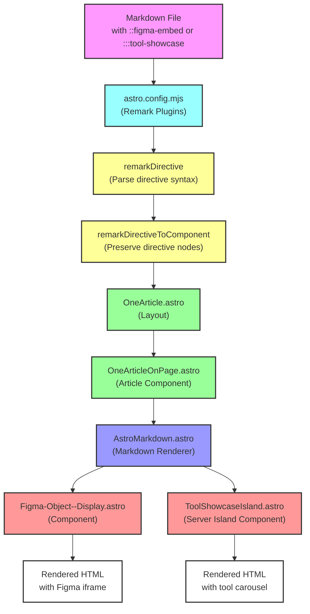
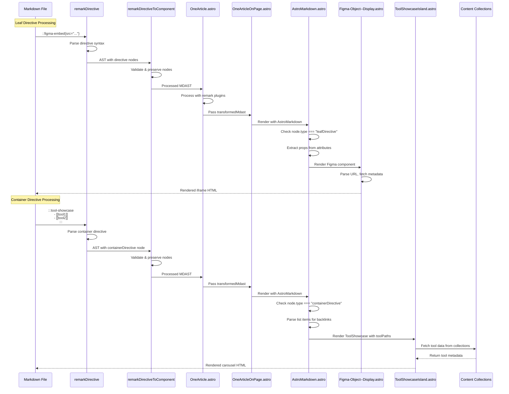

# Maintain Directives as part of our Extended Markdown

## Overview

To enhance our Extended Markdown capabilities, we have successfully integrated a custom `remark-directive` to render custom components using the directive syntax to parse relevant data.

The current custom component of concern is `Figma-Object--Display.astro`, which can render Figma objects specified in Markdown using a unique link (with authorization credentials stored in the .env variables.)

## Render Pipeline Architecture

The directive rendering pipeline involves multiple files working together to transform markdown directives into rendered components:



## Installation and Setup

1. - [x] **Install the Lossless Group's `remark-directive` Package:**
   Install the custom fork directly from the GitHub repository using pnpm. This approach is more practical for most use cases as it treats the fork as a dependency rather than requiring local development setup.
   
   ```bash
   pnpm add https://github.com/lossless-group/remark-directive.git
   ```
   
   This will install the package and maintain the connection to the remote repository for updates.

   a. - [ ] **Alternative: Fork and Clone for Development:**
      Only use this approach if you need to make changes to the `remark-directive` package itself:

      ```bash
      git clone https://github.com/lossless-group/remark-directive.git
      cd remark-directive
      npm install
      ```

## Directive Syntax
2. - [x] **Agree on directive syntax in markdown files**
   
   **Leaf Directive Example (single-line with attributes)**
   ```markdown
   ::figma-embed{src="https://www.figma.com/object-link"}
   ```

   **Leaf Directive with additional arguments**
   ```markdown
   ::figma-embed{
   src="https://www.figma.com/design/abc123/My-Design"
   auth-user="mpstaton"
   width="800"
   height="600"
   }
   ```

   **Container Directive Example (multi-line with content)**
   ```markdown
   :::tool-showcase
   - [[Tooling/AI-Toolkit/Tool Name|Display Name]]
   - [[vertical-toolkits/Category/Another Tool|Another Tool]]
   :::
   ```

## Agree on Conventions for Defining Directives and mapping to Components
2. - [x] **Agree on conventions for defining directives and mapping to components**

   While right now we are only focused on a Figma object renderer, we have established conventions for defining directives and mapping to components for future extensibility.

   ### Directive Naming Convention:
   - Use kebab-case for directive names
   - Include the service/tool name as prefix: `::figma-embed`, `::miro-board`, `::notion-page`
   - Use descriptive suffixes for different render types: `-embed`, `-display`, `-preview`, `-showcase`

   ### Component File Convention:
   - Components should follow the pattern: `{Service}-{Type}--{Action}.astro`
   - Examples: `Figma-Object--Display.astro`, `Miro-Board--Embed.astro`, `Notion-Page--Preview.astro`, `ToolShowcaseIsland.astro`
   - Use PascalCase for component files to match Astro conventions
   - Server island components should include "Island" suffix for client-side functionality

   ### Directive-to-Component Mapping Implementation:
   The mapping is defined in `src/utils/markdown/remark-directives.ts`:

   ```typescript
   export const directiveComponentMap: Record<string, string> = {
     'figma-embed': 'Figma-Object--Display.astro',
     'tool-showcase': 'ToolShowcaseIsland.astro',
     // Future components following the same pattern:
     // 'miro-board': 'Miro-Board--Embed.astro',
     // 'notion-page': 'Notion-Page--Preview.astro',
     // 'youtube-video': 'YouTube-Video--Embed.astro',
     // 'github-gist': 'GitHub-Gist--Display.astro',
   };
   ```

   ### The remarkDirectiveToComponent Plugin:
   ```typescript
   export function remarkDirectiveToComponent() {
     return (tree: any) => {
       visit(tree, (node: any) => {
         if (node.type === 'leafDirective' || node.type === 'containerDirective') {
           const directiveName = node.name;
           
           // Validate that this is a supported directive
           if (isSupportedDirective(directiveName)) {
             // Leave the node as-is for AstroMarkdown.astro to handle
             // Just add some debug info if needed
             if (process.env.DEBUG_AST === 'true') {
               console.log(`[remarkDirectiveToComponent] Preserving directive: ${directiveName}`);
             }
           } else {
             // For unsupported directives, log a warning but preserve the node
             console.warn(`[remarkDirectiveToComponent] Unknown directive: ${directiveName}`);
           }
           
           // Always preserve the original directive node - don't transform to HTML
           // AstroMarkdown.astro will handle the actual rendering
         }
       });
     };
   }
   ```

   ### Required Props Convention:
   - `src` or `url`: The primary resource URL (required)
   - `auth-user`: User identifier for authorization (optional, falls back to default)
   - `width`/`height`: Dimensions (optional, component provides defaults)
   - Component-specific props as needed

   ### Authentication Pattern:
   - Environment variables: `{SERVICE}_{USER}_TOKEN` (e.g., `FIGMA_MPSTATON_TOKEN`)
   - Default user fallback: `{SERVICE}_DEFAULT_TOKEN`
   - Components should handle missing auth gracefully

   ### Error Handling Convention:
   - Components should render fallback content when authentication fails
   - Display helpful error messages in development mode
   - Log authentication issues for debugging


## Configuration

3. - [x] **Configure astro.config.mjs:**
   The remark-directive plugin is configured in `astro.config.mjs` with a two-step process:

   ```javascript
   // Import directive-related modules
   import remarkDirective from 'remark-directive';
   import { directiveComponentMap, remarkDirectiveToComponent } from './src/utils/markdown/remark-directives.ts';

   // In the markdown configuration:
   remarkPlugins: [
     /** @type {any} */ (normalizeShellLangs),
     /** @type {any} */ (remarkTableOfContents),
     /** @type {any} */ (remarkDirective), // Parse directive syntax
     /** @type {any} */ (remarkDirectiveToComponent), // Transform directives to components
   ],
   ```

   The `remarkDirective` plugin parses the directive syntax, while `remarkDirectiveToComponent` preserves the directive nodes in the AST for later processing by `AstroMarkdown.astro`.

## Custom Component Implementation
4. - [x] **Create Custom Component:**
   The `Figma-Object--Display.astro` component has been developed with advanced features:

   ### Component Features:
   - **Smart URL Parsing:** Extracts file ID, node ID, and prototype status from Figma URLs
   - **Metadata Fetching:** Uses Figma API to fetch node information for optimal sizing
   - **Authentication Support:** Handles user-specific tokens with fallback patterns
   - **Intelligent Defaults:** Sets optimal embed parameters based on content type
   - **Responsive Design:** Calculates dimensions based on frame aspect ratios

   ### Key Implementation Details:
   ```typescript
   // Parse Figma URL to extract metadata
   function parseFigmaUrl(url: string) {
     const urlObj = new URL(url);
     const pathParts = urlObj.pathname.split('/');
     const fileId = pathParts[2]; // /design/FILE_ID/...
     const nodeId = urlObj.searchParams.get('node-id');
     const isPrototype = urlObj.pathname.includes('/proto/');
     
     return { fileId, nodeId, isPrototype };
   }

   // Fetch node metadata from Figma API
   async function fetchNodeMetadata(fileId: string, nodeId: string, headers: any) {
     try {
       const response = await fetch(`https://api.figma.com/v1/files/${fileId}/nodes?ids=${nodeId}`, {
         headers
       });
       
       if (!response.ok) {
         console.warn('Failed to fetch Figma node metadata:', response.status);
         return null;
       }
       
       const data = await response.json();
       const nodeData = data.nodes?.[nodeId]?.document;
       
       if (nodeData) {
         return {
           type: nodeData.type,
           name: nodeData.name,
           absoluteBoundingBox: nodeData.absoluteBoundingBox,
           backgroundColor: nodeData.backgroundColor,
           isFrame: nodeData.type === 'FRAME'
         };
       }
     } catch (error) {
       console.warn('Error fetching Figma metadata:', error);
     }
     
     return null;
   }
   ```

3. - [x] **Integration with remark-directive:**
   The directive parsing is handled automatically by the `remark-directive` plugin, and the component is rendered through `AstroMarkdown.astro` without needing to modify the remark-directive package itself.

## Tool Showcase Directive Implementation

### Overview
The `tool-showcase` directive enables rendering interactive tool carousels from backlink lists in markdown. It supports both `vertical-toolkits` and `tooling` collections, making it versatile for different content types.

### Component Architecture
The `ToolShowcaseIsland.astro` component is implemented as a server island, allowing it to:
- Fetch tool data from multiple Astro content collections
- Parse backlink syntax from container directive content
- Render interactive carousel components with tool metadata

### Key Implementation Details

```typescript
// Server-side data fetching across multiple collections
const [verticalToolkits, tooling] = await Promise.all([
  getCollection('vertical-toolkits').catch(() => []),
  getCollection('tooling').catch(() => [])
]);

// Combine all tools from different collections
const allTools = [...verticalToolkits, ...tooling];

// Parse backlink patterns like [[path/to/tool|Display Name]]
function parseBacklinks(content: string): Array<{path: string, displayName?: string}> {
  const backlinkRegex = /\[\[([^\]|]+)(?:\|([^\]]+))?\]\]/g;
  const backlinks = [];
  let match;
  
  while ((match = backlinkRegex.exec(content)) !== null) {
    backlinks.push({
      path: match[1].trim(),
      displayName: match[2] ? match[2].trim() : undefined
    });
  }
  
  return backlinks;
}
```

### Container Directive Processing
The component handles container directives by parsing their content for markdown list items:

```typescript
// In AstroMarkdown.astro - tool-showcase directive handling
if (directiveName === 'tool-showcase') {
  let toolPaths = [];
  
  if (node.type === "containerDirective" && node.children) {
    // Find list nodes in the container
    const listNodes = node.children.filter(child => child.type === 'list');
    
    for (const listNode of listNodes) {
      if (listNode.children) {
        for (const listItem of listNode.children) {
          if (listItem.type === 'listItem' && listItem.children) {
            // Extract text content from list item
            const textContent = extractTextFromNode(listItem);
            const backlinks = parseBacklinks(textContent);
            toolPaths.push(...backlinks);
          }
        }
      }
    }
  }
  
  if (toolPaths.length > 0) {
    return <ToolShowcaseIsland toolPaths={toolPaths} />;
  }
}
```

## Handling Directives with AstroMarkdown

4. - [x] **Support Both Leaf and Container Directives in AstroMarkdown:**
   The `AstroMarkdown.astro` component handles both directive types from `remark-directive`:
   
   - **Leaf Directives:** Single-line syntax like `::figma-embed{ src="..." width="800" }`
   - **Container Directives:** Multi-line syntax with triple colons:
     ```markdown
     :::figma-embed
     src="..."
     width="800"
     height="600"
     :::
     ```

5. - [x] **Directive Rendering in AstroMarkdown.astro:**
   The component includes specific handling for directive nodes:
   
   ```typescript
   {/* Handle directive nodes from remark-directive */}
   {(node.type === "leafDirective" || node.type === "containerDirective") && (() => {
     const directiveName = node.name;
     const props = node.attributes || {};
     
     if (directiveName === 'figma-embed') {
       const figmaUrl = props.src || props.url || '';
       const width = props.width || '100%';
       const height = props.height || '500px';
       const authUser = props['auth-user'] || '';
       
       return (
         <>
           <div class="figma-embed-container" data-directive="figma-embed">
             <div class="figma-embed-wrapper">
               <iframe
                 src={`https://www.figma.com/embed?embed_host=lossless.group&url=${encodeURIComponent(figmaUrl)}&initial_view=design&scaling=contain&hide_ui=true`}
                 allowfullscreen
                 loading="lazy"
                 title="Figma embed"
                 style={`border: none; width: ${width}; height: ${height}; border-radius: 8px; max-width: 100%;`}
               ></iframe>
             </div>
             <div class="figma-embed-footer">
               <a href={figmaUrl} target="_blank" rel="noopener">Open in Figma →</a>
             </div>
           </div>
           {/* Styles omitted for brevity */}
         </>
       );
     }
     
     if (directiveName === 'tool-showcase') {
       // Parse the container content for markdown list items with backlinks
       let toolPaths = [];
       
       if (node.type === "containerDirective" && node.children) {
         // Find list nodes in the container
         const listNodes = node.children.filter(child => child.type === 'list');
         
         for (const listNode of listNodes) {
           if (listNode.children) {
             for (const listItem of listNode.children) {
               if (listItem.type === 'listItem' && listItem.children) {
                 // Extract text content from list item
                 const textContent = extractTextFromNode(listItem);
                 const backlinks = parseBacklinks(textContent);
                 toolPaths.push(...backlinks);
               }
             }
           }
         }
       }
       
       if (toolPaths.length > 0) {
         return <ToolShowcaseIsland toolPaths={toolPaths} />;
       }
     }
     
     // Handle other directive types or show debug info
     return (
       <div class="unknown-directive" data-directive={directiveName}>
         <p>Unknown directive: <code>{directiveName}</code></p>
         <details>
           <summary>Debug Info</summary>
           <pre>{JSON.stringify({ name: directiveName, attributes: props }, null, 2)}</pre>
         </details>
       </div>
     );
   })()}
   ```

## Processing Flow Diagram

The following diagram shows how a directive flows through the processing pipeline:



## Layout Integration

The directive rendering is integrated into the layout hierarchy:

### OneArticle.astro
- Processes markdown content through remark plugins
- Passes the transformed MDAST to OneArticleOnPage

```typescript
// Process with our custom remark plugins to get MDAST
const processor = unified()
  .use(remarkParse)           // 1. Parse markdown to MDAST
  .use(remarkGfm)
  .use(remarkDirective)       // 2. Parse directive syntax
  .use(remarkDirectiveToComponent) // 3. Preserve directives for AstroMarkdown
  .use(remarkImages)         
  .use(remarkBacklinks)          
  .use(remarkCitations)
  .use(remarkTableOfContents)

// First parse to MDAST
const mdast = processor.parse(content || '');
const transformedMdast = await processor.run(mdast);
```

### OneArticleOnPage.astro
- Receives the transformed MDAST
- Passes it to AstroMarkdown for rendering

```typescript
<AstroMarkdown 
  node={{
    type: 'root',
    children: children.filter(child => child?.type !== 'tableOfContents'),
    data: { hProperties }
  }}         
  data={dataForMarkdown} 
/>
```

7. - [x] **Testing:**
   The directive rendering has been successfully implemented and tested. The Figma component properly parses URLs, fetches metadata when possible, and renders with intelligent defaults.

5. - [x] **Documentation:**
   This blueprint now serves as comprehensive documentation of the directive rendering pipeline, including:
   - Architecture diagrams showing component relationships
   - Code snippets demonstrating key implementation details
   - Processing flow diagrams showing data transformation
   - Complete working examples of all components involved 

## Usage

### Figma Embed Directive
To embed a Figma object, use a leaf directive:

```markdown
::figma-embed{src="https://www.figma.com/design/abc123/My-Design"}
```

This renders the Figma object using the `Figma-Object--Display.astro` component.

### Tool Showcase Directive  
To create an interactive tool carousel, use a container directive with backlink lists:

```markdown
:::tool-showcase
- [[Tooling/AI-Toolkit/Tool Name|Display Name]]
- [[vertical-toolkits/Category/Another Tool|Another Tool]]
- [[Tooling/Enterprise/Third Tool|Third Tool]]
:::
```

This renders an interactive carousel using the `ToolShowcaseIsland.astro` server island component, which fetches tool metadata from the content collections.

## Maintenance

- **Regular Updates:**
  Keep the `remark-directive` package and its dependencies updated to ensure compatibility with future Markdown rendering enhancements.

- **Feedback and Iterations:**
  Continuously gather feedback from users regarding the directive's functionality and make necessary improvements or extensions.

This document will serve as a guideline for integrating and maintaining the Figma object rendering functionality as part of our Extended Markdown capabilities.

## Component Styling and Breakout Containers

The Figma embed component includes responsive styling that integrates with the site's design system:

```css
.figma-embed-container {
  margin: 1.5rem 0;
  border-radius: 8px;
  overflow: hidden;
  box-shadow: 0 4px 6px -1px rgba(0, 0, 0, 0.1), 0 2px 4px -1px rgba(0, 0, 0, 0.06);
  background: rgba(255, 255, 255, 0.02);
  border: 1px solid rgba(255, 255, 255, 0.1);
}

.figma-embed-footer {
  padding: 0.75rem 1rem;
  background: rgba(255, 255, 255, 0.05);
  border-top: 1px solid rgba(255, 255, 255, 0.1);
  font-size: 0.75rem;
  color: #9ca3af;
  text-align: right;
}
```

## Environment Variables and Authentication

The component supports flexible authentication patterns:

- **User-specific tokens:** `FIGMA_{USER}_TOKEN` (e.g., `FIGMA_MPSTATON_TOKEN`)
- **Default token:** `FIGMA_EMBED_USER_TOKEN` or `FIGMA_DEFAULT_TOKEN`
- **Token usage:** Only used for API metadata fetching, not required for basic embeds

## Summary of Key Files

1. **astro.config.mjs**: Configures remark plugins in the correct order
2. **remark-directives.ts**: Defines directive-to-component mapping and preservation logic  
3. **OneArticle.astro**: Layout that processes markdown through the plugin pipeline
4. **OneArticleOnPage.astro**: Article component that passes content to AstroMarkdown
5. **AstroMarkdown.astro**: Core renderer that handles directive nodes and renders components
6. **Figma-Object--Display.astro**: Figma embed component with smart URL parsing and metadata fetching
7. **ToolShowcaseIsland.astro**: Server island component for rendering tool carousels from backlink lists

## Future Work

- [x] **Tool Showcase Directive**: Successfully implemented container directive for rendering tool carousels from backlink lists
- [ ] Add support for directives in the Obsidian native markdown editor, which requires a different way of handling styles for the custom components and will not be in Astro.
- [ ] Implement additional directive types following the established patterns (Miro, Notion, etc.)
- [ ] Add support for directive transformations during build time for better performance  
- [ ] Create a directive preview mode for the development environment
- [ ] Extend tool-showcase directive to support additional content collection types
- [ ] Add filtering and sorting capabilities to tool carousel components

