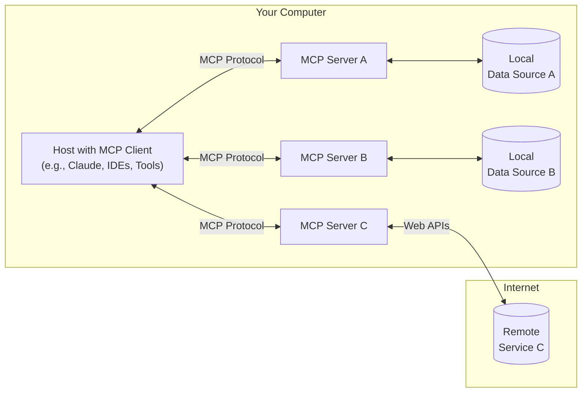

# Model Context Protocol (MCP) Analysis

## Core Concept

The Model Context Protocol (MCP) is an open protocol that standardizes how applications provide context to Large Language Models (LLMs). It serves as a universal connector between LLMs and various data sources or tools, similar to how USB-C provides a standardized way to connect devices to peripherals.

## Architecture Overview

MCP follows a client-server architecture with the following key components:



### Key Components

1. **MCP Hosts**
   - Applications that want to access data through MCP (e.g., Claude Desktop, IDEs, AI tools)
   - Maintains connections to one or more MCP servers

2. **MCP Clients**
   - Protocol clients that handle communication with MCP servers
   - Each client maintains a 1:1 connection with a server

3. **MCP Servers**
   - Lightweight programs that expose specific capabilities
   - Connect to various data sources (local or remote)
   - Implement the MCP protocol to communicate with clients

4. **Data Sources**
   - Local: Files, databases, system services
   - Remote: Web APIs, cloud services, other networked resources

## Key Features

### 1. Standardized Access
- Uniform interface for LLMs to access diverse data sources
- Eliminates the need for custom integrations for each tool or data source

### 2. Security
- Data remains within your infrastructure
- Fine-grained access control
- Secure communication channels

### 3. Flexibility
- Switch between different LLM providers
- Add or remove data sources without changing core application
- Support for various transport protocols (HTTP, WebSockets, stdio)

### 4. Extensibility
- Add new capabilities through additional MCP servers
- Support for custom data types and operations
- Versioned API for backward compatibility

## Protocol Capabilities

MCP defines several core capabilities that servers can implement:

1. **Resources**
   - Access to structured and unstructured data
   - Support for various URI schemes (file://, https://, git://)
   - Subscription to resource changes

2. **Tools**
   - Execute functions or operations
   - Pass parameters and receive structured results
   - Support for both synchronous and asynchronous operations

3. **Prompts**
   - Template management
   - Dynamic prompt construction
   - Support for multi-step interactions

4. **Sampling**
   - Generate completions based on context
   - Control over model parameters
   - Support for streaming responses

## Implementation Considerations

### For MCP Server Developers
- Implement the protocol specification
- Handle authentication and authorization
- Manage resource access and permissions
- Provide appropriate error handling and logging

### For MCP Client Developers
- Handle connection management
- Implement capability negotiation
- Manage request/response patterns
- Handle errors and retries

## Use Cases

1. **AI-Powered Development**
   - Code completion and generation
   - Documentation lookup
   - Debugging assistance

2. **Enterprise Knowledge**
   - Internal documentation search
   - Knowledge base integration
   - Data analysis and visualization

3. **Content Creation**
   - Research assistance
   - Content generation
   - Fact verification

4. **Workflow Automation**
   - Task automation
   - Data processing pipelines
   - System administration

## Getting Started

### Prerequisites
- Node.js (v16+)
- npm or yarn
- Basic understanding of TypeScript/JavaScript

### Basic Server Implementation

```typescript
import { MCPServer, Resource, Tool } from '@modelcontextprotocol/server';

// Create a new MCP server
const server = new MCPServer({
  name: 'example-server',
  version: '1.0.0'
});

// Define resources
server.resources.register({
  name: 'example-resource',
  description: 'An example resource',
  type: 'text/plain',
  async read(uri) {
    // Implement resource reading logic
    return { content: 'Hello, MCP!', mimeType: 'text/plain' };
  }
});

// Define tools
server.tools.register({
  name: 'example-tool',
  description: 'An example tool',
  parameters: {
    type: 'object',
    properties: {
      name: { type: 'string' }
    },
    required: ['name']
  },
  async execute(params) {
    return { result: `Hello, ${params.name}!` };
  }
});

// Start the server
server.start();
```

## Next Steps

1. Explore the official [MCP documentation](https://modelcontextprotocol.io)
2. Review the [specification](https://github.com/modelcontextprotocol/specification)
3. Experiment with the reference implementations
4. Join the MCP community for support and collaboration

## TypeScript SDK Implementation

The official TypeScript SDK for MCP provides a robust way to implement both MCP clients and servers. Here's an overview of its key features and usage:

### Core Components

1. **Server**
   - Handles connection management and protocol compliance
   - Routes messages to appropriate handlers
   - Manages server lifecycle and capabilities

2. **Resources**
   - Expose data to LLMs (similar to GET endpoints in REST)
   - Support static and dynamic content
   - Can be parameterized for flexible data access

3. **Tools**
   - Enable LLMs to perform actions with side effects
   - Support parameter validation using Zod schemas
   - Can make external API calls and process results


# Potential Architecture:

## File Structure
content-farm/
├── src/
│   ├── mcp/                          # MCP Server implementation
│   │   ├── server.ts                # Main MCP server setup
│   │   ├── resources/               # Resource definitions
│   │   │   ├── markdown/            # Markdown resources
│   │   │   │   ├── file-resource.ts # File system integration
│   │   │   │   └── index.ts         # Export markdown resources
│   │   │   └── index.ts             # Resource exports
│   │   │
│   │   ├── tools/              # Tool implementations
│   │   │   ├── research/           # Research tools
│   │   │   │   ├── web-search.ts   # Web search functionality
│   │   │   │   └── index.ts        # Export research tools
│   │   │   └── index.ts            # Tool exports
│   │   │
│   │   ├── types/             # TypeScript type definitions
│   │   │   └── index.ts           # Type exports
│   │   │
│   │   └── utils/             # Utility functions
│   │       ├── fs.ts              # File system utilities
│   │       ├── research.ts        # Research orchestration
│   │       └── obsidian.ts        # Obsidian integration
│   │
│   └── index.ts                # Entry point
│
└── config/                      # Configuration
    └── mcp.ts                    # MCP server configuration
├── scripts/                          # Utility scripts
│   └── start-mcp-server.ts           # Script to start the MCP server
│


## Servers
### Server Frameworks
Our choice is [Fastify](https://fastify.io), [[Tooling/Software Development/Frameworks/Web Frameworks/Fastify|Fastify]]

### Basic Server Example

```typescript
import { McpServer } from "@modelcontextprotocol/sdk/server/mcp.js";
import { StdioServerTransport } from "@modelcontextprotocol/sdk/server/stdio.js";
import { z } from "zod";

// Create an MCP server
const server = new McpServer({
  name: "Demo",
  version: "1.0.0"
});

// Add a tool
server.tool(
  "calculate-bmi",
  {
    weightKg: z.number(),
    heightM: z.number()
  },
  async ({ weightKg, heightM }) => ({
    content: [{
      type: "text",
      text: String(weightKg / (heightM * heightM))
    }]
  })
);

// Add a dynamic resource
server.resource(
  "user-profile",
  new ResourceTemplate("users://{userId}/profile", { list: undefined }),
  async (uri, { userId }) => ({
    contents: [{
      uri: uri.href,
      text: `Profile data for user ${userId}`
    }]
  })
);

// Start the server
const transport = new StdioServerTransport();
await server.connect(transport);
```

### Key Features

1. **Type Safety**
   - Full TypeScript support
   - Zod schema validation for tool parameters
   - Type-safe resource handling

2. **Transport Layers**
   - Stdio for simple CLI tools
   - Streamable HTTP for web applications
   - Custom transport support

3. **Advanced Capabilities**
   - Dynamic server registration
   - Proxy authorization
   - Backward compatibility handling

### Integration with Existing Systems

The SDK can be integrated with various data sources and services:

```typescript
// Example: Database integration
server.tool("query-db", 
  { query: z.string() },
  async ({ query }) => {
    const results = await database.query(query);
    return { content: [{ type: "text", text: JSON.stringify(results) }] };
  }
);

// Example: External API integration
server.tool("fetch-weather",
  { city: z.string() },
  async ({ city }) => {
    const response = await fetch(`https://api.weather.com/${city}`);
    const data = await response.text();
    return { content: [{ type: "text", text: data }] };
  }
);
```

### Best Practices

1. **Error Handling**
   - Implement proper error boundaries
   - Provide meaningful error messages
   - Log errors for debugging

2. **Security**
   - Validate all inputs
   - Implement proper authentication
   - Follow principle of least privilege

3. **Performance**
   - Cache expensive operations
   - Use streaming for large responses
   - Monitor resource usage


## Questions on Model Context Protocol:

### Iterative Markdown Research Assistant
1. Question: How would we use an existing markdown file as a resource, and have the LLM then go do futher web search research using [[Tooling/AI Toolkit/Models/Perplexica|Perplexica]], coming back with improvements to the same markdown file?

2. Findings:
   - **MCP Resource for Markdown**: 
     - Markdown files can be exposed as MCP resources using `ResourceTemplate`
     - Supports dynamic file path parameters (e.g., `markdown://{filePath}`)
     - Handles file I/O operations with proper error handling

   - **Research Integration**:
     - Perplexica can be integrated via its API for web search functionality
     - Research queries can be derived from markdown content or user input
     - Supports batch processing of multiple research topics

   - **Content Enhancement Workflow**:
     1. Parse markdown to identify research opportunities
     2. Generate targeted queries for Perplexica
     3. Process and integrate findings while maintaining markdown structure
     4. Preserve existing formatting and metadata

   - **Implementation Considerations**:
     - File system access requires proper path resolution
     - Need for version control integration to track changes
     - Should include user confirmation before overwriting files
     - Supports both CLI and GUI interactions

   - **Technical Stack**:
     - MCP TypeScript SDK for protocol implementation
     - Fastify for HTTP server (if needed)
     - Zod for input validation
     - Obsidian API for plugin integration

   - **Example Usage**:
     ```typescript
     // Example MCP server setup
     server.resource("markdown", 
       new ResourceTemplate("markdown://{filePath}"),
       async (uri, { filePath }) => ({
         contents: [{
           uri: uri.href,
           text: await fs.readFile(filePath, 'utf-8'),
           mimeType: "text/markdown"
         }]
       })
     );
     ```

   - **Security Considerations**:
     - Validate all file system paths
     - Implement proper error boundaries
     - Consider rate limiting for API calls
     - Handle sensitive content appropriately

## Content Enhancement with Perplexica

For applications that need to enhance content with AI-powered research, here's how to implement a streaming enhancement feature using Perplexica:

```typescript
private async enhanceWithPerplexica(content: string, editor: Editor): Promise<void> {
    try {
        const cursor = editor.getCursor();
        const insertPos = { line: cursor.line + 1, ch: 0 };
        editor.replaceRange('\n', cursor); // Add space for the response

        const requestData = {
            query: content,
            chatModel: {
                provider: 'ollama',
                name: 'llama3.2:latest'
            },
            embeddingModel: {
                provider: 'ollama',
                name: 'llama3.2:latest'
            },
            stream: true,
            systemInstructions: "Enhance the provided content with relevant research and context."
        };

        const response = await fetch('http://localhost:3030/api/search', {
            method: 'POST',
            headers: {
                'Content-Type': 'application/json',
            },
            body: JSON.stringify(requestData),
        });

        if (!response.ok) {
            throw new Error(`HTTP error! status: ${response.status}`);
        }

        const reader = response.body?.getReader();
        if (!reader) throw new Error('No response body');

        let fullResponse = '';
        const decoder = new TextDecoder();
        
        while (true) {
            const { done, value } = await reader.read();
            if (done) break;
            
            const chunk = decoder.decode(value, { stream: true });
            fullResponse += chunk;
            editor.replaceRange(chunk, insertPos);
            
            // Move cursor to end of inserted text
            const lines = fullResponse.split('\n');
            const lastLine = lines[lines.length - 1];
            editor.setCursor({
                line: insertPos.line + Math.max(0, lines.length - 1),
                ch: lastLine.length
            });
        }
    } catch (error) {
        console.error('Error enhancing content with Perplexica:', error);
        const errorMessage = `Error: ${error instanceof Error ? error.message : String(error)}`;
        new Notice(errorMessage);
        editor.replaceRange(`\n${errorMessage}`, editor.getCursor());
    }
}
```

### Key Features

- **Streaming Response**: Processes and displays content as it's received
- **Real-time Updates**: Updates the editor incrementally for better UX
- **Error Handling**: Comprehensive error handling with user feedback
- **Flexible Configuration**: Supports different models and providers

### Usage Example

```typescript
// Add this to your command registration
this.addCommand({
    id: 'enhance-with-perplexica',
    name: 'Enhance with Perplexica',
    editorCallback: async (editor: Editor) => {
        const selection = editor.getSelection();
        if (!selection) {
            new Notice('Please select some text to enhance');
            return;
        }
        await this.enhanceWithPerplexica(selection, editor);
    }
});
```

## References

- [Official MCP Website](https://modelcontextprotocol.io)
- [GitHub Repository](https://github.com/modelcontextprotocol)
- [TypeScript SDK](https://github.com/modelcontextprotocol/typescript-sdk)
- [Specification](https://github.com/modelcontextprotocol/specification)
- [Getting Started Guide](https://modelcontextprotocol.io/docs/getting-started)