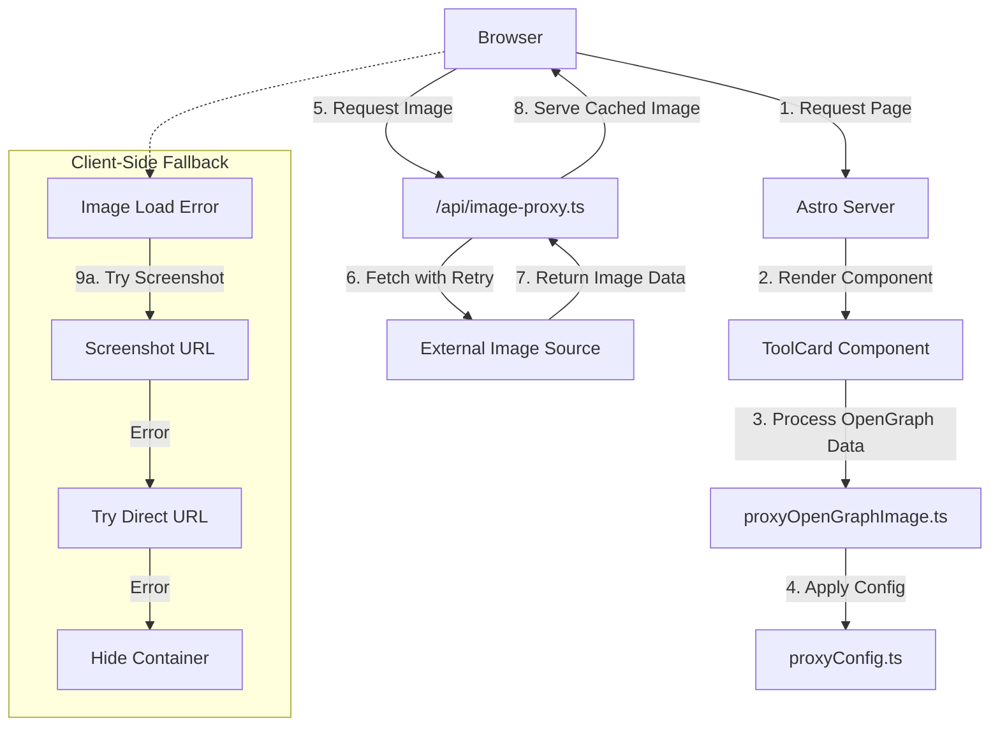

# Implementing an OpenGraph Image Proxy Service

This guide documents our solution for handling CORS issues with OpenGraph images in our Astro-based site, particularly focusing on the ToolCard component which displays external images from various sources.

## The Challenge: Unreliable OpenGraph Images

When displaying OpenGraph metadata from external sites, we encountered several issues:

1. **CORS Restrictions**: Many external image sources block cross-origin requests, causing images to fail loading
2. **Trust Issues**: Some browsers and environments block loading of untrusted external resources
3. **Inconsistent Behavior**: Images that worked in development would fail in production or vice versa
4. **Poor User Experience**: Failed image loads resulted in broken UI elements with no graceful fallback

## Our Attempts and Failures

### Attempt 1: Direct Image Loading

Initially, we tried loading external images directly in our components:

```astro

```

This failed because many external servers rejected our requests with CORS errors:

```
Access to image at 'https://external-site.com/image.jpg' has been blocked by CORS policy: 
No 'Access-Control-Allow-Origin' header is present on the requested resource.
```

### Attempt 2: Client-Side Fallbacks

We tried implementing client-side fallbacks to switch between different image sources:

```javascript
const img = document.querySelector('.tool-card-image');
img.addEventListener('error', () => {
  if (img.src === primaryImage) {
    img.src = fallbackImage;
  }
});
```

This approach was inconsistent and didn't solve the root CORS issue.

## The "Aha!" Moment

We realized we needed to proxy the external images through our own domain to bypass CORS restrictions entirely. This would allow us to:

1. Serve all images from our own domain (trusted by the browser)
2. Add proper CORS headers to the responses
3. Implement caching and retry logic for reliability
4. Create a consistent experience across all environments

## Final Solution: Image Proxy Service

### 1. API Endpoint for Image Proxying

We created an API route at `/api/image-proxy.ts` to handle image requests:

```typescript
import type { APIRoute } from 'astro';
import { PROXY_CONFIG } from '../../utils/proxyConfig';

export const GET: APIRoute = async ({ request }) => {
  const url = new URL(request.url);
  const imageUrl = url.searchParams.get('url');
  const requestId = Math.random().toString(36).substring(2, 15);
  
  if (!imageUrl) {
    console.error(`[${requestId}] Image proxy error: No URL provided`);
    return new Response('No URL provided', { status: 400 });
  }
  
  try {
    console.log(`[${requestId}] Proxying image: ${imageUrl}`);
    
    // Attempt to fetch with retries
    let response = null;
    let attempts = 0;
    
    while (!response && attempts <= PROXY_CONFIG.maxRetryAttempts) {
      try {
        const controller = new AbortController();
        const timeoutId = setTimeout(() => controller.abort(), PROXY_CONFIG.fetchTimeout);
        
        response = await fetch(imageUrl, {
          headers: {
            'User-Agent': 'Mozilla/5.0 (compatible; ImageProxyBot/1.0)',
            'Referer': new URL(request.url).origin
          },
          signal: controller.signal
        });
        
        clearTimeout(timeoutId);
      } catch (error) {
        attempts++;
        console.error(`[${requestId}] Attempt ${attempts} failed: ${error.message}`);
        if (attempts > PROXY_CONFIG.maxRetryAttempts) throw error;
      }
    }
    
    if (!response.ok) {
      throw new Error(`Image fetch failed with status: ${response.status}`);
    }
    
    const imageData = await response.arrayBuffer();
    const contentType = response.headers.get('Content-Type') || 'image/jpeg';
    
    return new Response(imageData, {
      status: 200,
      headers: {
        'Content-Type': contentType,
        'Cache-Control': `public, max-age=${PROXY_CONFIG.cacheDuration}`,
        'Access-Control-Allow-Origin': '*',
        'X-Content-Type-Options': 'nosniff'
      }
    });
  } catch (error) {
    console.error(`[${requestId}] Image proxy error: ${error.message}`);
    return new Response('Failed to proxy image', { status: 500 });
  }
};
```

### 2. Utility Functions for URL Processing

We created utility functions in `proxyOpenGraphImage.ts` to handle URL conversion:

```typescript
import { PROXY_IMAGE_FIELDS, PROXY_IMAGE_ARRAY_FIELDS } from './proxyConfig';

/**
 * Determines if a URL should be proxied
 */
export function shouldProxyUrl(url: string): boolean {
  if (!url) return false;
  
  try {
    const parsedUrl = new URL(url);
    const currentHost = typeof window !== 'undefined' 
      ? window.location.hostname 
      : new URL(import.meta.env.SITE || import.meta.env.PUBLIC_SITE_URL).hostname;
    
    // Don't proxy URLs from our own domain
    return parsedUrl.hostname !== currentHost;
  } catch (e) {
    return false;
  }
}

/**
 * Converts an external URL to a proxied URL
 */
export function proxyImageUrl(url: string): string {
  if (!url || !shouldProxyUrl(url)) return url;
  
  const baseUrl = typeof window !== 'undefined'
    ? window.location.origin
    : import.meta.env.SITE || import.meta.env.PUBLIC_SITE_URL;
  
  return `${baseUrl}/api/image-proxy?url=${encodeURIComponent(url)}`;
}

/**
 * Processes an OpenGraph data object to proxy all relevant image URLs
 */
export function proxyOpenGraphData(data: Record<string, any>): Record<string, any> {
  if (!data) return data;
  
  const result = { ...data };
  
  // Process single image fields
  PROXY_IMAGE_FIELDS.forEach(field => {
    if (field in result && typeof result[field] === 'string') {
      result[field] = proxyImageUrl(result[field]);
    }
  });
  
  // Process array fields
  PROXY_IMAGE_ARRAY_FIELDS.forEach(field => {
    if (field in result && Array.isArray(result[field])) {
      result[field] = result[field].map((item: string) => 
        typeof item === 'string' ? proxyImageUrl(item) : item
      );
    }
  });
  
  return result;
}
```

### 3. Centralized Configuration

We created a configuration file `proxyConfig.ts` to manage proxy settings:

```typescript
/**
 * List of field names that should be checked for image URLs to proxy
 */
export const PROXY_IMAGE_FIELDS = [
  // OpenGraph standard fields
  'og_image',
  'og_image_url',
  'og_screenshot_url',
  
  // Other common image fields
  'favicon',
  'image',
  'banner_image',
  'portrait_image',
  'thumbnail',
  'logo',
  'hero_image',
  'cover_image',
  'preview_image',
  'icon',
  'avatar',
];

/**
 * List of array field names that might contain image URLs
 */
export const PROXY_IMAGE_ARRAY_FIELDS = [
  'og_images',
  'images',
  'screenshots',
  'thumbnails',
];

/**
 * Configuration for the proxy service
 */
export const PROXY_CONFIG = {
  // Cache duration in seconds (24 hours)
  cacheDuration: 86400,
  
  // Maximum number of retry attempts for failed image fetches
  maxRetryAttempts: 2,
  
  // Timeout for image fetch requests in milliseconds
  fetchTimeout: 10000,
  
  // Whether to attempt direct URL if proxy fails (client-side fallback)
  tryDirectUrlOnProxyFailure: true
};
```

### 4. Component Integration

We updated the ToolCard component to use the proxy service:

```astro
---
import { proxyImageUrl } from '../../utils/proxyOpenGraphImage';
import { PROXY_CONFIG } from '../../utils/proxyConfig';

const { tool } = Astro.props;

// Proxy all image URLs
const primaryImage = proxyImageUrl(tool.og_image || tool.og_image_url);
const screenshotUrl = proxyImageUrl(tool.og_screenshot_url);
const faviconUrl = proxyImageUrl(tool.favicon);

// Pass config to client script
const tryDirectUrlOnProxyFailure = PROXY_CONFIG.tryDirectUrlOnProxyFailure;
---

<div class="tool-card">
  <div class="tool-card-image-container">
    
  </div>
  <!-- Rest of component... -->
</div>

<script define:vars={{ tryDirectUrlOnProxyFailure }}>
  // Client-side error handling with fallbacks
  document.querySelectorAll('.tool-card-image').forEach(imageElement => {
    // Track attempts to prevent infinite loops
    const attemptTracker = new WeakMap();
    
    imageElement.addEventListener('error', function(event) {
      const imageElement = event.target;
      const primaryImage = imageElement.getAttribute("data-primary-image");
      const screenshotUrl = imageElement.getAttribute("data-screenshot-url");
      
      // Get current attempt count or initialize
      const attempts = attemptTracker.get(imageElement) || {
        primary: 0,
        screenshot: 0,
        direct: 0
      };
      
      // Try screenshot if primary image fails
      if (imageElement.src === primaryImage && screenshotUrl && attempts.screenshot === 0) {
        console.log("Primary image failed, trying screenshot");
        imageElement.src = screenshotUrl;
        attempts.screenshot++;
        attemptTracker.set(imageElement, attempts);
        return;
      }
      
      // Try direct URLs if proxy fails and it's allowed
      if (tryDirectUrlOnProxyFailure && attempts.direct === 0) {
        const originalPrimary = imageElement.getAttribute("data-original-primary");
        console.log("Proxy failed, trying direct URL");
        imageElement.src = originalPrimary;
        attempts.direct++;
        attemptTracker.set(imageElement, attempts);
        return;
      }
      
      // If all attempts fail, hide the image container
      console.log("All image attempts failed, hiding image");
      const container = imageElement.closest('.tool-card-image-container');
      if (container) container.style.display = 'none';
    });
  });
</script>
```

## System Architecture



## Results and Benefits

After implementing the image proxy service:

1. **Eliminated CORS Errors**: All images now load through our own domain, bypassing cross-origin restrictions
2. **Improved Reliability**: Retry logic and fallbacks ensure images load even when external sources are temporarily unavailable
3. **Better User Experience**: Failed images gracefully fall back to alternatives or hide completely
4. **Consistent Behavior**: The same code works reliably in development and production environments
5. **Maintainable Solution**: Centralized configuration makes it easy to adjust proxy behavior

## Lessons Learned

1. **Proxy at the Source**: Rather than handling CORS issues at the component level, proxying at the source provides a more robust solution
2. **Multiple Fallbacks**: Implementing a cascade of fallbacks (proxy → screenshot → direct → hide) creates a resilient user experience
3. **Centralized Configuration**: Keeping proxy-related settings in one place makes the system easier to maintain and extend
4. **Tracking Attempts**: Preventing infinite retry loops is crucial for stable client-side error handling

This implementation has significantly improved the reliability of our OpenGraph image display across the site, providing a better experience for both developers and end users.