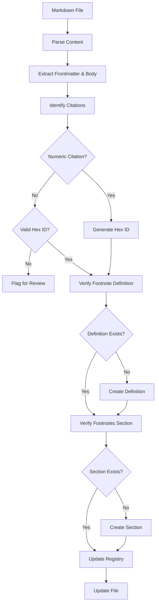

  

# Citation Processing System

  

## Objective

  

Extend the filesystem observer to process citations in markdown files by:

1. Converting numeric citations to hex format

2. Ensuring proper citation formatting

3. Creating/updating footnote definitions

4. Maintaining a citation registry

  



  

## Template Extension

  

Add content processing capability to the template system:

  

```typescript

// Extended MetadataTemplate interface with content processing

interface MetadataTemplate {

id: string;

name: string;

description: string;

// Define which files this template applies to

appliesTo: {

directories?: string[] ;

filePatterns?: string[] ;

};

// For frontmatter templates

required?: Record<string, FieldDefinition>;

optional?: Record<string, FieldDefinition>;

// For content processing templates

contentProcessing?: {

enabled: boolean;

processor: (content: string, filePath: string) => Promise<{

updatedContent: string;

changed: boolean;

stats: Record<string, any>;

}>;

};

}

```

  

## Citation Detection Patterns

  

```typescript

// Regular expressions for citation detection

const citationPatterns = {

// Pattern for numeric citations with caret: [^f96520]

numericWithCaret: /\[\^(\d+)\] /g,

// Pattern for numeric citations without caret: [^d7009d]

// Negative lookahead to avoid matching markdown links [text] (url) or [text] [ref]

numericWithoutCaret: /\[(\d+)\] (?!\] |\()/g,

// Pattern for existing hex citations: [^a1b2c3]

existingHexCitation: /\[\^([0-9a-f] {6})\] /g,

// Pattern for footnote definitions: [^f96520] : Text

footnoteDefinition: /\[\^([\da-f] +)\] :\s*(.*)/g

};

```

  

## Formatting Requirements

  

1. **Spacing**

- Ensure at least one space before citations

- Ensure one space or newline after citations

- Fix improper spacing

  

2. **Format Conversion**

- Convert `[^d7009d] ` → ` [^f96520] ` (add caret)

- Convert ` [^f96520] ` → ` [^a1b2c3] ` (numeric to hex)

- Preserve existing hex citations

  

## Citation Consistency Requirements

  

1. **Numeric Citation Consistency**

- All instances of the same numeric citation (e.g., all instances of `[6]`) MUST be converted to the same hex ID

- The system must maintain a mapping of numeric IDs to hex IDs during processing

- This mapping must be consistent within and across files

- Example: If `[6]` is converted to `[^a1b2c3]` in one place, all other instances of `[6]` must also be converted to `[^a1b2c3]`

  

2. **Citation Deduplication**

- The citation registry should not contain duplicate entries for the same citation

- When processing a file with multiple instances of the same citation, only one entry should be created in the registry

- The registry should track all files where a citation appears, but not create separate entries for each appearance

  

3. **Implementation Strategy**

```typescript

// Create a mapping of numeric IDs to hex IDs

const numericToHexMap: Record<string, string> = {};

// Process all numeric citations in a file

numericCitations.forEach(match => {

const numericId = match[1];

// If we've already assigned a hex ID for this numeric ID, reuse it

if (numericToHexMap[numericId]) {

// Reuse existing mapping

} else {

// Generate a new hex ID and store the mapping

numericToHexMap[numericId] = generateHexId();

}

});

// Replace all citations using the consistent mapping

Object.entries(numericToHexMap).forEach(([numericId, hexId]) => {

// Replace all instances of [^numericId] with [^hexId]

});

```

  

This approach ensures that all references to the same citation are consistently converted to the same hex ID, preventing duplication in the registry and maintaining the relationship between citations and their references.

  

## Implementation Steps

  

1. Create citations template in `tidyverse/observers/templates/citations.ts`

2. Implement citation processor function in `tidyverse/observers/services/citationService.ts`

3. Extend FileSystemObserver to use content processing

4. Add comprehensive error handling and reporting

  

## Processing Logic

  

### Citation-Footnote Pairing

  

1. **Check Existing Footnotes First**

- For each citation, check if a corresponding footnote definition exists BEFORE conversion

  

2. **With Existing Footnote**

- Convert both citation and footnote to the SAME hexCode

- Perform as atomic operation to prevent mismatches

- Example: ` [^f96520] ` → ` [^a1b2c3] ` and ` [^f96520] :` → ` [^a1b2c3] :`

  

3. **Without Existing Footnote**

- Convert citation to hexCode

- Generate placeholder footnote with same hexCode

- Add placeholder at end of document

- Track change in memory for reporting

- Add footnotes section if needed

  

### Footnotes Section Format

  

When adding a new footnotes section:

```markdown

# Footnotes

  

***

  

```

- Each element on its own line with blank lines as shown

- Add ONE LINE ABOVE the first footnote

- The section MUST be added if citations exist but no section is present

- The section should be placed at the end of the document

- If a footnote section exists but doesn't match the format, it should be preserved as-is

  

### Footnotes Section Logic

  

```typescript

/**

* Ensures a Footnotes section exists in the content if citations are present

* @param content - The markdown content

* @param config - Configuration for the footnotes section

* @returns Updated content with footnotes section if needed

*/

function ensureFootnotesSection(

content: string,

config: {

footnotesSectionHeader: string;

footnotesSectionSeparator: string;

}

): string {

// Check if any citations exist

const citationRegex = /\[\^([0-9a-f] +)\] /g;

const citations = [...content.matchAll(citationRegex)] ;

if (citations.length === 0) {

// No citations, no need for a footnotes section

return content;

}

// Check if a footnote definition exists

const footnoteDefRegex = /\[\^([0-9a-f] +)\] :/g;

const footnoteDefs = [...content.matchAll(footnoteDefRegex)] ;

if (footnoteDefs.length === 0) {

// No footnote definitions, no need for a section

return content;

}

// Check if a Footnotes section already exists

const sectionRegex = new RegExp(`${config.footnotesSectionHeader}`, 'i');

if (content.match(sectionRegex)) {

// Section already exists

return content;

}

// Add footnotes section before the first footnote definition

const firstFootnoteDef = footnoteDefs[^f51f7a] ;

const firstFootnotePos = content.indexOf(firstFootnoteDef[^f51f7a] );

// Get the content before and after the first footnote

const contentBefore = content.substring(0, firstFootnotePos);

const contentAfter = content.substring(firstFootnotePos);

// Add the footnotes section

return `${contentBefore}\n\n${config.footnotesSectionHeader}\n\n${config.footnotesSectionSeparator}\n\n${contentAfter}`;

}

```

  

### Citation Registry Integration

  

The citation registry (`site/src/content/citations/citation-registry.json`):

  

1. **Registry Loading**:

- Load the citation registry at the start of processing a batch of files

- If the registry doesn't exist, create an empty registry structure

  

2. **Registry Lookup During Processing**:

- When encountering an existing hex citation (` [^a1b2c3] `):

- Check if it exists in the registry

- If not, add it to the registry with the current file path and footnote text

- If it exists, update the registry entry with this file path if not already included

  

3. **Registry Updates During Conversion**:

- When converting a numeric citation to hex:

- First check if the footnote text already exists in the registry

- If a match is found, use the existing hexCode for consistency

- If no match is found, generate a new hexCode and add it to the registry

  

4. **Registry Persistence**:

- After processing each file, update the registry with any new citations

- Write the updated registry back to disk after each file to prevent data loss

- Include metadata about when the registry was last updated

  

5. **Registry Structure**:

```typescript

interface CitationRegistry {

citations: {

[hexCode: string] : {

text: string;

files: string[] ;

created: string; // ISO date

lastUpdated: string; // ISO date

}

};

metadata: {

lastUpdated: string; // ISO date

totalCitations: number;

};

}

```

  

### Registry Structure

  

```typescript

interface CitationRegistry {

citations: {

[hexCode: string] : {

text: string;

files: string[] ;

created: string; // ISO date

lastUpdated: string; // ISO date

}

};

metadata: {

lastUpdated: string; // ISO date

totalCitations: number;

};

}

```

  

### Citation Registry Implementation

  

```typescript

class CitationRegistry {

private registryPath: string;

private registry: CitationRegistry;

  

constructor(registryPath: string) {

this.registryPath = registryPath;

this.registry = { citations: {}, metadata: { lastUpdated: '', totalCitations: 0 } };

}

  

async loadRegistry(): Promise<void> {

try {

const registryData = await fs.promises.readFile(this.registryPath, 'utf8');

this.registry = JSON.parse(registryData);

} catch (error) {

// If file doesn't exist, create empty registry

await fs.promises.writeFile(this.registryPath, JSON.stringify(this.registry, null, 2), 'utf8');

}

}

  

async saveRegistry(): Promise<void> {

await fs.promises.writeFile(this.registryPath, JSON.stringify(this.registry, null, 2), 'utf8');

}

  

addCitation(hexCode: string, citationData: { text: string; files: string[] }): void {

this.registry.citations[hexCode] = citationData;

this.registry.metadata.totalCitations++;

this.registry.metadata.lastUpdated = new Date().toISOString();

}

  

updateCitationFiles(hexCode: string, filePath: string): void {

if (this.registry.citations[hexCode] ) {

this.registry.citations[hexCode] .files.push(filePath);

this.registry.citations[hexCode] .lastUpdated = new Date().toISOString();

}

}

  

getCitation(hexCode: string): { text: string; files: string[] } | undefined {

return this.registry.citations[hexCode] ;

}

}

```

  

### Complete Processing Pipeline

  

```typescript

/**

* Process citations in a Markdown file

* @param content - The markdown file content

* @param filePath - Path to the file

* @param config - Citation configuration

* @returns Object with updated content and processing statistics

*/

export async function processCitations(

content: string,

filePath: string,

config: CitationConfig

): Promise<{

updatedContent: string;

changed: boolean;

stats: {

citationsConverted: number;

footnotesAdded: number;

footnoteSectionAdded: boolean;

}

}> {

// Get citation registry

const citationRegistry = new CitationRegistry(config.registryPath);

// Load existing registry

await citationRegistry.loadRegistry();

// Extract frontmatter and body

const frontmatterAndBody = extractFrontmatterAndBody(content);

if (!frontmatterAndBody) {

return {

updatedContent: content,

changed: false,

stats: {

citationsConverted: 0,

footnotesAdded: 0,

footnoteSectionAdded: false

}

};

}

const { frontmatter, body } = frontmatterAndBody;

// Step 1: Fix citation spacing

const bodyWithFixedSpacing = fixCitationSpacing(body);

// Step 2: Convert citations without carets

const bodyWithCarets = convertCitationsToCaret(bodyWithFixedSpacing);

// Step 3: Convert numeric citations to hex

const { updatedContent: bodyWithHexCitations, stats: conversionStats } =

convertNumericCitationsToHex(bodyWithCarets, citationRegistry);

// Step 4: Ensure all citations have footnote definitions

const { updatedContent: bodyWithFootnotes, footnotesAdded } =

ensureFootnoteDefinitions(bodyWithHexCitations, citationRegistry);

// Step 5: Ensure Footnotes section exists if needed

const hadFootnotesSection = bodyWithFootnotes.includes(config.footnotesSectionHeader);

const bodyWithFootnotesSection = ensureFootnotesSection(bodyWithFootnotes, {

footnotesSectionHeader: config.footnotesSectionHeader,

footnotesSectionSeparator: config.footnotesSectionSeparator

});

const footnoteSectionAdded = !hadFootnotesSection &&

bodyWithFootnotesSection.includes(config.footnotesSectionHeader);

// Extract citation text for all hex citations and update registry

const hexCitationRegex = /\[\^([0-9a-f] {6})\] /g;

const hexCitations = [...bodyWithFootnotesSection.matchAll(hexCitationRegex)] ;

hexCitations.forEach(match => {

const hexId = match[^41e8c7] ;

const citationText = extractCitationText(bodyWithFootnotesSection, hexId);

if (citationText) {

citationRegistry.addCitation(hexId, {

sourceText: citationText,

files: [filePath]

});

}

// Update citation registry with this file

citationRegistry.updateCitationFiles(hexId, filePath);

});

// Update frontmatter with citation information

const updatedFrontmatter = {

...frontmatter,

date_modified: new Date().toISOString().split('T')[^f51f7a]

};

// Combine frontmatter and body

const finalContent = combineFrontmatterAndBody(

updatedFrontmatter,

bodyWithFootnotesSection

);

// Save citation registry

await citationRegistry.saveRegistry();

return {

updatedContent: finalContent,

changed: finalContent !== content,

stats: {

citationsConverted: conversionStats.conversionsPerformed,

footnotesAdded,

footnoteSectionAdded

}

};

}

```

  

### Safe Registry Update Mechanism

  

```typescript

/**

* Safely update the citation registry with backup and error recovery

* @param registryPath - Path to the registry file

* @param updateFn - Function to update the registry data

*/

async function safelyUpdateRegistry(

registryPath: string,

updateFn: (data: any) => any

): Promise<void> {

// Create backup first

const backupPath = `${registryPath}.backup`;

try {

await fs.promises.copyFile(registryPath, backupPath);

} catch (error) {

// If file doesn't exist, create empty registry

await fs.promises.writeFile(registryPath, '{}', 'utf8');

await fs.promises.copyFile(registryPath, backupPath);

}

try {

// Read current data

const data = JSON.parse(await fs.promises.readFile(registryPath, 'utf8'));

// Apply updates

const updatedData = updateFn(data);

// Write to temporary file first

const tempPath = `${registryPath}.temp`;

await fs.promises.writeFile(tempPath, JSON.stringify(updatedData, null, 2), 'utf8');

// Rename temp file to actual file (atomic operation on most file systems)

await fs.promises.rename(tempPath, registryPath);

// Remove backup if successful

await fs.promises.unlink(backupPath);

} catch (error) {

console.error('Error updating registry:', error);

// Restore from backup on error

try {

await fs.promises.copyFile(backupPath, registryPath);

} catch (restoreError) {

console.error('Failed to restore registry from backup:', restoreError);

}

throw error;

}

}

```

  

### FileSystemObserver Integration

  

```typescript

// In fileSystemObserver.ts

async processFile(filePath: string): Promise<void> {

// Process frontmatter as before

// Process citations if markdown file

if (filePath.endsWith('.md')) {

const template = this.templateRegistry.findTemplateForFile(filePath);

if (template?.contentProcessing?.enabled) {

const content = await fs.promises.readFile(filePath, 'utf8');

const { updatedContent, changed, stats } =

await template.contentProcessing.processor(content, filePath);

if (changed) {

await fs.promises.writeFile(filePath, updatedContent, 'utf8');

this.reportingService.addProcessedFile(filePath, stats);

}

}

}

}

```

  

### Complete Implementation

  

```typescript

// In tidyverse/observers/templates/citations.ts

export const citationsTemplate: MetadataTemplate = {

id: 'citations',

name: 'Citations Template',

description: 'Template for citation processing in markdown files',

appliesTo: {

directories: [

'content/lost-in-public/prompts/**/*',

'content/specs/**/*',

// Other directories as needed

] ,

},

// Configuration options for citation processing

citationConfig: {

// Registry path - configurable by user

registryPath: 'site/src/content/citations/citation-registry.json',

// Hex ID configuration

hexLength: 6,

// Footnotes section configuration

footnotesSectionHeader: '# Footnotes',

footnotesSectionSeparator: '***'

},

contentProcessing: {

enabled: true,

processor: async (content: string, filePath: string) => {

// Get citation service instance with this template's configuration

const citationService = CitationService.getInstance(citationsTemplate.citationConfig);

// Process citations

const result = await citationService.processCitations(content, filePath);

return {

updatedContent: result.content,

changed: result.changed,

stats: result.stats

};

}

}

};

```

  

### Citation Service

  

```typescript

// In tidyverse/observers/services/citationService.ts

export interface CitationConfig {

registryPath: string;

hexLength: number;

footnotesSectionHeader: string;

footnotesSectionSeparator: string;

}

  

export class CitationService {

private static instance: CitationService;

private registry: CitationRegistry;

private config: CitationConfig;

static getInstance(config?: CitationConfig): CitationService {

if (!CitationService.instance || config) {

CitationService.instance = new CitationService(config);

}

return CitationService.instance;

}

constructor(config?: CitationConfig) {

// Use provided config or default values

this.config = config || {

registryPath: 'site/src/content/citations/citation-registry.json',

hexLength: 6,

footnotesSectionHeader: '# Footnotes',

footnotesSectionSeparator: '***'

};

// Resolve registry path relative to cwd if needed

this.config.registryPath = path.isAbsolute(this.config.registryPath)

? this.config.registryPath

: path.join(process.cwd(), this.config.registryPath);

this.registry = new CitationRegistry(this.config.registryPath);

}

async processCitations(content: string, filePath: string): Promise<{

content: string;

changed: boolean;

stats: Record<string, any>;

}> {

// Implementation of citation processing logic

// Following the requirements specified above

// Using this.config for all configurable options

}

// Other methods for registry management

}

  

[^f96520]: Citation text needed

  

[^d7009d]: Citation text needed

  

[^a1b2c3]: Citation text needed

  

[^f51f7a]: Citation text needed

  

[^41e8c7]: Citation text needed