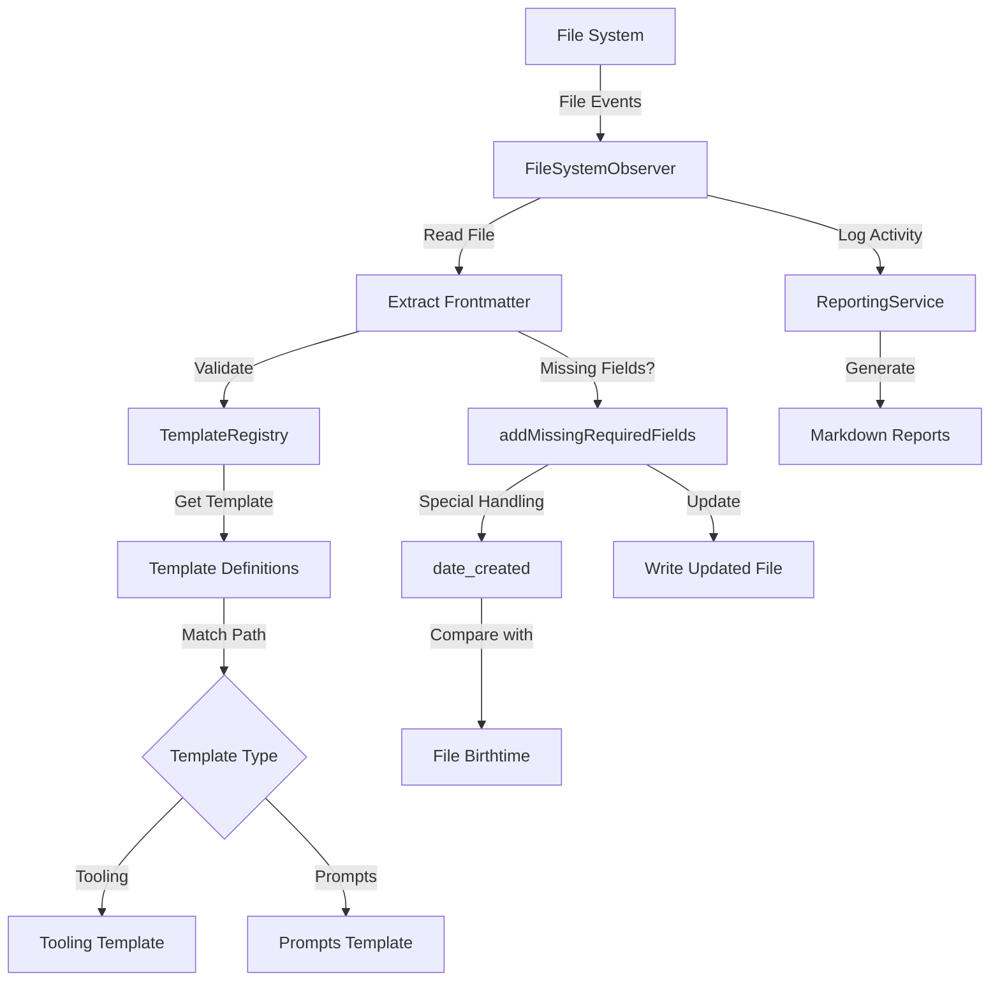

## Objective
Enhance the existing filesystem observer system to monitor the `content/lost-in-public/prompts` directory, validate frontmatter against a new template designed for prompts, and prepare these prompts for publication on the website as resources for clients.

## Implementation Status
This enhancement builds upon the successfully implemented system in the `tidyverse/observers` directory, extending it with:
- New template for prompts directory
- Support for additional metadata fields required for publication
- Preservation of existing content while ensuring consistent frontmatter

## System Architecture



## Data Flow

1. **File Detection**:
   ```
   File System (new/modified file)
     → FileSystemObserver (event)
       → Extract Frontmatter
         → Validate Against Template (tooling or prompts)
   ```

2. **Template Selection**:
   ```
   File Path
     → TemplateRegistry
       → Match Against Path Patterns
         → Select Appropriate Template (tooling or prompts)
   ```

3. **Field Processing**:
   ```
   Template Registry (find matching template)
     → Check Required Fields
       → Special Handling for date_created
         → Compare with File Birthtime
           → Keep Earlier Date
   ```

4. **Reporting Flow**:
   ```
   Observer Activity
     → ReportingService
       → Log Property Conversions
         → Generate Markdown Reports
   ```

## Key Components

### 1. Enhanced Template Registry
```typescript
// Template registry with support for multiple templates
class TemplateRegistry {
  private templates: Template[] = [];
  
  registerTemplate(template: Template) {
    this.templates.push(template);
  }
  
  findTemplate(filePath: string): Template | null {
    // Find the first template that matches the file path
    return this.templates.find(template => {
      return template.pathPatterns.some(pattern => {
        // Use minimatch for glob pattern matching
        return minimatch(filePath, pattern);
      });
    }) || null;
  }
  
  // Other methods...
}
```

### 2. Prompts Template Definition
```typescript
const promptsTemplate = {
  id: 'prompts',
  name: 'Prompts Document',
  description: 'Template for prompt documentation',
  
  // Path pattern to match prompts directory
  pathPatterns: ['content/lost-in-public/prompts/**/*.md'],
  
  required: {
    title: {
      type: 'string',
      description: 'Title of the prompt',
      defaultValueFn: (filePath) => {
        // Extract filename without extension and convert to title case
        const filename = path.basename(filePath, '.md');
        return filename.split('-').map(word => 
          word.charAt(0).toUpperCase() + word.slice(1)
        ).join(' ');
      }
    },
    lede: {
      type: 'string',
      description: 'Brief description of the prompt',
      defaultValueFn: () => 'Brief description of the prompt functionality and purpose'
    },
    date_authored_initial_draft: {
      type: 'date',
      description: 'Date of initial draft authoring',
      defaultValueFn: () => {
        const today = new Date();
        return today.toISOString().split('T')[0]; // YYYY-MM-DD format
      }
    },
    date_authored_current_draft: {
      type: 'date',
      description: 'Date of current draft authoring',
      defaultValueFn: () => {
        const today = new Date();
        return today.toISOString().split('T')[0]; // YYYY-MM-DD format
      }
    },
    at_semantic_version: {
      type: 'string',
      description: 'Semantic version of the prompt',
      defaultValueFn: () => '0.0.0.1'
    },
    authors: {
      type: 'string',
      description: 'Author(s) of the prompt',
      defaultValueFn: () => 'Michael Staton'
    },
    status: {
      type: 'string',
      description: 'Current status of the prompt',
      defaultValueFn: () => 'To-Prompt'
    },
    augmented_with: {
      type: 'string',
      description: 'AI model used for augmentation',
      defaultValueFn: () => 'Windsurf Cascade on Claude 3.5 Sonnet'
    },
    category: {
      type: 'string',
      description: 'Category of the prompt',
      defaultValueFn: () => 'Prompts'
    },
    tags: {
      type: 'array',
      description: 'Categorization tags',
      defaultValueFn: (filePath) => {
        // Extract directory structure as tags
        try {
          // Extract all directory names after 'prompts'
          const pathParts = filePath.split('/');
          const promptsIndex = pathParts.findIndex(part => part === 'prompts');
          
          if (promptsIndex >= 0) {
            // Get all directory names after 'prompts' and before the filename
            const tags = pathParts.slice(promptsIndex + 1, -1).map(tag => {
              // Convert to Train-Case format
              return tag.replace(/\s+/g, '-');
            });
            return tags.length > 0 ? tags : ['Uncategorized'];
          }
          return ['Uncategorized'];
        } catch (error) {
          console.error(`Error generating tags for ${filePath}:`, error);
          return ['Uncategorized'];
        }
      }
    },
    date_created: {
      type: 'date',
      description: 'Creation date',
      defaultValueFn: (filePath) => {
        try {
          // Use the Node.js fs module for synchronous operations
          const fs = require('fs');
          
          // Check if file exists
          if (fs.existsSync(filePath)) {
            // Get file stats to access creation time
            const stats = fs.statSync(filePath);
            
            // Use birthtime (actual file creation time) which is reliable on Mac
            const timestamp = stats.birthtime;
            
            // Return full ISO string with timezone
            return timestamp.toISOString();
          } else {
            // Return null instead of current date
            return null;
          }
        } catch (error) {
          // Return null instead of current date
          return null;
        }
      }
    },
    date_modified: {
      type: 'date',
      description: 'Last modified date',
      defaultValueFn: (filePath) => {
        try {
          const fs = require('fs');
          
          if (fs.existsSync(filePath)) {
            const stats = fs.statSync(filePath);
            const timestamp = stats.mtime;
            
            // Format as YYYY-MM-DD
            return new Date(timestamp).toISOString().split('T')[0];
          } else {
            return null;
          }
        } catch (error) {
          return null;
        }
      }
    }
  },
  
  optional: {
    date_authored_final_draft: {
      type: 'date',
      description: 'Date of final draft authoring'
    },
    date_first_published: {
      type: 'date',
      description: 'Date of first publication'
    },
    date_last_updated: {
      type: 'date',
      description: 'Date of last update'
    },
    date_first_run: {
      type: 'date',
      description: 'Date the prompt was first run'
    }
  }
};
```

### 3. Updated FileSystemObserver
```typescript
class FileSystemObserver {
  constructor(
    private templateRegistry: TemplateRegistry,
    private contentRoot: string,
    private reportingService: ReportingService
  ) {
    // Initialize watcher with multiple directories
    this.watcher = chokidar.watch([
      path.join(contentRoot, 'tooling'),
      path.join(contentRoot, 'lost-in-public/prompts')
    ], {
      persistent: true,
      ignoreInitial: false,
      awaitWriteFinish: {
        stabilityThreshold: 2000,
        pollInterval: 100
      }
    });
    
    // Set up event handlers
    this.watcher
      .on('add', this.onFileAdded.bind(this))
      .on('change', this.onFileChanged.bind(this));
  }
  
  // Rest of the implementation...
}
```

### 4. Integration with Website Publication
```typescript
// In the FileSystemObserver class
async processFileForPublication(filePath: string, frontmatter: any, content: string) {
  // Only process prompts
  if (!filePath.includes('lost-in-public/prompts')) {
    return;
  }
  
  // Check if the prompt is ready for publication
  if (frontmatter.status === 'Implemented' || frontmatter.status === 'Published') {
    // Generate publication-ready version
    const publicationPath = filePath
      .replace('lost-in-public/prompts', 'published/prompts')
      .replace(/\.md$/, '.astro');
      
    // Ensure directory exists
    const publicationDir = path.dirname(publicationPath);
    await fs.promises.mkdir(publicationDir, { recursive: true });
    
    // Create Astro component with frontmatter
    const astroContent = `---
// Generated from ${path.basename(filePath)}
layout: '@layouts/PromptLayout.astro'
title: ${JSON.stringify(frontmatter.title)}
lede: ${JSON.stringify(frontmatter.lede)}
date_published: ${frontmatter.date_first_published || `"${new Date().toISOString().split('T')[0]}"`}
author: ${JSON.stringify(frontmatter.authors)}
tags: ${JSON.stringify(frontmatter.tags)}
---

${content}
`;
    
    // Write the Astro file
    await fs.promises.writeFile(publicationPath, astroContent, 'utf8');
    
    this.reportingService.logPublication(filePath, publicationPath);
  }
}
```

## Example Frontmatter Template

```yaml
---
# The main title of the prompt, displayed as the heading on the website
title: 'Integrate OpenGraph fetch into filesystem observer'

# A concise description that explains the purpose of the prompt (appears in previews and cards, it's a bit like a "subtitle" but in Journalism the "lede" is the opening statement that captivates )
lede: 'Leverage Node.js filesystem APIs to monitor content directories, automatically fetch OpenGraph metadata and update frontmatter'

# When the first draft was created (YYYY-MM-DD format)
date_authored_initial_draft: 2025-04-07

# When the current version was updated (YYYY-MM-DD format)
date_authored_current_draft: 2025-04-07

# When the final version was completed (null until finalized)
date_authored_final_draft: null

# When the prompt was first published to the website (null until published)
date_first_published: null

# When the published version was last updated (null until updated after publishing)
date_last_updated: null

# Semantic versioning in format 'MAJOR.MINOR.PATCH.BUILD'
# - MAJOR: Breaking changes
# - MINOR: New features, backward compatible
# - PATCH: Bug fixes, backward compatible
# - BUILD: Iteration count for drafts
at_semantic_version: '0.0.0.1'

# The creator(s) of the prompt (string or array format), the default should be array just to keep consistency.  The array format in YAML could take many forms, but the "list" format is the one we want to use.
authors: 
  Michael Staton

# Current development status (To-Prompt, In-Progress, Implemented, Published)
status: Implemented

# The AI system used to help create or refine the prompt
augmented_with: 'Windsurf Cascade on Claude 3.5 Sonnet'

# Primary classification for navigation and filtering, all prompts should be in the Prompts category
category: Prompts

# Hierarchical classification tags for filtering and discovery
# Automatically generated from directory structure and manually enhanced
# AI assistants may intuitively add tags, but must be in the list format.  The list format is the one we want to use.
tags:
- Frontmatter-Validation
- File-Processing
- Build-Scripts
- File-Systems
- Data-Integrity
- Data-APIs

# Automatically tracked creation timestamp (ISO format with timezone)
# Generated from file birthtime or explicitly set
date_created: 2025-03-23

# Automatically updated modification timestamp (YYYY-MM-DD format)
# Updated whenever the file changes
date_modified: 2025-04-07
---
```

## Implementation Steps

1. **Update Template Registry**:
   - Add new prompts template to the registry
   - Ensure path patterns correctly identify prompt files

2. **Extend FileSystemObserver**:
   - Update watcher to monitor both tooling and prompts directories
   - Add special handling for prompts publication

3. **Create Publication Pipeline**:
   - Add functionality to generate Astro components from prompts
   - Set up directory structure for published prompts

4. **Update ReportingService**:
   - Add tracking for prompt validation and publication
   - Include publication statistics in reports

5. **Testing**:
   - Verify frontmatter validation for prompts
   - Test publication pipeline with sample prompts
   - Ensure existing tooling functionality remains intact

## Best Practices

1. **Frontmatter Consistency**:
   - Apply the same property name normalization (kebab-case to snake_case)
   - Format tags consistently across all templates
   - Preserve content while updating frontmatter

2. **Publication Readiness**:
   - Only publish prompts with appropriate status
   - Generate proper Astro components with layout
   - Maintain relationship between source and published files

3. **Error Handling**:
   - Add robust error handling for publication process
   - Log all publication attempts and outcomes
   - Provide clear error messages for failed publications

4. **Code Organization**:
   - Maintain separation of concerns between validation and publication
   - Share utility functions across templates
   - Follow the single source of truth principle

## Constraints and Considerations

1. **Performance Impact**:
   - Monitor additional directories may increase system load
   - Consider implementing throttling for large directories

2. **Publication Workflow**:
   - Publication should be non-destructive to source files
   - Consider implementing a staging step before final publication

3. **Content Security**:
   - Ensure sensitive prompts are not published accidentally
   - Add validation for publication-ready content
