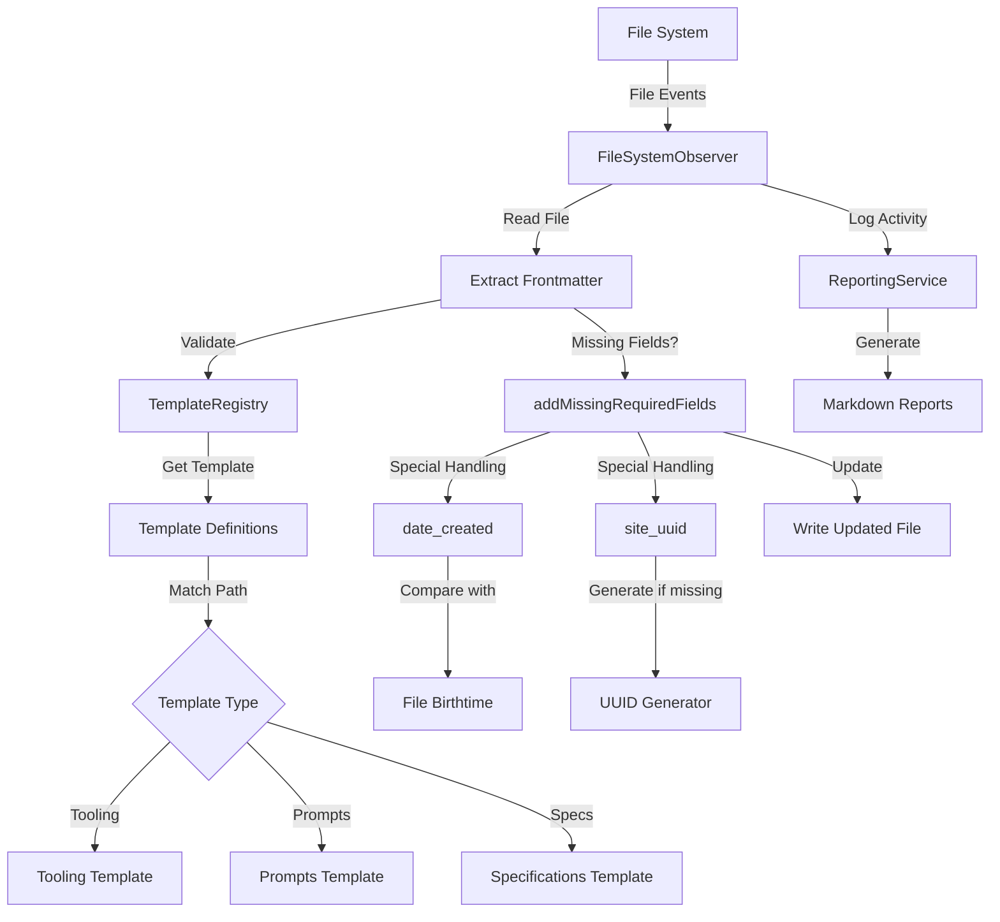

## Objective
Enhance the existing filesystem observer system to monitor both the `content/lost-in-public/prompts` and `content/specs` directories, validate frontmatter against templates designed for prompts and specifications, and prepare these resources for publication on the website as resources for clients.

## Implementation Status
This enhancement builds upon the successfully implemented system in the `tidyverse/observers` directory, extending it with:
- New templates for prompts and specifications directories
- Support for additional metadata fields required for publication
- Preservation of existing content while ensuring consistent frontmatter
- Generation of site_uuid for resources that don't already have one

## System Architecture



## Data Flow

1. **File Detection**:
   ```
   File System (new/modified file)
     → FileSystemObserver (event)
       → Extract Frontmatter
         → Validate Against Template (tooling or prompts)
   ```

2. **Template Selection**:
   ```
   File Path
     → TemplateRegistry
       → Match Against Path Patterns
         → Select Appropriate Template (tooling or prompts)
   ```

3. **Field Processing**:
   ```
   Template Registry (find matching template)
     → Check Required Fields
       → Special Handling for date_created
         → Compare with File Birthtime
           → Keep Earlier Date
   ```

4. **Reporting Flow**:
   ```
   Observer Activity
     → ReportingService
       → Log Property Conversions
         → Generate Markdown Reports
   ```

## Key Components

### 1. Enhanced Template Registry
```typescript
// Template registry with support for multiple templates
class TemplateRegistry {
  private templates: Template[] = [];
  
  registerTemplate(template: Template) {
    this.templates.push(template);
  }
  
  findTemplate(filePath: string): Template | null {
    // Find the first template that matches the file path
    return this.templates.find(template => {
      return template.pathPatterns.some(pattern => {
        // Use minimatch for glob pattern matching
        return minimatch(filePath, pattern);
      });
    }) || null;
  }
  
  // Other methods...
}
```

### 2. Prompts Template Definition
```typescript
const promptsTemplate = {
  id: 'prompts',
  name: 'Prompts Document',
  description: 'Template for prompt documentation',
  
  // Path pattern to match prompts directory
  pathPatterns: ['content/lost-in-public/prompts/**/*.md'],
  
  required: {
    title: {
      type: 'string',
      description: 'Title of the prompt',
      defaultValueFn: (filePath) => {
        // Extract filename without extension and convert to title case
        const filename = path.basename(filePath, '.md');
        return filename.split('-').map(word => 
          word.charAt(0).toUpperCase() + word.slice(1)
        ).join(' ');
      }
    },
    lede: {
      type: 'string',
      description: 'Brief description of the prompt',
      defaultValueFn: () => 'Brief description of the prompt functionality and purpose'
    },
    date_authored_initial_draft: {
      type: 'date',
      description: 'Date of initial draft authoring',
      defaultValueFn: () => {
        const today = new Date();
        return today.toISOString().split('T')[0]; // YYYY-MM-DD format
      }
    },
    date_authored_current_draft: {
      type: 'date',
      description: 'Date of current draft authoring',
      defaultValueFn: () => {
        const today = new Date();
        return today.toISOString().split('T')[0]; // YYYY-MM-DD format
      }
    },
    at_semantic_version: {
      type: 'string',
      description: 'Semantic version of the prompt',
      defaultValueFn: () => '0.0.0.1'
    },
    authors: {
      type: 'string',
      description: 'Author(s) of the prompt',
      defaultValueFn: () => 'Michael Staton'
    },
    status: {
      type: 'string',
      description: 'Current status of the prompt',
      defaultValueFn: () => 'To-Prompt'
    },
    augmented_with: {
      type: 'string',
      description: 'AI model used for augmentation',
      defaultValueFn: () => 'Windsurf Cascade on Claude 3.5 Sonnet'
    },
    category: {
      type: 'string',
      description: 'Category of the prompt',
      defaultValueFn: () => 'Prompts'
    },
    tags: {
      type: 'array',
      description: 'Categorization tags',
      defaultValueFn: (filePath) => {
        // Extract directory structure as tags
        try {
          // Extract all directory names after 'prompts'
          const pathParts = filePath.split('/');
          const promptsIndex = pathParts.findIndex(part => part === 'prompts');
          
          if (promptsIndex >= 0) {
            // Get all directory names after 'prompts' and before the filename
            const tags = pathParts.slice(promptsIndex + 1, -1).map(tag => {
              // Convert to Train-Case format
              return tag.replace(/\s+/g, '-');
            });
            return tags.length > 0 ? tags : ['Uncategorized'];
          }
          return ['Uncategorized'];
        } catch (error) {
          console.error(`Error generating tags for ${filePath}:`, error);
          return ['Uncategorized'];
        }
      }
    },
    date_created: {
      type: 'date',
      description: 'Creation date',
      defaultValueFn: (filePath) => {
        try {
          // Use the Node.js fs module for synchronous operations
          const fs = require('fs');
          
          // Check if file exists
          if (fs.existsSync(filePath)) {
            // Get file stats to access creation time
            const stats = fs.statSync(filePath);
            
            // Use birthtime (actual file creation time) which is reliable on Mac
            const timestamp = stats.birthtime;
            
            // Return full ISO string with timezone
            return timestamp.toISOString();
          } else {
            // Return null instead of current date
            return null;
          }
        } catch (error) {
          // Return null instead of current date
          return null;
        }
      }
    },
    date_modified: {
      type: 'date',
      description: 'Last modified date',
      defaultValueFn: (filePath) => {
        try {
          const fs = require('fs');
          
          if (fs.existsSync(filePath)) {
            const stats = fs.statSync(filePath);
            const timestamp = stats.mtime;
            
            // Format as YYYY-MM-DD
            return new Date(timestamp).toISOString().split('T')[0];
          } else {
            return null;
          }
        } catch (error) {
          return null;
        }
      }
    },
    site_uuid: {
      type: 'string',
      description: 'Unique identifier for the resource on the website',
      validation: (value) => typeof value === 'string' && value.length > 0,
      defaultValueFn: () => {
        // Generate a UUID v4 for the resource
        return generateUUID();
      }
    }
  },
  
  optional: {
    date_authored_final_draft: {
      type: 'date',
      description: 'Date of final draft authoring'
    },
    date_first_published: {
      type: 'date',
      description: 'Date of first publication'
    },
    date_last_updated: {
      type: 'date',
      description: 'Date of last update'
    },
    date_first_run: {
      type: 'date',
      description: 'Date the prompt was first run'
    }
  }
};

### 3. Specifications Template Definition
```typescript
const specificationsTemplate = {
  id: 'specifications',
  name: 'Technical Specification',
  description: 'Template for technical specifications documentation',
  
  // Path pattern to match specifications directory
  pathPatterns: ['content/specs/**/*.md'],
  
  required: {
    title: {
      type: 'string',
      description: 'Title of the specification',
      defaultValueFn: (filePath) => {
        try {
          // Extract filename without extension and convert to title case
          const filename = path.basename(filePath, '.md');
          return filename.split('-').map(word => 
            word.charAt(0).toUpperCase() + word.slice(1)
          ).join(' ');
        } catch (error) {
          console.error(`Error generating title for ${filePath}:`, error);
          return 'Untitled Specification';
        }
      }
    },
    lede: {
      type: 'string',
      description: 'Brief description of the specification',
      defaultValueFn: () => 'Technical specification document outlining implementation details'
    },
    status: {
      type: 'string',
      description: 'Current status of the specification',
      validation: (value) => {
        const allowedValues = ['Draft', 'In-Review', 'Approved', 'Implemented', 'Deprecated'];
        return typeof value === 'string' && allowedValues.includes(value);
      },
      defaultValueFn: () => 'Draft'
    },
    authors: {
      type: 'array',
      description: 'Author(s) of the specification',
      validation: (value) => {
        // Handle various author formats
        if (Array.isArray(value)) {
          // Array format is already correct
          return value.length > 0;
        } else if (typeof value === 'string') {
          // If it's a string, it should be non-empty
          return value.trim().length > 0;
        }
        return false;
      },
      defaultValueFn: () => ['Michael Staton']
    },
    category: {
      type: 'string',
      description: 'Category of the specification',
      defaultValueFn: () => 'Technical Specifications'
    },
    tags: {
      type: 'array',
      description: 'Categorization tags',
      defaultValueFn: (filePath) => {
        try {
          // Extract filename without extension
          const filename = path.basename(filePath, '.md');
          // Split by hyphens and convert to tags
          return filename.split('-').map(word => 
            word.charAt(0).toUpperCase() + word.slice(1)
          );
        } catch (error) {
          console.error(`Error generating tags for ${filePath}:`, error);
          return ['Uncategorized'];
        }
      }
    },
    date_created: {
      type: 'date',
      description: 'Creation date',
      defaultValueFn: (filePath) => {
        // Use the shared utility function for file creation date
        return getFileCreationDate(filePath);
      }
    },
    date_modified: {
      type: 'date',
      description: 'Last modification date',
      defaultValueFn: () => {
        // Use the shared utility function for current date
        return getCurrentDate();
      }
    },
    site_uuid: {
      type: 'string',
      description: 'Unique identifier for the resource on the website',
      validation: (value) => typeof value === 'string' && value.length > 0,
      defaultValueFn: () => {
        // Generate a UUID v4 for the resource
        return generateUUID();
      }
    }
  },
  
  optional: {
    date_approved: {
      type: 'date',
      description: 'Date the specification was approved'
    },
    date_implemented: {
      type: 'date',
      description: 'Date the specification was implemented'
    },
    date_deprecated: {
      type: 'date',
      description: 'Date the specification was deprecated'
    },
    related_specs: {
      type: 'array',
      description: 'Related specification documents'
    }
  }
};

### 4. UUID Generation Function
```typescript
/**
 * Add site_uuid to resources that don't have one
 * 
 * This function checks if a resource has a site_uuid and generates one if missing.
 * It's used in the addMissingRequiredFields function to ensure all resources have
 * a unique identifier for website publication.
 * 
 * @param frontmatter - The frontmatter object to process
 * @returns Updated frontmatter and whether changes were made
 */
async function addSiteUuid(
  frontmatter: Record<string, any>
): Promise<{ updatedFrontmatter: Record<string, any>; changed: boolean }> {
  let changed = false;
  
  // Check if site_uuid exists
  if (!frontmatter.site_uuid) {
    // Generate a new UUID
    frontmatter.site_uuid = generateUUID();
    changed = true;
    console.log(`Generated site_uuid: ${frontmatter.site_uuid}`);
  }
  
  return { updatedFrontmatter: frontmatter, changed };
}

### 5. Updated FileSystemObserver
```typescript
class FileSystemObserver {
  constructor(
    private templateRegistry: TemplateRegistry,
    private contentRoot: string,
    private reportingService: ReportingService
  ) {
    // Initialize watcher with multiple directories
    this.watcher = chokidar.watch([
      path.join(contentRoot, 'tooling'),
      path.join(contentRoot, 'lost-in-public/prompts'),
      path.join(contentRoot, 'specs')
    ], {
      persistent: true,
      ignoreInitial: false,
      awaitWriteFinish: {
        stabilityThreshold: 2000,
        pollInterval: 100
      }
    });
    
    // Set up event handlers
    this.watcher
      .on('add', this.onFileAdded.bind(this))
      .on('change', this.onFileChanged.bind(this));
  }
  
  // Rest of the implementation...
}

async processFileForPublication(filePath: string, frontmatter: any, content: string) {
  // Only process prompts and specifications
  if (!filePath.includes('lost-in-public/prompts') && !filePath.includes('specs')) {
    return;
  }
  
  // Check if the resource is ready for publication
  const isPrompt = filePath.includes('lost-in-public/prompts');
  const isSpec = filePath.includes('specs');
  
  // Different publication criteria based on content type
  let readyForPublication = false;
  
  if (isPrompt) {
    // Prompts are ready when status is 'Implemented' or 'Published'
    readyForPublication = ['Implemented', 'Published'].includes(frontmatter.status);
  } else if (isSpec) {
    // Specs are ready when status is 'Approved' or 'Implemented'
    readyForPublication = ['Approved', 'Implemented'].includes(frontmatter.status);
  }
  
  if (!readyForPublication) {
    console.log(`${filePath} is not ready for publication. Status: ${frontmatter.status}`);
    return;
  }
  
  // Determine publication directory based on content type
  let publicationDir;
  if (isPrompt) {
    publicationDir = path.join(this.contentRoot, 'public', 'prompts');
  } else if (isSpec) {
    publicationDir = path.join(this.contentRoot, 'public', 'specs');
  }
  
  // Create directory if it doesn't exist
  await fs.promises.mkdir(publicationDir, { recursive: true });
  
  // Generate filename from title or original filename
  const filename = frontmatter.title 
    ? frontmatter.title.toLowerCase().replace(/\s+/g, '-') + '.astro'
    : path.basename(filePath, '.md') + '.astro';
  
  const publicationPath = path.join(publicationDir, filename);
  
  // Generate Astro component with appropriate layout
  const layoutComponent = isPrompt ? 'PromptLayout' : 'SpecificationLayout';
  
  const astroContent = `---
// Generated from ${filePath}
// Publication date: ${new Date().toISOString()}
layout: '@layouts/${layoutComponent}.astro'
title: ${JSON.stringify(frontmatter.title)}
lede: ${JSON.stringify(frontmatter.lede || '')}
date: ${JSON.stringify(frontmatter.date_modified || frontmatter.date_created)}
tags: ${JSON.stringify(frontmatter.tags || [])}
site_uuid: ${JSON.stringify(frontmatter.site_uuid)}
---

${content}
`;
  
  // Write the Astro file
  await fs.promises.writeFile(publicationPath, astroContent, 'utf8');
  
  this.reportingService.logPublication(filePath, publicationPath);
}

## Session-Based In-Memory Processed File Tracking

To prevent infinite processing loops and redundant OpenGraph fetches, the observer now maintains an in-memory session-tracking mechanism using a static `Set`. This ensures that each file is only processed once per observer session (process lifetime). This logic is critical for data integrity and system performance.

```typescript
/**
 * FileSystemObserver with in-memory tracking of processed files
 *
 * This static Set tracks file paths that have already been processed in the current session.
 * Prevents infinite loops and redundant OpenGraph processing caused by repeated file system events.
 */
class FileSystemObserver {
  /**
   * Static Set to track processed files for the current observer session.
   * This Set is cleared only when the Node.js process restarts.
   */
  private static processedFiles: Set<string> = new Set();

  // ... constructor and other methods ...

  /**
   * Handles file change events for markdown files.
   * Skips processing if the file has already been handled in this session.
   */
  async onChange(filePath: string): Promise<void> {
    // Aggressive logging of file processing attempts
    console.log(`[Observer] [EVENT] Change detected for file: ${filePath}`);

    // Skip if already processed in this session
    if (FileSystemObserver.processedFiles.has(filePath)) {
      console.log(`[Observer] [SKIP] File already processed in this session, skipping: ${filePath}`);
      return;
    }
    FileSystemObserver.processedFiles.add(filePath);

    // ...rest of file processing logic...
  }
}
```

**Rationale:**
- This approach ensures that each file is processed only once per session, preventing infinite event loops and redundant OpenGraph API calls.
- The Set is in-memory and resets on process restart, keeping the logic stateless across sessions.

---

## Updated OpenGraph Processing Logic

The observer uses an improved `needsOpenGraph` function to determine if OpenGraph fields are missing or out-of-date. This function checks for the presence and correctness of all required OpenGraph fields and skips unnecessary fetches.

```typescript
/**
 * Determines if OpenGraph metadata needs to be (re)fetched for a file.
 *
 * Returns true if any required OpenGraph field is missing, empty, or out-of-date.
 * Returns false if all required fields are present and up-to-date, avoiding unnecessary API calls.
 */
function needsOpenGraph(frontmatter: Record<string, any>): boolean {
  const OG_FIELDS = ['og_title', 'og_description', 'og_image', 'og_url', 'og_last_fetch'];
  // Check if og_last_fetch exists and all fields are present and non-empty
  if ('og_last_fetch' in frontmatter) {
    const missingOrEmpty = OG_FIELDS.some(key =>
      !(key in frontmatter) || frontmatter[key] === '' || frontmatter[key] === null || frontmatter[key] === undefined
    );
    if (!missingOrEmpty) {
      // All OG fields are present and non-empty; skip OpenGraph processing
      return false;
    }
  }
  // Otherwise, OpenGraph data is missing or incomplete
  return true;
}
```

**Commentary:**
- This logic ensures that OpenGraph fetching is only triggered when necessary, reducing API usage and file churn.
- Aggressive logging is used throughout the observer to record when files are skipped or processed for OpenGraph updates.

---

## OpenGraph Error Handling and Logging

When OpenGraph data fetching fails, errors are aggressively logged and recorded in frontmatter. This ensures transparency and traceability for debugging and reporting.

```typescript
try {
  // ...fetch OpenGraph data logic...
} catch (error) {
  // Aggressively log the error
  console.error(`[OpenGraph] [ERROR] Failed to fetch OpenGraph data for ${filePath}:`, error);
  // Record error in frontmatter for visibility
  updatedFrontmatter.og_error = error.message || 'Unknown error fetching OpenGraph data';
  updatedFrontmatter.og_last_fetch = new Date().toISOString();
  changed = true;
}
```

**Best Practices:**
- All errors are logged to the console and recorded in the file's frontmatter.
- `og_last_fetch` is updated on error for traceability.
- This approach supports robust debugging and ensures that failures are not silently ignored.

---

## Example Frontmatter Template

```yaml
---
# The main title of the prompt, displayed as the heading on the website
title: 'Integrate OpenGraph fetch into filesystem observer'

# A concise description that explains the purpose of the prompt (appears in previews and cards, it's a bit like a "subtitle" but in Journalism the "lede" is the opening statement that captivates )
lede: 'Leverage Node.js filesystem APIs to monitor content directories, automatically fetch OpenGraph metadata and update frontmatter'

# When the first draft was created (YYYY-MM-DD format)
date_authored_initial_draft: 2025-04-07

# When the current version was updated (YYYY-MM-DD format)
date_authored_current_draft: 2025-04-07

# When the final version was completed (null until finalized)
date_authored_final_draft: null

# When the prompt was first published to the website (null until published)
date_first_published: null

# When the published version was last updated (null until updated after publishing)
date_last_updated: null

# Semantic versioning in format 'MAJOR.MINOR.PATCH.BUILD'
# - MAJOR: Breaking changes
# - MINOR: New features, backward compatible
# - PATCH: Bug fixes, backward compatible
# - BUILD: Iteration count for drafts
at_semantic_version: '0.0.0.1'

# The creator(s) of the prompt (string or array format), the default should be array just to keep consistency.  The array format in YAML could take many forms, but the "list" format is the one we want to use.
authors: 
  Michael Staton

# Current development status (To-Prompt, In-Progress, Implemented, Published)
status: Implemented

# The AI system used to help create or refine the prompt
augmented_with: 'Windsurf Cascade on Claude 3.5 Sonnet'

# Primary classification for navigation and filtering, all prompts should be in the Prompts category
category: Prompts

# Hierarchical classification tags for filtering and discovery
# Automatically generated from directory structure and manually enhanced
# AI assistants may intuitively add tags, but must be in the list format.  The list format is the one we want to use.
tags:
- Frontmatter-Validation
- File-Processing
- Build-Scripts
- File-Systems
- Data-Integrity
- Data-APIs

# Automatically tracked creation timestamp (ISO format with timezone)
# Generated from file birthtime or explicitly set
date_created: 2025-03-23

# Automatically updated modification timestamp (YYYY-MM-DD format)
# Updated whenever the file changes
date_modified: 2025-04-07

# Image prompt for the prompt
image_prompt: "A system observer dashboard visualizing real-time file changes and prompt metadata updates, with animated folder icons, notification badges, and code snippets. The atmosphere is dynamic, technical, and focused on automation and monitoring."
---

## Example Specifications Frontmatter Template

```yaml
---
# The main title of the specification
title: 'Search Implementation Specification'

# Brief description of the specification
lede: 'Technical specification for implementing search functionality using Pagefind'

# Current status: Draft, In-Review, Approved, Implemented, Deprecated
status: 'Approved'

# The creator(s) of the specification
authors:
- Michael Staton

# Primary classification
category: 'Technical Specifications'

# Categorization tags
tags:
- Search
- Pagefind
- Frontend
- Performance

# Unique identifier for the resource on the website
site_uuid: '550e8400-e29b-41d4-a716-446655440000'

# Automatically tracked creation timestamp
date_created: 2025-03-15

# Automatically updated modification timestamp
date_modified: 2025-04-12

# Optional fields
date_approved: 2025-04-01
date_implemented: null
date_deprecated: null
related_specs:
- 'Frontend-Architecture-Spec'
---

## Implementation Steps

1. **Update Template Registry**:
   - Add new prompts and specifications templates to the registry
   - Ensure path patterns correctly identify both content types
   - Register UUID generation utility

2. **Extend FileSystemObserver**:
   - Update watcher to monitor prompts and specifications directories
   - Add special handling for site_uuid generation
   - Implement content-type specific validation

3. **Create Publication Pipeline**:
   - Add functionality to generate Astro components from both content types
   - Set up directory structure for published resources
   - Implement content-type specific layouts

4. **Update ReportingService**:
   - Add tracking for validation and publication of both content types
   - Include publication statistics in reports
   - Track UUID generation

5. **Testing**:
   - Verify frontmatter validation for both content types
   - Test UUID generation and persistence
   - Test publication pipeline with sample content
   - Ensure existing functionality remains intact

## Best Practices

1. **Frontmatter Consistency**:
   - Apply the same property name normalization (kebab-case to snake_case)
   - Format tags consistently across all templates
   - Preserve content while updating frontmatter

2. **Publication Readiness**:
   - Only publish prompts and specifications with appropriate status
   - Generate proper Astro components with layout
   - Maintain relationship between source and published files

3. **Error Handling**:
   - Add robust error handling for publication process
   - Log all publication attempts and outcomes
   - Provide clear error messages for failed publications

4. **Code Organization**:
   - Maintain separation of concerns between validation and publication
   - Share utility functions across templates
   - Follow the single source of truth principle

## Constraints and Considerations

1. **Performance Impact**:
   - Monitor additional directories may increase system load
   - Consider implementing throttling for large directories

2. **Publication Workflow**:
   - Publication should be non-destructive to source files
   - Consider implementing a staging step before final publication

3. **Content Security**:
   - Ensure sensitive prompts and specifications are not published accidentally
   - Add validation for publication-ready content